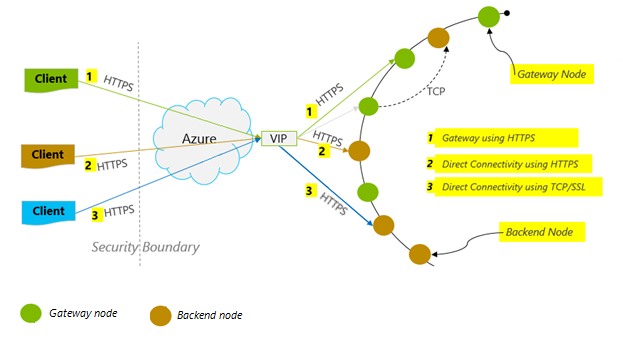

# Performance tips for Azure Cosmos DB and Java

> [!div class="op_single_selector"]
> * [Async Java](performance-tips-async-java.md)
> * [Java](performance-tips-java.md)
> * [.NET](performance-tips.md)
> 

Azure Cosmos DB is a fast and flexible distributed database that scales seamlessly with guaranteed latency and throughput. You do not have to make major architecture changes or write complex code to scale your database with Azure Cosmos DB. Scaling up and down is as easy as making a single API call or [SDK method call](set-throughput.md#set-throughput-java). However, because Azure Cosmos DB is accessed via network calls there are client-side optimizations you can make to achieve peak performance when using the [SQL Java SDK](documentdb-sdk-java.md).

So if you're asking "How can I improve my database performance?" consider the following options:

## Networking
<a id="direct-connection"></a>

1. **Connection mode: Use DirectHttps**

    How a client connects to Azure Cosmos DB has important implications on performance, especially in terms of observed client-side latency. There is one key configuration setting available for configuring the client [ConnectionPolicy](https://docs.microsoft.com/java/api/com.microsoft.azure.documentdb._connection_policy) – the [ConnectionMode](https://docs.microsoft.com/java/api/com.microsoft.azure.documentdb._connection_mode).  The two available ConnectionModes are:

   1. [Gateway (default)](https://docs.microsoft.com/java/api/com.microsoft.azure.documentdb._connection_mode)
   2. [DirectHttps](https://docs.microsoft.com/java/api/com.microsoft.azure.documentdb._connection_mode)

    Gateway mode is supported on all SDK platforms and is the configured default.  If your application runs within a corporate network with strict firewall restrictions, Gateway is the best choice since it uses the standard HTTPS port and a single endpoint. The performance tradeoff, however, is that Gateway mode involves an additional network hop every time data is read or written to Azure Cosmos DB. Because of this, DirectHttps mode offers better performance due to fewer network hops. 

    The Java SDK uses HTTPS as a transport protocol. HTTPS uses SSL for initial authentication and encrypting traffic. When using the Java SDK, only HTTPS port 443 needs to be open. 

    The ConnectionMode is configured during the construction of the DocumentClient instance with the ConnectionPolicy parameter. 

    ```Java
    public ConnectionPolicy getConnectionPolicy() {
        ConnectionPolicy policy = new ConnectionPolicy();
        policy.setConnectionMode(ConnectionMode.DirectHttps);
        policy.setMaxPoolSize(1000);
        return policy;
    }
        
    ConnectionPolicy connectionPolicy = new ConnectionPolicy();
    DocumentClient client = new DocumentClient(HOST, MASTER_KEY, connectionPolicy, null);
    ```

    

   <a id="same-region"></a>
2. **Collocate clients in same Azure region for performance**

    When possible, place any applications calling Azure Cosmos DB in the same region as the Azure Cosmos DB database. For an approximate comparison, calls to Azure Cosmos DB within the same region complete within 1-2 ms, but the latency between the West and East coast of the US is >50 ms. This latency can likely vary from request to request depending on the route taken by the request as it passes from the client to the Azure datacenter boundary. The lowest possible latency is achieved by ensuring the calling application is located within the same Azure region as the provisioned Azure Cosmos DB endpoint. For a list of available regions, see [Azure Regions](https://azure.microsoft.com/regions/#services).

    
   
## SDK Usage
1. **Install the most recent SDK**

    The Azure Cosmos DB SDKs are constantly being improved to provide the best performance. See the [Azure Cosmos DB SDK](documentdb-sdk-java.md) pages to determine the most recent SDK and review improvements.
2. **Use a singleton Azure Cosmos DB client for the lifetime of your application**

    Each [DocumentClient](https://docs.microsoft.com/java/api/com.microsoft.azure.documentdb._document_client) instance is thread-safe and performs efficient connection management and address caching when operating in Direct Mode. To allow efficient connection management and better performance by DocumentClient, it is recommended to use a single instance of DocumentClient per AppDomain for the lifetime of the application.

   <a id="max-connection"></a>
3. **Increase MaxPoolSize per host when using Gateway mode**

    Azure Cosmos DB requests are made over HTTPS/REST when using Gateway mode, and are subjected to the default connection limit per hostname or IP address. You may need to set the MaxPoolSize to a higher value (200-1000) so that the client library can utilize multiple simultaneous connections to Azure Cosmos DB. In the Java SDK, the default value for [ConnectionPolicy.getMaxPoolSize](https://docs.microsoft.com/java/api/com.microsoft.azure.documentdb._connection_policy.getmaxpoolsize) is 100. Use [setMaxPoolSize]( https://docs.microsoft.com/java/api/com.microsoft.azure.documentdb._connection_policy.setmaxpoolsize) to change the value.

4. **Tuning parallel queries for partitioned collections**

    Azure Cosmos DB SQL Java SDK version 1.9.0 and above support parallel queries, which enable you to query a partitioned collection in parallel (see [Working with the SDKs](sql-api-partition-data.md#working-with-the-azure-cosmos-db-sdks) and the related [code samples](https://github.com/Azure/azure-documentdb-java/tree/master/documentdb-examples/src/test/java/com/microsoft/azure/documentdb/examples) for more info). Parallel queries are designed to improve query latency and throughput over their serial counterpart.

    (a) ***Tuning setMaxDegreeOfParallelism\:***
    Parallel queries work by querying multiple partitions in parallel. However, data from an individual partitioned collection is fetched serially with respect to the query. So, use [setMaxDegreeOfParallelism](https://docs.microsoft.com/java/api/com.microsoft.azure.documentdb._feed_options.setmaxdegreeofparallelism) to set the number of partitions that has the maximum chance of achieving the most performant query, provided all other system conditions remain the same. If you don't know the number of partitions, you can use setMaxDegreeOfParallelism to set a high number, and the system chooses the minimum (number of partitions, user provided input) as the maximum degree of parallelism. 

    It is important to note that parallel queries produce the best benefits if the data is evenly distributed across all partitions with respect to the query. If the partitioned collection is partitioned such a way that all or a majority of the data returned by a query is concentrated in a few partitions (one partition in worst case), then the performance of the query would be bottlenecked by those partitions.

    (b) ***Tuning setMaxBufferedItemCount\:***
    Parallel query is designed to pre-fetch results while the current batch of results is being processed by the client. The pre-fetching helps in overall latency improvement of a query. setMaxBufferedItemCount limits the number of pre-fetched results. By setting [setMaxBufferedItemCount](https://docs.microsoft.com/java/api/com.microsoft.azure.documentdb._feed_options.setmaxbuffereditemcount) to the expected number of results returned (or a higher number), this enables the query to receive maximum benefit from pre-fetching.

    Pre-fetching works the same way irrespective of the MaxDegreeOfParallelism, and there is a single buffer for the data from all partitions.  

5. **Implement backoff at getRetryAfterInMilliseconds intervals**

    During performance testing, you should increase load until a small rate of requests get throttled. If throttled, the client application should backoff on throttle for the server-specified retry interval. Respecting the backoff ensures that you spend minimal amount of time waiting between retries. Retry policy support is included in Version 1.8.0 and above of the [Java SDK](documentdb-sdk-java.md). For more information, see [Exceeding reserved throughput limits](request-units.md#RequestRateTooLarge) and [getRetryAfterInMilliseconds](https://docs.microsoft.com/java/api/com.microsoft.azure.documentdb._document_client_exception.getretryafterinmilliseconds).
6. **Scale out your client-workload**

    If you are testing at high throughput levels (>50,000 RU/s), the client application may become the bottleneck due to the machine capping out on CPU or network utilization. If you reach this point, you can continue to push the Azure Cosmos DB account further by scaling out your client applications across multiple servers.

7. **Use name based addressing**

    Use name-based addressing, where links have the format `dbs/MyDatabaseId/colls/MyCollectionId/docs/MyDocumentId`, instead of SelfLinks (\_self), which have the format `dbs/<database_rid>/colls/<collection_rid>/docs/<document_rid>` to avoid retrieving ResourceIds of all the resources used to construct the link. Also, as these resources get recreated (possibly with same name), caching these may not help.

   <a id="tune-page-size"></a>
8. **Tune the page size for queries/read feeds for better performance**

    When performing a bulk read of documents by using read feed functionality (for example, [readDocuments]( https://docs.microsoft.com/java/api/com.microsoft.azure.documentdb._document_client.readdocuments#com_microsoft_azure_documentdb__document_client_readDocuments_String_FeedOptions_c) or when issuing a SQL query, the results are returned in a segmented fashion if the result set is too large. By default, results are returned in chunks of 100 items or 1 MB, whichever limit is hit first.

    To reduce the number of network round trips required to retrieve all applicable results, you can increase the page size using the [x-ms-max-item-count](https://docs.microsoft.com/rest/api/cosmos-db/common-cosmosdb-rest-request-headers) request header to up to 1000. In cases where you need to display only a few results, for example, if your user interface or application API returns only 10 results a time, you can also decrease the page size to 10 to reduce the throughput consumed for reads and queries.

    You may also set the page size using the [setPageSize method](https://docs.microsoft.com/java/api/com.microsoft.azure.documentdb._feed_options_base.setpagesize#com_microsoft_azure_documentdb__feed_options_base_setPageSize_Integer).

## Indexing Policy
 
1. **Exclude unused paths from indexing for faster writes**

    Azure Cosmos DB’s indexing policy allows you to specify which document paths to include or exclude from indexing by leveraging Indexing Paths ([setIncludedPaths](https://docs.microsoft.com/java/api/com.microsoft.azure.documentdb._indexing_policy.setincludedpaths) and [setExcludedPaths](https://docs.microsoft.com/java/api/com.microsoft.azure.documentdb._indexing_policy.setexcludedpaths)). The use of indexing paths can offer improved write performance and lower index storage for scenarios in which the query patterns are known beforehand, as indexing costs are directly correlated to the number of unique paths indexed.  For example, the following code shows how to exclude an entire section of the documents (a.k.a. a subtree) from indexing using the "*" wildcard.

    ```Java
    Index numberIndex = Index.Range(DataType.Number);
    numberIndex.set("precision", -1);
    indexes.add(numberIndex);
    includedPath.setIndexes(indexes);
    includedPaths.add(includedPath);
    indexingPolicy.setIncludedPaths(includedPaths);
    collectionDefinition.setIndexingPolicy(indexingPolicy);
    ```

    For more information, see [Azure Cosmos DB indexing policies](indexing-policies.md).

## Throughput
<a id="measure-rus"></a>

1. **Measure and tune for lower request units/second usage**

    Azure Cosmos DB offers a rich set of database operations including relational and hierarchical queries with UDFs, stored procedures, and triggers – all operating on the documents within a database collection. The cost associated with each of these operations varies based on the CPU, IO, and memory required to complete the operation. Instead of thinking about and managing hardware resources, you can think of a request unit (RU) as a single measure for the resources required to perform various database operations and service an application request.

    Throughput is provisioned based on the number of [request units](request-units.md) set for each container. Request unit consumption is evaluated as a rate per second. Applications that exceed the provisioned request unit rate for their container are limited until the rate drops below the provisioned level for the container. If your application requires a higher level of throughput, you can increase your throughput by provisioning additional request units. 

    The complexity of a query impacts how many request units are consumed for an operation. The number of predicates, nature of the predicates, number of UDFs, and the size of the source data set all influence the cost of query operations.

    To measure the overhead of any operation (create, update, or delete), inspect the [x-ms-request-charge](https://docs.microsoft.com/rest/api/cosmos-db/common-cosmosdb-rest-response-headers) header (or the equivalent RequestCharge property in [ResourceResponse<T>](https://docs.microsoft.com/java/api/com.microsoft.azure.documentdb._resource_response) or [FeedResponse<T>](https://docs.microsoft.com/java/api/com.microsoft.azure.documentdb._feed_response) to measure the number of request units consumed by these operations.

    ```Java
    ResourceResponse<Document> response = client.createDocument(collectionLink, documentDefinition, null, false);

    response.getRequestCharge();
    ```             

    The request charge returned in this header is a fraction of your provisioned throughput. For example, if you have 2000 RU/s provisioned, and if the preceding query returns 1000 1KB-documents, the cost of the operation is 1000. As such, within one second, the server honors only two such requests before rate limiting subsequent requests. For more information, see [Request units](request-units.md) and the [request unit calculator](https://www.documentdb.com/capacityplanner).
<a id="429"></a>
1. **Handle rate limiting/request rate too large**

    When a client attempts to exceed the reserved throughput for an account, there is no performance degradation at the server and no use of throughput capacity beyond the reserved level. The server will preemptively end the request with RequestRateTooLarge (HTTP status code 429) and return the [x-ms-retry-after-ms](https://docs.microsoft.com/rest/api/cosmos-db/common-cosmosdb-rest-response-headers) header indicating the amount of time, in milliseconds, that the user must wait before reattempting the request.

        HTTP Status 429,
        Status Line: RequestRateTooLarge
        x-ms-retry-after-ms :100

    The SDKs all implicitly catch this response, respect the server-specified retry-after header, and retry the request. Unless your account is being accessed concurrently by multiple clients, the next retry will succeed.

    If you have more than one client cumulatively operating consistently above the request rate, the default retry count currently set to 9 internally by the client may not suffice; in this case, the client throws a [DocumentClientException](https://docs.microsoft.com/java/api/com.microsoft.azure.documentdb._document_client_exception) with status code 429 to the application. The default retry count can be changed by using [setRetryOptions](https://docs.microsoft.com/java/api/com.microsoft.azure.documentdb._connection_policy.setretryoptions) on the [ConnectionPolicy](https://docs.microsoft.com/java/api/com.microsoft.azure.documentdb._connection_policy) instance. By default, the DocumentClientException with status code 429 is returned after a cumulative wait time of 30 seconds if the request continues to operate above the request rate. This occurs even when the current retry count is less than the max retry count, be it the default of 9 or a user-defined value.

    While the automated retry behavior helps to improve resiliency and usability for the most applications, it might come at odds when doing performance benchmarks, especially when measuring latency.  The client-observed latency will spike if the experiment hits the server throttle and causes the client SDK to silently retry. To avoid latency spikes during performance experiments, measure the charge returned by each operation and ensure that requests are operating below the reserved request rate. For more information, see [Request units](request-units.md).
3. **Design for smaller documents for higher throughput**

    The request charge (the request processing cost) of a given operation is directly correlated to the size of the document. Operations on large documents cost more than operations for small documents.

## Next steps
To learn more about designing your application for scale and high performance, see [Partitioning and scaling in Azure Cosmos DB](partition-data.md).
