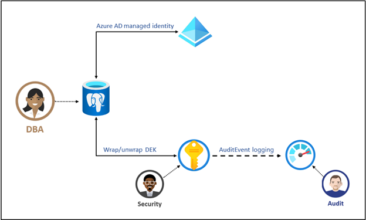

# Data Encryption with Customer Managed Keys

[!INCLUDE [PostgreSQL](../includes/appliesto-postgresql.md)]

Data stored in your Azure Cosmos DB for PostgreSQL cluster is automatically and seamlessly encrypted with keys managed by Microsoft. These keys are referred to as **service-managed keys**. Azure Cosmos DB for PostgreSQL uses [Azure Storage encryption](../../storage/common/storage-service-encryption.md) to encrypt data at-rest by default using service-managed keys.  You can optionally choose to add an extra layer of security by enabling encryption with **customer-managed keys**.

## Service-managed keys

The Azure Cosmos DB for PostgreSQL service uses the FIPS 140-2 validated cryptographic module for storage encryption of data at-rest. All Data including backups and temporary files created while running queries are encrypted on disk. The service uses the AES 256-bit cipher included in Azure storage encryption, and the keys are system-managed. Storage encryption is always on and cannot be disabled.

## Customer-managed keys

Many organizations require full control of access to data using a customer-managed key. Data encryption with customer-managed keys for Azure Cosmos DB for PostgreSQL enables you to bring your own key for protecting data at rest. It also allows organizations to implement separation of duties in the management of keys and data. With customer-managed encryption, you're responsible for, and in full control of, a key's lifecycle, usage permissions, and auditing of operations.

Data encryption with customer-managed keys for Azure Cosmos DB for PostgreSQL is set at the server level. Data, including backups, are encrypted on disk. This encryption includes the temporary files created while running queries. For a given cluster, a customer-managed key, called the key encryption key (**KEK**), is used to encrypt the service's data encryption key (**DEK**). The KEK is an asymmetric key stored in a customer-owned and customer-managed [Azure Key Vault](../../key-vault/index.yml) instance.

| | Description |
| --- | --- |
| **Data encryption key (DEK)** | A data encryption key is a symmetric AES256 key used to encrypt a partition or block of data. Encrypting each block of data with a different key makes crypto analysis attacks more difficult. The resource provider or application instance that is encrypting and decrypting a specific block requires access to DEKs. When you replace a DEK with a new key, only the data in its associated block must be re-encrypted with the new key. |
| **Key encryption key (KEK)** | A key encryption key is an encryption key used to encrypt the DEKs. A KEK that never leaves a key vault allows the DEKs themselves to be encrypted and controlled. The entity that has access to the KEK might be different than the entity that requires the DEK. Since the KEK is required to decrypt the DEKs, the KEK is effectively a single point and deletion of the KEK effectively deletes the DEKs. |

> [!NOTE]
> Azure Key Vault is a cloud-based key management system. It's highly available and provides scalable, secure storage for RSA cryptographic keys, optionally backed by FIPS 140-2 Level 2 validated hardware security modules (**HSM**s). A key vault doesn't allow direct access to a stored key but provides encryption and decryption services to authorized entities. A key vault can generate the key, import it, or have it transferred from an on-premises HSM device.

The DEKs, encrypted with the KEKs, are stored separately. Only an entity with access to the KEK can decrypt these DEKs. For more information, see [Security in encryption at rest.](../../security/fundamentals/encryption-atrest.md).

## How data encryption with a customer-managed key works

For a cluster to use customer-managed keys stored in Key Vault for encryption of the DEK, a Key Vault administrator gives the following access rights to the server:

| | Description |
| --- | --- |
| **get** | Enables retrieving the public part and properties of the key in the key vault. |
| **wrapKey** | Enables encryption of the DEK. The encrypted DEK is stored in Azure Cosmos DB for PostgreSQL. |
| **unwrapKey** | Enables decryption of the DEK. Azure Cosmos DB for PostgreSQL requires the decrypted DEK to encrypt/decrypt data. |

The key vault administrator can also enable logging of Key Vault audit events, so they can be audited later.
When the Azure Cosmos DB for PostgreSQL cluster is configured to use the customer-managed key stored in the key vault, the cluster sends the DEK to the key vault for encryptions. Key Vault returns the encrypted DEK, which is stored in the user database. Similarly, when needed, the server sends the protected DEK to the key vault for decryption. Auditors can use  [Azure Monitor](../../azure-monitor/index.yml) to review Key Vault audit event logs, if logging is enabled.

## Benefits

Data encryption with customer-managed keys for Azure Cosmos DB for PostgreSQL provides the following benefits:

- You fully control data access with the ability to remove the key and make the database inaccessible.
- Full control over the key lifecycle, including rotation of the key to align with specific corporate policies.
- Central management and organization of keys in Azure Key Vault.
- Ability to implement separation of duties between security officers, database administrators, and system administrators.
- Enabling encryption doesn't have any extra performance effect with or without customer-managed keys. Azure Cosmos DB for PostgreSQL relies on Azure Storage for data encryption in both customer-managed and service-managed key scenarios.

## Next steps

>[!div class="nextstepaction"]
>[Enable encryption with customer managed keys](how-to-customer-managed-keys.md)
