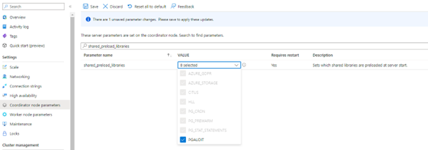
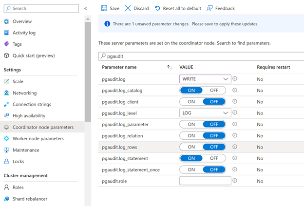

# Audit logging in Azure Cosmos DB for PostgreSQL

[!INCLUDE [PostgreSQL](../includes/appliesto-postgresql.md)]

Audit logging of database activities in Azure Cosmos DB for PostgreSQL is available through the PostgreSQL Audit extension: [pgAudit](https://www.pgaudit.org/). pgAudit provides detailed session or object audit logging.

If you want Azure resource-level logs for operations like compute and storage scaling, see the [Azure Activity Log](../../azure-monitor/essentials/platform-logs-overview.md).

## Usage considerations
By default, pgAudit log statements are emitted along with your regular log statements by using Postgres's standard logging facility. In Azure Cosmos DB for PostgreSQL, you can configure all logs to be sent to Azure Monitor Log store for later analytics in Log Analytics. 

## Installing pgAudit

To install pgAudit, you need to include it in the server's shared preload libraries. A change to `shared_preload_libraries` parameter requires a cluster restart to take effect. Also, pgAudit settings are specified per-node in a cluster. To enable auditing on all nodes, you must apply the audit settings to both coordinator and worker nodes settings.

Using the [Azure portal](https://portal.azure.com):

 1. Select your Azure Cosmos DB for PostgreSQL cluster.
 1. On the sidebar, select **Coordinator (or Worker Node) parameters**.
 1. Search for the `shared_preload_libraries` parameter.
 1. Select **pgaudit** and save the changes. Your Azure Cosmos DB for PostgreSQL cluster will be restarted.
   
    [](media/howto-enable-pgaudit/shared-preload-libraries-expanded.png#lightbox)

 1. You can check that **pgaudit** is loaded in shared_preload_libraries by executing following query in psql:
      ```SQL
      show shared_preload_libraries;
      ```
      You should see **pgaudit** in the query result. 

 1. Connect to psql and the following query for citus versions equal or newer than 11.0
     ```SQL
     BEGIN; 
     SET LOCAL citus.enable_metadata_sync = false; 
     SELECT create_extension('pgaudit'); 
     COMMIT; 
      ```
    
    For older versions than citus 11.0: 
       ```SQL
     BEGIN; 
     SET LOCAL citus.enable_object_propagation= false; 
     SELECT create_extension('pgaudit'); 
     COMMIT; 
      ```

## pgAudit settings

pgAudit allows you to configure session or object audit logging. [Session audit logging](https://github.com/pgaudit/pgaudit/blob/master/README.md#session-audit-logging) emits detailed logs of executed statements. [Object audit logging](https://github.com/pgaudit/pgaudit/blob/master/README.md#object-audit-logging) is audit scoped to specific relations. You can choose to set up one or both types of logging. 

Once you have [enabled pgAudit](#installing-pgaudit), you can configure its parameters to start logging. 
To configure pgAudit, you can follow below instructions. 
Using the [Azure portal](https://portal.azure.com):

   1. Select your Azure Cosmos DB for PostgreSQL cluster.
   2. On the sidebar, select **Server Parameters**.
   3. Search for the `pgaudit` parameters.
   4. Pick appropriate settings parameter to edit. For example, to start logging set `pgaudit.log` to `WRITE`
            [ ](media/howto-enable-pgaudit/audit-parameters-expanded.png#lightbox)

   5. Select **Save** button to save changes

 The [pgAudit documentation](https://github.com/pgaudit/pgaudit/blob/master/README.md#settings) provides the definition of each parameter. Test the parameters first and confirm that you're getting the expected behavior.

> [!NOTE]
> Setting `pgaudit.log_client` to ON will redirect logs to a client process (like psql) instead of being written to file. This setting should generally be left disabled. <br> <br>
> `pgaudit.log_level` is only enabled when `pgaudit.log_client` is on.

> [!NOTE]
> In Azure Cosmos DB for PostgreSQL, `pgaudit.log` cannot be set using a `-` (minus) sign shortcut as described in the pgAudit documentation. All required statement classes (READ, WRITE, etc.) should be individually specified.

## Audit log format
Each audit entry is indicated by `AUDIT:` near the beginning of the log line. The format of the rest of the entry is detailed in the [pgAudit documentation](https://github.com/pgaudit/pgaudit/blob/master/README.md#format).


## Viewing audit logs
The way you access the logs depends on which endpoint you choose. For Azure Storage, see the [logs storage account](../../azure-monitor/essentials/resource-logs.md#send-to-azure-storage) article. For Event Hubs, see the [stream Azure logs](../../azure-monitor/essentials/resource-logs.md#send-to-azure-event-hubs) article.

For Azure Monitor Logs, logs are sent to the workspace you selected. The Postgres logs use the **AzureDiagnostics** collection mode, so they can be queried from the AzureDiagnostics table. The fields in the table are described below. Learn more about querying and alerting in the [Azure Monitor Logs query](../../azure-monitor/logs/log-query-overview.md) overview.

You can use this query to get started. You can configure alerts based on queries.

Search for all pgAudit entries in Postgres logs for a particular server in the last day
```kusto
AzureDiagnostics
| where Resource == "myservername"
| where Category == "PostgreSQLlogs"
| where TimeGenerated > ago(1d) 
| where Message contains "AUDIT:"
```

## Next steps

- [Learn how to setup logging in Azure Cosmos DB for PostgreSQL and how to access logs](howto-logging.md)