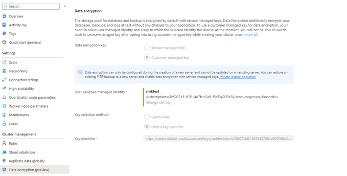

# Enable data encryption with customer-managed keys in Azure Cosmos DB for PostgreSQL

## Prerequisites

- An existing Azure Cosmos DB for PostgreSQL account.
  - If you have an Azure subscription, [create a new account](../nosql/how-to-create-account.md?tabs=azure-portal).
  - If you don't have an Azure subscription, create a [free account](https://azure.microsoft.com/free/?WT.mc_id=A261C142F) before you begin.
  - Alternatively, you can [try Azure Cosmos DB free](../try-free.md) before you commit.

## Enable data encryption with customer-managed keys

> [!IMPORTANT]
> Create all the following resources in the same region where your Azure Cosmos DB for PostgreSQL cluster will be deployed.

1. Create a User-Assigned Managed Identity. Currently, Azure Cosmos DB for PostgreSQL only supports user-assigned managed identities.

1. Create an Azure Key Vault and add an access policy to the created User-Assigned Managed Identity with the following key permissions: Get, Unwrap Key, and Wrap Key.

1. Generate a Key in the Key Vault (supported key types: RSA 2048, 3071, 4096).

1. Select the Customer-Managed Key encryption option during the creation of the Azure Cosmos DB for PostgreSQL cluster and select the appropriate User-Assigned Managed Identity, Key Vault, and Key created in Steps 1, 2, and 3.

## Detailed Steps

**1. User Assigned Managed Identity:**

   a. Search for Managed Identities in the global search bar.

   


   b. Create a new User assigned managed Identity in the same region as your Azure Cosmos DB for PostgreSQL cluster.

   


   Learn more about [User Assigned Managed Identity](../../active-directory/managed-identities-azure-resources/how-manage-user-assigned-managed-identities.md?pivots=identity-mi-methods-azp#create-a-user-assigned-managed-identity).

**2. Key Vault:**

   Using customer-managed keys with Azure Cosmos DB for PostgreSQL requires you to set two properties on the Azure Key Vault instance that you plan to use to host your encryption keys: Soft Delete and Purge Protection.

   a. If you create a new Azure Key Vault instance, enable these properties during creation:

   

   b. If you're using an existing Azure Key Vault instance, you can verify that these properties are enabled by looking at the Properties section on the Azure portal. If any of these properties aren’t enabled, see the "Enabling soft delete" and "Enabling Purge Protection" sections in one of the following articles.

   * How to use [soft-delete with PowerShell](../../key-vault/general/key-vault-recovery.md)
   * How to use [soft-delete with Azure CLI](../../key-vault/general/key-vault-recovery.md)

   c. The key Vault must be set with 90 days for 'Days to retain deleted vaults'. If the existing key Vault has been configured with a lower number, you'll need to create a new key vault as it can't be modified after creation.

   > [!IMPORTANT]
   > Your Azure Key Vault instance must be allow public access from all the networks.
   

**3. Add an Access Policy to the Key Vault:**

   a. From the Azure portal, go to the Azure Key Vault instance that you plan to use to host your encryption keys. Select Access configuration from the left menu and then select Go to access policies.

   

   b. Select + Create.

   c. In the Permissions Tab under the Key permissions drop-down menu, select Get, Unwrap Key, and Wrap Key permissions.

   

   d. In the Principal Tab, select the User Assigned Managed Identity you had created in prerequisite step.

   e. Navigate to Review + create select Create.

**4. Create / Import Key:**

    a. From the Azure portal, go to the Azure Key Vault instance that you plan to use to host your encryption keys.

    b. Select Keys from the left menu and then select +Generate/Import.

   

    c. The customer-managed key to be used for encrypting the DEK can only be asymmetric RSA Key type. All RSA Key sizes 2048, 3072 and 4096 are supported.

    d. The key activation date (if set) must be a date and time in the past. The expiration date (if set) must be a future date and time.

    e. The key must be in the Enabled state.

    f. If you're importing an existing key into the key vault, make sure to provide it in the supported file formats (`.pfx`, `.byok`, `.backup`).

    g. If you're manually rotating the key, the old key version shouldn't  be deleted for at least 24 hours.

**5. Enable CMK encryption during the provisioning for a new cluster**

   # [Portal](#tab/portal)

   a. During the provisioning of a new Cosmos DB for PostgreSQL cluster, after providing the necessary information under Basics and Networking Tab, Navigate to the Encryption (Preview) Tab.
      

   b. Select Customer Managed Key under Data encryption key option.

   c. Select the User Assigned Managed Identity created in the previous section.
      

   d. Select the Key Vault created in the previous step, which has the access policy to the user managed identity selected in the previous step.

   e. Select the Key created in the previous step, and then select Review+create.

   f. Verify that CMK is encryption is enabled by Navigating to the Data Encryption(preview) blade of the Cosmos DB for PostgreSQL cluster in the Azure portal.
      

   > [!NOTE]
   > Data encryption can only be configured during the creation of a new cluster and can't be updated on an existing cluster. A workaround for updating the encryption configuration on an existing cluster is to restore an existing PITR backup to a new cluster and configure the data encryption during the creation of the newly restored cluster.

   # [ARM Template](#tab/arm)
  ```json
    {
        "$schema": "http://schema.management.azure.com/schemas/2015-01-01/deploymentTemplate.json#",
        "contentVersion": "1.0.0.0",
        "parameters": {
            "serverGroupName": {
                "type": "string"
            },
            "location": {
                "type": "string"
            },
            "administratorLoginPassword": {
                "type": "secureString"
            },
            "previewFeatures": {
                "type": "bool"
            },
            "postgresqlVersion": {
                "type": "string"
            },
            "coordinatorVcores": {
                "type": "int"
            },
            "coordinatorStorageSizeMB": {
                "type": "int"
            },
            "numWorkers": {
                "type": "int"
            },
            "workerVcores": {
                "type": "int"
            },
            "workerStorageSizeMB": {
                "type": "int"
            },
            "enableHa": {
                "type": "bool"
            },
            "enablePublicIpAccess": {
                "type": "bool"
            },
            "serverGroupTags": {
                "type": "object"
            },
            "userAssignedIdentityUrl": {
                "type": "string"
            },
            "encryptionKeyUrl": {
                "type": "string"
            }
        },
        "variables": {},
        "resources": [
            {
                "name": "[parameters('serverGroupName')]",
                "type": "Microsoft.DBforPostgreSQL/serverGroupsv2",
                "kind": "CosmosDBForPostgreSQL",
                "apiVersion": "2020-10-05-privatepreview",
                "identity":
                {
                    "type": "UserAssigned",
                    "userAssignedIdentities":
                    {
                        "/subscriptions/04b0358b-392b-41d6-899e-b75cb292321e/resourcegroups/yogkuleuapcmkmarlintest/providers/Microsoft.ManagedIdentity/userAssignedIdentities/marlincmktesteus2euapuai1": {}
                    }
                },
                "location": "[parameters('location')]",
                "tags": "[parameters('serverGroupTags')]",
                "properties": {
                    "createMode": "Default",
                    "administratorLogin": "citus",
                    "administratorLoginPassword": "[parameters('administratorLoginPassword')]",
                    "backupRetentionDays": 35,
                    "enableMx": false,
                    "enableZfs": false,
                    "previewFeatures": "[parameters('previewFeatures')]",
                    "postgresqlVersion": "[parameters('postgresqlVersion')]",
                    "dataencryption":
                    {
                        "primaryKeyUri": "[parameters('encryptionKeyUrl')]",
                        "primaryUserAssignedIdentityId": "[parameters('userAssignedIdentityUrl')]",
                        "type": "AzureKeyVault"
                    },
                    "serverRoleGroups": [
                        {
                            "name": "",
                            "role": "Coordinator",
                            "serverCount": 1,
                            "serverEdition": "GeneralPurpose",
                            "vCores": "[parameters('coordinatorVcores')]",
                            "storageQuotaInMb": "[parameters('coordinatorStorageSizeMB')]",
                            "enableHa": "[parameters('enableHa')]"
                        },
                        {
                            "name": "",
                            "role": "Worker",
                            "serverCount": "[parameters('numWorkers')]",
                            "serverEdition": "MemoryOptimized",
                            "vCores": "[parameters('workerVcores')]",
                            "storageQuotaInMb": "[parameters('workerStorageSizeMB')]",
                            "enableHa": "[parameters('enableHa')]",
                            "enablePublicIpAccess": "[parameters('enablePublicIpAccess')]"
                        }
                    ]
                },
                "dependsOn": []
            }
        ],
        "outputs": {}
    }
```
---

**6. High Availability:**

   When CMK encryption is enabled on the primary cluster, all standby HA replicas are automatically encrypted by the primary cluster’s CMK

### Restrictions

1. CMK encryption can't be enabled on cross region read replicas.

1. CMK encryption can only be enabled during the creation of a new Azure Cosmos DB for PostgreSQL cluster.

1. CMK encryption is available in the following regions Switzerland North and North Europe.

1. CMK encryption isn't supported with Private access (including VNET).

### Changing Encryption Configuration by performing a PITR.

Encryption configuration can be changed from service managed encryption to CMK encryption or vice versa while performing a Point in restore operation to a new cluster.

# [Portal](#tab/portal)

  a. Navigate to the Data Encryption blade, and select Initiate restore operation. Alternatively, you can perform PITR by selecting the Restore option in the overview blade.
    

  b. You can change/configure the Data Encryption from the Encryption(preview) Tab.

# [ARM Template](#tab/arm)

```json
    {
        "$schema": "http://schema.management.azure.com/schemas/2014-04-01-preview/deploymentTemplate.json#",
        "contentVersion": "1.0.0.0",
        "parameters": {
            "location": {
                "type": "string"
            },
            "sourceLocation": {
                "type": "string"
            },
            "subscriptionId": {
                "type": "string"
            },
            "resourceGroupName": {
                "type": "string"
            },
            "serverGroupName": {
                "type": "string"
            },
            "sourceServerGroupName": {
                "type": "string"
            },
            "restorePointInTime": {
                "type": "string"
            },
            "encryptionKeyUrl": {
                "type": "string"
            },
            "userAssignedIdentityUrl": {
                "type": "string"
            }
        },
        "variables": {
            "api": "2020-02-14-privatepreview"
        },
        "resources": [
            {
                "apiVersion": "2020-10-05-privatepreview",
                "location": "[parameters('location')]",
                "name": "[parameters('serverGroupName')]",
                "identity":
                {
                    "type": "UserAssigned",
                    "userAssignedIdentities":
                    {
                        "/subscriptions/04b0358b-392b-41d6-899e-b75cb292321e/resourcegroups/yogkuleuapcmkmarlintest/providers/Microsoft.ManagedIdentity/userAssignedIdentities/marlincmktesteus2euapuai1": {}
                    }
                },
                "properties": {
                    "createMode": "PointInTimeRestore",
                    "sourceServerGroupName": "[parameters('sourceServerGroupName')]",
                    "pointInTimeUTC": "[parameters('restorePointInTime')]",
                    "sourceLocation": "[parameters('location')]",
                    "sourceSubscriptionId": "[parameters('subscriptionId')]",
                    "sourceResourceGroupName": "[parameters('resourceGroupName')]",
                    "enableMx": false,
                    "enableZfs": false,
                    "dataencryption":
                    {
                        "primaryKeyUri": "[parameters('encryptionKeyUrl')]",
                        "primaryUserAssignedIdentityId": "[parameters('userAssignedIdentityUrl')]",
                        "type": "AzureKeyVault"
                    },
                }
                "type": "Microsoft.DBforPostgreSQL/serverGroupsv2"
            }
        ]
    }
```
---

### Monitor the customer-managed key in Key Vault

To monitor the database state, and to enable alerting for the loss of transparent data encryption protector access, configure the following Azure features:

* [Azure Resource Health](../../service-health/resource-health-overview.md): An inaccessible database that has lost access to the Customer Key shows as "Inaccessible" after the first connection to the database has been denied.

* [Activity log](../../service-health/alerts-activity-log-service-notifications-portal.md): When access to the Customer Key in the customer-managed Key Vault fails, entries are added to the activity log. You can reinstate access as soon as possible, if you create alerts for these events.

* [Action groups](../../azure-monitor/alerts/action-groups.md): Define these groups to send you notifications and alerts based on your preference.


