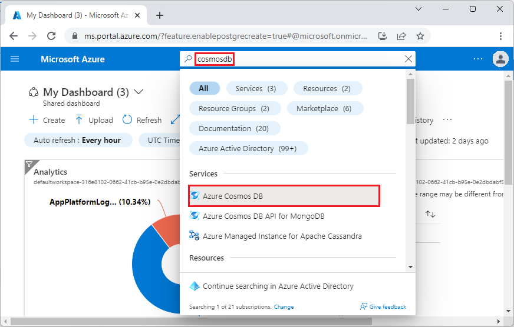
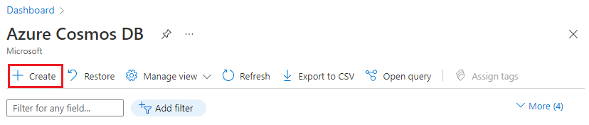
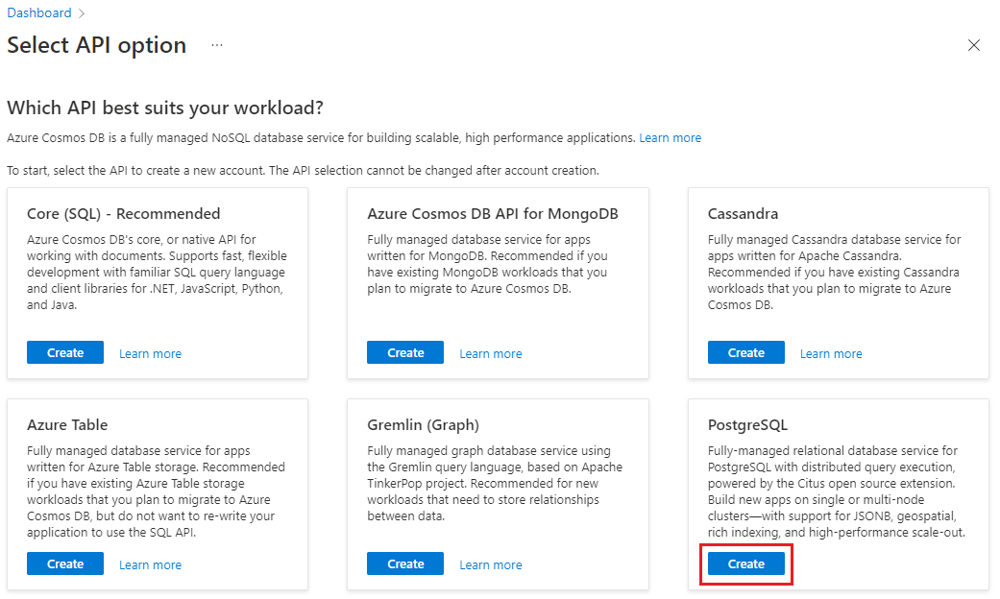
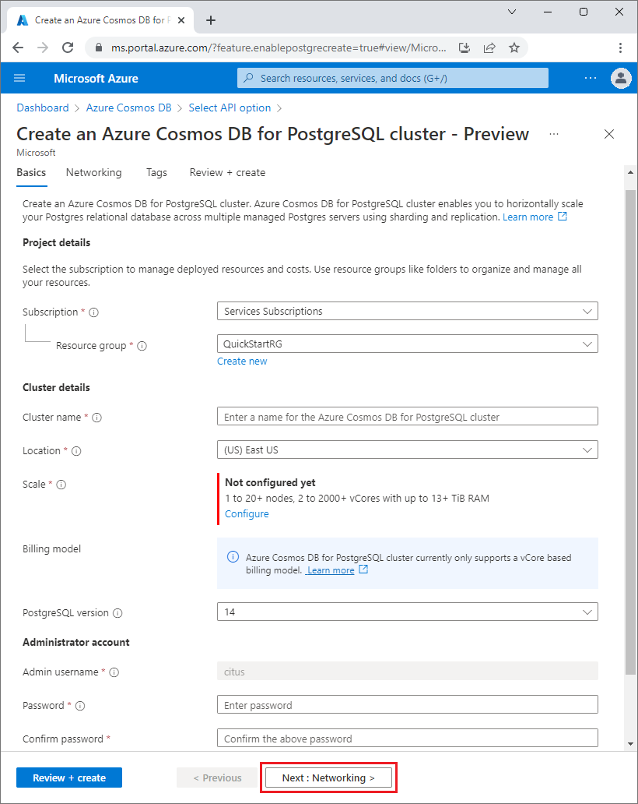
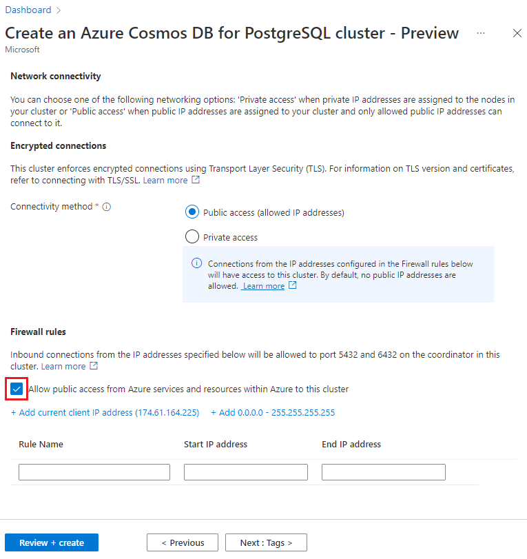

If you don't have an Azure subscription, create a [free](https://azure.microsoft.com/free/) account before you begin.

Sign in to the [Azure portal](https://portal.azure.com) and follow these steps to create an Azure Cosmos DB for PostgreSQL cluster:

# [Direct link](#tab/direct)

Go to [Create an Azure Cosmos DB for PostgreSQL cluster](https://portal.azure.com/#view/Microsoft_Azure_DocumentDB/CreatePostgreSQL.ReactView) in the Azure portal.

# [Portal search](#tab/portal-search)

1. In the [Azure portal](https://portal.azure.com), search for and select *cosmos db*.

   
   
1. On the **Azure Cosmos DB** screen, select **Create**.

   
   
1. On the **Select API option** screen, select **Create** on the **PostgreSQL** tile.

   

---

On the **Create an Azure Cosmos DB for PostgreSQL cluster** form:

1. Fill out the information on the **Basics** tab.

   

   Most options are self-explanatory, but keep in mind:

   * The cluster name determines the DNS name your applications use to connect, in the form `<clustername>.postgres.database.azure.com`.
   * You can choose a database version. Azure Cosmos DB for PostgreSQL always supports the
     latest PostgreSQL version, within one day of release.
   * The admin username must be the value `citus`.

1. Select **Next : Networking** at the bottom of the screen.
1. On the **Networking** screen, select **Allow public access from Azure services and resources within Azure to this cluster**.

   

1. Select **Review + create**, and when validation passes, select **Create** to create the cluster.

1. Provisioning takes a few minutes. The page redirects to monitor deployment. When the status changes
   from **Deployment is in progress** to **Your deployment is complete**, select **Go to resource**.
