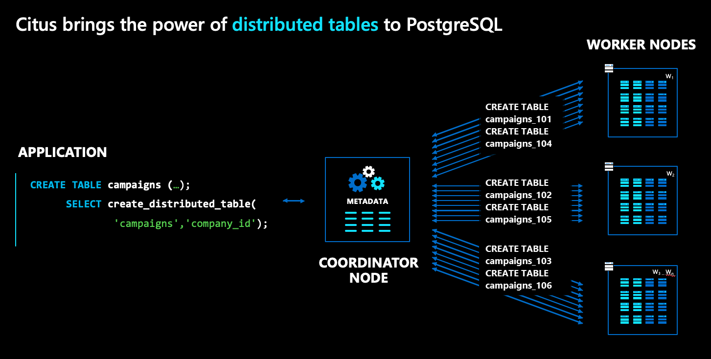

# Fundamental concepts for scaling in Azure Cosmos DB for PostgreSQL

[!INCLUDE [PostgreSQL](../includes/appliesto-postgresql.md)]

Before we investigate the steps of building a new app, it's helpful to see a
quick overview of the terms and concepts involved.

## Architectural overview

Azure Cosmos DB for PostgreSQL gives you the power to distribute tables and/or schemas across multiple
machines in a cluster and transparently query them the same you query
plain PostgreSQL:



In the Azure Cosmos DB for PostgreSQL architecture, there are multiple kinds of nodes:

* The **coordinator** node stores distributed table metadata and is responsible
  for distributed planning.
* By contrast, the **worker** nodes store the actual data, metadata and do the computation.
* Both the coordinator and workers are plain PostgreSQL databases, with the
  `citus` extension loaded.

To distribute a normal PostgreSQL table, like `campaigns` in the diagram above,
run a command called `create_distributed_table()`.  Once you run this
command, Azure Cosmos DB for PostgreSQL transparently creates shards for the table across
worker nodes. In the diagram, shards are represented as blue boxes.

To distribute a normal PostgreSQL schema, you run the `citus_schema_distribute()` command. Once you run this command, Azure Cosmos DB for PostgreSQL transparently turns tables in such schemas into a single shard colocated tables that can be moved as a unit between nodes of the cluster.

> [!NOTE]
>
> On a cluster with no worker nodes, shards of distributed tables are on the coordinator node.

Shards are plain (but specially named) PostgreSQL tables that hold slices of
your data. In our example, because we distributed `campaigns` by `company_id`,
the shards hold campaigns, where the campaigns of different companies are
assigned to different shards.

## Distribution column (also known as shard key)

`create_distributed_table()` is the magic function that Azure Cosmos DB for PostgreSQL
provides to distribute tables and use resources across multiple machines.

```postgresql
SELECT create_distributed_table(
	'table_name',
	'distribution_column');
```

The second argument above picks a column from the table as a **distribution
column**. It can be any column with a native PostgreSQL type (with integer and
text being most common). The value of the distribution column determines which
rows go into which shards, which is why the distribution column is also called
the **shard key**.

Azure Cosmos DB for PostgreSQL decides how to run queries based on their use of the shard
key:

| Query involves | Where it runs |
|----------------|---------------|
| just one shard key | on the worker node that holds its shard |
| multiple shard keys | parallelized across multiple nodes |

The choice of shard key dictates the performance and scalability of your
applications.

* Uneven data distribution per shard keys (also known as *data skew*) isn't optimal
  for performance. For example, don’t choose a column for which a single value
  represents 50% of data.
* Shard keys with low cardinality can affect scalability. You can use only as
  many shards as there are distinct key values. Choose a key with cardinality
  in the hundreds to thousands.
* Joining two large tables with different shard keys can be slow. Choose a
  common shard key across large tables. Learn more in
  [colocation](#colocation).

## Colocation

Another concept closely related to shard key is *colocation*. Tables sharded by
the same distribution column values are colocated - The shards of colocated
tables are stored together on the same workers.

Below are two tables sharded by the same key, `site_id`. They're colocated.


Azure Cosmos DB for PostgreSQL ensures that rows with a matching `site_id` value in both
tables are stored on the same worker node.  You can see that, for both tables,
rows with `site_id=1` are stored on worker 1. Similarly for other site IDs.

Colocation helps optimize JOINs across these tables. If you join the two tables
on `site_id`, Azure Cosmos DB for PostgreSQL can perform the join locally on worker nodes
without shuffling data between nodes.

Tables within a distributed schema are always colocated with each other. 

## Next steps

> [!div class="nextstepaction"]
> [Classify application workload >](quickstart-build-scalable-apps-classify.md)
