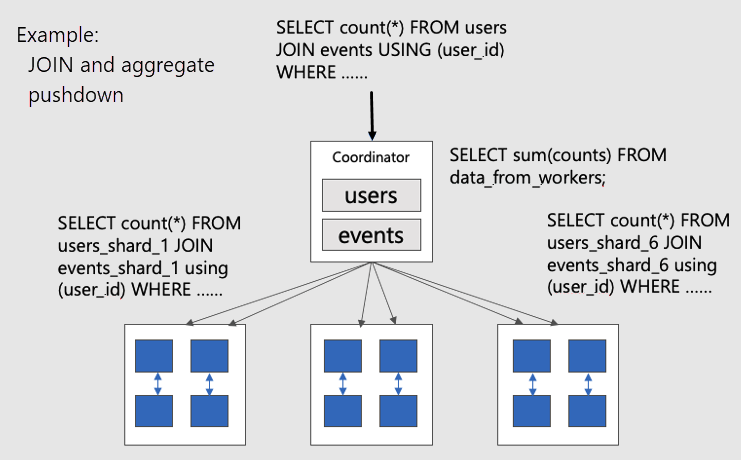
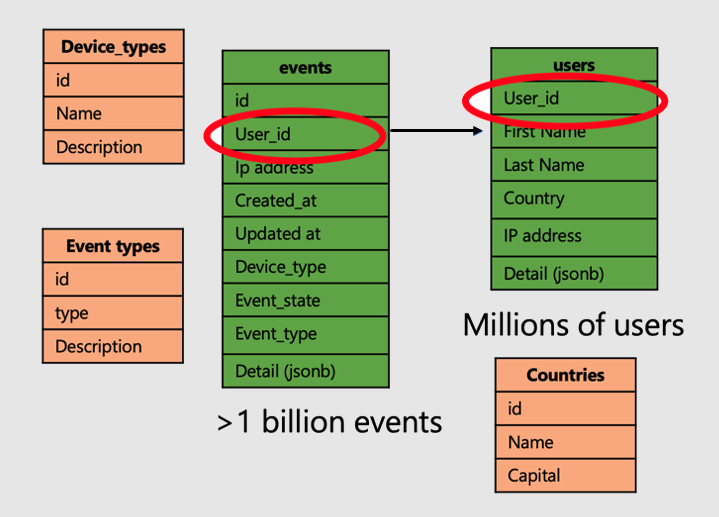

# Model real-time analytics apps in Azure Cosmos DB for PostgreSQL

[!INCLUDE [PostgreSQL](../includes/appliesto-postgresql.md)]

## Colocate large tables with shard key

To pick the shard key for a real-time operational analytics application, follow
these guidelines:

* Choose a column that is common on large tables
* Choose a column that is a natural dimension in the data, or a central piece
  of the application. Some examples:
  * In the financial world, an application that analyzes security trends would
    probably use `security_id`.
  * In a user analytics workload where you want to analyze website usage
    metrics, `user_id` would be a good distribution column

By colocating large tables, you can push SQL queries down to worker nodes in
parallel. Pushing down queries avoids shuffling data between nodes over the
network.  Operations such as JOINs, aggregates, rollups, filters, LIMITs can be
efficiently executed.

To visualize parallel distributed queries on colocated tables, consider this
diagram:



The `users` and `events` tables are both sharded by `user_id`, so related
rows for the same user ID are placed together on the same worker node. The
SQL JOINs can happen without pulling information between workers.

## Optimal data model for real-time apps

Let's continue with the example of an application that analyzes user website
visits and metrics. There are two "fact" tables--users and events--and other
smaller "dimension" tables.



To apply the super power of distributed tables on Azure Cosmos DB for PostgreSQL, follow
the following steps:

* Distribute large fact tables on a common column. In our case, users and
  events are distributed on `user_id`.
* Mark the small/dimension tables (`device_types`, `countries`, and
  `event_types) as reference tables.
* Be sure to include the distribution column in primary, unique, and foreign
  key constraints on distributed tables. Including the column may require making the keys
  composite. There's need to update keys for reference tables.
* When you're joining large distributed tables, be sure to join using the
  shard key.

```sql
-- Distribute the fact tables

SELECT create_distributed_table('users', 'user_id');
SELECT create_distributed_table('products', 'user_id', colocate_with => 'users');

-- Turn dimension tables into reference tables, with synchronized copies
-- maintained on every worker node

SELECT create_reference_table('countries');
-- similarly for device_types and event_types...
```

## Next steps

Now we've finished exploring data modeling for scalable apps. The next step is
connecting and querying the database with your programming language of choice.

> [!div class="nextstepaction"]
> [App stacks >](quickstart-app-stacks-overview.yml)
