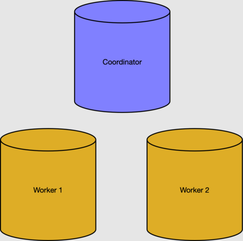
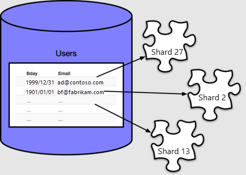
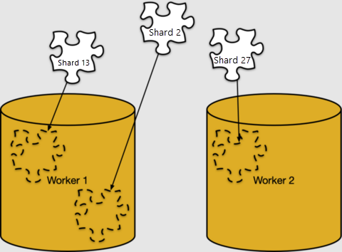
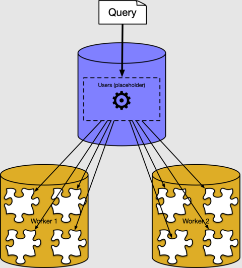

# Tutorial: Shard data on worker nodes in Azure Cosmos DB for PostgreSQL

[!INCLUDE [PostgreSQL](../includes/appliesto-postgresql.md)]

In this tutorial, you use Azure Cosmos DB for PostgreSQL to learn how to:

> [!div class="checklist"]
> * Create hash-distributed shards
> * See where table shards are placed
> * Identify skewed distribution
> * Create constraints on distributed tables
> * Run queries on distributed data

## Prerequisites

This tutorial requires a running cluster with two
worker nodes. If you don't have a running cluster, follow the [create
cluster](quickstart-create-portal.md) tutorial and then come back
to this one.

## Hash-distributed data

Distributing table rows across multiple PostgreSQL servers is a key technique
for scalable queries in Azure Cosmos DB for PostgreSQL. Together, multiple nodes can hold
more data than a traditional database, and in many cases can use worker CPUs in
parallel to execute queries.

In the prerequisites section, we created a cluster with
two worker nodes.



The coordinator node's metadata tables track workers and distributed data. We
can check the active workers in the
[pg_dist_node](reference-metadata.md#worker-node-table) table.

```sql
select nodeid, nodename from pg_dist_node where isactive;
```
```
 nodeid | nodename
--------+-----------
      1 | 10.0.0.21
      2 | 10.0.0.23
```

> [!NOTE]
> Nodenames on Azure Cosmos DB for PostgreSQL are internal IP addresses in a virtual
> network, and the actual addresses you see may differ.

### Rows, shards, and placements

To use the CPU and storage resources of worker nodes, we have to distribute
table data throughout the cluster.  Distributing a table assigns each row
to a logical group called a *shard.* Let's create a table and distribute it:

```sql
-- create a table on the coordinator
create table users ( email text primary key, bday date not null );

-- distribute it into shards on workers
select create_distributed_table('users', 'email');
```

Azure Cosmos DB for PostgreSQL assigns each row to a shard based on the value of the
*distribution column*, which, in our case, we specified to be `email`. Every
row will be in exactly one shard, and every shard can contain multiple rows.



By default `create_distributed_table()` makes 32 shards, as we can see by
counting in the metadata table
[pg_dist_shard](reference-metadata.md#shard-table):

```sql
select logicalrelid, count(shardid)
  from pg_dist_shard
 group by logicalrelid;
```
```
 logicalrelid | count
--------------+-------
 users        |    32
```

Azure Cosmos DB for PostgreSQL uses the `pg_dist_shard` table to assign rows to shards,
based on a hash of the value in the distribution column. The hashing details
are unimportant for this tutorial. What matters is that we can query to see
which values map to which shard IDs:

```sql
-- Where would a row containing hi@test.com be stored?
-- (The value doesn't have to actually be present in users, the mapping
-- is a mathematical operation consulting pg_dist_shard.)
select get_shard_id_for_distribution_column('users', 'hi@test.com');
```
```
 get_shard_id_for_distribution_column
--------------------------------------
                               102008
```

The mapping of rows to shards is purely logical. Shards must be assigned to
specific worker nodes for storage, in what Azure Cosmos DB for PostgreSQL calls *shard
placement*.



We can look at the shard placements in
[pg_dist_placement](reference-metadata.md#shard-placement-table).
Joining it with the other metadata tables we've seen shows where each shard
lives.

```sql
-- limit the output to the first five placements

select
	shard.logicalrelid as table,
	placement.shardid as shard,
	node.nodename as host
from
	pg_dist_placement placement,
	pg_dist_node node,
	pg_dist_shard shard
where placement.groupid = node.groupid
  and shard.shardid = placement.shardid
order by shard
limit 5;
```
```
 table | shard  |    host
-------+--------+------------
 users | 102008 | 10.0.0.21
 users | 102009 | 10.0.0.23
 users | 102010 | 10.0.0.21
 users | 102011 | 10.0.0.23
 users | 102012 | 10.0.0.21
```

### Data skew

A cluster runs most efficiently when you place data evenly on worker
nodes, and when you place related data together on the same workers. In this
section we'll focus on the first part, the uniformity of placement.

To demonstrate, let's create sample data for our `users` table:

```sql
-- load sample data
insert into users
select
	md5(random()::text) || '@test.com',
	date_trunc('day', now() - random()*'100 years'::interval)
from generate_series(1, 1000);
```

To see shard sizes, we can run [table size
functions](https://www.postgresql.org/docs/current/functions-admin.html#FUNCTIONS-ADMIN-DBSIZE)
on the shards.

```sql
-- sizes of the first five shards
select *
from
	run_command_on_shards('users', $cmd$
	  select pg_size_pretty(pg_table_size('%1$s'));
	$cmd$)
order by shardid
limit 5;
```
```
 shardid | success | result
---------+---------+--------
  102008 | t       | 16 kB
  102009 | t       | 16 kB
  102010 | t       | 16 kB
  102011 | t       | 16 kB
  102012 | t       | 16 kB
```

We can see the shards are of equal size. We already saw that placements are
evenly distributed among workers, so we can infer that the worker nodes hold
roughly equal numbers of rows.

The rows in our `users` example distributed evenly because properties of the
distribution column, `email`.

1. The number of email addresses was greater than or equal to the number of shards.
2. The number of rows per email address was similar (in our case, exactly one
   row per address because we declared email a key).

Any choice of table and distribution column where either property fails will
end up with uneven data size on workers, that is, *data skew*.

### Add constraints to distributed data

Using Azure Cosmos DB for PostgreSQL allows you to continue to enjoy the safety of a
relational database, including [database
constraints](https://www.postgresql.org/docs/current/ddl-constraints.html).
However, there's a limitation. Because of the nature of distributed systems,
Azure Cosmos DB for PostgreSQL won't cross-reference uniqueness constraints or referential
integrity between worker nodes.

Let's consider our `users` table example with a related table.

```sql
-- books that users own
create table books (
	owner_email text references users (email),
	isbn text not null,
	title text not null
);

-- distribute it
select create_distributed_table('books', 'owner_email');
```

For efficiency, we distribute `books` the same way as `users`: by the owner's
email address. Distributing by similar column values is called
[colocation](concepts-colocation.md).

We had no problem distributing books with a foreign key to users, because the
key was on a distribution column. However, we would have trouble making `isbn`
a key:

```sql
-- will not work
alter table books add constraint books_isbn unique (isbn);
```
```
ERROR:  cannot create constraint on "books"
DETAIL: Distributed relations cannot have UNIQUE, EXCLUDE, or
        PRIMARY KEY constraints that do not include the partition column
        (with an equality operator if EXCLUDE).
```

In a distributed table the best we can do is make columns unique modulo
the distribution column:

```sql
-- a weaker constraint is allowed
alter table books add constraint books_isbn unique (owner_email, isbn);
```

The above constraint merely makes isbn unique per user. Another option is to
make books a [reference
table](howto-modify-distributed-tables.md#reference-tables) rather
than a distributed table, and create a separate distributed table associating
books with users.

## Query distributed tables

In the previous sections, we saw how distributed table rows are placed in shards
on worker nodes. Most of the time you don't need to know how or where data is
stored in a cluster. Azure Cosmos DB for PostgreSQL has a distributed query executor
that automatically splits up regular SQL queries. It runs them in parallel on
worker nodes close to the data.

For instance, we can run a query to find the average age of users, treating the
distributed `users` table like it's a normal table on the coordinator.

```sql
select avg(current_date - bday) as avg_days_old from users;
```
```
    avg_days_old
--------------------
 17926.348000000000
```



Behind the scenes, the Azure Cosmos DB for PostgreSQL executor creates a separate query for
each shard, runs them on the workers, and combines the result. You can see it
if you use the PostgreSQL EXPLAIN command:

```sql
explain select avg(current_date - bday) from users;
```
```
                                  QUERY PLAN
----------------------------------------------------------------------------------
 Aggregate  (cost=500.00..500.02 rows=1 width=32)
   ->  Custom Scan (Citus Adaptive)  (cost=0.00..0.00 rows=100000 width=16)
     Task Count: 32
     Tasks Shown: One of 32
     ->  Task
       Node: host=10.0.0.21 port=5432 dbname=citus
       ->  Aggregate  (cost=41.75..41.76 rows=1 width=16)
         ->  Seq Scan on users_102040 users  (cost=0.00..22.70 rows=1270 width=4)
```

The output shows an example of an execution plan for a *query fragment* running
on shard 102040 (the table `users_102040` on worker 10.0.0.21). The other
fragments aren't shown because they're similar. We can see that the worker node
scans the shard tables and applies the aggregate. The coordinator node combines
aggregates for the final result.

## Next steps

In this tutorial, we created a distributed table, and learned about its shards
and placements. We saw a challenge of using uniqueness and foreign key
constraints, and finally saw how distributed queries work at a high level.

* Read more about Azure Cosmos DB for PostgreSQL [table types](concepts-nodes.md)
* Get more tips on [choosing a distribution column](howto-choose-distribution-column.md)
* Learn the benefits of [table colocation](concepts-colocation.md)
