# Visualize Azure Cosmos DB data by using the Power BI connector

[Power BI](https://powerbi.microsoft.com/) is an online service where you can create and share dashboards and reports. Power BI Desktop is a report authoring tool that enables you to retrieve data from various data sources. Azure Cosmos DB is one of the data source that you can use with Power BI Desktop. You can connect Power BI Desktop to Azure Cosmos DB account with the Azure Cosmos DB connector for Power BI.  After you import Azure Cosmos DB data to Power BI, you can transform it, create reports, and publish the reports to Power BI.   

This article describes the steps required to connect Azure Cosmos DB account to Power BI Desktop. After connecting, you navigate to a collection, extract the data, transform the JSON data into tabular format, and publish a report to Power BI.

> [!NOTE]
> The Power BI connector for Azure Cosmos DB connects to Power BI Desktop. Reports created in Power BI Desktop can be published to PowerBI.com. Direct extraction of Azure Cosmos DB data cannot be performed from PowerBI.com. 

> [!NOTE]
> Connecting to Azure Cosmos DB with the Power BI connector is currently supported for Azure Cosmos DB SQL API and Gremlin API accounts only.

## Prerequisites
Before following the instructions in this Power BI tutorial, ensure that you have access to the following resources:

* [Download the latest version of Power BI Desktop](https://powerbi.microsoft.com/desktop).

* Download the [sample volcano data](https://github.com/Azure-Samples/azure-cosmos-db-sample-data/blob/master/SampleData/VolcanoData.json) from GitHub.

* [Create an Azure Cosmos DB database account](https://azure.microsoft.com/documentation/articles/create-account/) and import the volcano data by using the [Azure Cosmos DB data migration tool](import-data.md). When importing data, consider the following settings for the source and destinations in the data migration tool:

   * **Source parameters** 

       * **Import from:** JSON file(s)

   * **Target parameters** 

      * **Connection string:** `AccountEndpoint=<Your_account_endpoint>;AccountKey=<Your_primary_or_secondary_key>;Database= <Your_database_name>` 

      * **Partition key:** /Country 

      * **Collection Throughput:** 1000 

To share your reports in PowerBI.com, you must have an account in PowerBI.com.  To learn more about Power BI and Power BI Pro, see [https://powerbi.microsoft.com/pricing](https://powerbi.microsoft.com/pricing).

## Let's get started
In this tutorial, let's imagine that you are a geologist studying volcanoes around the world. The volcano data is stored in an Azure Cosmos DB account and the JSON document format is as follows:

    {
        "Volcano Name": "Rainier",
           "Country": "United States",
          "Region": "US-Washington",
          "Location": {
            "type": "Point",
            "coordinates": [
              -121.758,
              46.87
            ]
          },
          "Elevation": 4392,
          "Type": "Stratovolcano",
          "Status": "Dendrochronology",
          "Last Known Eruption": "Last known eruption from 1800-1899, inclusive"
    }

You will retrieve the volcano data from the Azure Cosmos DB account and visualize data in an interactive Power BI report.

1. Run Power BI Desktop.

2. You can **Get Data**, see **Recent Sources**, or **Open Other Reports** directly from the welcome screen. Select the "X" at the top right corner to close the screen. The **Report** view of Power BI Desktop is displayed.
   
   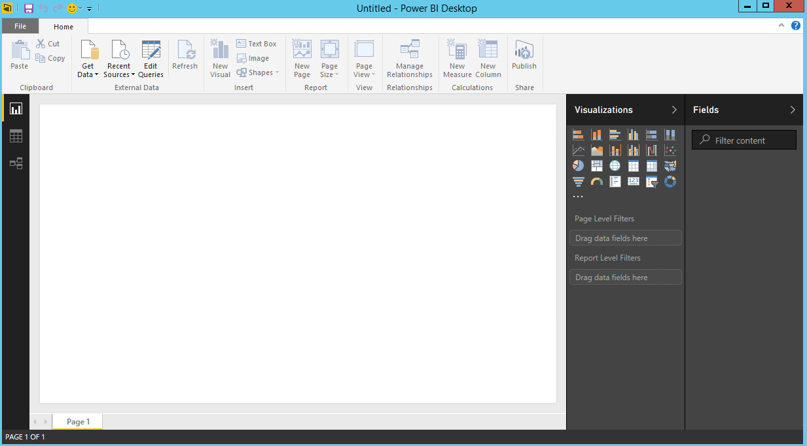

3. Select the **Home** ribbon, then click on **Get Data**.  The **Get Data** window should appear.

4. Click on **Azure**, select **Azure Cosmos DB (Beta)**, and then click **Connect**. 

       

5. On the **Preview Connector** page, click **Continue**. The **Azure Cosmos DB** window appears.

6. Specify the Azure Cosmos DB account endpoint URL you would like to retrieve the data from as shown below, and then click **OK**. To use your own account, you can retrieve the URL from the URI box in the **Keys** blade of the Azure portal. Optionally you can provide the database name, collection name or use the navigator to select the database and collection to identify where the data comes from.
   
7. If you are connecting to this endpoint for the first time, you are prompted for the account key. For your own account, retrieve the key from the **Primary Key** box in the **Read-only Keys** blade of the Azure portal. Enter the appropriate key and then click **Connect**.
   
   We recommend that you use the read-only key when building reports. This prevents unnecessary exposure of the master key to potential security risks. The read-only key is available from the **Keys** blade of the Azure portal. 
    
8. When the account is successfully connected, the **Navigator** pane appears. The **Navigator** shows a list of databases under the account.

9. Click and expand on the database where the data for the report comes from, select **volcanodb** (your database name can be different).   

10. Now, select a collection that contains the data to retrieve, select **volcano1** (your collection name can be different).
    
    The Preview pane shows a list of **Record** items.  A Document is represented as a **Record** type in Power BI. Similarly, a nested JSON block inside a document is also a **Record**.
    
    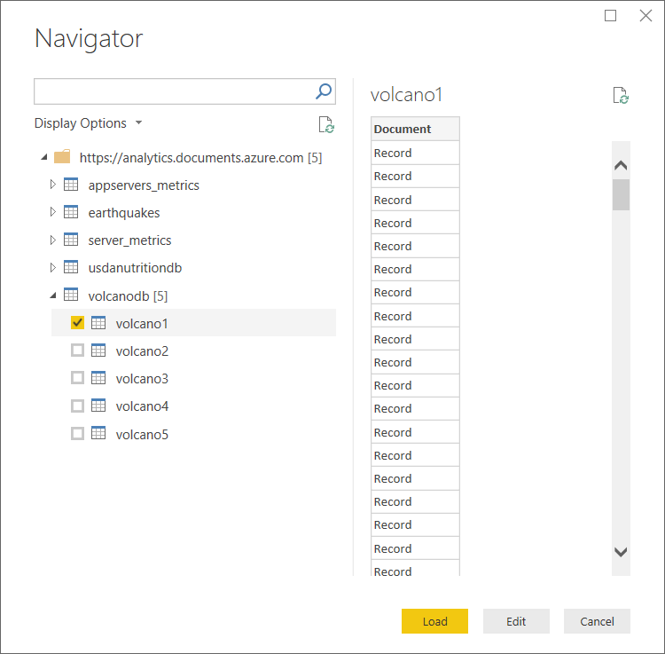
12. Click **Edit** to launch the Query Editor in a new window to transform the data.

## Flattening and transforming JSON documents
1. Switch to the Power BI Query Editor window, where the **Document** column in the center pane.
   
2. Click on the expander at the right side of the **Document** column header.  The context menu with a list of fields will appear.  Select the fields you need for your report, for instance,  Volcano Name, Country, Region, Location, Elevation, Type, Status and Last Know Eruption. Uncheck the **Use original column name as prefix** box, and then click **OK**.
   
    
3. The center pane displays a preview of the result with the fields selected.
   
    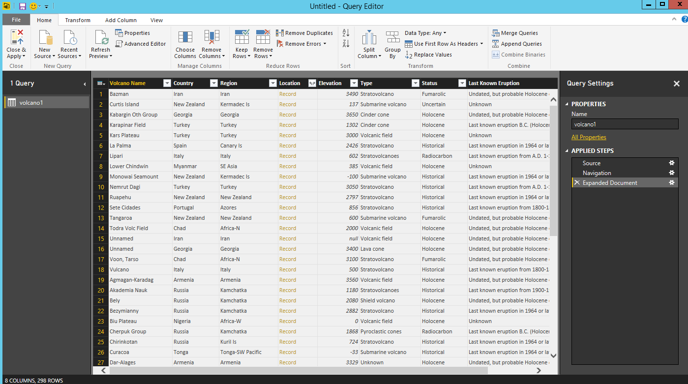
4. In our example, the Location property is a GeoJSON block in a document.  As you can see, Location is represented as a **Record** type in Power BI Desktop.  
5. Click on the expander at the right side of the Document.Location column header.  The context menu with type and coordinates fields appear.  Let's select the coordinates field, ensure **Use original column name as prefix** is not selected, and click **OK**.
   
    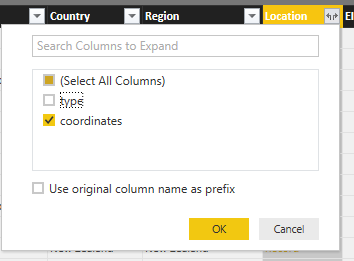
6. The center pane now shows a coordinates column of **List** type.  As shown at the beginning of the tutorial, the GeoJSON data in this tutorial is of Point type with Latitude and Longitude values recorded in the coordinates array.
   
    The coordinates[0] element represents Longitude while coordinates[1] represents Latitude.
    
7. To flatten the coordinates array, create a **Custom Column** called LatLong.  Select the **Add Column** ribbon and click on **Custom Column**.  The **Custom Column** window appears.
8. Provide a name for the new column, e.g. LatLong.
9. Next, specify the custom formula for the new column.  For our example, we will concatenate the Latitude and Longitude values separated by a comma as shown below using the following formula: `Text.From([coordinates]{1})&","&Text.From([coordinates]{0})`. Click **OK**.
   
    For more information on Data Analysis Expressions (DAX) including DAX functions, please visit [DAX Basics in Power BI Desktop](https://docs.microsoft.com/power-bi/desktop-quickstart-learn-dax-basics).
   
    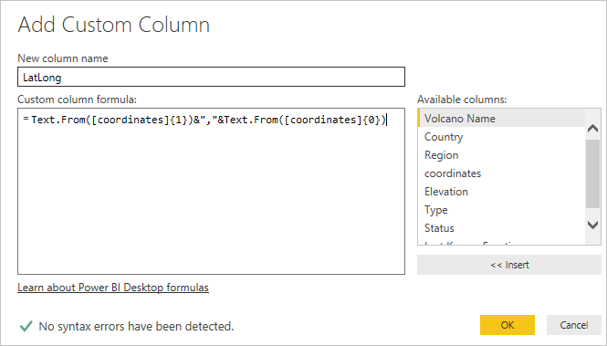

10. Now, the center pane shows the new LatLong columns populated with the values.
    
    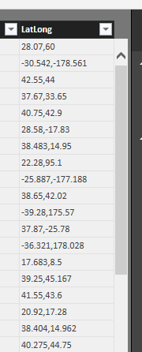
    
    If you receive an Error in the new column, make sure that the applied steps under Query Settings match the following figure:
    
    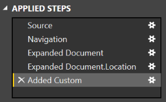
    
    If your steps are different, delete the extra steps and try adding the custom column again. 

11. Click **Close and Apply** to save the data model.
    
    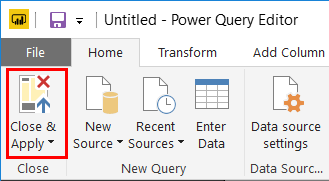

## Build the reports
Power BI Desktop Report view is where you can start creating reports to visualize data.  You can create reports by dragging and dropping fields into the **Report** canvas.

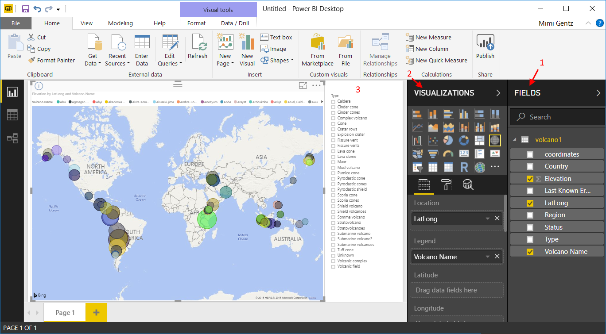

In the Report view, you should find:

1. The **Fields** pane, this is where you can see a list of data models with fields you can use for your reports.
2. The **Visualizations** pane. A report can contain a single or multiple visualizations.  Pick the visual types fitting your needs from the **Visualizations** pane.
3. The **Report** canvas, this is where you build the visuals for your report.
4. The **Report** page. You can add multiple report pages in Power BI Desktop.

The following shows the basic steps of creating a simple interactive Map view report.

1. For our example, we will create a map view showing the location of each volcano.  In the **Visualizations** pane, click on the Map visual type as highlighted in the screenshot above.  You should see the Map visual type painted on the **Report** canvas.  The **Visualization** pane should also display a set of properties related to the Map visual type.
2. Now, drag and drop the LatLong field from the **Fields** pane to the **Location** property in **Visualizations** pane.
3. Next, drag and drop the Volcano Name field to the **Legend** property.  
4. Then, drag and drop the Elevation field to the **Size** property.  
5. You should now see the Map visual showing a set of bubbles indicating the location of each volcano with the size of the bubble correlating to the elevation of the volcano.
6. You now have created a basic report.  You can further customize the report by adding more visualizations.  In our case, we added a Volcano Type slicer to make the report interactive.  
   
7. On the File menu, click **Save** and save the file as PowerBITutorial.pbix.

## Publish and share your report
To share your report, you must have an account in PowerBI.com.

1. In the Power BI Desktop, click on the **Home** ribbon.
2. Click **Publish**.  You are be prompted to enter the user name and password for your PowerBI.com account.
3. Once the credential has been authenticated, the report is published to your destination you selected.
4. Click **Open 'PowerBITutorial.pbix' in Power BI** to see and share your report on PowerBI.com.
   
    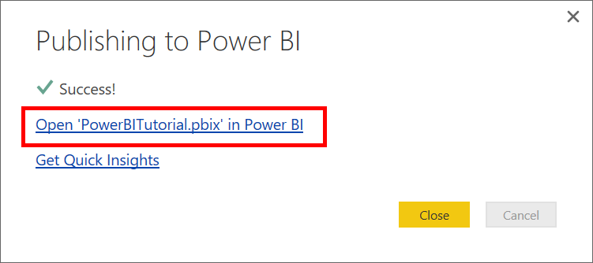

## Create a dashboard in PowerBI.com
Now that you have a report, lets share it on PowerBI.com

When you publish your report from Power BI Desktop to PowerBI.com, it generates a **Report** and a **Dataset** in your PowerBI.com tenant. For example, after you published a report called **PowerBITutorial** to PowerBI.com, you will see PowerBITutorial in both the **Reports** and **Datasets** sections on PowerBI.com.

   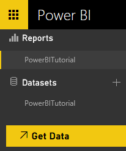

To create a sharable dashboard, click the **Pin Live Page** button on your PowerBI.com report.

   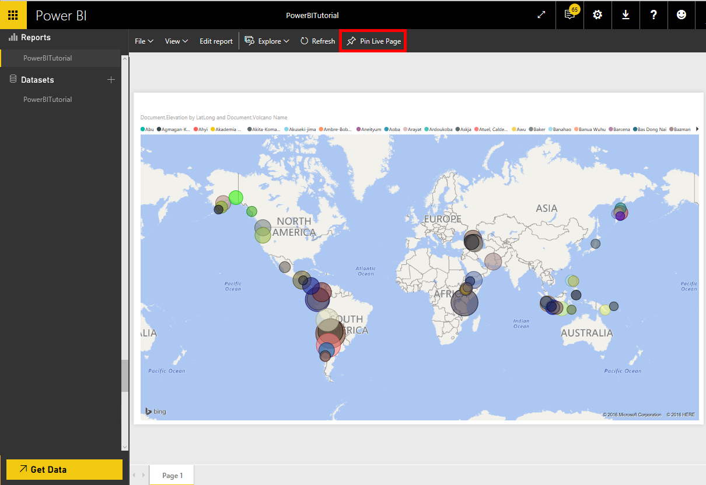

Then follow the instructions in [Pin a tile from a report](https://powerbi.microsoft.com/documentation/powerbi-service-pin-a-tile-to-a-dashboard-from-a-report/#pin-a-tile-from-a-report) to create a new dashboard. 

You can also do ad hoc modifications to report before creating a dashboard. However, it's recommended that you use Power BI Desktop to perform the modifications and republish the report to PowerBI.com.

<!-- ## Refresh data in PowerBI.com
There are two ways to refresh data, ad hoc and scheduled.

For an ad hoc refresh, simply click on the eclipses (…) by the **Dataset**, e.g. PowerBITutorial. You should see a list of actions including **Refresh Now**. Click **Refresh Now** to refresh the data.

For a scheduled refresh, do the following.

1. Click **Schedule Refresh** in the action list. 

    
2. In the **Settings** page, expand **Data source credentials**. 
3. Click on **Edit credentials**. 
   
    The Configure popup appears. 
4. Enter the key to connect to the Azure Cosmos DB account for that data set, then click **Sign in**. 
5. Expand **Schedule Refresh** and set up the schedule you want to refresh the dataset. 
6. Click **Apply** and you are done setting up the scheduled refresh.
-->
## Next steps
* To learn more about Power BI, see [Get started with Power BI](https://powerbi.microsoft.com/documentation/powerbi-service-get-started/).
* To learn more about Azure Cosmos DB, see the [Azure Cosmos DB documentation landing page](https://azure.microsoft.com/documentation/services/cosmos-db/).

