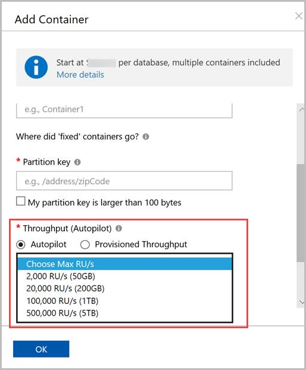

# Create Azure Cosmos containers and databases in autopilot mode (Preview)

Azure Cosmos DB allows you to provision throughput on your containers in either manual or autopilot mode. This article describes the benefits and use cases of autopilot mode.

> [!NOTE]
> Autopilot mode is currently available in public preview. You can [enable autopilot for new databases and containers](#create-a-database-or-a-container-with-autopilot-mode) only. It is not available for existing containers and databases.

In addition to manual provisioning of throughput, you can now configure Azure Cosmos containers in autopilot mode. Containers and databases configured in autopilot mode will **automatically and instantly scale the provisioned throughput based on your application needs without impacting the availability, latency, throughput, or performance of the workload globally.**

When configuring containers and databases in autopilot mode, you need to specify the maximum throughput `Tmax` not to be exceeded. Containers can then scale their throughput so that `0.1*Tmax < T < Tmax`. In other words, containers and databases scale instantly based on the workload needs, from as low as 10% of the maximum throughput value that you have configured up to the configured maximum throughput value. You can change the maximum throughput (`Tmax`) setting on an autopilot database or container at any point in time. With the autopilot option, the 400 RU/s minimum throughput per container or database is no longer applicable.

During the preview of autopilot, for the specified maximum throughput on the container or the database, the system allows operating within the calculated storage limit. If the storage limit is exceeded, then the maximum throughput is automatically adjusted to a higher value. When using database level throughput with autopilot mode, the number of containers allowed within a database is calculated as: `0.001*TMax`. For example, if you provision 20,000 autopilot RU/s, then the database can have 20 containers.

## Benefits of autopilot mode

Azure Cosmos containers that are configured in autopilot mode have the following benefits:

* **Simple:** Containers in autopilot mode remove the complexity to manage provisioned throughput (RUs) and capacity manually for various containers.

* **Scalable:** Containers in autopilot mode seamlessly scale the provisioned throughput capacity as needed. There is no disruption to client connections, applications and they don’t impact any existing SLAs.

* **Cost-effective:** When you use containers configured in autopilot mode, you only pay for the resources that your workloads need on a per-hour basis.

* **Highly available:** Containers in autopilot mode use the same globally distributed, fault-tolerant, highly available backend to ensure data durability and high availability.

## Use cases of autopilot mode

The use cases for Azure Cosmos containers configured in autopilot mode include:

* **Variable workloads:** When you are running a lightly used application with peak usage of 1 hour to several hours a few times each day or several times per year. Examples include applications for human resources, budgeting, and operational reporting. For such scenarios, containers configured in autopilot mode can be used, and you no longer need to manually provision for either peak or average capacity.

* **Unpredictable workloads:** When you are running workloads where there is database usage throughout the day, but also peaks of activity that are hard to predict. An example includes a traffic site that sees a surge of activity when weather forecast changes. Containers configured in autopilot mode adjust the capacity to meet the needs of the application's peak load and scale back down when the surge of activity is over.

* **New applications:** If you are deploying a new application and are unsure about how much provisioned throughput (i.e., how many RUs) you need. With containers configured in autopilot mode, you can automatically scale to the capacity needs and requirements of your application.

* **Infrequently used applications:** If you have an application that is only used for a few hours several times per day or week or month, such as a low-volume application/web/blog site.

* **Development and test databases:** If you have developers using containers during work hours but don't need them on nights or weekends. With containers configured in autopilot mode, they scale down to a minimum when not in use.

* **Scheduled production workloads/queries:** When you have a series of scheduled requests/operations/queries on a single container, and if there are idle periods where you want to run at an absolute low throughput, you can now do that easily. When a scheduled query/request is submitted to a container configured in autopilot mode, it will automatically scale up as much as needed and run the operation.

Solutions to the previous problems not only require an enormous amount of time in implementation, but they also introduce complexity in configuration or your code, and frequently require manual intervention to address them. Autopilot mode enables the above scenarios out of the box, so that you do not need to worry about these problems anymore.

## Comparison – Containers configured in manual mode vs. autopilot mode

|  | Containers configured in manual mode  | Containers configured in autopilot mode |
|---------|---------|---------|
| **Provisioned throughput** | Manually provisioned. | Automatically and instantaneously scaled based on the workload usage patterns. |
| **Rate-limiting of requests/operations (429)**  | May happen, if consumption exceeds provisioned capacity. | Will not happen if the throughput consumed is within the max throughput that you choose with autopilot mode.   |
| **Capacity planning** |  You have to do an initial capacity planning and provision of the throughput you need. |    You don’t have to worry about capacity planning. The system automatically takes care of capacity planning and capacity management. |
| **Pricing** | Manually provisioned RU/s per hour. | For single write region accounts, you pay for the throughput used on an hourly basis, by using the autopilot RU/s per hour rate.   For accounts with multiple write regions, there is no extra charge for autopilot. You pay for the throughput used on hourly basis using the same multi-master RU/s per hour rate. |
| **Best suited for workload types** |  Predictable and stable workloads|   Unpredictable and variable workloads  |

## Create a database or a container with autopilot mode

You can configure autopilot for new databases or containers when creating them through the Azure portal. Use the following steps to create a new database or container, enable autopilot, and specify the maximum throughput (RU/s).

1. Sign in to the [Azure portal](https://portal.azure.com) or the [Azure Cosmos DB explorer.](https://cosmos.azure.com/)

1. Navigate to your Azure Cosmos DB account and open the **Data Explorer** tab.

1. Select **New Container.** Enter a name for your database, container, and a partition key. Under **Throughput**, select the **Autopilot** option, and choose the maximum throughput (RU/s) that the database or container cannot exceed when using the autopilot option.

   

1. Select **OK**.

You can create a shared throughput database with autopilot mode by selecting the **Provision database throughput** option.

##  Throughput and storage limits for autopilot

The following table shows the maximum throughout and storage limits for different options in autopilot mode:

|Maximum throughput limit  |Maximum storage limit  |
|---------|---------|
|4000 RU/s  |   50 GB    |
|20,000 RU/s  |  200 GB  |
|100,000 RU/s    |  1 TB   |
|500,000 RU/s    |  5 TB  |

## Next steps

* Review the [autopilot FAQ](autopilot-faq.md).
* Learn more about [logical partitions](partition-data.md).
* Learn how to [provision throughput on an Azure Cosmos container](how-to-provision-container-throughput.md).
* Learn how to [provision throughput on an Azure Cosmos database](how-to-provision-database-throughput.md).
