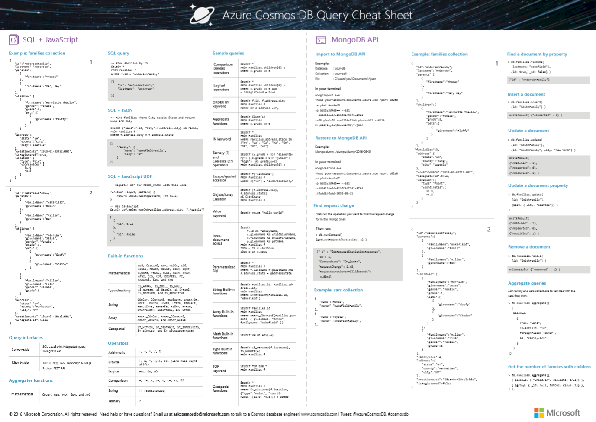
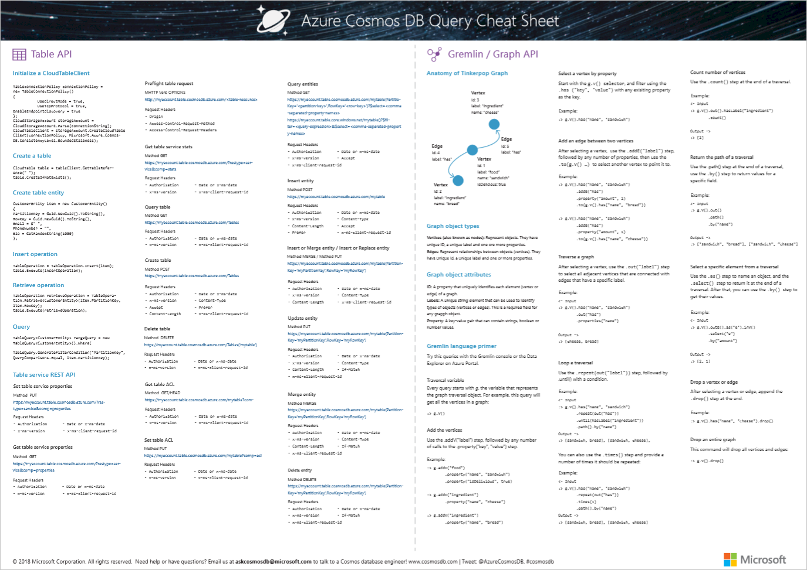

# Azure Cosmos DB query cheat sheet

The **Azure Cosmos DB query cheat sheet** helps you quickly write queries for your data by displaying common database queries, operations, functions, and operators in an easy to print PDF reference sheet. The cheat sheet includes reference information for the SQL API, MongoDB API, Table API, and Gremlin/Graph API. 

## Download 
Write your queries faster by downloading the query cheat sheet and using it as a quick reference. 

**Download the query cheat sheet here: [Azure Cosmos DB query cheat sheet](http://go.microsoft.com/fwlink/?LinkId=623215)**

## Print 

You can print the cheat sheet single-sided or double-sided on A3 sized paper.

## Next steps
For more help writing queries, see the following articles:
* For SQL API queries, see [Query using the SQL API](tutorial-query-sql-api.md), [SQL queries for Azure Cosmos DB](sql-api-sql-query.md), and [SQL syntax reference](https://msdn.microsoft.com/library/azure/dn782250.aspx)
* For MongoDB queries, see [Query using the MongoDB API](tutorial-query-mongodb.md)
* For Graph API queries, see [Query using the MongoDB API](tutorial-query-graph.md)
* For Table API queries, see [Query using the Table API](tutorial-query-table.md)

