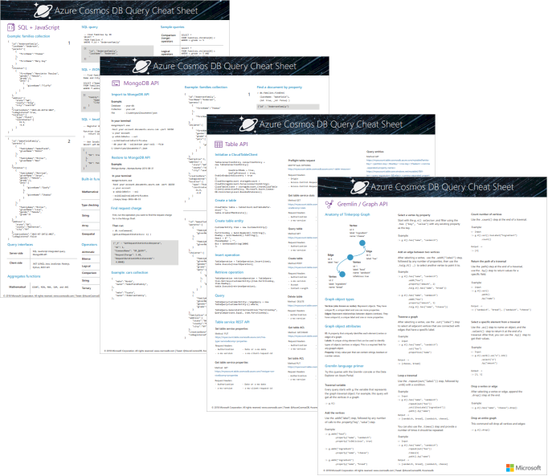

# Azure Cosmos DB query cheat sheets

The **Azure Cosmos DB query cheat sheets** help you quickly write queries for your data by displaying common database queries, operations, functions, and operators in easy-to-print PDF reference sheets. The cheat sheets include reference information for the SQL API, MongoDB API, Table API, and Gremlin API. 

Choose from a letter-sized or A3-sized download. 

## Letter-sized cheat sheets

Download the [Azure Cosmos DB letter-sized query cheat sheets](http://go.microsoft.com/fwlink/?LinkId=623215) if you're going to print to letter-sized paper (8.5" x 11").

## Oversized cheat sheets
Download the [Azure Cosmos DB A3-sized query cheat sheets](https://go.microsoft.com/fwlink/?linkid=870413) if you're going to print using a plotter or large-scale printer on A3-sized paper (11.7" x 16.5").

## Next steps
For more help writing queries, see the following articles:
* For SQL API queries, see [Query using the SQL API](tutorial-query-sql-api.md), [SQL queries for Azure Cosmos DB](sql-api-sql-query.md), and [SQL syntax reference](sql-api-sql-query-reference.md)
* For MongoDB queries, see [Query using the MongoDB API](tutorial-query-mongodb.md) and [MongoDB API support for MongoDB features and syntax](mongodb-feature-support.md)
* For Gremlin API queries, see [Query using the Gremlin API](tutorial-query-graph.md) and [Azure Cosmos DB Gremlin graph support](gremlin-support.md)
* For Table API queries, see [Query using the Table API](tutorial-query-table.md)

