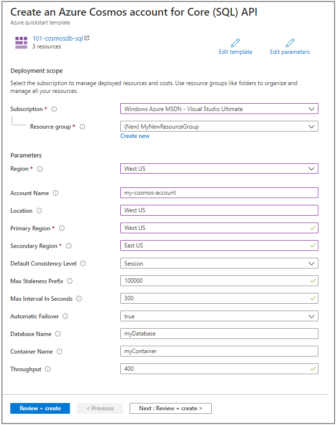
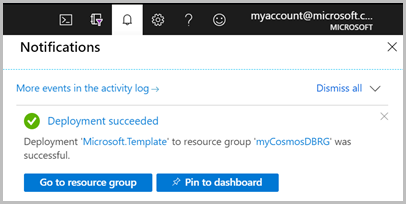

# Quickstart: Create an Azure Cosmos DB and a container by using Azure Resource Manager template

Azure Cosmos DB is Microsoft’s globally distributed multi-model database service. You can use Azure Cosmos DB to quickly create and query key/value databases, document databases, and graph databases. This quickstart focuses on the process of deploying a Resource Manager template to create an Azure Cosmos database and a container within that database. You can later store data in this container.

[Resource Manager template](../azure-resource-manager/templates/overview.md) is a JavaScript Object Notation (JSON) file that defines the infrastructure and configuration for your project. The template uses declarative syntax, which lets you state what you intend to deploy without having to write the sequence of programming commands to create it. If you want to learn more about developing Resource Manager templates, see [Resource Manager documentation](/azure/azure-resource-manager/) and the [template reference](/azure/templates/microsoft.DocumentDB/allversions).

If you don't have an Azure subscription, create a [free account](https://azure.microsoft.com/free/?WT.mc_id=A261C142F) before you begin.

## Prerequisites

An Azure subscription or free Azure Cosmos DB trial account

- [!INCLUDE [quickstarts-free-trial-note](../../includes/quickstarts-free-trial-note.md)] 

- [!INCLUDE [cosmos-db-emulator-docdb-api](../../includes/cosmos-db-emulator-docdb-api.md)]  

## Create an Azure Cosmos account, database, container

The template used in this quickstart is from [Azure Quickstart templates](https://azure.microsoft.com/resources/templates/101-cosmosdb-create/).

[!code-json[<Resource Manager template create Azure Cosmos DB>](~/quickstart-templates/101-cosmosdb-create/azuredeploy.json)]

Three Azure resources are defined in the template:

* [Microsoft.DocumentDB/databaseAccounts](/azure/templates/microsoft.documentdb/databaseaccounts): Create an Azure Cosmos account.

* [Microsoft.DocumentDB/databaseAccounts/sqlDatabases](/azure/templates/microsoft.documentdb/databaseaccounts/sqldatabases): Create an Azure Cosmos database.

* [Microsoft.DocumentDB/databaseAccounts/sqlDatabases/containers](/azure/templates/microsoft.documentdb/databaseaccounts/sqldatabases/containers): Create an Azure Cosmos container.

More Azure Cosmos DB template samples can be found in the [quickstart template gallery](https://azure.microsoft.com/resources/templates/?resourceType=Microsoft.Documentdb).

1. Select the following image to sign in to Azure and open a template. The template creates an Azure Cosmos account, a database, and a container.

   <a href="https://portal.azure.com/#create/Microsoft.Template/uri/https%3A%2F%2Fraw.githubusercontent.com%2FAzure%2Fazure-quickstart-templates%2Fmaster%2F101-cosmosdb-create%2Fazuredeploy.json"></a>

2. Select or enter the following values.

   

    Unless it is specified, use the default values to create the Azure Cosmos resources.

    * **Subscription**: select an Azure subscription.
    * **Resource group**: select **Create new**, enter a unique name for the resource group, and then click **OK**.
    * **Location**: select a location.  For example, **Central US**.
    * **Account Name**: enter a name for the Azure Cosmos account. It must be globally unique. 
    * **Location**: enter a location where you want to create your Azure Cosmos account. The Azure Cosmos account can be in the same location as the resource group. 
    * **Primary Region**: The primary replica region for the Azure Cosmos account.
    * **Secondary region**: The secondary replica region for the Azure Cosmos account.
    * **Database Name**: The name of the Azure Cosmos database.
    * **Container Name**: The name of the Azure Cosmos container.
    * **Throughput**:  The throughput for the container, minimum throughput value is 400 RU/s. 
    * **I agree to the terms and conditions state above**: Select.

3. Select **Purchase**. After the Azure Cosmos account has been deployed successfully, you get a notification:

   

The Azure portal is used to deploy the template. In addition to the Azure portal, you can also use the Azure PowerShell, Azure CLI, and REST API. To learn other deployment methods, see [Deploy templates](../azure-resource-manager/templates/deploy-powershell.md).

## Validate the deployment

You can either use the Azure portal to check the Azure Cosmos account, the database, and the container or use the following Azure CLI or Azure PowerShell script to list the secret created.

# [CLI](#tab/CLI)

```azurecli-interactive
echo "Enter your Azure Cosmos account name:" &&
read cosmosAccountName &&
echo "Enter the resource group where the Azure Cosmos account exists:" &&
read resourcegroupName &&
az cosmosdb show -g $resourcegroupName -n $cosmosAccountName
```

# [PowerShell](#tab/PowerShell)

```azurepowershell-interactive
$resourceGroupName = Read-Host -Prompt "Enter the resource group name where your Azure Cosmos account exists"
(Get-AzResource -ResourceType "Microsoft.DocumentDB/databaseAccounts" -ResourceGroupName $resourceGroupName).Name 
 Write-Host "Press [ENTER] to continue..."
```

---

## Clean up resources

If you plan to continue on to work with subsequent and tutorials, you may wish to leave these resources in place.
When no longer needed, delete the resource group, which deletes the Azure Cosmos account and the related resources. To delete the resource group by using Azure CLI or Azure Powershell:

# [CLI](#tab/CLI)

```azurecli-interactive
echo "Enter the Resource Group name:" &&
read resourceGroupName &&
az group delete --name $resourceGroupName &&
echo "Press [ENTER] to continue ..."
```

# [PowerShell](#tab/PowerShell)

```azurepowershell-interactive
$resourceGroupName = Read-Host -Prompt "Enter the Resource Group name"
Remove-AzResourceGroup -Name $resourceGroupName
Write-Host "Press [ENTER] to continue..."
```

---

## Next steps

In this quickstart, you created an Azure Cosmos account, a database and a container by using an Azure Resource Manager template and validated the deployment. To learn more about Azure Cosmos DB and Azure Resource Manager, continue on to the articles below.

- Read an [Overview of Azure Cosmos DB](introduction.md)
- Learn more about [Azure Resource Manager](../azure-resource-manager/management/overview.md)
- Get other [Azure Cosmos DB Resource Manager templates](resource-manager-samples.md)