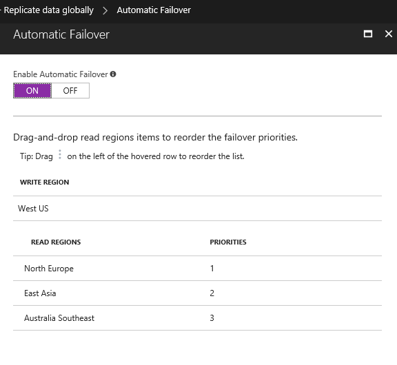
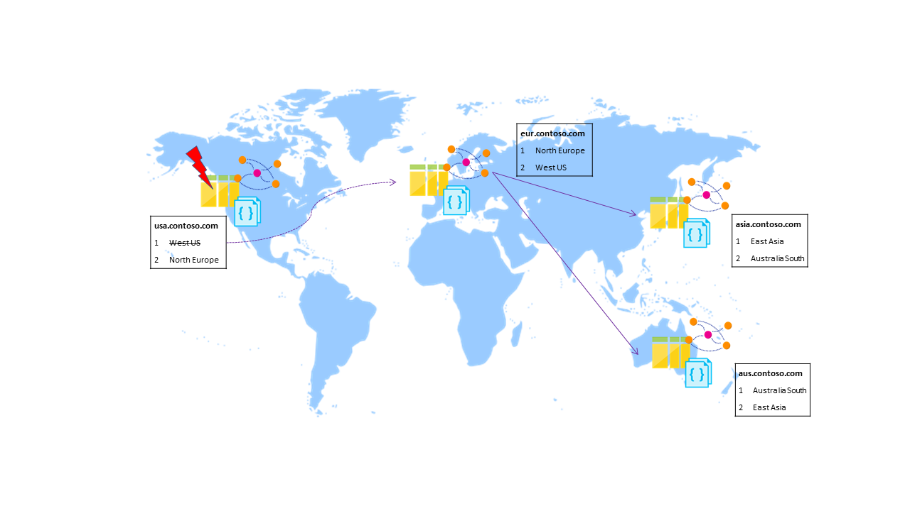

# Automatic regional failover for business continuity in Azure Cosmos DB
Azure Cosmos DB simplifies the global distribution of data by offering fully managed, [multi-region database accounts](distribute-data-globally.md) that provide clear tradeoffs between consistency, availability, and performance, all with corresponding guarantees. Cosmos DB accounts offer high availability, single digit ms latencies, [well-defined consistency levels](consistency-levels.md), transparent regional failover with multi-homing APIs, and the ability to elastically scale throughput and storage across the globe. 

Cosmos DB supports both explicit and policy driven failovers that allow you to control the end-to-end system behavior in the event of failures. In this article, we look at:

* How do manual failovers work in Cosmos DB?
* How do automatic failovers work in Cosmos DB and what happens when a data center goes down?
* How can you use manual failovers in application architectures?

You can also learn about regional failovers in this video by Azure Cosmos DB Program Manager Andrew Liu, which demonstrates the global distribution features including regional failover.

>[!VIDEO https://www.youtube.com/embed/1D06yjTVxt8]
>

## <a id="ConfigureMultiRegionApplications"></a>Configuring multi-region applications
Before we dive into failover modes, we look at how you can configure an application to take advantage of multi-region availability and be resilient in the face of regional failovers.

* First, deploy your application in multiple regions
* To ensure low latency access from every region your application is deployed, configure the corresponding [preferred regions list](https://msdn.microsoft.com/library/microsoft.azure.documents.client.connectionpolicy.preferredlocations.aspx#P:Microsoft.Azure.Documents.Client.ConnectionPolicy.PreferredLocations) for each region via one of the supported SDKs.

The following snippet shows how to initialize a multi-region application. Here, the Azure Cosmos DB account `contoso.documents.azure.com` is configured with two regions - West US and North Europe. 

* The application is deployed in the West US region (using Azure App Services for example) 
* Configured with `West US` as the first preferred region for low latency reads
* Configured with `North Europe` as the second preferred region (for high availability during regional failures)

In the SQL API, this configuration looks like the following snippet:

```cs
ConnectionPolicy usConnectionPolicy = new ConnectionPolicy 
{ 
    ConnectionMode = ConnectionMode.Direct,
    ConnectionProtocol = Protocol.Tcp
};

usConnectionPolicy.PreferredLocations.Add(LocationNames.WestUS);
usConnectionPolicy.PreferredLocations.Add(LocationNames.NorthEurope);

DocumentClient usClient = new DocumentClient(
    new Uri("https://contosodb.documents.azure.com"),
    "<Fill your Cosmos DB account's AuthorizationKey>",
    usConnectionPolicy);
```

The application is also deployed in the North Europe region with the order of preferred regions reversed. That is, the North Europe region is specified first for low latency reads. Then, the West US region is specified as the second preferred region for high availability during regional failures.

The following architecture diagram shows a multi-region application deployment where Cosmos DB and the application are configured to be available in four Azure geographic regions.  


Now, let's look at how the Cosmos DB service handles regional failures via automatic failovers. 

## <a id="AutomaticFailovers"></a>Automatic Failovers
In the rare event of an Azure regional outage or data center outage, Cosmos DB automatically triggers failovers of all Cosmos DB accounts with a presence in the affected region. 

**What happens if a read region has an outage?**

Cosmos DB accounts with a read region in one of the affected regions are automatically disconnected from their write region and marked offline. The Cosmos DB SDKs implement a regional discovery protocol that allows them to automatically detect when a region is available and redirect read calls to the next available region in the preferred region list. If none of the regions in the preferred region list is available, calls automatically fall back to the current write region. No changes are required in your application code to handle regional failovers. During this entire process, consistency guarantees continue to be honored by Cosmos DB.


Once the affected region recovers from the outage, all the affected Cosmos DB accounts in the region are automatically recovered by the service. Cosmos DB accounts that had a read region in the affected region will then automatically sync with current write region and turn online. The Cosmos DB SDKs discover the availability of the new region and evaluate whether the region should be selected as the current read region based on the preferred region list configured by the application. Subsequent reads are redirected to the recovered region without requiring any changes to your application code.

**What happens if a write region has an outage?**

If the affected region is the current write region and automatic failover is enabled for the Azure Cosmos DB account, then the region is automatically marked as offline. Then, an alternative region is promoted as the write region for the affected Azure Cosmos DB account. You can enable automatic failover and fully control the region selection order for your Azure Cosmos DB accounts via the Azure portal or [programmatically](https://docs.microsoft.com/rest/api/cosmos-db-resource-provider/databaseaccounts#DatabaseAccounts_FailoverPriorityChange). 



During automatic failovers, Azure Cosmos DB automatically chooses the next write region for a given Azure Cosmos DB account based on the specified priority order. Applications can use the WriteEndpoint property of DocumentClient class to detect the change in write region.



Once the affected region recovers from the outage, all the affected Cosmos DB accounts in the region are automatically recovered by the service. 

* Data present in the previous write region that was not replicated to read regions during the outage is published as a conflict feed. Applications can read the conflict feed, resolve the conflicts based on application specific logic, and write the updated data back to the Azure Cosmos DB account as appropriate. 
* The previous write region is recreated as a read region and brought back online automatically. 
* You can reconfigure read region that was brought back online automatically as the write region by performing a manual failover via the Azure portal or [programmatically](https://docs.microsoft.com/rest/api/cosmos-db-resource-provider/databaseaccounts#DatabaseAccounts_CreateOrUpdate).

The following code snippet illustrates how to process conflicts after the affected region recovers from the outage.

```cs
string conflictsFeedContinuationToken = null;
do
{
    FeedResponse<Conflict> conflictsFeed = client.ReadConflictFeedAsync(collectionLink,
        new FeedOptions { RequestContinuation = conflictsFeedContinuationToken }).Result;

    foreach (Conflict conflict in conflictsFeed)
    {
        Document doc = conflict.GetResource<Document>();
        Console.WriteLine("Conflict record ResourceId = {0} ResourceType= {1}", conflict.ResourceId, conflict.ResourceType);

        // Perform application specific logic to process the conflict record / resource
    }

    conflictsFeedContinuationToken = conflictsFeed.ResponseContinuation;
} while (conflictsFeedContinuationToken != null);
```

## <a id="ManualFailovers"></a>Manual Failovers

In addition to automatic failovers, the current write region of a given Cosmos DB account can be manually changed dynamically to one of the existing read regions. Manual failovers can be initiated via the Azure portal or [programmatically](https://docs.microsoft.com/rest/api/cosmos-db-resource-provider/databaseaccounts#DatabaseAccounts_CreateOrUpdate). 

Manual failovers ensure **zero data loss** and **zero availability** loss and gracefully transfer write status from the old write region to the new one for the specified Cosmos DB account. Like in automatic failovers, the Cosmos DB SDK automatically handles write region changes during manual failovers and ensures that calls are automatically redirected to the new write region. No code or configuration changes are required in your application to manage failovers. 


Some of the common scenarios where manual failover can be useful are:

**Follow the clock model**: If your applications have predictable traffic patterns based on the time of the day, you can periodically change the write status to the most active geographic region based on time of the day.

**Service update**: Certain globally distributed application deployment may involve rerouting traffic to different region via traffic manager during their planned service update. Such application deployment now can use manual failover to keep the write status to the region where there is going to be active traffic during the service update window.

**Business Continuity and Disaster Recovery (BCDR) and High Availability and Disaster Recovery (HADR) drills**: Most enterprise applications include business continuity tests as part of their development and release process. BCDR and HADR testing is often an important step in compliance certifications and guaranteeing service availability in the case of regional outages. You can test the BCDR readiness of your applications that use Cosmos DB for storage by triggering a manual failover of your Cosmos DB account and/or adding and removing a region dynamically.

In this article, we reviewed how manual and automatic failovers work in Cosmos DB, and how you can configure your Cosmos DB accounts and applications to be globally available. By using Cosmos DB's global replication support, you can improve end-to-end latency and ensure that they are highly available even in the event of region failures. 

## <a id="NextSteps"></a>Next Steps
* Learn about how Cosmos DB supports [global distribution](distribute-data-globally.md)
* Learn about [global consistency with Azure Cosmos DB](consistency-levels.md)
* Develop with multiple regions using Azure Cosmos DB's [SQL API](tutorial-global-distribution-sql-api.md)
* Learn how to build [Multi-region writer architectures](multi-region-writers.md) with Azure Cosmos DB

