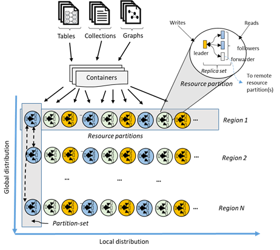

# High Availability in Azure Cosmos DB

Azure Cosmos DB transparently replicates your data across the Azure regions that are associated with your Cosmos account.  Cosmos DB employs multiple layers of redundancy for your data. As seen from the figure below:

- The data within Cosmos containers is horizontally partitioned.
- Within each region, each partition is protected by a replica-set with all writes replicated and durably committed by a majority of replicas. Replicas are distributed across as many as 10-20 fault domains.
- Across all the regions, all partitions are replicated. Each region contains all of the data partitions of a Cosmos container and can accept writes and serve reads.  

 

If your Cosmos account is distributed across N Azure regions, there will be at least N x 4 copies of all your data. In addition to providing low latency access to your data and scaling write and read throughput across the regions associated with your Cosmos account, having more regions (higher N) also improves availability.  

## Availability SLAs  

As a globally distributed database, Cosmos DB provides comprehensive SLAs encompassing throughput, latency at the 99th percentile, consistency, and high availability. In the following table, we describe the guarantees pertaining to high availability provided by Cosmos DB for single and multi-region accounts. For the highest availability, we strongly recommend configuring your Cosmos accounts to have multiple write regions.

|Operation Type  | Single Region |Multi-region with single-write|Multi-region with multi-write|
|---------|---------|---------|-------|
|Writes    | 99.99    |99.99   |99.999|
|Reads     | 99.99    |99.999  |99.999|

> [!NOTE]
> In practice, the actual write availability for bounded staleness, session, consistent-prefix and eventual consistency models is significantly higher than the published SLAs. And, in practice, the actual read availability for all consistency levels is significantly higher than the published SLAs.

## Regional outages

Regional outages aren't uncommon, and Azure Cosmos DB makes sure your database is always available. The following captures Cosmos DB behavior during an outage, depending on your Cosmos account configuration: 

- Multi-region accounts configured with multiple-write regions will remain highly available for both writes and reads during a regional outage. Regional failovers are instantaneous and do not require any changes from the application.

- Multi-region accounts with a single-write region during a write region outage will remain highly available for reads. However, for writes you must “enable automatic failover” on your Cosmos account for Cosmos DB to failover the impacted region to another region associated with your Cosmos account. The failover will occur in the order of region priority you’ve specified. Eventually, when the impacted region is back online, the un-replicated data present in the impacted write region during the outage is made available through the conflicts feed. Applications can read the conflicts feed, resolve the conflicts based on application-specific logic, and write the updated data back to the Cosmos container as appropriate. Once the previously impacted write region recovers, it becomes automatically available as a read region. You can invoke a manual failover and bring back the impacted region as the write region. You can do a manual failover by using Azure CLI or Azure portal.  

- Multi-region accounts with a single-write region during a read region outage will remain highly available for reads and writes. The impacted region is automatically disconnected from the write region and will be marked offline. The Cosmos DB SDKs will redirect read calls to the next available region in the preferred region list. If none of the regions in the preferred region list is available, calls automatically fall back to the current write region. No changes are required in your application code to handle read region outage. Eventually, when the impacted region is back online, the previously impacted read region will automatically sync with the current write region and will be available again for serving reads. Subsequent reads are redirected to the recovered region without requiring any changes to your application code. During both failover and rejoining of a previously failed region, read-consistency guarantees continue to be honored by Cosmos DB.

- Single-region accounts may lose availability in the event of regional outage. We highly encourage to setup at least two regions (preferably, at least two write regions) with your Cosmos account to ensure high availability at all times.

## Building highly available applications

- To ensure high write and read availability, configure your Cosmos account to span at least two regions with multiple-write regions. This configuration will ensure the best availability, lowest latency, and scalability for both reads and writes backed by SLAs. See how to [configure your Cosmos account with multiple write-regions](tutorial-global-distribution-sql-api.md).

- For multi-region Cosmos accounts that are configured with a single-write region, enable “automatic-failover” by using Azure CLI or Azure portal.  After you enable automatic failover, whenever there is a regional disaster, Cosmos DB will automatically failover your account.  

- Even if your Cosmos account is highly available, your application may not be correctly designed to remain highly available. To ensure the end-to-end high availability for your application, periodically invoke the “manual failover” by using Azure CLI or Azure portal, as a part of your application testing or disaster-recovery (DR) drills. To learn more, see changing the regional priorities for your Cosmos account).  

## Next steps

[Azure Cosmos DB SLA](https://azure.microsoft.com/en-us/support/legal/sla/cosmos-db/v1_0/)

Configuring your Cosmos account for high availability

Changing the regional priorities for your Cosmos account

Configure your Cosmos account with multiple write-regions

Manual failover for your Cosmos account

Use conflict feed
