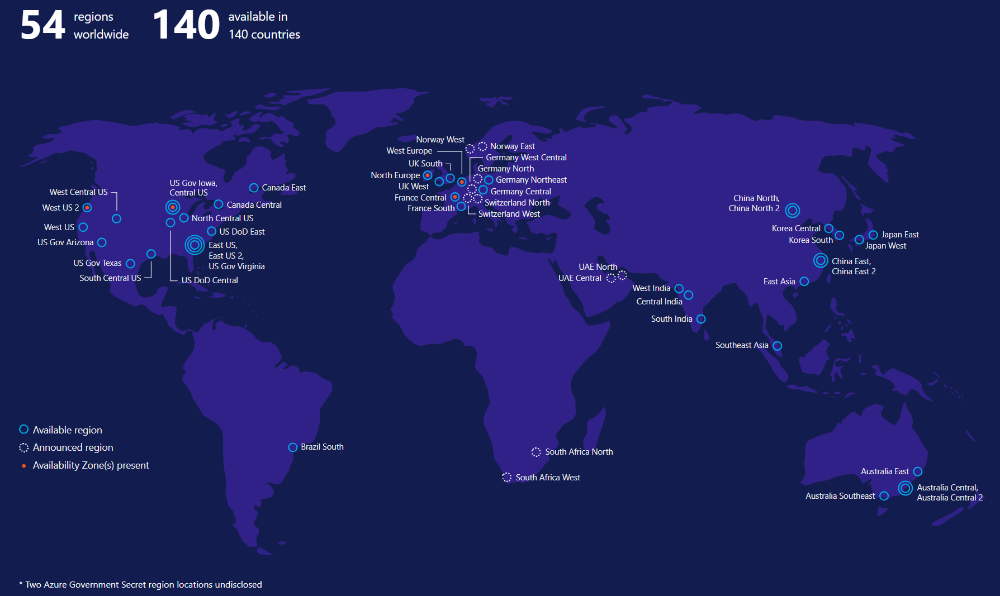

# Regional presence with Azure Cosmos DB

Azure Cosmos DB is a foundational service in Azure, and, by default, is always available in all regions, where Azure is available. Currently, Azure is available in [54 regions](https://azure.microsoft.com/global-infrastructure/regions/) worldwide. 

Cosmos DB is available in all five distinct Azure cloud environments available to customers:

* **Azure public** cloud, which is available globally.

* **Azure China 21Vianet** is available through a unique partnership between Microsoft and 21Vianet, one of the country’s largest internet providers in China.

* **Azure Germany** provides services under a data trustee model, which ensures that customer data remains in Germany under the control of T-Systems International GmbH, a subsidiary of Deutsche Telecom, acting as the German data trustee.

* **Azure Government** is available in four regions in the United States to US government agencies and their partners. 

* **Azure Government for Department of Defense (DoD)** is available in two regions in the United States to the US Department of Defense.

## Regional presence with global distribution

All APIs exposed by Azure Cosmos DB (including SQL, MongoDB, Cassandra, Gremlin, and Table) are available in all Azure regions by default. For example, you can have MongoDB and Cassandra APIs exposed by Azure Cosmos DB not only in all of the global Azure regions, but also in sovereign clouds like China, Germany, Government, and Department of Defense (DoD) regions.

Azure Cosmos DB is a [globally distributed](distribute-data-globally.md) database service. You can associate any number of Azure regions with your Azure Cosmos account and your data is automatically and transparently replicated. You can add or remove a region to your Azure Cosmos account at any time. With the turnkey global distribution capability and multi-mastered replication protocol, Azure Cosmos DB offers less than 10 ms read and write latencies at the 99th percentile, 99.999 read and write availability, and ability to elastically scale provisioned throughput for reads and writes across all the regions associated with your Azure Cosmos account. Azure Cosmos DB, also offers five well-defined consistency models and you can choose to apply a specific consistency model to your data. Finally, Azure Cosmos DB is the only database service in the industry that provides a comprehensive [Service Level Agreement (SLA)](https://azure.microsoft.com/support/legal/sla/cosmos-db/v1_2/) encompassing provisioned throughput, latency at the 99th percentile, high availability, and consistency. The above capabilities are available in all Azure clouds.

## Next steps

You can now learn about core concepts of Azure Cosmos DB with the following articles:

* [Global data distribution](distribute-data-globally.md)
* [How to manage an Azure Cosmos DB account](manage-account.md)
* [Provision throughput for Azure Cosmos containers and databases](set-throughput.md)
* [Azure Cosmos DB SLA](https://azure.microsoft.com/support/legal/sla/cosmos-db/v1_2/)
