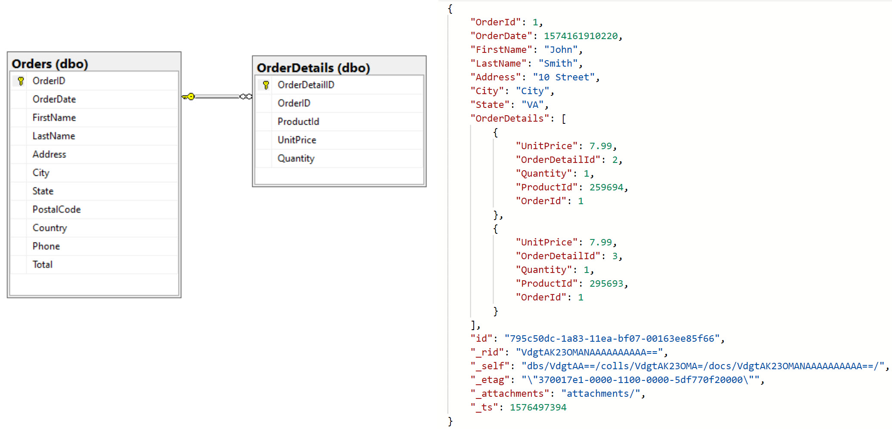
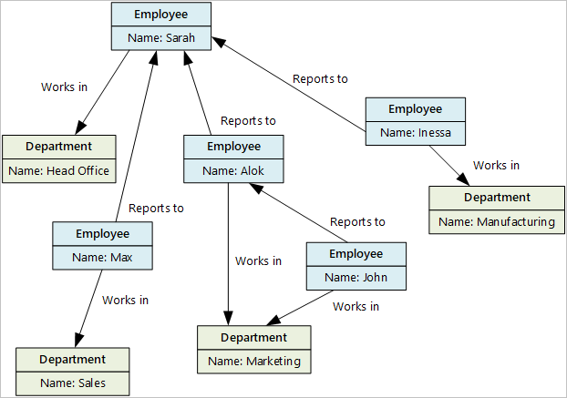
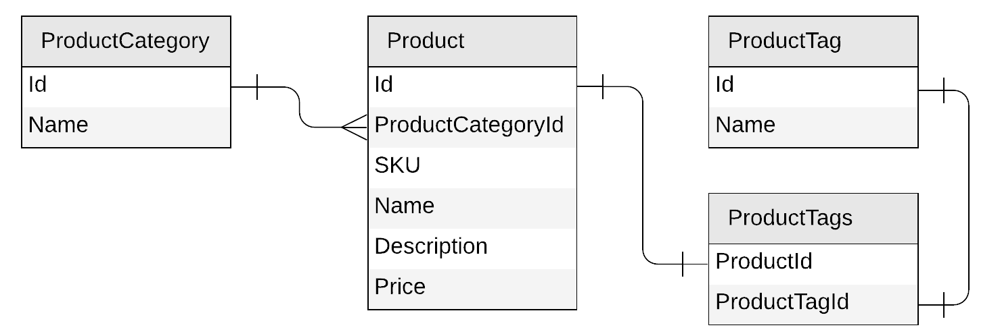

# Understanding the differences between NoSQL and relational databases

The relational model has been with us for a long time, and over the years has matured, becoming a mainstay in both academia and the commercial world of computer science and software engineering. However, with a shifting landscape in software and hardware architectures, and changing demands in performance and speed-to-market for the delivery of applications, a number of new paradigms for storing and querying data have emerged. This has now evolved to such a degree that in certain use cases, what would have been considered best practice in relational databases 20 or more years ago, might today be considered an anti-pattern in light of newer approaches. This article will enumerate at a high level the occasions where you may want to consider moving away from using relational database engines to store your enterprise data. We will also discuss some challenges with NoSQL databases. For a more in-depth look at the different types of data stores that exist, have a look at our article on [choosing the right data store](https://docs.microsoft.com/azure/architecture/guide/technology-choices/data-store-overview).

## High throughput

One of the most obvious challenges when maintaining a relational database system is that most relational engines apply locks and latches to enforce strict [ACID semantics](https://en.wikipedia.org/wiki/ACID). While this has benefits in terms of ensuring a consistent data state within the database, there are heavy trade-offs with respect to concurrency, latency, and availability. Due to these fundamental architectural restrictions, high transactional volumes can result in the need to manually shard data. This can be a very time consuming and painful exercise. In these scenarios, [distributed databases](https://en.wikipedia.org/wiki/Distributed_database) can offer a more scalable solution. However, maintenance can still be a costly and time-consuming exercise. Administrators may have to do extra work to ensure that the distributed nature of the system is transparent. They may also have to account for the “disconnected” nature of the database.

Platform as a Service (PaaS) distributed database services like [Azure Cosmos DB](https://docs.microsoft.com/azure/cosmos-db/introduction) make this much easier, by being deployed worldwide across all Azure regions, with partition ranges capable of being dynamically sub-divided to seamlessly grow the database as the application grows, while simultaneously maintaining high availability. Fine-grained multi-tenancy and tightly controlled, cloud-native resource governance facilitates [astonishing latency guarantees](https://docs.microsoft.com/azure/cosmos-db/consistency-levels-tradeoffs#consistency-levels-and-latency) and predictable performance, with partition management being fully managed, so administrators need not have to have to write code or manage partitions. If your transactional volumes are reaching extreme levels, such as many thousands of transactions per second, you should consider a distributed NoSQL database such as Azure Cosmos DB for maximum efficiency, ease of maintenance, and significantly reduced total cost of ownership.

## Hierarchical Data

There are a significant number of use cases where transactions in the database can contain many parent-child relationships. These can grow significantly over time, and prove difficult to manage. Forms of [hierarchical databases](https://en.wikipedia.org/wiki/Hierarchical_database_model) did emerge during the 1980s, but were not popular due to inefficiency in storage. The also lost traction as [Ted Codd’s relational model](https://en.wikipedia.org/wiki/Relational_model) became the de facto standard used by virtually all mainstream database management systems.

However, today the popularity of document-style databases has grown significantly. These databases might be considered a re-inventing of the hierarchical database paradigm, now uninhibited by concerns around storage inefficiency. This is due to the sharp decline in the actual cost of storing data on disk. As a result, maintaining many complex parent-child entity relationships in a relational database could now be considered an anti-pattern compared to modern document-oriented approaches.

The emergence of [object oriented design](https://en.wikipedia.org/wiki/Object-oriented_design), and the [impedance mismatch](https://en.wikipedia.org/wiki/Object-relational_impedance_mismatch) that arises when combining it with relational models, also highlights an anti-pattern in relational databases for certain use cases. This resulted in a hidden but often very significant maintenance cost. Although [ORM approaches](https://en.wikipedia.org/wiki/Object-relational_mapping) evolved to partly mitigate this, Document-oriented databases nonetheless coalesce much better with object-oriented approaches, without forcing developers to be committed to ORM drivers, or bespoke language specific [OO Database engines](https://en.wikipedia.org/wiki/Object_database). If your data contains many parent-child relationships, with very deep levels of hierarchy, you may want to consider using a NoSQL document database such as the [Azure Cosmos DB SQL API](https://docs.microsoft.com/en-us/azure/cosmos-db/introduction), to better manage this type of data.

## Complex Networks and Relationships

Ironically, given their name, relational databases can present a less than optimal solution for modelling deep and complex relationships. This is due to the fact that relationships between entities do not actually exist in the database, and need to be computed at runtime, with complex relationships requiring cartesian joins in order to allow mapping using queries. This can become exponentially more expensive in terms of computation as relationships increase, to the point where a relational database attempting to manage these entities can become unusable. Again, forms of “Network” databases did emerge during the time that relational databases also emerged, but as with hierarchical databases, these systems struggled to gain popularity, due to a lack of use cases at the time, and storage inefficiencies. Today, graph database engines could be considered a re-emergence of the network database paradigm. The key benefit with these systems is that relationships are stored as “first class citizens” within the database, and thus traversing relationships can be done in constant time, rather than increasing in time complexity with each new join or cross product. If you are maintaining a complex network of relationships in your database, you may want to consider a graph database such as the [Azure Cosmos DB Gremlin API](https://docs.microsoft.com/en-us/azure/cosmos-db/graph-introduction) for managing this data.

Azure Cosmos DB is a multi-model database service which offers an API projection for all the major NoSQL model types (Column-family, Document, Graph, Key-Value), with the [Gremlin (graph)](https://docs.microsoft.com/en-us/azure/cosmos-db/gremlin-support) and SQL (Core) Document API layers being fully interoperable. This has benefits for switching between different models at the programmability level, so that graph stores can be queried in terms of both complex network traversals as well as filtering on, or searching for, transactions modelled as document records in the same store.

## Fluid schema

Another particular characteristic of relational databases is that schemas are required to be defined at design time. This has benefits in terms of referential integrity and conformity of data, but can also be restrictive as the database grows and the application needs to respond to changes in the schema across logically separate models that may share the same table or database definition. Such use cases often benefit from the schema being devolved to the application to manage on a per record basis, which requires the database to be “schema agnostic” and allow records to be “self-describing” in terms of the data contained within them.

If you are managing data whose structures are constantly changing at a high rate, particularly If transactions can come from external sources where it is difficult to enforce conformity across the database, you may want to consider a more schema-agnostic approach using a managed NoSQL database service like Azure Cosmos DB.

## Microservices

The [microservices](https://en.wikipedia.org/wiki/Microservices) pattern has grown significantly in recent years. This pattern has its roots in [Service-Oriented Architecture](https://en.wikipedia.org/wiki/Service-oriented_architecture), and messaging protocols such as SOAP, evolving more recently into REST web services. The de-facto standard for data transmission in these modern microservices architectures is [JSON](https://en.wikipedia.org/wiki/JSON), which also happens to be the storage medium for the vast majority of document oriented NoSQL Databases. This makes NoSQL document stores a much more seamless fit for both the persistence and synchronisation (using [event sourcing patterns](https://en.wikipedia.org/wiki/Event-driven_architecture)) across complex Microservice implementations. More traditional relational databases can be much more complex to maintain in these architectures as there is a significantly higher amount of transformation both for state and synchronisation across APIs. Azure Cosmos DB’s choice of pure JSON data types, a JavaScript engine and query [API built](https://docs.microsoft.com/en-us/azure/cosmos-db/javascript-query-api) into the database, and exposing a state-of-the-art [change feed](https://docs.microsoft.com/en-us/azure/cosmos-db/change-feed) which clients can subscribe to in order to get notified of modifications to a container, makes it an even more seamless and better fit for JSON-based Microservices Architectures than many NoSQL databases!

## Some challenges with NoSQL Databases

Although there are some clear advantages when implementing NoSQL databases, there are also some challenges which you may want to take into consideration, which may not be present to the same degree when working with the relational model:

* transactions with a lot of relations pointing to the same entity.
* transactions requiring strong consistency across the entire dataset.

Looking at the first challenge, the rule-of-thumb in NoSQL databases is generally denormalization, which as articulated earlier, produces more efficient reads in a distributed system. However, there are some design challenges that come into play with this approach. Let’s take a very simple example of a product that’s related to one category and multiple tags:

A best practice approach in a NoSQL document database would be to denormalize the category name and tag names directly in a “product document”. However, in order to keep categories, tags and products in sync, the design options to facilitate this have added maintenance complexity, because the data is duplicated across multiple records in the product, rather than being a simple update in a “one-to-many” relationship, and a join to retrieve the data. 

The trade-off is that reads are more efficient in the denormalized record, and become increasingly more efficient as the number of conceptually joined entities increases. However, just as the read efficiency increases with increasing numbers of joined entities in a denormalize record, so too does the maintenance complexity of keeping entities in sync. One way of mitigating this trade-off is to create a [hybrid data model](https://docs.microsoft.com/en-us/azure/cosmos-db/modeling-data#hybrid-data-models). 

While there is more flexibility available in NoSQL databases to deal with these trade-offs, increased flexibility can also produce more design decisions. Please consult our article [how to model and partition data on Azure Cosmos DB using a real-world example](https://docs.microsoft.com/en-us/azure/cosmos-db/how-to-model-partition-example), which includes an approach for keeping [denormalized user data in sync](https://docs.microsoft.com/en-us/azure/cosmos-db/how-to-model-partition-example#denormalizing-usernames) where users not only sit in different partitions, but in a different containers.

With respect to strong consistency, it is very rare that this will be required across the entire dataset. However, in cases where this is necessary, this can be a challenge in distributed databases, primarily because this can lead to increased latency, since data being written to the database will need to be synchronised across replicas and regions before allowing clients to read it. Again, Azure Cosmos DB offers more flexibility than relational databases for the various trade-offs that are relevant here, but for small scale implementations, this will add more design considerations. Please consult our article on [Consistency, availability, and performance tradeoffs](https://docs.microsoft.com/en-us/azure/cosmos-db/consistency-levels-tradeoffs) for more detail on this topic.

## Next steps

Learn how to manage your Azure Cosmos account and other concepts:

* [How-to manage your Azure Cosmos account](how-to-manage-database-account.md)
* [Global distribution](distribute-data-globally.md)
* [Consistency levels](consistency-levels.md)
* [Working with Azure Cosmos containers and items](databases-containers-items.md)
* [VNET service endpoint for your Azure Cosmos account](vnet-service-endpoint.md)
* [IP-firewall for your Azure Cosmos account](firewall-support.md)
* [How-to add and remove Azure regions to your Azure Cosmos account](how-to-manage-database-account.md)
* [Azure Cosmos DB SLAs](https://azure.microsoft.com/support/legal/sla/cosmos-db/v1_2/)
