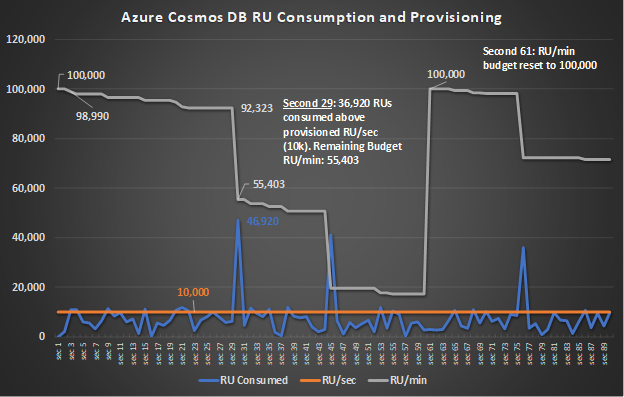
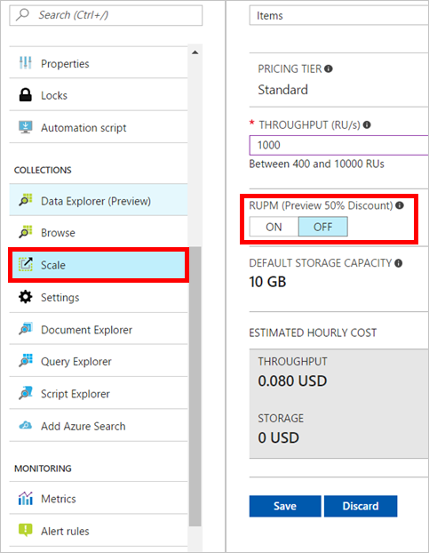
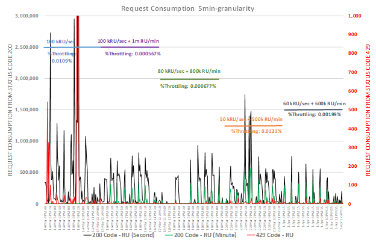
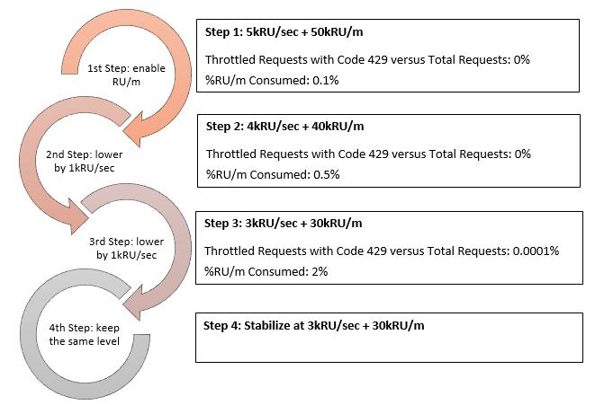

# Request units per minute in Azure Cosmos DB

Azure Cosmos DB is designed to help you achieve a fast, predictable performance and scale seamlessly along with your application’s growth. You can provision throughput on a Cosmos DB container at both, per-second and at per-minute (RU/m) granularities. The provisioned throughput at per-minute granularity is used to manage unexpected spikes in the workload occurring at a per-second granularity. 

This article provides an overview of how the provisioning of Request Unit per Minute (RU/m) works. The goal in mind with provisioning of RU/m is to provide a predictable performance around unpredictable needs (especially if you need to run analytics on top of your operational data) and spiky workloads. We want to have our customers consume more the throughput they provision so they can scale quickly with peace of mind.

After reading this article, you will be able to answer the following questions:

* How does a Request Unit per Minute work?
* What is the difference between Request Unit per Minute and Request Unit per Second?
* How to provision RU/m?
* Under which scenario shall I consider provisioning Request Unit per Minute?
* How to use the portal metrics to optimize my cost and performance?
* Define which type of request can consume your RU/m budget?

## Provisioning request units per minute (RU/m)

When you provision Azure Cosmos DB at the second granularity (RU/s), you get the guarantee that your request succeeds at a low latency if your throughput has not exceeded the capacity provisioned within that second. With RU/m, the granularity is at the minute with the guarantee that your request succeeds within that minute. Compared to bursting systems, we make sure that the performance you get is predictable and you can plan on it.

The way per minute provisioning works is simple:

* RU/m is billed hourly and in addition to RU/s. For more details, please visit Azure Cosmos DB [pricing page](https://aka.ms/acdbpricing).
* RU/m can be enabled at collection level. That can be done through the SDKs (Node.js, Java, or .Net) or through the portal (also include MongoDB API workloads)
* When RU/m is enabled, for every 100 RU/s provisioned, you also get 1,000 RU/m provisioned (the ratio is 10x)
* At a given second, a request unit consumes your RU/m provisioning only if you have exceeded your per second provisioning within that second
* Once the 60-second period (UTC) ends, the per minute provisioning is refilled
* RU/m can be enabled only for collections with a maximum provisioning of 5,000 RU/s per partition. If you scale your throughput needs and have such a high level of provisioning per partition, you will get a warning message

Below is a concrete example, in which a customer can provision 10kRU/s with 100kRU/m, saving 73% in cost against provisioning for peak (at 50kRU/sec) through a 90-second period on a collection that has 10,000 RU/s and 100,000 RU/m provisioned:

* 1st second: The RU/m budget is set at 100,000
* 3rd second: During that second the consumption of Request Unit was 11,010 RUs, 1,010 RUs above the RU/s provisioning. Therefore, 1,010 RUs are deducted from the RU/m budget. 98,990 RUs are available for the next 57 seconds in the RU/m budget
* 29th second: During that second, a large spike happened (>4x higher than provisioning per second) and the consumption of Request Unit was 46,920 RUs. 36,920 RUs are deducted from the RU/m budget that dropped from 92,323 RUs (28th second) to 55,403 RUs (29th second)
* 61st second: RU/m budget is set back to 100,000 RUs.
 


## Specifying request unit capacity with RU/m

When creating an Azure Cosmos DB collection, you specify the number of request units per second (RU per second) you want reserved for the collection. You can also decide if you want to add RU per minute. This can be done through the Portal or the SDK. 

### Through the Portal

Enabling or disabling RU per minute simply requires a click when provisioning a collection. 

 

### Through the SDK
First, this is important to note that RU/m is only available for the following SDKs:

* .Net 1.14.0
* Java 1.11.0
* Node.js 1.12.0
* Python 2.2.0

Here is a code snippet for creating a collection with 3,000 request units per second and 30,000 request units per minute using the .NET SDK:

```csharp
// Create a collection with RU/m enabled
DocumentCollection myCollection = new DocumentCollection();
myCollection.Id = "coll";
myCollection.PartitionKey.Paths.Add("/deviceId");

// Set the throughput to 3,000 request units per second which will give you 30,000 request units per minute as the RU/m budget
await client.CreateDocumentCollectionAsync(
    UriFactory.CreateDatabaseUri("db"),
    myCollection,
    new RequestOptions { OfferThroughput = 3000, OfferEnableRUPerMinuteThroughput = true });
```

Here is a code snippet for changing the throughput of a collection to 5,000 request units per second without provisioning RU per minute using the .NET SDK:

```csharp
// Get the current offer
Offer offer = client.CreateOfferQuery()
    .Where(r => r.ResourceLink == collection.SelfLink)    
    .AsEnumerable()
    .SingleOrDefault();

// Set the throughput to 5000 request units per second without RU/m enabled (the last parameter to OfferV2 constructor below)
OfferV2 offerV2 = new OfferV2(offer, 5000, false);

// Now persist these changes to the database by replacing the original resource
await client.ReplaceOfferAsync(offerV2);
```

## Good fit scenarios

In this section, we provide an overview of scenarios that are a good fit for enabling request units per minute.

**Dev/Test environment:** Good fit. During the development stage, if you are testing your application with different workloads, RU/m can provide the flexibility at this stage. While the [emulator](local-emulator.md) is a great free tool to test Azure Cosmos DB. However if you want to start in a cloud environment, you will have a great flexibility with RU/m for your adhoc performance needs. You will spend more time developing, less worrying about performance needs at first. We recommend starting with the minimum RU/s provisioning and enable RU/m.

**Unpredictable, spiky, minute granularity needs:** Good fit – Savings: 25-75%. We have seen large improvement from RU/m and most production scenarios are into that group. If you have an IoT workload that has spike a few times in a minute, if you have queries running when your system makes mass insert at the same time, you will need extra capacity for handeling spiky needs. We recommend optimizing your resource needs by applying our step by step approach below.

 
 
 *Figure - RU consumption benchmark*

**Peace of mind:** Good fit – Savings: 10-20%. Sometimes, you just want to have peace of mind and not worry about potential peaks and throttling. This feature is the right one for you. In that case, we recommend enabling RU/m and slightly lower your per second provisioning. This case is different from the above as you will not try to optimize aggressively your provisioning. This is more of a “Zero Throttling” mindset you are in.

Critical operations with adhoc needs: We sometimes recommend to only let critical operations access RU/m budget so the budget doesn’t get consume by adhoc or less important operations. That can be easily defined in the section below.

## Using the portal metrics to optimize cost and performance

**In the coming weeks, we will further develop the content around monitoring RUs minute consumption to optimize your throughput needs.**

Through the portal metrics, you can see how much of regular RU seconds you consume versus RU minutes. Monitoring these metrics should help you optimize your provisioning. 

We recommend a step by step approach on how to use RU/m to your advantage. For each step, you should have an overview of the RU consumption representing a full cycle of your workload (it could be hours, days, or even weeks) and get insights on the utilization of what you provision.

The principle behind this approach is to make your throughput provisioning as close as possible to a provisioning point that matches your performance criteria below. 


 
To understand the optimal provisioning point for your workload, you need to understand:

* Consumption patterns: no, infrequent or sustained spikes? Small (2x average), medium, or large (>10x average) spikes?
* Percent of throttled requests: do you feel comfortable if you have a bit of throttling? If so, by how much? 

Once you have identified what your goals are, you will be able to get closer to the optimal provisioning.

To assist you, we want to provide an overall guidance on how to optimize your provisioning based on your RU/m consumption. This guidance doesn’t apply to all kind of workloads but is based on the private preview knowledge. We might change such baselines as we learn more:

|RU/m % utilization|Degree of utilization of RU/m|Recommended actions for provisioning|
|---|---|---|
|0-1%|Under utilization|Lower RU/s to consume more RU/m|
|1-10%|Healthy use|Keep the same provisioning level|
|Above 10%|Over utilization|Increase RU/s to rely less on RU/m|

## Select which operations can consume the RU/m budget

At request level, you can also enable/disable RU/m budget to serve the request irrespective of operation type. If regular provisioned RUs/sec budget is consumed and the request cannot consume the RU/m budget, this request will be throttled. By default, any request is served by RU/m budget if RU/m throughput budget is activated. 

Here is a code snippet for disabling RU/m budget using the DocumentDB API for CRUD and query operations.

```csharp
// In order to disable any CRUD request for RU/m, set DisableRUPerMinuteUsage to true in RequestOptions
await client.CreateDocumentAsync(
    UriFactory.CreateDocumentCollectionUri("db", "container"),
    new Document { Id = "Cosmos DB" },
    new RequestOptions { DisableRUPerMinuteUsage = true });
// In order to disable any query request for RU/m, set DisableRUPerMinuteOnRequest to true in RequestOptions
FeedOptions feedOptions = new FeedOptions();
feedOptions.DisableRUPerMinuteUsage = true;
var query = client.CreateDocumentQuery<Book>(
    UriFactory.CreateDocumentCollectionUri("db", "container"),
    "select * from c",feedOptions).AsDocumentQuery();
```

## Next steps

In this article, we've described how partitioning works in Azure Cosmos DB, how you can create partitioned collections, and how you can pick a good partition key for your application.

* Perform scale and performance testing with Azure Cosmos DB. See [Performance and Scale Testing with Azure Cosmos DB](performance-testing.md) for a sample.
* Get started coding with the [SDKs](documentdb-sdk-dotnet.md) or the [REST API](https://msdn.microsoft.com/library/azure/dn781481.aspx).
* Learn about [provisioned throughput](request-units.md) in Azure Cosmos DB 

