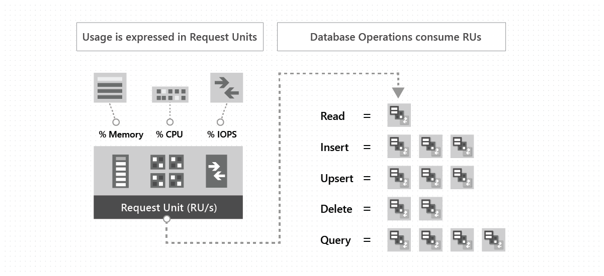

# Request Units in Azure Cosmos DB

With Azure Cosmos DB, you pay for the throughput you provision and the storage you consume on an hourly basis. Throughput must be provisioned to ensure that sufficient system resources are available for your Azure Cosmos DB database all the time. You need enough resources to meet or exceed the Azure Cosmos DB SLA.

Azure Cosmos DB supports many APIs, such as SQL, MongoDB, Cassandra, Gremlin, and Table. Each API has its own set of database operations. These operations range from simple point reads and writes to complex queries. Each database operation consumes system resources based on the complexity of the operation. 

The cost of all database operations is normalized by Azure Cosmos DB and is expressed by Request Units (RUs). The cost to read a 1-KB item is one Request Unit (RU). The minimum RUs required to consume 1 GB of storage is 40. All other database operations are similarly assigned a cost by using RUs. No matter which API you use to interact with your Azure Cosmos DB container, costs are always measured by RUs. Whether the database operation is a write, read, or query, RUs are used to measure costs.

You can think of RUs per second as the currency for throughput. RUs per second is a rate-based currency. It abstracts the system resources such as CPU, IOPS, and memory that are required to perform the database operations supported by Azure Cosmos DB. The following image shows the RUs consumed by different database operations:

To manage and plan capacity, Azure Cosmos DB ensures that the number of RUs for a given database operation over a given dataset is deterministic. Examine the response header to track the number of RUs that are consumed by any database operation. When you understand the factors that affect RU charges and your application's throughput requirements, you can run your application cost effectively.

You're billed on an hourly basis. You provision the number of RUs for your application on a per-second basis in increments of 100 RUs per second. To scale the provisioned throughput for your application, you can increase or decrease the number of RUs at any time. Make your changes in increments or decrements of 100 RUs. You can make your changes either programmatically or by using the Azure portal.

You can provision throughput at two distinct granularities: 

* **Containers**. For more information, see [Provision throughput on an Azure Cosmos DB container](how-to-provision-container-throughput.md).
* **Databases**. For more information, see [Provision throughput on an Azure Cosmos DB database](how-to-provision-database-throughput.md).

## Request Unit considerations

While you estimate the number of RUs per second to provision, consider the following factors:

* **Item size**: As the size of an item increases, the number of RUs consumed to read or write the item also increases.

* **Item indexing**: By default, each item is automatically indexed. Fewer RUs are consumed if you choose not to index some of your items in a container.

* **Item property count**: Assuming the default indexing on all properties, the number of RUs consumed to write an item increases as the item property count increases.

* **Indexed properties**: An index policy on each container determines which properties are indexed by default. To reduce the RU consumption for write operations, limit the number of indexed properties.

* **Data consistency**: The strong and bounded staleness consistency levels consume approximately two times more RUs while performing read operations when compared to that of other relaxed consistency levels.

* **Query patterns**: The complexity of a query affects how many RUs are consumed for an operation. Factors that affect the cost of query operations include: 
    
    - The number of query results. 
    - The number of predicates. 
    - The nature of the predicates. 
    - The number of user-defined functions. 
    - The size of the source data.
    - The size of the result set. 
    - Projections.

    Azure Cosmos DB guarantees that the same query on the same data always costs the same number of RUs on repeat executions.

* **Script usage**: As with queries, stored procedures and triggers consume RUs based on the complexity of the operations that are performed. As you develop your application, inspect the request charge header to better understand how much RU capacity each operation consumes.

## Next steps

* Learn more about [provisioning throughput for Azure Cosmos containers and databases](set-throughput.md).
* Learn more about [logical partitions](partition-data.md).
* Learn more about [globally scaling provisioned throughput](scaling-throughput.md).
* Learn how to [provision throughput on a Azure Cosmos DB container](how-to-provision-container-throughput.md).
* Learn how to [provision throughput on a Azure Cosmos DB database](how-to-provision-database-throughput.md).
