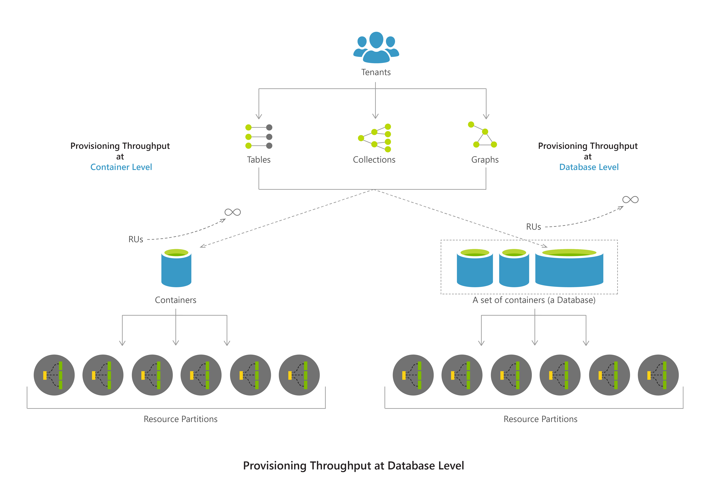

# Throughput and request units in Azure Cosmos DB

Azure Cosmos DB resources are billed based on the provisioned throughput and storage. Azure Cosmos DB throughput is expressed in terms of **Request Units per second (RU/s)**. Azure Cosmos DB supports various APIs that have different operations, ranging from simple reads and writes to complex graph queries. Each request consumes request units based on the amount of computation required to serve the request. The number of request units for an operation is deterministic. You can track the number of request units that are consumed by any operation in Azure Cosmos DB by using the response header. To provide predictable performance, you should reserve throughput in units of 100 RU/second. You can estimate your throughput needs by using the Azure Cosmos DB [request unit calculator](https://www.documentdb.com/capacityplanner).

In Azure Cosmos DB, you can provision throughput at two granularities: 

1. **Azure Cosmos DB container:** The throughput provisioned for a container is reserved for that specific container only. When assigning throughput(RU/s) at the container level, the containers can be created as **Fixed** or **Unlimited**. 

  Fixed-size containers have a maximum throughput limit of 10,000 RU/s and a storage limit of 10 GB. To create an unlimited container, you must specify a minimum throughput of 1,000 RU/s and a [partition key](partition-data.md). Because your data may be split across multiple partitions, you have to pick a partition key that has a high cardinality (100 to millions of distinct values). By selecting a partition key with many distinct values, Azure Cosmos DB ensures that the requests to a collection, table, and graph are scaled uniformly. 

2. **Azure Cosmos DB database:** The throughput provisioned for a database is shared across all the containers within that database. When provisioning throughput at the database level, you can choose to explicitly exclude certain containers and instead provision throughput for those containers at the container level. Database level throughput requires all collections to be created with a partition key. When assigning throughput at the database level, the containers that belong to this database should be created with a partition key because every collection is an **Unlimited** container.  

Based on the provisioned throughput, Azure Cosmos DB will allocate physical partitions to host your container(s) and splits data across partitions as it grows. The following image illustrates provisioning throughput at different levels:

  

> [!NOTE] 
> Provisioning throughput at the container level and database level are separate offerings and switching between either of these require migrating data from source to destination. Which means you need to create a new database or a new collection and then migrate data by using [bulk executor library](bulk-executor-overview.md) or [Azure Data Factory](../data-factory/connector-azure-cosmos-db.md).

## Request units and request charges

Azure Cosmos DB delivers fast, predictable performance by reserving resources to satisfy the throughput needs of your application. Application load and access patterns change over time. Azure Cosmos DB can help you easily increase or decrease the amount of reserved throughput available to your application.

With Azure Cosmos DB, reserved throughput is specified in terms of request unit processing per second. You can think of request units as throughput currency. You reserve a number of guaranteed request units to be available to your application on a per-second basis. Each operation in Azure Cosmos DB, including writing a document, performing a query, and updating a document, consumes CPU, memory, and IOPS. That is, each operation incurs a request charge, which is expressed in request units. When you understand the factors that affect request unit charges and your application's throughput requirements, you can run your application as cost effectively as possible. 

## Throughput isolation in globally distributed databases

If you replicate your database to more than one region, Azure Cosmos DB provides throughput isolation to ensure that request unit usage in one region doesn't affect request unit usage in another region. For example, if you write data to one region and read data from another region, the request units that are used to perform the write operation in region A don't take away from the request units that are used for the read operation in region B. Request units aren't split across the regions in which you've deployed your database. Each region in which the database is replicated has the full number of request units provisioned. For more information about global replication, see [How to distribute data globally with Azure Cosmos DB](distribute-data-globally.md).

## Request unit considerations
When you estimate the number of request units to provision, it's important to consider the following variables:

* **Item size**. As size increases, the number of request units consumed to read or write the data also increases.
* **Item property count**. Assuming default indexing of all properties, the units consumed to write a document, node, or entity increase as the property count increases.
* **Data consistency**. When you use data consistency models like Strong or Bounded Staleness, additional request units are consumed to read items.
* **Indexed properties**. An index policy on each container determines which properties are indexed by default. You can reduce your request unit consumption for write operations by limiting the number of indexed properties or by enabling lazy indexing.
* **Document indexing**. By default, each item is automatically indexed. You consume fewer request units if you choose to not index some of your items.
* **Query patterns**. The complexity of a query affects how many request units are consumed for an operation. The number of query results, the number of predicates, the nature of the predicates, the number of user-defined functions, the size of the source data, and projections all affect the cost of query operations.
* **Script usage**. As with queries, stored procedures and triggers consume request units based on the complexity of the operations being performed. As you develop your application, inspect the request charge header to better understand how each operation consumes request unit capacity.

## Estimating throughput needs
A request unit is a normalized measure of request processing cost. A single request unit represents the processing capacity that's required to read (via self-link or ID) a single 1-KB item that consists of 10 unique property values (excluding system properties). A request to create (insert), replace, or delete the same item consumes more processing from the service and thereby requires more request units. 

> [!NOTE]
> The baseline of 1 request unit for a 1-KB item corresponds to a simple GET by self link or ID of the item.
> 
> 

For example, here's a table that shows how many request units to provision for items with three different sizes (1 KB, 4 KB, and 64 KB) and at two different performance levels (500 reads/second + 100 writes/second and 500 reads/second + 500 writes/second). In this example, the data consistency is set to **Session**, and the indexing policy is set to **None**.

| Item size | Reads/second | Writes/second | Request units
| --- | --- | --- | --- |
| 1 KB | 500 | 100 | (500 * 1) + (100 * 5) = 1,000 RU/s
| 1 KB | 500 | 500 | (500 * 1) + (500 * 5) = 3,000 RU/s
| 4 KB | 500 | 100 | (500 * 1.3) + (100 * 7) = 1,350 RU/s
| 4 KB | 500 | 500 | (500 * 1.3) + (500 * 7) = 4,150 RU/s
| 64 KB | 500 | 100 | (500 * 10) + (100 * 48) = 9,800 RU/s
| 64 KB | 500 | 500 | (500 * 10) + (500 * 48) = 29,000 RU/s

### Use the request unit calculator
To help you fine-tune your throughput estimations, you can use a web-based [request unit calculator](https://www.documentdb.com/capacityplanner). The calculator can help your estimate the request unit requirements for typical operations, including:

* Item creates (writes)
* Item reads
* Item deletes
* Item updates

The tool also includes support for estimating data storage needs based on the sample items that you provide.

To use the tool:

1. Upload one or more representative items (for example, a sample JSON document).
   
    ![Upload items to the request unit calculator][2]
2. To estimate the data storage requirements, enter the total number of items (for example, documents, rows, or vertices) that you expect to store.
3. Enter the number of create, read, update, and delete operations that you require (on a per-second basis). To estimate the request unit charges of item update operations, upload a copy of the sample item from step 1 that includes typical field updates. For example, if item updates typically modify two properties named *lastLogin* and *userVisits*, copy a sample item, update the values for those two properties, and then upload the copied item.
   
    ![Enter throughput requirements in the request unit calculator][3]
4. Select **Calculate**, and then examine the results.
   
    ![Request unit calculator results][4]

> [!NOTE]
> If you have item types that differ dramatically in terms of size and the number of indexed properties, upload a sample of each *type* of typical item to the tool, and then calculate the results.
> 
> 

### Use the Azure Cosmos DB request charge response header
Every response from the Azure Cosmos DB service includes a custom header (`x-ms-request-charge`) that contains the request units consumed for a given request. You can also access this header through the Azure Cosmos DB SDKs. In the .NET SDK, **RequestCharge** is a property of the **ResourceResponse** object. For queries, the Azure Cosmos DB Data Explorer in the Azure portal provides request charge information for executed queries. To learn about how to get and set throughput by using different multi-model APIs see [set and get throughput in Azure Cosmos DB](set-throughput.md) article.

One method for estimating the amount of reserved throughput required by your application is to record the request unit charge associated with running typical operations against a representative item that's used by your application. Then, estimate the number of operations you anticipate to perform each second. Be sure to also measure and include typical queries and Azure Cosmos DB script usage.

> [!NOTE]
> If you have item types that differ dramatically in terms of size and the number of indexed properties, record the applicable operation request unit charge associated with each *type* of typical item.
> 
> 

For example, these are the steps you might take:

1. Record the request unit charge of creating (inserting) a typical item. 
2. Record the request unit charge of reading a typical item.
3. Record the request unit charge of updating a typical item.
4. Record the request unit charge of typical, common item queries.
5. Record the request unit charge of any custom scripts (stored procedures, triggers, user-defined functions) that the application uses.
6. Calculate the required request units given the estimated number of operations you anticipate to run each second.

## A request unit estimate example
Consider the following document, which is approximately 1 KB in size:

```json
{
 "id": "08259",
  "description": "Cereals ready-to-eat, KELLOGG, KELLOGG'S CRISPIX",
  "tags": [
    {
      "name": "cereals ready-to-eat"
    },
    {
      "name": "kellogg"
    },
    {
      "name": "kellogg's crispix"
    }
  ],
  "version": 1,
  "commonName": "Includes USDA Commodity B855",
  "manufacturerName": "Kellogg, Co.",
  "isFromSurvey": false,
  "foodGroup": "Breakfast Cereals",
  "nutrients": [
    {
      "id": "262",
      "description": "Caffeine",
      "nutritionValue": 0,
      "units": "mg"
    },
    {
      "id": "307",
      "description": "Sodium, Na",
      "nutritionValue": 611,
      "units": "mg"
    },
    {
      "id": "309",
      "description": "Zinc, Zn",
      "nutritionValue": 5.2,
      "units": "mg"
    }
  ],
  "servings": [
    {
      "amount": 1,
      "description": "cup (1 NLEA serving)",
      "weightInGrams": 29
    }
  ]
}
```

> [!NOTE]
> Documents are minified in Azure Cosmos DB, so the system-calculated size of the document above is slightly less than 1 KB.
> 
> 

The following table shows approximate request unit charges for typical operations on this item. (The approximate request unit charge assumes that the account consistency level is set to **Session** and that all items are automatically indexed.)

| Operation | Request unit charge |
| --- | --- |
| Create item |~15 RU |
| Read item |~1 RU |
| Query item by ID |~2.5 RU |

The following table shows approximate request unit charges for typical queries used in the application:

| Query | Request unit charge | # of returned items |
| --- | --- | --- |
| Select food by ID |~2.5 RU |1 |
| Select foods by manufacturer |~7 RU |7 |
| Select by food group and order by weight |~70 RU |100 |
| Select top 10 foods in a food group |~10 RU |10 |

> [!NOTE]
> Request unit charges vary based on the number of items returned.
> 
> 

With this information, you can estimate the request unit requirements for this application given the number of operations and queries that you expect per second:

| Operation/query | Estimated number per second | Required request units |
| --- | --- | --- |
| Create item |10 |150 |
| Read item |100 |100 |
| Select foods by manufacturer |25 |175 |
| Select by food group |10 |700 |
| Select top 10 |15 |150 Total |

In this case, you expect an average throughput requirement of 1,275 RU/second. Rounding up to the nearest 100, you would provision 1,300 RU/second for this application's container (or set of containers).

## <a id="RequestRateTooLarge"></a> Exceeding reserved throughput limits in Azure Cosmos DB
Request unit consumption is evaluated at a per-second rate. For applications that exceed the provisioned request unit rate, requests are rate-limited until the rate drops below the provisioned throughput level. When a request is rate-limited, the server preemptively ends the request with `RequestRateTooLargeException` (HTTP status code 429) and returns the `x-ms-retry-after-ms` header. The header indicates the amount of time, in milliseconds, that the user must wait before retrying the request.

    HTTP Status 429
    Status Line: RequestRateTooLarge
    x-ms-retry-after-ms :100

If you use the .NET Client SDK and LINQ queries, most of the time, you never have to deal with this exception. The current version of the .NET Client SDK implicitly catches this response, respects the server-specified retry-after header, and automatically retries the request. Unless your account is being accessed concurrently by multiple clients, the next retry will succeed.

If you have more than one client cumulatively operating above the request rate, the default retry behavior might be insufficient, and the client throws a `DocumentClientException` with status code 429 to the application. In cases like this, you might want to consider handling the retry behavior and logic in your application's error-handling routines or increase the throughput provisioned for the container (or set of containers).

## Next steps
 
- Learn how to [set and get throughput in Azure Cosmos DB](set-throughput.md) by using Azure portal and SDKs.
- Learn about [performance and scale testing with Azure Cosmos DB](performance-testing.md).
- To learn more about reserved throughput with Azure Cosmos DB databases, see [Azure Cosmos DB pricing](https://azure.microsoft.com/pricing/details/cosmos-db/) and [Partitioning data in Azure Cosmos DB](partition-data.md).
- To learn more about Azure Cosmos DB, see the [Azure Cosmos DB documentation](https://azure.microsoft.com/documentation/services/cosmos-db/). 

[2]: ./media/request-units/RUEstimatorUpload.png
[3]: ./media/request-units/RUEstimatorDocuments.png
[4]: ./media/request-units/RUEstimatorResults.png
[5]: ./media/request-units/RUCalculator2.png


