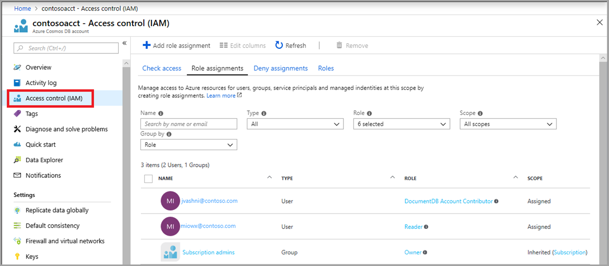

# Role-based access control in Azure Cosmos DB

Azure Cosmos DB provides built-in role-based access control (RBAC) for common management scenarios in Azure Cosmos DB. An individual who has a profile in Azure Active Directory can assign these RBAC roles to users, groups, service principals, or managed identities to grant or deny access to resources and operations on Azure Cosmos DB resources. Role assignments are scoped to control-plane access only, which includes access to Azure Cosmos accounts, databases, containers, and offers (throughput).

## Built-in roles

The following are the built-in roles supported by Azure Cosmos DB:

|**Built-in role**  |**Description**  |
|---------|---------|
|[DocumentDB Account Contributor](../role-based-access-control/built-in-roles.md#documentdb-account-contributor)|Can manage Azure Cosmos DB accounts.|
|[Cosmos DB Account Reader](../role-based-access-control/built-in-roles.md#cosmos-db-account-reader-role)|Can read Azure Cosmos DB account data.|
|[Cosmos Backup Operator](../role-based-access-control/built-in-roles.md#cosmosbackupoperator)|Can submit restore request for an Azure Cosmos database or a container.|
|[Cosmos DB Operator](../role-based-access-control/built-in-roles.md#cosmos-db-operator)|Can provision Azure Cosmos accounts, databases, and containers but cannot access the keys that are required to access the data.|

> [!IMPORTANT]
> RBAC support in Azure Cosmos DB applies to control plane operations only. Data plane operations are secured using master keys or resource tokens. To learn more, see [Secure access to data in Azure Cosmos DB](secure-access-to-data.md)

## Identity and access management (IAM)

The **Access control (IAM)** pane in the Azure portal is used to configure role-based access control on Azure Cosmos resources. The roles are applied to users, groups, service principals, and managed identities in Active Directory. You can use built-in roles or custom roles for individuals and groups. The following screenshot shows Active Directory integration (RBAC) using access control (IAM) in the Azure portal:



## Custom roles

In addition to the built-in roles, users may also create [custom roles](../role-based-access-control/custom-roles.md) in Azure and apply these roles to service principals across all subscriptions within their Active Directory tenant. Custom roles provide users a way to create RBAC role definitions with a custom set of resource provider operations. To learn which operations are available for building custom roles for Azure Cosmos DB see, [Azure Cosmos DB resource provider operations](../role-based-access-control/resource-provider-operations.md#microsoftdocumentdb)

## Preventing changes from Cosmos SDK

> [!WARNING]
> Enabling this feature can have dangerous impact on your application. Please thoroughly read before enabling this feature.

The Azure Cosmos DB resource provider can be locked down to prevent any changes to resources made from any client connecting using account keys (i.e. applications connecting via Cosmos SDK). This also includes changed made from the Azure portal. This may be desirable for users who want higher degrees of control and governance for production environments and enable features such as resource locks and also enable diagnostic logs for control plane operations. Clients connecting via Cosmos DB SDK will be prevented from changing any property for Cosmos accounts, databases, containers, and throughput. Operations involving reading and writing data to Cosmos containers themselves are not impacted.

When set, changes to any resource can only be made from a user with the proper RBAC role and Azure Active Directory credentials including Managed Service Identities.

### Check list before enabling

This setting will prevent any changes to any Cosmos resource from any client connecting using account keys including any Cosmos DB SDK, any tools that connect via account keys, or from the Azure portal. To prevent issues or errors from applications after enabling this feature, check if  applications or Azure portal users perform any of the following actions before enabling this feature, including:

- Any change to the Cosmos account including any properties or adding or removing regions.

- Creating, deleting child resources such as databases and containers. This includes resources for other API's such as Cassandra, MongoDB, Gremlin and table resources.

- Updating throughput on database or container level resources.

- Modifying container properties including index policy, TTL and unique keys.

- Modifying stored procedures, triggers or user-defined functions.

If your applications (or users via Azure portal) perform any of these actions they will need to be migrated to execute via [ARM Templates](manage-sql-with-resource-manager.md), [PowerShell](manage-with-powershell.md), [Azure CLI](manage-with-cli.md), [REST](/rest/api/cosmos-db-resource-provider/) or [Azure Management Library](https://github.com/Azure-Samples/cosmos-management-net). Note that Azure Management is available in [multiple languages](https://docs.microsoft.com/azure/?product=featured#languages-and-tools).

### Set via ARM Template

To set this property using an ARM template, update your existing template or export a new template for your current deployment, then include the `"disableKeyBasedMetadataWriteAccess": true` to the properties for the databaseAccounts resources. Below is a basic example of an Azure Resource Manager template with this property setting.

```json
{
    {
      "type": "Microsoft.DocumentDB/databaseAccounts",
      "name": "[variables('accountName')]",
      "apiVersion": "2020-04-01",
      "location": "[parameters('location')]",
      "kind": "GlobalDocumentDB",
      "properties": {
        "consistencyPolicy": "[variables('consistencyPolicy')[parameters('defaultConsistencyLevel')]]",
        "locations": "[variables('locations')]",
        "databaseAccountOfferType": "Standard",
        "disableKeyBasedMetadataWriteAccess": true
        }
    }
}
```

> [!IMPORTANT]
> Make sure you include the other properties for your account and child resources when redploying with this property. Do not deploy this template as is or it will reset all of your account properties.

### Set via Azure CLI

To enable using Azure CLI use the command below:

```azurecli-interactive
az cosmosdb update  --name [CosmosDBAccountName] --resource-group [ResourceGroupName]  --disable-key-based-metadata-write-access true

```

### Set via PowerShell

To enable using Azure PowerShell, use the command below:

```azurepowershell-interactive
Update-AzCosmosDBAccount -ResourceGroupName [ResourceGroupName] -Name [CosmosDBAccountName] -DisableKeyBasedMetadataWriteAccess true
```

## Next steps

- [What is role-based access control (RBAC) for Azure resources](../role-based-access-control/overview.md)
- [Custom roles for Azure resources](../role-based-access-control/custom-roles.md)
- [Azure Cosmos DB resource provider operations](../role-based-access-control/resource-provider-operations.md#microsoftdocumentdb)
