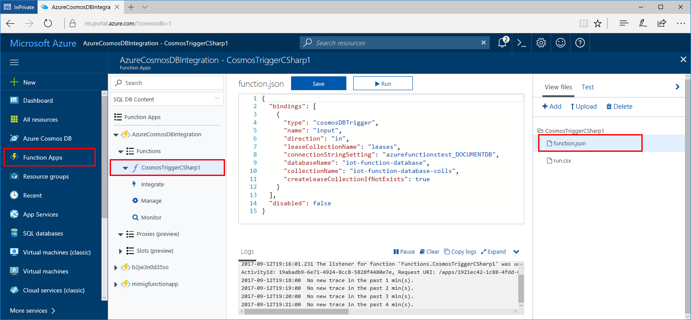

# Azure Cosmos DB: Serverless computing database

Serverless computing is all about the ability to focus on individual pieces of logic that are repeatable and stateless. These pieces require no infrastructure management and they consume resources only for the seconds, or milliseconds, when they run. At the core of the serverless computing movement are functions, which are made available in the Azure ecosystem by Azure Functions.

With the native integration between Azure Cosmos DB and Azure Functions, you can simply add a trigger function directly from your Azure Cosmos DB account. The benefit of trigger functions are that they only execute when an event happens, and that event triggers a function call. Using Azure Functions and Azure Cosmos DB, you can create and deploy event-driven, planet-scale serverless apps with extremely low-latency access against very rich data for a huge number of customers across the globe.

## Overview

With Azure Cosmos DB and Azure Functions, you can:

1. Create event-driven Azure Cosmos DB triggers that get invoked when items are modified in an Azure Cosmos DB database. These triggers rely Azure Cosmos DB [change feed](change-feed.md) support, which monitors your database for changes.
2. Use data in an Azure Cosmos DB database as input to an Azure Function. This is known as an input binding. 
3. Store data in Azure Cosmos DB as the output of an Azure Function. This is known as an output binding.

The following diagram illustrates each of these integrations: 

## Use cases

The following use cases demonstrate a few ways you can make the most of your Azure Cosmos DB data - by connecting your data to event-driven Azure Functions.

* In IoT implementations, you can now invoke a function when the temperature of a component in a connected car exceeds a certain value. 

    Implementation: Connected car sensor data is written to Azure Cosmos DB. An Azure Cosmos DB trigger is used to watch the value of the engine temperature. If the temperature exceeds a certain value, the Azure Cosmos DB trigger is invoked, one Azure Function sends the temperature data to a QA department, another Azure Function sends the owner information to the manufacturer call center as the user will soon be calling in. The output binding on one of the functions updates the car record in Azure Cosmos DB to store information about the temperature event. 

* In financial implementations, you can invoke a function when a bank account balance falls under a certain value.

    Implementation: todo

* In gaming, when a new user is created you can search for other users who might know them by using the Azure Cosmos DB Graph API.

    Implementation: todo

* In retail implementations, when a user adds an item to their basket you now have the flexibility to create and invoke functions for optional pipeline components such as sending promotional mailers because the app flow no longer needs to be linear - any department could create an Azure Cosmos DB trigger by listening to the change feed, and be assured they won't delay critical order processing events in the process.

    Implementation: todo

In all of these cases, because the function has decoupled the app itself, you dont need to spin up new app instances all the time, instead, Azure Functions spins up individual functions to complete discrete processes as needed.

## Tooling

Native integration between Azure Cosmos DB and Azure Functions is available in the portal and Visual Studio 2017. Azure Cosmos DB triggers can be created from either the Azure Cosmos DB portal or the Azure Functions portal, as shown in the following diagram.

 

## Why choose Azure Functions integration for serverless computing

Azure Functions provides the ability to create scalable units of work, or concise pieces of logic that can be run on demand, without provisioning or managing infrastructure. By using Azure Functions, you don't have to create a full blown app to respond to changes in your Azure Cosmos DB database, you can create small reusable functions for specific tasks. In addition, you can also use Azure Cosmos DB data as the input or output to an Azure Function in response to event such as HTTP requests, events in Azure Event Hub, messages in a message queue, or any of the other [Azure Function triggers](../azure-functions/functions-triggers-bindings.md).

Azure Cosmos DB is the recommended database for your serverless computing architecture for the following reasons: 

* **Instant access to all your data**: You have granular access to every value stored because Azure Cosmos DB automatically indexes all data, and makes those indexes immediately available. This means you are able to constantly query, update, and add new items. If you're looking to store data and don't need deep indexing or need to store attachments and media files, the [Azure Blog Storage trigger](../azure-functions/functions-bindings-storage-blob.md) may be a better option.

* **Schemaless**. Azure Cosmos DB is schemaless - so its uniquely able to handle any data output from an Azure Function. This "handle anything" approach makes it very straightforward to create a variety of Functions that each query and respond to independent values.

* **Scalable throughput**. Throughput can be scaled up and down instantly in Azure Cosmos DB. If you have hundreds or thousands of Functions querying and writing to the same database, you can scale up your [RU/s](request-units.md) to handle the load. All Functions can work in parallel using your allocated RU/s and your data is guaranteed to be [consistent](consistency-levels.md).

* **Global replication**. You can replicate Azure Cosmos DB data [around the globe](distribute-data-globally.md) to reduce latency, geo-locating your data closest to where your users are. As with all Azure Cosmos DB queries, data from event-driven triggers is read data from the Azure Cosmos DB closest to the user.

Benefits of Azure Functions: 

* **Event-driven**. Azure Functions are event-driven and can listen to a change feed from Azure Cosmos DB. This means you don't need to create listening logic, you just keep an eye out for the changes you're listening for. 

* **No limits**. Functions execute in parallel and the service will spin up as many as you need. You set the parameters.

* **Good for quick tasks**. The service spins up new instances of functions whenever an event fires and closes them as soon as the function completes. You only pay for the time your functions are running.

* If you're not sure whether Flow, Logic Apps, Azure Functions, or WebJobs are best for your implementation, see [Choose between Flow, Logic Apps, Functions, and WebJobs](../azure-functions/functions-compare-logic-apps-ms-flow-webjobs).

## Next steps

Now let's connect Azure Cosmos DB and Azure Functions for real: 

* Azure Cosmos DB trigger quickstart - link to be provided
* Azure Cosmos DB trigger tutorial (VS) - link to be provided
* Azure Cosmos DB bindings and triggers - link to be provided

 

