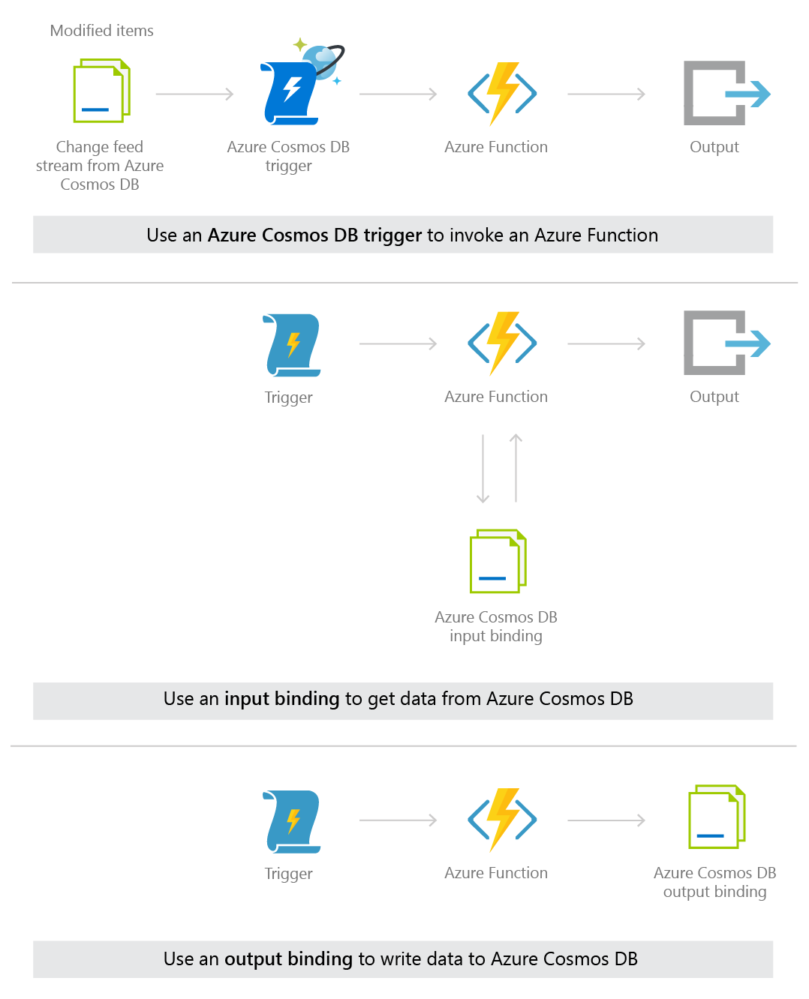
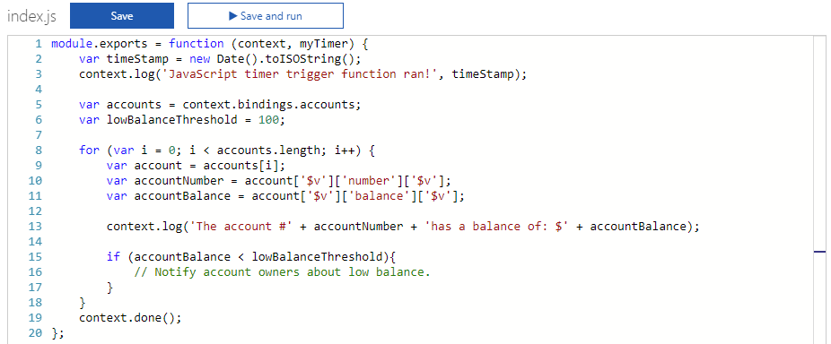

# Serverless database computing using Azure Cosmos DB and Azure Functions

Serverless computing is all about the ability to focus on individual pieces of logic that are repeatable and stateless. These pieces require no infrastructure management and they consume resources only for the seconds, or milliseconds, they run for. At the core of the serverless computing movement are functions, which are made available in the Azure ecosystem by [Azure Functions](https://azure.microsoft.com/services/functions). To learn about other serverless execution environments in Azure see [serverless in Azure](https://azure.microsoft.com/solutions/serverless/) page. 

With the native integration between [Azure Cosmos DB](https://azure.microsoft.com/services/cosmos-db) and Azure Functions, you can create database triggers, input bindings, and output bindings directly from your Azure Cosmos DB account. Using Azure Functions and Azure Cosmos DB, you can create and deploy event-driven serverless apps with low-latency access to rich data for a global user base.

## Overview

Azure Cosmos DB and Azure Functions enable you to integrate your databases and serverless apps in the following ways:

* Create an event-driven **Azure Cosmos DB trigger** in an Azure Function. This trigger relies on [change feed](change-feed.md) streams to monitor your Azure Cosmos DB container for changes. When any changes are made to a container, the change feed stream is sent to the trigger, which invokes the Azure Function.
* Alternatively, bind an Azure Function to an Azure Cosmos DB container using an **input binding**. Input bindings read data from a container when a function executes.
* Bind a function to an Azure Cosmos DB container using an **output binding**. Output bindings write data to a container when a function completes.

> [!NOTE]
> At this time, the Azure Cosmos DB trigger, input bindings, and output bindings work with SQL API and Gremlin API accounts only.

The following diagram illustrates each of these three integrations: 

The Azure Cosmos DB trigger, input binding, and output binding can be used in the following combinations:
* An Azure Cosmos DB trigger can be used with an output binding to a different Azure Cosmos DB container. After a function performs an action on an item in the change feed you can write it to another container (writing it to the same container it came from would effectively create a recursive loop). Or, you can use an Azure Cosmos DB trigger to effectively migrate all changed items from one container to a different container, with the use of an output binding.
* Input bindings and output bindings for Azure Cosmos DB can be used in the same Azure Function. This works well in cases when you want to find certain data with the input binding, modify it in the Azure Function, and then save it to the same container or a different container, after the modification.
* An input binding to an Azure Cosmos DB container can be used in the same function as an Azure Cosmos DB trigger, and can be used with or without an output binding as well. You could use this combination to apply up-to-date currency exchange information (pulled in with an input binding to an exchange container) to the change feed of new orders in your shopping cart service. The updated shopping cart total, with the current currency conversion applied, can be written to a third container using an output binding.

## Use cases

The following use cases demonstrate a few ways you can make the most of your Azure Cosmos DB data - by connecting your data to event-driven Azure Functions.

### IoT use case - Azure Cosmos DB trigger and output binding

In IoT implementations, you can invoke a function when the check engine light is displayed in a connected car.

**Implementation:** Use an Azure Cosmos DB trigger and an output binding

1. An **Azure Cosmos DB trigger** is used to trigger events related to car alerts, such as the check engine light coming on in a connected car.
2. When the check engine light comes, the sensor data is sent to Azure Cosmos DB.
3. Azure Cosmos DB creates or updates new sensor data documents, then those changes are streamed to the Azure Cosmos DB trigger.
4. The trigger is invoked on every data-change to the sensor data collection, as all changes are streamed via the change feed.
5. A threshold condition is used in the function to send the sensor data to the warranty department.
6. If the temperature is also over a certain value, an alert is also sent to the owner.
7. The **output binding** on the function updates the car record in another Azure Cosmos DB container to store information about the check engine event.

The following image shows the code written in the Azure portal for this trigger.

### Financial use case - Timer trigger and input binding

In financial implementations, you can invoke a function when a bank account balance falls under a certain amount.

**Implementation:** A timer trigger with an Azure Cosmos DB input binding

1. Using a [timer trigger](../azure-functions/functions-bindings-timer.md), you can retrieve the bank account balance information stored in an Azure Cosmos DB container at timed intervals using an **input binding**.
2. If the balance is below the low balance threshold set by the user, then follow up with an action from the Azure Function.
3. The output binding can be a [SendGrid integration](../azure-functions/functions-bindings-sendgrid.md) that sends an email from a service account to the email addresses identified for each of the low balance accounts.

The following images show the code in the Azure portal for this scenario.

### Gaming use case - Azure Cosmos DB trigger and output binding

In gaming, when a new user is created you can search for other users who might know them by using the [Azure Cosmos DB Gremlin API](graph-introduction.md). You can then write the results to an [Azure Cosmos DB SQL database] for easy retrieval.

**Implementation:** Use an Azure Cosmos DB trigger and an output binding

1. Using an Azure Cosmos DB [graph database](graph-introduction.md) to store all users, you can create a new function with an Azure Cosmos DB trigger. 
2. Whenever a new user is inserted, the function is invoked, and then the result is stored using an **output binding**.
3. The function queries the graph database to search for all the users that are directly related to the new user and returns that dataset to the function.
4. This data is then stored in an Azure Cosmos DB which can then be easily retrieved by any front-end application that shows the new user their connected friends.

### Retail use case - Multiple functions

In retail implementations, when a user adds an item to their basket you now have the flexibility to create and invoke functions for optional business pipeline components.

**Implementation:** Multiple Azure Cosmos DB triggers listening to one container

1. You can create multiple Azure Functions by adding Azure Cosmos DB triggers to each - all of which listen to the same change feed of shopping cart data. Note that when multiple functions listen to the same change feed, a new lease collection is required for each function. For more information about lease collections, see [Understanding the Change Feed Processor library](change-feed.md#understand-cf).
2. Whenever a new item is added to a users shopping cart, each function is independently invoked by the change feed from the shopping cart container.
    * One function may use the contents of the current basket to change the display of other items the user might be interested in.
    * Another function may update inventory totals.
    * Another function may send customer information for certain products to the marketing department, who sends them a promotional mailer. 

    Any department can create an Azure Cosmos DB trigger by listening to the change feed, and be sure they won't delay critical order processing events in the process.

In all of these use cases, because the function has decoupled the app itself, you don’t need to spin up new app instances all the time. Instead, Azure Functions spins up individual functions to complete discrete processes as needed.

## Tooling

Native integration between Azure Cosmos DB and Azure Functions is available in the Azure portal and in Visual Studio 2017.

* In the Azure Functions portal, you can create an Azure Cosmos DB trigger. For quickstart instructions, see [Create an Azure Cosmos DB trigger in the Azure portal](https://aka.ms/cosmosdbtriggerportalfunc).
* In the Azure Cosmos DB portal, you can add an Azure Cosmos DB trigger to an existing Azure Function app in the same resource group.
* In Visual Studio 2017, you can create an Azure Cosmos DB trigger using the [Azure Functions Tools for Visual Studio 2017](../azure-functions/functions-develop-vs.md):

    >[!VIDEO https://www.youtube.com/embed/iprndNsUeeg]

## Why choose Azure Functions integration for serverless computing?

Azure Functions provides the ability to create scalable units of work, or concise pieces of logic that can be run on demand, without provisioning or managing infrastructure. By using Azure Functions, you don't have to create a full-blown app to respond to changes in your Azure Cosmos DB database, you can create small reusable functions for specific tasks. In addition, you can also use Azure Cosmos DB data as the input or output to an Azure Function in response to event such as an HTTP requests or a timed trigger.

Azure Cosmos DB is the recommended database for your serverless computing architecture for the following reasons:

* **Instant access to all your data**: You have granular access to every value stored because Azure Cosmos DB [automatically indexes](indexing-policies.md) all data by default, and makes those indexes immediately available. This means you are able to constantly query, update, and add new items to your database and have instant access via Azure Functions.

* **Schemaless**. Azure Cosmos DB is schemaless - so it's uniquely able to handle any data output from an Azure Function. This "handle anything" approach makes it straightforward to create a variety of Functions that all output to Azure Cosmos DB.

* **Scalable throughput**. Throughput can be scaled up and down instantly in Azure Cosmos DB. If you have hundreds or thousands of Functions querying and writing to the same container, you can scale up your [RU/s](request-units.md) to handle the load. All functions can work in parallel using your allocated RU/s and your data is guaranteed to be [consistent](consistency-levels.md).

* **Global replication**. You can replicate Azure Cosmos DB data [around the globe](distribute-data-globally.md) to reduce latency, geo-locating your data closest to where your users are. As with all Azure Cosmos DB queries, data from event-driven triggers is read data from the Azure Cosmos DB closest to the user.

If you're looking to integrate with Azure Functions to store data and don't need deep indexing or if you need to store attachments and media files, the [Azure Blob Storage trigger](../azure-functions/functions-bindings-storage-blob.md) may be a better option.

Benefits of Azure Functions: 

* **Event-driven**. Azure Functions are event-driven and can listen to a change feed from Azure Cosmos DB. This means you don't need to create listening logic, you just keep an eye out for the changes you're listening for. 

* **No limits**. Functions execute in parallel and the service spins up as many as you need. You set the parameters.

* **Good for quick tasks**. The service spins up new instances of functions whenever an event fires and closes them as soon as the function completes. You only pay for the time your functions are running.

If you're not sure whether Flow, Logic Apps, Azure Functions, or WebJobs are best for your implementation, see [Choose between Flow, Logic Apps, Functions, and WebJobs](../azure-functions/functions-compare-logic-apps-ms-flow-webjobs.md).

## Next steps

Now let's connect Azure Cosmos DB and Azure Functions for real: 

* [Create an Azure Cosmos DB trigger in the Azure portal](https://aka.ms/cosmosdbtriggerportalfunc)
* [Create an Azure Functions HTTP trigger with an Azure Cosmos DB input binding](https://aka.ms/cosmosdbinputbind)
* [Azure Cosmos DB bindings and triggers](../azure-functions/functions-bindings-cosmosdb.md)

 

