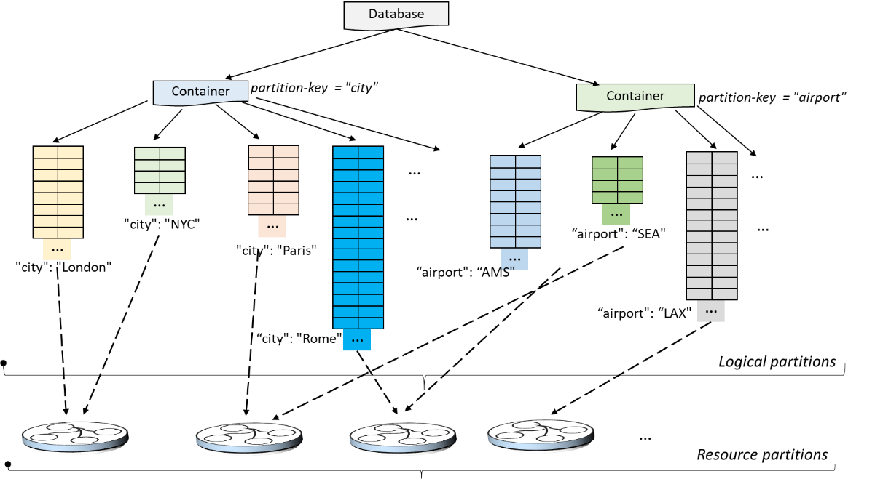

# Provision throughput on containers and databases

An Azure Cosmos DB database is a unit of management for a set of containers. A database consists of a set of schema-agnostic containers. An Azure Cosmos DB container is the unit of scalability for both throughput and storage. A container is horizontally partitioned across a set of machines within an Azure region and is distributed across all Azure regions associated with your Azure Cosmos DB account.

With Azure Cosmos DB, you can configure throughput at two granularities:
 
- Azure Cosmos DB containers.
- Azure Cosmos DB databases.

## Set throughput on a container  

The throughput provisioned on an Azure Cosmos DB container is exclusively reserved for the container. The container receives the provisioned throughput all the time. The provisioned throughput on a container is financially backed by SLAs. To configure throughput on a container, see [Provision throughput on an Azure Cosmos DB container](how-to-provision-container-throughput.md).

Setting provisioned throughput on a container is the widely used option. You can elastically scale throughput for a container by provisioning any amount of throughput by using Request Units (RUs). But you can't selectively specify the throughput for logical partitions. 

If the workload running on a logical partition consumes more than the throughput that was allocated to the specific logical partition, your operations get rate-limited. When rate-limiting occurs, you can either increase the throughput for the entire container or retry the operations. For more information on partitioning, see [Logical partitions](partition-data.md).

We recommend that you configure throughput at the container granularity when you want guaranteed performance for the container.

Throughput provisioned on an Azure Cosmos DB container is uniformly distributed across all the logical partitions of the container. Because one or more logical partitions of a container are hosted by a physical partition, the physical partitions belong exclusively to the container and support the throughput provisioned on the container. 

The following image shows how a physical partition hosts one or more logical partitions of a container:

## Set throughput on a database

When you provision throughput on an Azure Cosmos DB database, the throughput is shared across all the containers in the database. An exception is if you specified a provisioned throughput on specific containers. Sharing the database throughput among its containers is analogous to hosting a database on a cluster of machines. Because all containers within a database share the resources available on a machine, you naturally do not get predictable performance on any specific container. To configure throughput on a database, see [Configure provisioned throughput on an Azure Cosmos DB database](how-to-provision-database-throughput.md).

Setting throughput on an Azure Cosmos DB database guarantees that you receive the provisioned throughput all the time. Because all containers within the database share the provisioned throughput, Azure Cosmos DB doesn't provide any predictable throughput guarantees for a particular container in that database. The portion of the throughput that a specific container can receive is dependent on:

* The number of containers.
* The choice of partition keys for various containers.
* The distribution of the workload across various logical partitions of the containers. 

We recommend that you configure throughput on a database when you want to share the throughput across multiple containers, but don't want to dedicate the throughput to any particular container. 

The following examples demonstrate where it's preferred to provision throughput at the database level:

* Sharing a database’s provisioned throughput across a set of containers is useful for a multitenant application. Each user can be represented by a distinct Azure Cosmos DB container.

* Sharing a database’s provisioned throughput across a set of containers is useful when you migrate a NoSQL database, such as MongoDB or Cassandra, hosted from a cluster of VMs or from on-premises physical servers to Azure Cosmos DB. Think of the provisioned throughput configured on your Azure Cosmos DB database as a logical equivalent, but more cost-effective and elastic, to that of the compute capacity of your MongoDB or Cassandra cluster.  

All containers created inside a database with provisioned throughput must be created with a partition key. At any given point of time, the throughput allocated to a container within a database is distributed across all the logical partitions of that container. When you have containers that share provisioned throughput on a database, you can't selectively apply the throughput to a specific container or a logical partition. 

If the workload on a logical partition consumes more than the throughput that's allocated to a specific logical partition, your operations are rate-limited. When rate-limiting occurs, you can either increase the throughput for the entire container or retry the operations. For more information on partitioning, see [Logical partitions](partition-data.md).

Multiple logical partitions that share the throughput provisioned to a database can be hosted on a single physical partition. While a single logical partition of a container is always scoped within a physical partition, "L" logical partitions across "C" containers that share the provisioned throughput of a database can be mapped and hosted on "R" physical partitions. 

The following image shows how a physical partition can host one or more logical partitions that belong to different containers within a database:

## Set throughput on a database and a container

You can combine the two models. Provisioning throughput on both the database and the container is allowed. The following example shows how to provision throughput on an Azure Cosmos DB database and a container:

* You can create an Azure Cosmos DB database named Z with provisioned throughput of "K" RUs. 
* Next, create five containers named A, B, C, D, and E within the database.
* You can explicitly configure "P" RUs of provisioned throughput on the container named B.
* The "K" RUs throughput is shared across the four containers A, C, D, and E. The exact amount of throughput available to A, C, D, or E varies. There are no SLAs for each individual container’s throughput.
* The container named B is guaranteed to get the "P" RUs throughput all the time. It's backed by SLAs.

## Comparison of models

|**Quota**  |**Throughput provisioned on a database**  |**Throughput provisioned on a container**|
|---------|---------|---------|
|Minimum RUs |400 (After the first four containers, each additional container requires a minimum of 100 RUs per second.) |400|
|Minimum RUs per container|100|400|
|Minimum RUs required to consume 1 GB of storage|40|40|
|Maximum RUs|Unlimited, on the database.|Unlimited, on the container.|
|RUs assigned or available to a specific container|No guarantees. RUs assigned to a given container depend on the properties. Properties can be the choice of partition keys of containers that share the throughput, the distribution of the workload, and the number of containers. |All the RUs configured on the container are exclusively reserved for the container.|
|Maximum storage for a container|Unlimited.|Unlimited.|
|Maximum throughput per logical partition of a container|10K RUs|10K RUs|
|Maximum storage (data + index) per logical partition of a container|10 GB|10 GB|

## Next steps

* Learn more about [logical partitions](partition-data.md).
* Learn how to [provision throughput on an Azure Cosmos DB container](how-to-provision-container-throughput.md).
* Learn how to [provision throughput on an Azure Cosmos DB database](how-to-provision-database-throughput.md).

