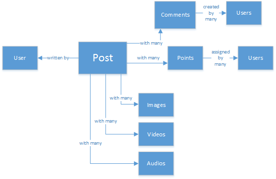
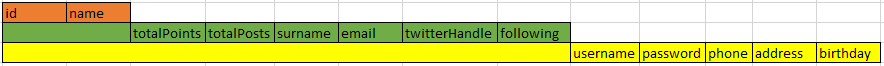
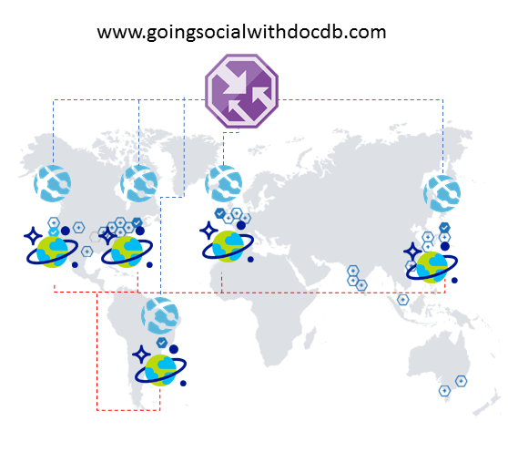

# Going social with Azure Cosmos DB
Living in a massively interconnected society means that, at some point in life, you become part of a **social network**. You use social networks to keep in touch with friends, colleagues, family, or sometimes to share your passion with people with common interests.

As engineers or developers, you might have wondered how do these networks store and interconnect your data, or might have even been tasked to create or architect a new social network for a specific niche market yourselves. That’s when the significant question arises: How is all this data stored?

Let’s suppose that you are creating a new and shiny social network, where your users can post articles with related media like, pictures, videos, or even music. Users can comment on posts and give points for ratings. There will be a feed of posts that users will see and be able to interact with on the main website landing page. This doesn’t sound complex (at first), but for the sake of simplicity, let’s stop there (you can delve into custom user feeds affected by relationships, but it exceeds the goal of this article).

So, how do you store this and where?

Many of you might have experience on SQL databases or at least have notion of [relational modeling of data](https://en.wikipedia.org/wiki/Relational_model) and you might be tempted to start drawing something like this:

 

A perfectly normalized and pretty data structure… that doesn't scale. 

Don’t get me wrong, I’ve worked with SQL databases all my life, they are great, but like every pattern, practice and software platform, it’s not perfect for every scenario.

Why isn't SQL the best choice in this scenario? Let’s look at the structure of a single post, if I wanted to show that post in a website or application, I’d have to do a query with… Eight table joins (!) just to show one single post, now, picture a stream of posts that dynamically load and appear on the screen and you might see where I am going.

You could, of course, use a enormous SQL instance with enough power to solve thousands of queries with these many joins to serve your content, but truly, why would you, when a simpler solution exists?

## The NoSQL road
This article will guide you into modeling your social platform's data with Azure's NoSQL database [Azure Cosmos DB](https://azure.microsoft.com/services/cosmos-db/) in a cost-effective way while leveraging other Azure Cosmos DB features like the  [Gremlin API](../cosmos-db/graph-introduction.md). Using a [NoSQL](https://en.wikipedia.org/wiki/NoSQL) approach, storing data, in JSON format and applying [denormalization](https://en.wikipedia.org/wiki/Denormalization), the previously complicated post can be transformed into a single [Document](https://en.wikipedia.org/wiki/Document-oriented_database):

    {
        "id":"ew12-res2-234e-544f",
        "title":"post title",
        "date":"2016-01-01",
        "body":"this is an awesome post stored on NoSQL",
        "createdBy":User,
        "images":["http://myfirstimage.png","http://mysecondimage.png"],
        "videos":[
            {"url":"http://myfirstvideo.mp4", "title":"The first video"},
            {"url":"http://mysecondvideo.mp4", "title":"The second video"}
        ],
        "audios":[
            {"url":"http://myfirstaudio.mp3", "title":"The first audio"},
            {"url":"http://mysecondaudio.mp3", "title":"The second audio"}
        ]
    }

And it can be obtained with a single query, and with no joins. This is much more simple and straightforward, and, budget-wise, it requires fewer resources to achieve a better result.

Azure Cosmos DB makes sure that all the properties are indexed with its automatic indexing, which can even be [customized](indexing-policies.md). The schema-free approach lets us store documents with different and dynamic structures, maybe tomorrow you want posts to have a list of categories or hashtags associated with them, Cosmos DB will handle the new Documents with the added attributes with no extra work required by us.

Comments on a post can be treated as other posts with a parent property (this simplifies your object mapping). 

    {
        "id":"1234-asd3-54ts-199a",
        "title":"Awesome post!",
        "date":"2016-01-02",
        "createdBy":User2,
        "parent":"ew12-res2-234e-544f"
    }

    {
        "id":"asd2-fee4-23gc-jh67",
        "title":"Ditto!",
        "date":"2016-01-03",
        "createdBy":User3,
        "parent":"ew12-res2-234e-544f"
    }

And all social interactions can be stored on a separate object as counters:

    {
        "id":"dfe3-thf5-232s-dse4",
        "post":"ew12-res2-234e-544f",
        "comments":2,
        "likes":10,
        "points":200
    }

Creating feeds is just a matter of creating documents that can hold a list of post ids with a given relevance order:

    [
        {"relevance":9, "post":"ew12-res2-234e-544f"},
        {"relevance":8, "post":"fer7-mnb6-fgh9-2344"},
        {"relevance":7, "post":"w34r-qeg6-ref6-8565"}
    ]

You could have a "latest" stream with posts ordered by creation date, a "hottest" stream with those posts with more likes in the last 24 hours, you could even implement a custom stream for each user based on logic like followers and interests, and it would still be a list of posts. It’s a matter of how to build these lists, but the reading performance remains unhindered. Once you acquire one of these lists, you issue a single query to Cosmos DB using the [IN operator](sql-api-sql-query.md#WhereClause) to obtain pages of posts at a time.

The feed streams could be built using [Azure App Services’](https://azure.microsoft.com/services/app-service/) background processes: [Webjobs](../app-service/web-sites-create-web-jobs.md). Once a post is created, background processing can be triggered by using [Azure Storage](https://azure.microsoft.com/services/storage/) [Queues](../storage/queues/storage-dotnet-how-to-use-queues.md) and Webjobs triggered using the [Azure Webjobs SDK](https://github.com/Azure/azure-webjobs-sdk/wiki), implementing the post propagation inside streams based on your own custom logic. 

Points and likes over a post can be processed in a deferred manner using this same technique to create an eventually consistent environment.

Followers are trickier. Cosmos DB has a maximum document size limit, and reading/writing large documents can impact the scalability of your application. So you may think about storing followers as a document with this structure:

    {
        "id":"234d-sd23-rrf2-552d",
        "followersOf": "dse4-qwe2-ert4-aad2",
        "followers":[
            "ewr5-232d-tyrg-iuo2",
            "qejh-2345-sdf1-ytg5",
            //...
            "uie0-4tyg-3456-rwjh"
        ]
    }

This might work for a user with a few thousands followers, but if some celebrity joins the ranks, this approach will lead to a large document size, and might eventually hit the document size cap.

To solve this, you can use a mixed approach. As part of the User Statistics document you can store the number of followers:

    {
        "id":"234d-sd23-rrf2-552d",
        "user": "dse4-qwe2-ert4-aad2",
        "followers":55230,
        "totalPosts":452,
        "totalPoints":11342
    }

And the actual graph of followers can be stored using Azure Cosmos DB [Gremlin API](../cosmos-db/graph-introduction.md), to create [vertexes](http://mathworld.wolfram.com/GraphVertex.html) for each user and [edges](http://mathworld.wolfram.com/GraphEdge.html) that maintain the "A-follows-B" relationships. The Gremlin API let's you not only obtain the followers of a certain user but create more complex queries to even suggest people in common. If you add to the graph the Content Categories that people like or enjoy, you can start weaving experiences that include smart content discovery, suggesting content that those you follow like, or finding people with whom you might have much in common.

The User Statistics document can still be used to create cards in the UI or quick profile previews.

## The "Ladder" pattern and data duplication
As you might have noticed in the JSON document that references a post, there are multiple occurrences of a user. And you’d have guessed right, this means that the information that represents a user, given this denormalization, might be present in more than one place.

In order to allow for faster queries, you incur data duplication. The problem with this side-effect is that if by some action, a user’s data changes, you need to find all the activities he ever did and update them all. Doesn’t sound practical, right?

You are going to solve it by identifying the Key attributes of a user that you show in your application for each activity. If you visually show a post in your application and show just the creator’s name and picture, why store all of the user’s data in the "createdBy" attribute? If for each comment you just show the user’s picture, you don’t really need the rest of his information. That’s where something I call the "Ladder pattern" comes into play.

Let’s take user information as an example:

    {
        "id":"dse4-qwe2-ert4-aad2",
        "name":"John",
        "surname":"Doe",
        "address":"742 Evergreen Terrace",
        "birthday":"1983-05-07",
        "email":"john@doe.com",
        "twitterHandle":"\@john",
        "username":"johndoe",
        "password":"some_encrypted_phrase",
        "totalPoints":100,
        "totalPosts":24
    }

By looking at this information, you can quickly detect which is critical information and which isn’t, thus creating a "Ladder":

The smallest step is called a UserChunk, the minimal piece of information that identifies a user and it’s used for data duplication. By reducing the size of the duplicated data to only the information you will "show", you reduce the possibility of massive updates.

The middle step is called the user, it’s the full data that will be used on most performance-dependent queries on Cosmos DB, the most accessed and critical. It includes the information represented by a UserChunk.

The largest is the Extended User. It includes all the critical user information plus other data that doesn’t really require to be read quickly or it’s usage is eventual (like the login process). This data can be stored outside of Cosmos DB, in Azure SQL Database or Azure Storage Tables.

Why would you split the user and even store this information in different places? Because from a performance point of view, the bigger the documents, the costlier the queries. Keep documents slim, with the right information to do all your performance-dependent queries for your social network, and store the other extra information for eventual scenarios like, full profile edits, logins, even data mining for usage analytics and Big Data initiatives. You really don’t care if the data gathering for data mining is slower because it’s running on Azure SQL Database, you do have concern though that your users have a fast and slim experience. A user, stored on Cosmos DB, would look like this:

    {
        "id":"dse4-qwe2-ert4-aad2",
        "name":"John",
        "surname":"Doe",
        "username":"johndoe"
        "email":"john@doe.com",
        "twitterHandle":"\@john"
    }

And a Post would look like:

    {
        "id":"1234-asd3-54ts-199a",
        "title":"Awesome post!",
        "date":"2016-01-02",
        "createdBy":{
            "id":"dse4-qwe2-ert4-aad2",
            "username":"johndoe"
        }
    }

And when an edit arises where one of the attributes of the chunk is affected, it’s easy to find the affected documents by using queries that point to the indexed attributes (SELECT * FROM posts p WHERE p.createdBy.id == "edited_user_id") and then updating the chunks.

## The search box
Users will generate, luckily, much content. And you should be able to provide the ability to search and find content that might not be directly in their content streams, maybe because you don’t follow the creators, or maybe you are just trying to find that old post you did six months ago.

Thankfully, and because you are using Azure Cosmos DB, you can easily implement a search engine using [Azure Search](https://azure.microsoft.com/services/search/) in a couple of minutes and without typing a single line of code (other than obviously, the search process and UI).

Why is this so easy?

Azure Search implements what they call [Indexers](https://msdn.microsoft.com/library/azure/dn946891.aspx), background processes that hook in your data repositories and automagically add, update or remove your objects in the indexes. They support an [Azure SQL Database indexers](https://blogs.msdn.microsoft.com/kaevans/2015/03/06/indexing-azure-sql-database-with-azure-search/), [Azure Blobs indexers](../search/search-howto-indexing-azure-blob-storage.md) and thankfully, [Azure Cosmos DB indexers](../search/search-howto-index-documentdb.md). The transition of information from Cosmos DB to Azure Search is straightforward, as both store information in JSON format, you just need to [create your Index](../search/search-create-index-portal.md) and map, which attributes from your Documents you want indexed and that’s it, in a matter of minutes (depends on the size of your data), all your content will be available to be searched upon, by the best Search-as-a-Service solution in cloud infrastructure. 

For more information about Azure Search, you can visit the [Hitchhiker’s Guide to Search](https://blogs.msdn.microsoft.com/mvpawardprogram/2016/02/02/a-hitchhikers-guide-to-search/).

## The underlying knowledge
After storing all this content that grows and grows every day, you might find thinking: What can I do with all this stream of information from my users?

The answer is straightforward: Put it to work and learn from it.

But, what can you learn? A few easy examples include [sentiment analysis](https://en.wikipedia.org/wiki/Sentiment_analysis), content recommendations based on a user’s preferences or even an automated content moderator that ensures that all the content published by your social network is safe for the family.

Now that I got you hooked, you’ll probably think you need some PhD in math science to extract these patterns and information out of simple databases and files, but you’d be wrong.

[Azure Machine Learning](https://azure.microsoft.com/services/machine-learning/), part of the [Cortana Intelligence Suite](https://social.technet.microsoft.com/wiki/contents/articles/36688.introduction-to-cortana-intelligence-suite.aspx), is a fully managed cloud service that lets you create workflows using algorithms in a simple drag-and-drop interface, code your own algorithms in [R](https://en.wikipedia.org/wiki/R_\(programming_language\)) or use some of the already-built and ready to use APIs such as: [Text Analytics](https://gallery.cortanaanalytics.com/MachineLearningAPI/Text-Analytics-2),  [Content Moderator, or [Recommendations](https://gallery.azure.ai/Solution/Recommendations-Solution).

To achieve any of these Machine Learning scenarios, you can use [Azure Data Lake](https://azure.microsoft.com/services/data-lake-store/) to ingest the information from different sources, and use [U-SQL](https://azure.microsoft.com/documentation/videos/data-lake-u-sql-query-execution/) to process the information and generate an output that can be processed by Azure Machine Learning.

Another available option is to use [Microsoft Cognitive Services](https://www.microsoft.com/cognitive-services) to analyze your users content; not only can you understand them better (through analyzing what they write with [Text Analytics API](https://www.microsoft.com/cognitive-services/en-us/text-analytics-api)) , but you could also detect unwanted or mature content and act accordingly with [Computer Vision API](https://www.microsoft.com/cognitive-services/en-us/computer-vision-api). Cognitive Services includes many out-of-the-box solutions that don't require any kind of Machine Learning knowledge to use.

## A planet-scale social experience
There is a last, but not least, important article I must address: **scalability**. When designing an architecture it's crucial that each component can scale on its own, either because you need to process more data or because you want to have a bigger geographical coverage (or both!). Thankfully, achieving such a complex task is a **turnkey experience** with Cosmos DB.

Cosmos DB supports [dynamic partitioning](https://azure.microsoft.com/blog/10-things-to-know-about-documentdb-partitioned-collections/) out-of-the-box by automatically creating partitions based on a given **partition key** (defined as one of the attributes in your documents). Defining the correct partition key must be done at design time and keeping in mind the [best practices](../cosmos-db/partition-data.md#designing-for-partitioning) available; in the case of a social experience, your partitioning strategy must be aligned with the way you query (reads within the same partition are desirable) and write (avoid "hot spots" by spreading writes on multiple partitions). Some options are: partitions based on a temporal key (day/month/week), by content category, by geographical region, by user; it all really depends on how you will query the data and show it in your social experience. 

One interesting point worth mentioning is that Cosmos DB will run your queries (including [aggregates](https://azure.microsoft.com/blog/planet-scale-aggregates-with-azure-documentdb/)) across all your partitions transparently, you don't need to add any logic as your data grows.

With time, you will eventually grow in traffic and your resource consumption (measured in [RUs](request-units.md), or Request Units) will increase. You will read and write more frequently as your user base grows and they will start creating and reading more content; the ability of **scaling your throughput** is vital. Increasing your RUs is easy, you can do it with a few clicks on the Azure portal or by [issuing commands through the API](https://docs.microsoft.com/rest/api/cosmos-db/replace-an-offer).

What happens if things keep getting better and users from another region, country or continent, notice your platform and start using it, what a great surprise!

But wait... you soon realize their experience with your platform is not optimal; they are so far away from your operational region that the latency is terrible, and you obviously don't want them to quit. If only there was an easy way of **extending your global reach**... but there is!

Cosmos DB lets you [replicate your data globally](../cosmos-db/tutorial-global-distribution-sql-api.md) and transparently with a couple of clicks and automatically select among the available regions from your [client code](../cosmos-db/tutorial-global-distribution-sql-api.md). This also means that you can have [multiple failover regions](regional-failover.md). 

When you replicate your data globally, you need to make sure that your clients can take advantage of it. If you are using a web frontend or accessing APIs from mobile clients, you can deploy [Azure Traffic Manager](https://azure.microsoft.com/services/traffic-manager/) and clone your Azure App Service on all the desired regions, using a performance configuration to support your extended global coverage. When your clients access your frontend or APIs, they will be routed to the closest App Service, which in turn, will connect to the local Cosmos DB replica.

## Conclusion
This article tries to shed some light into the alternatives of creating social networks completely on Azure with low-cost services and providing great results by encouraging the use of a multi-layered storage solution and data distribution called "Ladder".

The truth is that there is no silver bullet for this kind of scenarios, it’s the synergy created by the combination of great services that allow us to build great experiences: the speed and freedom of Azure Cosmos DB to provide a great social application, the intelligence behind a first-class search solution like Azure Search, the flexibility of Azure App Services to host not even language-agnostic applications but powerful background processes and the expandable Azure Storage and Azure SQL Database for storing massive amounts of data and the analytic power of Azure Machine Learning to create knowledge and intelligence that can provide feedback to your processes and help us deliver the right content to the right users.

## Next steps
To learn more about use cases for Cosmos DB, see [Common Cosmos DB use cases](use-cases.md).
