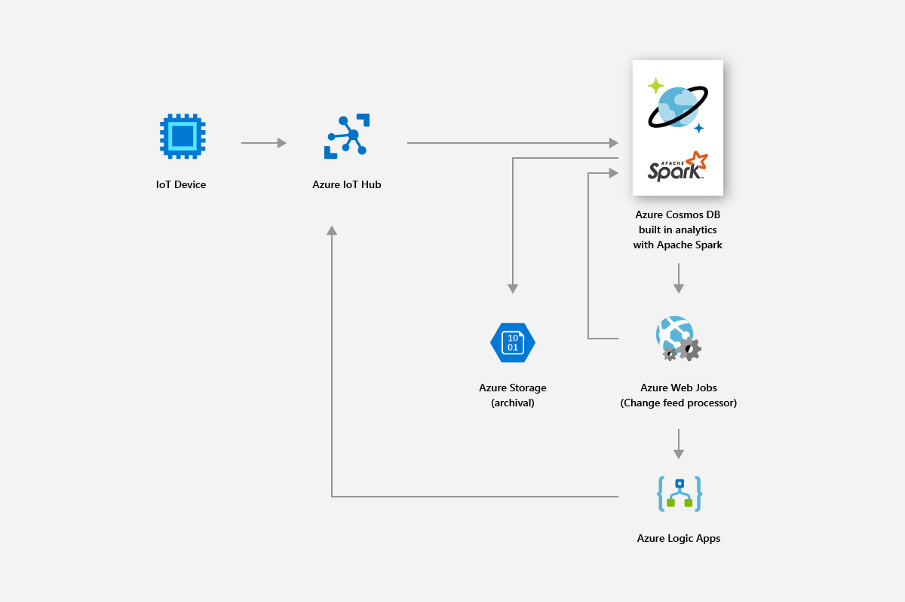

# Built-in operational analytics in Azure Cosmos DB with Apache Spark (preview) 

The built-in support for Apache Spark in Azure Cosmos DB allows you to run analytics from Apache Spark against your data stored in an Azure Cosmos account. It provides the native support for Apache Spark jobs to execute directly on your globally distributed Cosmos databases. With these capabilities, developers, data engineers, and data scientists can use Azure Cosmos DB as a flexible, scalable, and performant data platform to run both **OLTP and OLAP/HTAP** workloads. 

Spark compute is automatically available in all the Azure regions associated with your Azure Cosmos account. Spark jobs use the Azure Cosmos DB's multi-master capability and they can write or query against the local replicas in each region. 

> [!NOTE]
> The built-in support for Apache Spark in Azure Cosmos DB is currently in limited preview. To sign-up for the preview, navigate to [sign-up for the preview page](https://portal.azure.com/?feature.customportal=false#create/Microsoft.DocumentDB). 

The Apache Spark support in Azure Cosmos DB offers the following benefits:

* You can get the fastest time to insight for the geographically distributed users and data.

* You can simplify the architecture of your solution and lower the [Total Cost of Ownership](total-cost-ownership.md) (TCO). The system will have the least number of data processing components and avoids any unnecessary data movement among them.

* Creates a [security](secure-access-to-data.md), [compliance](compliance.md), and auditing boundary that encompasses all the data under management.

* Provides "always on" or [highly available](high-availability.md) end-user analytics that are backed by stringent SLAs.

 
Using the Apache Spark support in Azure Cosmos DB, you can build and deploy solutions such as AI and deep learning models, predictive analytics, recommendations, IoT, customer 360, fraud detection, text sentiment, clickstream analysis. These solutions work directly against your Azure Cosmos DB data.

You can set up batch and streaming ETL job in Azure Cosmos DB, without having to go outside the database service or add additional compute services. You can elastically scale the compute environment when you need to perform ETL job and scale it back down when the job is done.

The Apache Spark support in Azure Cosmos DB offers built-in Machine Learning support in the Apache Spark runtimes. The runtimes include Spark MLLib, Microsoft Machine Learning for Spark, Azure Machine Learning, and Cognitive Services. With these features, data scientists, data engineers, and data analysts can build and operationalize machine learning models directly within Azure Cosmos DB, in a fraction of time and with the low cost.

## Key benefits

### Globally distributed, low latency operational analytics and AI

With Apache Spark on the globally distributed Azure Cosmos database, you can now get quick time-to-insight all around the world. Azure Cosmos DB enables **globally distributed, low latency operational analytics** at elastic scale with three key techniques:

* Since your Azure Cosmos database is globally distributed, all the data is ingested locally where the producers of the data (for example, users) are located. The queries are served against the local replicas closest to both the producers and the consumers of data regardless of where they are located in the world. 

* All your analytical queries are executed directly on the indexed data stored inside the data partitions without requiring any unnecessary data movement. 

* Because Spark is colocated with Azure Cosmos DB, fewer intermediate translations and data movements take place, resulting in a better performance and scalability.

### Unified serverless experience for Apache Spark

As a multi-model database, Azure Cosmos DB now expands its support for OSS APIs by providing a **unified serverless experience for Apache Spark** with key-value, document, graph, column family data models. Different data models are supported using MongoDB, Cassandra, Gremlin, Etcd, and SQL APIs - all operating on the same underlying data. 

With the Apache Spark support in Azure Cosmos DB, you can natively support applications written in Scala, Python, Java, and use several tightly integrated libraries for SQL. These libraries include ([Spark SQL](https://spark.apache.org/sql/)), machine learning (Spark [MLlib](https://spark.apache.org/mllib/)), stream processing ([Spark Structured Streaming](https://spark.apache.org/streaming/)), and graph processing (Spark [GraphFrames]( https://docs.databricks.com/spark/latest/graph-analysis/graphframes/user-guide-python.html)). These tools make it easier to use the Apache Spark for a variety of use cases. You don’t have to deal with managing Spark or Spark clusters. You can use the familiar Apache Spark APIs and **Jupyter notebooks** for analytics and SQL API or any of the OSS NoSQL APIs like Cassandra for transactional processing on the same underlying data at the same time.

### No schema or index management

Unlike traditional analytical databases, with Azure Cosmos DB, data engineers, and data scientists no longer need to deal with cumbersome schema and index management. The database engine in Azure Cosmos DB does not require any explicit schema or index management and it is capable of automatically indexing all the data it ingests to serve the Apache Spark queries quickly. 

### Consistency choices

Since the Apache Spark jobs are executed in the data partitions of your Azure Cosmos database, the queries will get the [five well-defined consistency choices](consistency-levels.md). These consistency models give the flexibility to choose strict consistency to provide the most accurate results for machine learning algorithms without compromising the latency and high availability. 

### Comprehensive SLAs

The Apache Spark jobs will have the Azure Cosmos DB benefits such as industry leading comprehensive [SLAs](https://azure.microsoft.com/support/legal/sla/documentdb/v1_1/) (99.999) without any overhead of managing separate Apache Spark clusters. These SLAs encompass throughput, latency at the 99th percentile, consistency, and high availability. 

### Mixed workloads

The integration of Apache Spark into Azure Cosmos DB bridges the transactional and analytic separation, which has been one of the major customer pain points when building cloud-native applications at global scale. 

## Scenarios for Azure Cosmos DB Spark support

### Retail and consumer goods

You can use Spark support in Azure Cosmos DB to deliver real-time recommendations and offers. You can help customers discover the items they will need with real-time personalization and product recommendations.

* You can use the built-in Machine Learning support provided by the Apache Spark runtime to generate real-time recommendations across the product catalogs.

* You can mine click stream data, purchase data, and customer data to provide targeted recommendations that drive lifetime value.

* Using the Azure Cosmos DB's global distribution feature, high volumes of product data that is spread across regions can be analyzed in milliseconds.

* You can quickly get insights for the geographically distributed users and data. You can improve the promotion conversion rate by serving the right ad to the right user at the right time.

* You can leverage the inbuilt Spark streaming capability to enrich live data by combining it with static customer data. This way you can deliver more personalized and targeted ads in real time and in context with what customers are doing.

The following image shows how Azure Cosmos DB Spark support is used to optimize pricing and promotions:

The following image shows how Azure Cosmos DB Spark support is used in real-time recommendation engine:

### Manufacturing and IoT

Azure Cosmos DB’s in-built analytics platform allows you to enable real-time analysis of IoT data from millions of devices at global scale. You can make modern innovations like predicting weather patterns, predictive analysis, and energy optimizations.

* By using Azure Cosmos DB, you can mine data such as real-time asset metrics and weather factors, then apply smart grid analytics to optimize performance of connected devices in the field. Smart grid analytics is the key to control operating costs, to improve grid reliability, and deliver personalized energy services to consumers.

The following image shows how Azure Cosmos DB’s Spark support is used to read metrics from IoT devices and apply smart grid analytics:

### Predictive maintenance

* Maintaining assets such as compressors that are used in small drilling rigs to deep-water platforms is a complex endeavor. These assets are located across the globe and generate petabytes of data. By using Azure Cosmos DB, you can build an end-to-end predictive data pipeline that uses Spark streaming to process large amounts of sensor telemetry, store asset parts, and sensor mappings data.

* You can build and deploy machine learning models to predict asset failures before they happen and issue maintenance work orders before the failure occurs.

The following image shows how Azure Cosmos DB’s Spark support is used to build a predictive maintenance system:

The following image shows how Azure Cosmos DB’s Spark support is used to build a real-time vehicle diagnostic system:

### Gaming

* With built-in Spark support, Azure Cosmos DB enables you to easily build, scale, and deploy advanced analytics and machine learning models in minutes to build the best gaming experience possible.

* You can analyze player, purchase, and behavioral data to create relevant personalized offers to attain high conversion rates.

* Using Spark machine learning, you can analyze and gain insights on game telemetry data. You can diagnose and prevent slow load times and in-game issues.

The following image shows how Azure Cosmos DB’s Spark support is used in gaming analytics:

## Built-in Jupyter notebooks support

Azure Cosmos DB supports built-in Jupyter notebooks for all APIs such as Cassandra, MongoDB, SQL, Gremlin, and Table. The Jupyter notebooks run within the Azure Cosmos accounts and they enhance the developer experience. The built-in notebook support for all Azure Cosmos DB APIs and data models allows you to interactively run queries. You can also execute machine learning models, and analyze the data stored in your Azure Cosmos databases. By using the Jupyter notebook experience, you can analyze the stored data, build and train machine learning models, and perform inferencing on the data in the Azure portal as shown in the following image:

## Next steps

* To learn about the benefits of Azure Cosmos DB, see the [overview](introduction.md) article.
* [Get started with the Azure Cosmos DB API for MongoDB](mongodb-introduction.md)
* [Get started with the Azure Cosmos DB Cassandra API](cassandra-introduction.md)
* [Get started with the Azure Cosmos DB Gremlin API](graph-introduction.md)
* [Get started with the Azure Cosmos DB Table API](table-introduction.md)

