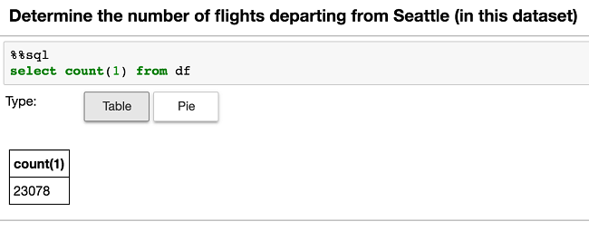
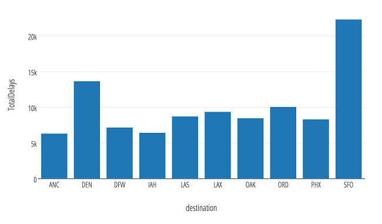
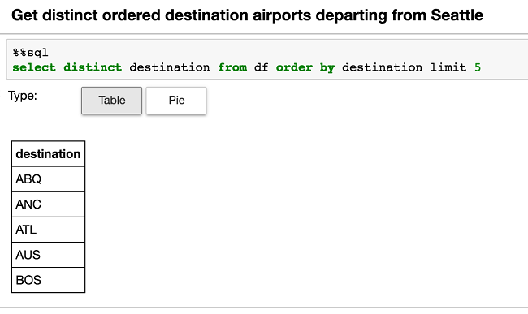

# Accelerate real-time big-data analytics with the Spark to Azure Cosmos DB connector

The Spark to Azure Cosmos DB connector enables Cosmos DB to act as an input source or output sink for Apache Spark jobs. Connecting [Spark](http://spark.apache.org/) to [Azure Cosmos DB](https://azure.microsoft.com/services/cosmos-db/) accelerates your ability to solve fast-moving data science problems where you can use Cosmos DB to quickly persist and query data. The Spark to Azure Cosmos DB connector efficiently utilizes the native Cosmos DB managed indexes. The indexes enable updateable columns when you perform analytics and push-down predicate filtering against fast-changing globally distributed data, which range from Internet of Things (IoT) to data science and analytics scenarios.

For working with Spark GraphX and the Gremlin graph APIs of Azure Cosmos DB, see [Perform graph analytics using Spark and Apache TinkerPop Gremlin](spark-connector-graph.md).

## Download

To get started, download the Spark to Azure Cosmos DB connector (preview) from the [azure-cosmosdb-spark](https://github.com/Azure/azure-cosmosdb-spark/) repository on GitHub.

## Connector components

The connector utilizes the following components:

* [Azure Cosmos DB](http://documentdb.com) enables customers to provision and elastically scale both throughput and storage across any number of geographical regions. The service offers:
   * Turn key [global distribution](distribute-data-globally.md) and horizontal scale
   * Guaranteed single digit latencies at the 99th percentile
   * [Multiple well-defined consistency models](consistency-levels.md)
   * Guaranteed high availability with multi-homing capabilities

   All features are backed by industry-leading, comprehensive [service level agreements](https://azure.microsoft.com/support/legal/sla/cosmos-db) (SLAs).

* [Apache Spark](http://spark.apache.org/) is a powerful open source processing engine that's built around speed, ease of use, and sophisticated analytics.

* [Apache Spark on Azure HDInsight](../hdinsight/hdinsight-apache-spark-jupyter-spark-sql.md) so that you can deploy Apache Spark in the cloud for mission-critical deployments by using [Azure HDInsight](https://azure.microsoft.com/services/hdinsight/apache-spark/).

Officially supported versions:

| Component | Version |
|---------|-------|
|Apache Spark|2.0+|
| Scala| 2.11|
| Azure DocumentDB Java SDK | 1.10.0 |

This article helps you run some simple samples by using Python (via pyDocumentDB) and the Scala interfaces.

There are two approaches to connect Apache Spark and Azure Cosmos DB:
- Use pyDocumentDB via the [Azure DocumentDB Python SDK](https://github.com/Azure/azure-documentdb-python).
- Create a Java-based Spark to Cosmos DB connector by utilizing the [Azure DocumentDB Java SDK](https://github.com/Azure/azure-documentdb-java).

## pyDocumentDB implementation
The current [pyDocumentDB SDK](https://github.com/Azure/azure-documentdb-python) enables you to connect Spark to Cosmos DB as shown in the following diagram:


### Data flow of the pyDocumentDB implementation

The data flow is as follows:

1. The Spark master node connects to the Cosmos DB gateway node via pyDocumentDB. A user specifies only the Spark and Cosmos DB connections. Connections to the respective master and gateway nodes are transparent to the user.
2. The gateway node makes the query against Cosmos DB where the query subsequently runs against the collection's partitions in the data nodes. The response for those queries is sent back to the gateway node, and that result set is returned to the Spark master node.
3. Subsequent queries (for example, against a Spark DataFrame) are sent to the Spark worker nodes for processing.

Communication between Spark and Cosmos DB is limited to the Spark master node and Cosmos DB gateway nodes.  The queries go as fast as the transport layer between these two nodes allows.

### Install pyDocumentDB
You can install pyDocumentDB on your driver node by using **pip**, for example:

```
pip install pyDocumentDB
```


### Connect Spark to Cosmos DB via pyDocumentDB
The simplicity of the communication transport makes execution of a query from Spark to Cosmos DB by using pyDocumentDB relatively simple.

The following code snippet shows how to use pyDocumentDB in a Spark context.

```
# Import Necessary Libraries
import pydocumentdb
from pydocumentdb import document_client
from pydocumentdb import documents
import datetime

# Configuring the connection policy (allowing for endpoint discovery)
connectionPolicy = documents.ConnectionPolicy()
connectionPolicy.EnableEndpointDiscovery
connectionPolicy.PreferredLocations = ["Central US", "East US 2", "Southeast Asia", "Western Europe","Canada Central"]


# Set keys to connect to Cosmos DB
masterKey = 'le1n99i1w5l7uvokJs3RT5ZAH8dc3ql7lx2CG0h0kK4lVWPkQnwpRLyAN0nwS1z4Cyd1lJgvGUfMWR3v8vkXKA=='
host = 'https://doctorwho.documents.azure.com:443/'
client = document_client.DocumentClient(host, {'masterKey': masterKey}, connectionPolicy)
```

As noted in the code snippet:

* The Cosmos DB Python SDK (`pyDocumentDB`) contains the all the necessary connection parameters. For example, the preferred locations parameter chooses the read replica and priority order.
*  Import the necessary libraries and configure your **masterKey** and **host** to create the Cosmos DB *client* (**pydocumentdb.document_client**).


### Execute Spark Queries via pyDocumentDB
The following examples use the Cosmos DB instance that was created in the previous snippet by using the specified read-only keys. The following code snippet connects to the **airports.codes** collection in the DoctorWho account as specified earlier and runs a query to extract the airport cities in Washington state.

```
# Configure Database and Collections
databaseId = 'airports'
collectionId = 'codes'

# Configurations the Cosmos DB client will use to connect to the database and collection
dbLink = 'dbs/' + databaseId
collLink = dbLink + '/colls/' + collectionId

# Set query parameter
querystr = "SELECT c.City FROM c WHERE c.State='WA'"

# Query documents
query = client.QueryDocuments(collLink, querystr, options=None, partition_key=None)

# Query for partitioned collections
# query = client.QueryDocuments(collLink, query, options= { 'enableCrossPartitionQuery': True }, partition_key=None)

# Push into list `elements`
elements = list(query)
```

After the query has been executed via **query**, the result is a **query_iterable.QueryIterable** that is converted to a Python list. A Python list can be easily converted to a Spark DataFrame by using the following code:

```
# Create `df` Spark DataFrame from `elements` Python list
df = spark.createDataFrame(elements)
```

### Why use the pyDocumentDB to connect Spark to Cosmos DB?
Connecting Spark to Cosmos DB by using pyDocumentDB is typically for scenarios where:

* You want to use Python.
* You are returning a relatively small result set from Cosmos DB to Spark. Note that the underlying dataset in Cosmos DB can be quite large. You are applying filters, that is, running predicate filters, against your Cosmos DB source.  

## Spark to Cosmos DB connector

The Spark to Cosmos DB connector utilizes the [Azure DocumentDB Java SDK](https://github.com/Azure/azure-documentdb-java) and moves data between the Spark worker nodes and Cosmos DB as shown in the following diagram:


The data flow is as follows:

1. The Spark master node connects to the Cosmos DB gateway node to obtain the partition map. A user specifies only the Spark and Cosmos DB connections. Connections to the respective master and gateway nodes are transparent to the user.
2. This information is provided back to the Spark master node.  At this point, you should be able to parse the query to determine the partitions and their locations in Cosmos DB that you need to access.
3. This information is transmitted to the Spark worker nodes.
4. The Spark worker nodes connect to the Cosmos DB partitions directly to extract the data and return the data to the Spark partitions in the Spark worker nodes.

Communication between Spark and Cosmos DB is significantly faster because the data movement is between the Spark worker nodes and the Cosmos DB data nodes (partitions).

### Build the Spark to Cosmos DB connector
Currently, the connector project uses maven. To build the connector without dependencies, you can run:
```
mvn clean package
```
You can also download the latest versions of the JAR from the *releases* folder.

### Include the Azure Cosmos DB Spark JAR
Before you execute any code, you need to include the Azure Cosmos DB Spark JAR.  If you are using the **spark-shell**, then you can include the JAR by using the **--jars** option.  

```
spark-shell --master $master --jars /$location/azure-cosmosdb-spark-0.0.3-jar-with-dependencies.jar
```

If you want to execute the JAR without dependencies, use the following code:

```
spark-shell --master $master --jars /$location/azure-cosmosdb-spark-0.0.3.jar,/$location/azure-documentdb-1.10.0.jar
```

If you are using a notebook service such as Azure HDInsight Jupyter notebook service, you can use the **spark magic** commands:

```
%%configure
{ "jars": ["wasb:///example/jars/azure-documentdb-1.10.0.jar","wasb:///example/jars/azure-cosmosdb-spark-0.0.3.jar"],
  "conf": {
    "spark.jars.excludes": "org.scala-lang:scala-reflect"
   }
}
```

The **jars** command enables you to include the two JARs that are needed for **azure-cosmosdb-spark** (itself and the Azure DocumentDB Java SDK) and exclude **scala-reflect** so that it does not interfere with the Livy calls (Jupyter notebook > Livy > Spark).

### Connect Spark to Cosmos DB using the connector
Although the communication transport is a little more complicated, executing a query from Spark to Cosmos DB by using the connector is significantly faster.

The following code snippet shows how to use the connector in a Spark context.

```
// Import Necessary Libraries
import org.joda.time._
import org.joda.time.format._
import com.microsoft.azure.cosmosdb.spark.schema._
import com.microsoft.azure.cosmosdb.spark._
import com.microsoft.azure.cosmosdb.spark.config.Config

// Configure connection to your collection
val readConfig2 = Config(Map("Endpoint" -> "https://doctorwho.documents.azure.com:443/",
"Masterkey" -> "le1n99i1w5l7uvokJs3RT5ZAH8dc3ql7lx2CG0h0kK4lVWPkQnwpRLyAN0nwS1z4Cyd1lJgvGUfMWR3v8vkXKA==",
"Database" -> "DepartureDelays",
"preferredRegions" -> "Central US;East US2;",
"Collection" -> "flights_pcoll",
"SamplingRatio" -> "1.0"))

// Create collection connection
val coll = spark.sqlContext.read.cosmosDB(readConfig2)
coll.createOrReplaceTempView("c")
```

As noted in the code snippet:

- **azure-cosmosdb-spark** contains the all the necessary connection parameters, which include the preferred locations. For example, you can choose the read replica and priority order.
- Just import the necessary libraries and configure your masterKey and host to create the Cosmos DB client.

### Execute Spark queries via the connector

The following example uses the Cosmos DB instance that was created in the previous snippet by using the specified read-only keys. The following code snippet connects to the DepartureDelays.flights_pcoll collection (in the DoctorWho account as specified earlier) and runs a query to extract the flight delay information of flights that are departing from Seattle.

```
// Queries
var query = "SELECT c.date, c.delay, c.distance, c.origin, c.destination FROM c WHERE c.origin = 'SEA'"
val df = spark.sql(query)

// Run DF query (count)
df.count()

// Run DF query (show)
df.show()
```

### Why use the Spark to Cosmos DB connector implementation?

Connecting Spark to Cosmos DB by using the connector is typically for scenarios where:

* You want to use Scala and update it to include a Python wrapper as noted in [Issue 3: Add Python wrapper and examples](https://github.com/Azure/azure-cosmosdb-spark/issues/3).
* You have a large amount of data to transfer between Apache Spark and Cosmos DB.

To give you an idea of the query performance difference, see the [Query Test Runs wiki](https://github.com/Azure/azure-cosmosdb-spark/wiki/Query-Test-Runs).

## Distributed aggregation example
This section provides some examples of how you can do distributed aggregations and analytics by using Apache Spark and Azure Cosmos DB together. Azure Cosmos DB already supports aggregations, which is discussed in the [Planet scale aggregates with Azure Cosmos DB blog](https://azure.microsoft.com/blog/planet-scale-aggregates-with-azure-documentdb/). Here is how you can take it to the next level with Apache Spark.

Note that these aggregations are in reference to the [Spark to Cosmos DB Connector notebook](https://github.com/Azure/azure-cosmosdb-spark/blob/master/samples/notebooks/Spark-to-DocumentDB_Connector.ipynb).

### Connect to flights sample data
These aggregation examples access some flight performance data that's stored in our **DoctorWho** Cosmos DB database. To connect to it, you need to utilize the following code snippet:

```
// Import Spark to Cosmos DB connector
import com.microsoft.azure.cosmosdb.spark.schema._
import com.microsoft.azure.cosmosdb.spark._
import com.microsoft.azure.cosmosdb.spark.config.Config

// Connect to Cosmos DB Database
val readConfig2 = Config(Map("Endpoint" -> "https://doctorwho.documents.azure.com:443/",
"Masterkey" -> "le1n99i1w5l7uvokJs3RT5ZAH8dc3ql7lx2CG0h0kK4lVWPkQnwpRLyAN0nwS1z4Cyd1lJgvGUfMWR3v8vkXKA==",
"Database" -> "DepartureDelays",
"preferredRegions" -> "Central US;East US 2;",
"Collection" -> "flights_pcoll",
"SamplingRatio" -> "1.0"))

// Create collection connection
val coll = spark.sqlContext.read.cosmosDB(readConfig2)
coll.createOrReplaceTempView("c")
```

With this snippet, we are also going to run a base query that transfers the filtered set of data from Cosmos DB to Spark where the latter can perform distributed aggregates. In this case, we are asking for flights that depart from Seattle (SEA).

```
// Run, get row count, and time query
val originSEA = spark.sql("SELECT c.date, c.delay, c.distance, c.origin, c.destination FROM c WHERE c.origin = 'SEA'")
originSEA.createOrReplaceTempView("originSEA")
```

The following results were generated by running the queries from the Jupyter notebook service.  Note that all the code snippets are generic and not specific to any service.

### Running LIMIT and COUNT queries
Just like you're used to in SQL/Spark SQL, let's start off with a **LIMIT** query:


The next query is a simple and fast **COUNT** query:



### GROUP BY query
In this next set, we can easily run **GROUP BY** queries against our Cosmos DB database:

```
select destination, sum(delay) as TotalDelays
from originSEA
group by destination
order by sum(delay) desc limit 10
```



### DISTINCT, ORDER BY query
And here is a **DISTINCT, ORDER BY** query:



### Continue the flight data analysis
You can use the following example queries to continue analysis of the flight data:

#### Top 5 delayed destinations (cities) departing from Seattle
```
select destination, sum(delay)
from originSEA
where delay < 0
group by destination
order by sum(delay) limit 5
```


#### Calculate median delays by destination cities departing from Seattle
```
select destination, percentile_approx(delay, 0.5) as median_delay
from originSEA
where delay < 0
group by destination
order by percentile_approx(delay, 0.5)
```


## Next steps

If you haven't already, download the Spark to Cosmos DB connector from the [azure-cosmosdb-spark](https://github.com/Azure/azure-cosmosdb-spark) GitHub repository and explore the additional resources in the repo:

* [Distributed Aggregations Examples](https://github.com/Azure/azure-cosmosdb-spark/wiki/Aggregations-Examples)
* [Sample Scripts and Notebooks](https://github.com/Azure/azure-cosmosdb-spark/tree/master/samples)

You might also want to review the [Apache Spark SQL, DataFrames, and Datasets Guide](http://spark.apache.org/docs/latest/sql-programming-guide.html) and the [Apache Spark on Azure HDInsight](../hdinsight/hdinsight-apache-spark-jupyter-spark-sql.md) article.
