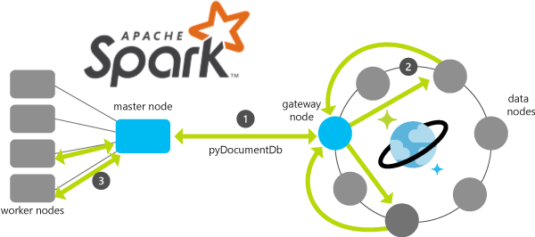
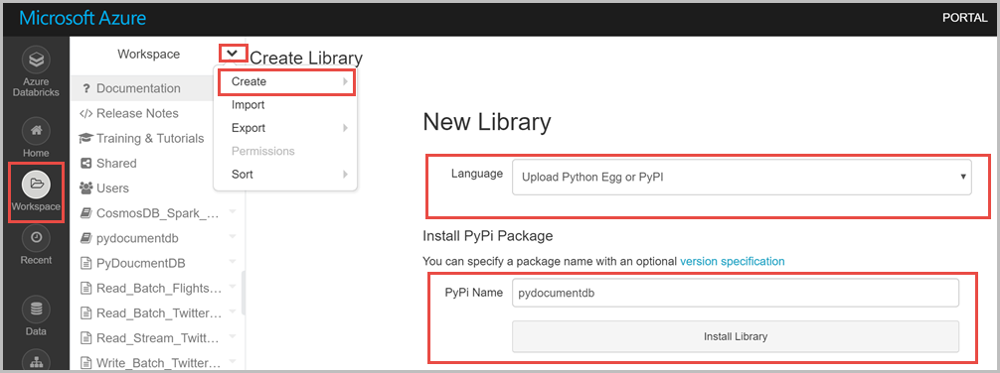
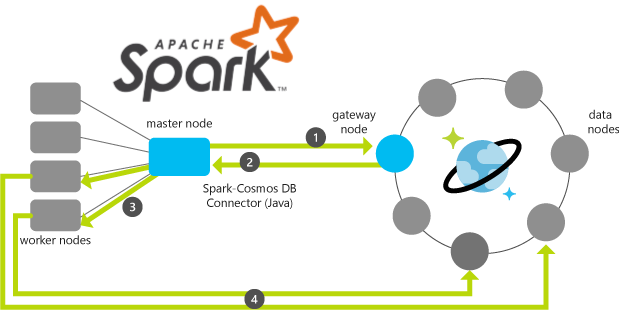

# Accelerate big data analytics by using the Apache Spark to Azure Cosmos DB connector
 
The Apache Spark to Azure Cosmos DB connector enables Azure Cosmos DB to be an input or output for Apache Spark jobs. Connecting [Spark](http://spark.apache.org/) to [Azure Cosmos DB](https://azure.microsoft.com/services/cosmos-db/) accelerates your ability to solve fast-moving data science problems. You can use Azure Cosmos DB to quickly persist and query data. The connector efficiently uses the native Azure Cosmos DB managed indexes. The indexes enable updateable columns when you perform analytics and push-down predicate filtering against fast-changing, globally distributed data. This kind of data can range from Internet of Things (IoT) to data science and analytics scenarios.

## Connector components

The Spark to Azure Cosmos DB connector has the following components:

* [Azure Cosmos DB](http://documentdb.com) enables you to provision and elastically scale both throughput and storage, across any number of geographical regions.  

* [Apache Spark](http://spark.apache.org/) is a powerful open source processing engine, built around speed, ease of use, and sophisticated analytics.  

* [Apache Spark cluster on Azure Databricks](https://docs.azuredatabricks.net/getting-started/index.html) enables you to run Spark jobs on the Spark cluster.

## Connect Apache Spark to Azure Cosmos DB

There are two approaches to connect Apache Spark and Azure Cosmos DB:

- [Azure Cosmos DB SQL Python SDK](https://github.com/Azure/azure-documentdb-python), a Python-based connector, which is also referred to as *pyDocumentDB*.  

- [Azure Cosmos DB SQL Java SDK](https://github.com/Azure/azure-documentdb-java), a Java-based connector.


**Supported versions**

| Component | Version |
|---------|-------|
|Apache Spark| 2.1.x, 2.2.x, 2.3.x |
| Scala|2.11|
| Azure Databricks runtime version | > 3.4 |
| Azure Cosmos DB SQL Java SDK | 1.16.2 |

## Connect by using Python or pyDocumentDB SDK

The following diagram shows the architecture of the pyDocumentDB SDK implementation:




### Data flow

Data flow of the pyDocumentDB implementation is as follows:

* The master node of Spark connects to the Azure Cosmos DB gateway node through pyDocumentDB. You specify the Spark and Azure Cosmos DB connections only. Connections to the respective master and gateway nodes are transparent.  

* The gateway node makes the query against Azure Cosmos DB, where the query subsequently runs against the collection's partitions in the data nodes. The response for those queries is sent back to the gateway node, and that result set is returned to the Spark master node.  

* Subsequent queries (for example, against a Spark data frame) are sent to the Spark worker nodes for processing.  

Communication between Spark and Azure Cosmos DB is limited to the Spark master node and Azure Cosmos DB gateway nodes. The queries go as fast as the transport layer between these two nodes allows.

Run the following steps to connect Spark to Azure Cosmos DB by using pyDocumentDB SDK:

1. Create an [Azure Databricks workspace](../azure-databricks/quickstart-create-databricks-workspace-portal.md#create-an-azure-databricks-workspace) and a [Spark cluster](../azure-databricks/quickstart-create-databricks-workspace-portal.md#create-a-spark-cluster-in-databricks). Azure Databricks runtime version 4.0 includes Apache Spark 2.3.0 and Scala 2.11 within that workspace.  

2. When the cluster is created and is running, go to **Workspace** > **Create** > **Library**.  
3. From the New Library dialog box, choose **Upload Python Egg or PyPi** as the source. Provide **pydocumentdb** as the name, and select **Install Library**. pyDocumentdb SDK is already published to the pip packages, so you can find and install it. 

   

4. After the library is installed, attach it to the cluster you created earlier.  

5. Go to **Workspace** > **Create** > **Notebook**.  

6. In the **Create Notebook** dialog box, enter a user-friendly name, and choose **Python** as the language. From the drop-down list, select the cluster that you created earlier, and select **Create**.  

7. Run a few Spark queries by using the flights sample data hosted in the "doctorwho" Azure Cosmos DB account. (This account is publicly accessible.) The [azure-cosmosdb-spark](https://github.com/Azure/azure-cosmosdb-spark/tree/master) GitHub repository hosts the HTML version of the notebook. Download the repository files, and go to `\samples\Documentation_Samples\Read_Batch_PyDocumentDB.html`. You can import the notebook to your Azure Databricks account and run it. The following section explains the functionality of the code blocks in detail.

The following code snippet shows how to import the pyDocumentDB SDK, and run a query in the Spark context. As noted in the code snippet, the pyDocumentDB SDK contains the connection parameters required to connect to the Azure Cosmos DB account. It imports the required libraries, and configures the master key and host, to create the Azure Cosmos DB client (pydocumentdb.document_client).


```python
# Import Necessary Libraries
import pydocumentdb
from pydocumentdb import document_client
from pydocumentdb import documents
import datetime

# Configuring the connection policy (allowing for endpoint discovery)
connectionPolicy = documents.ConnectionPolicy()
connectionPolicy.EnableEndpointDiscovery
connectionPolicy.PreferredLocations = ["Central US", "East US 2", "Southeast Asia", "Western Europe","Canada Central"]

# Set keys to connect to Azure Cosmos DB
masterKey = 'le1n99i1w5l7uvokJs3RT5ZAH8dc3ql7lx2CG0h0kK4lVWPkQnwpRLyAN0nwS1z4Cyd1lJgvGUfMWR3v8vkXKA=='
host = 'https://doctorwho.documents.azure.com:443/'
client = document_client.DocumentClient(host, {'masterKey': masterKey}, connectionPolicy)

```

Next, you can run queries. The following code snippet connects to the airports.codes collection in the doctorwho account, and runs a query to extract the airport cities in Washington state. 

```python
# Configure Database and Collections
databaseId = 'airports'
collectionId = 'codes'

# Configurations the Azure Cosmos DB client will use to connect to the database and collection
dbLink = 'dbs/' + databaseId
collLink = dbLink + '/colls/' + collectionId

# Set query parameter
querystr = "SELECT c.City FROM c WHERE c.State='WA'"

```

After you run the query, the result is a "query_iterable.QueryIterable" that is converted to a Python list. This list, in turn, is converted to a Spark data frame. 

```python
# Query documents
query = client.QueryDocuments(collLink, querystr, options=None, partition_key=None)

# Query for partitioned collections
# query = client.QueryDocuments(collLink, query, options= { 'enableCrossPartitionQuery': True }, partition_key=None)

# Create `df` Spark DataFrame from `elements` Python list
df = spark.createDataFrame(list(query))

# Show data
df.show()
```

### Considerations when using pyDocumentDB SDK
Connecting Spark to Azure Cosmos DB by using pyDocumentDB SDK is recommended in the following scenarios:

* You want to use Python.  

* You are returning a relatively small result set from Azure Cosmos DB to Spark. Note that the underlying dataset in Azure Cosmos DB can be quite large, and you are applying filters or running predicate filters against your Azure Cosmos DB source.

## Connect by using the Java SDK

The following diagram shows the architecture of Azure Cosmos DB SQL Java SDK implementation, and data moves between the Spark worker nodes:



### Data flow

The data flow of the Java SDK implementation is as follows:

* The Spark master node connects to the Azure Cosmos DB gateway node to obtain the partition map. You specify only the Spark and Azure Cosmos DB connections. Connections to the respective master and gateway nodes are transparent.  

* This information is provided back to the Spark master node. At this point, you should be able to parse the query to determine the partitions and their locations in Azure Cosmos DB that you need to access.  

* This information is transmitted to the Spark worker nodes.  

* The Spark worker nodes connect to the Azure Cosmos DB partitions directly, to extract and return the data to the Spark partitions in the worker nodes.  

Communication between Spark and Azure Cosmos DB is significantly faster, because the data movement is between the Spark worker nodes and the Azure Cosmos DB data nodes (partitions). In this example, you send some sample Twitter data to the Azure Cosmos DB account, and run Spark queries by using that data. Use the following steps to write sample Twitter data to Azure Cosmos DB:

1. Create an [Azure Cosmos DB SQL API account](create-sql-api-dotnet.md#create-a-database-account) and [add a collection](create-sql-api-dotnet.md#add-a-collection) to the account.  

2. Download the [TwitterCosmosDBFeed](https://github.com/tknandu/TwitterCosmosDBFeed) sample from GitHub. You use this feed to write sample Twitter data to Azure Cosmos DB.  

3. Open a command prompt, and install Tweepy and pyDocumentdb modules by running the following commands:

   ```bash
   pip install tweepy==3.3.0
   pip install pyDocumentDB
   ```

4. Extract the contents of the Twitter feed sample and open the config.py file. Update the masterKey, host, databaseId, collectionId, and preferredLocations values.  

5. Go to `http://apps.twitter.com/`, and register the Twitter feed application. After choosing a name for your application, you will be provided with a **consumer key, consumer secret, access token and access token secret**. Copy these values and update them in config.py file to provide the Twitter feed application programmatic access to Twitter.   

6. Save the config.py file. Open a command prompt, and run the Python application by using the following command:

   ```bash
   Python driver.py
   ```

7. Go to the Azure Cosmos DB collection in the portal, and verify that the Twitter data is written to the collection.

### Find and attach the Java SDK to the Spark cluster

1. Create an [Azure Databricks workspace](../azure-databricks/quickstart-create-databricks-workspace-portal.md#create-an-azure-databricks-workspace) and a [Spark cluster](../azure-databricks/quickstart-create-databricks-workspace-portal.md#create-a-spark-cluster-in-databricks). Azure Databricks runtime version 4.0 includes Apache Spark 2.3.0 and Scala 2.11 within that workspace.  

2. When the cluster is created and is running, go to **Workspace** > **Create** > **Library**.  

3. From the **New Library** dialog box, choose **Maven Coordinate** as the source. Provide the coordinate value **com.microsoft.azure:azure-cosmosdb-spark_2.3.0_2.11:1.2.0**, and select **Create Library**. The Maven dependencies are resolved, and the package is added to your workspace. In the preceding Maven coordinate format, 2.3.0 represents the Spark version, 2.11 represents the Scala version, and 1.2.0 represents the Azure Cosmos DB connector version. 

4. After the library is installed, attach it to the cluster you created earlier. 

This article demonstrates the use of the Spark connector Java SDK in the following scenarios:

* Read Twitter data from Azure Cosmos DB.  

* Read Twitter data that is streaming to Azure Cosmos DB.  

* Write Twitter data to Azure Cosmos DB. 

### Read Twitter data from Azure Cosmos DB
 
In this section, you run Spark queries to read a batch of Twitter data from Azure Cosmos DB. The [azure-cosmosdb-spark](https://github.com/Azure/azure-cosmosdb-spark/tree/master) GitHub repository hosts the HTML version of the notebook. Download the repository files and go to `\samples\Documentation_Samples\Read_Batch_Twitter_Data.html`. You can import the notebook to your Azure Databricks account, and update the account URI, master key, database, and collection names. You can run the notebook, or create it as follows:

1. Go to your Azure Databricks account, and select **Workspace** > **Create** > **Notebook**. 

2. In the **Create Notebook** dialog box, enter a user-friendly name, and choose **Python** as the language. From the drop-down list, select the cluster that you created earlier, and select **Create**.  

3. Update the endpoint, master key, database, and collection values to connect to the account. Read tweets by using the spark.read.format() command.

   ```python
   # Configuration Map
   tweetsConfig = {
   "Endpoint" : "<Your Azure Cosmos DB endpoint>",
   "Masterkey" : "<Primary key of your Azure Cosmos DB account>",
   "Database" : "<Your Azure Cosmos DB database name>",
   "Collection" : "<Your Azure Cosmos DB collection name>", 
   "preferredRegions" : "East US",
   "SamplingRatio" : "1.0",
   "schema_samplesize" : "200000",
   "query_custom" : "SELECT c.id, c.created_at, c.user.screen_name, c.user.lang, c.user.location, c.text, c.retweet_count, c.entities.hashtags, c.entities.user_mentions, c.favorited, c.source FROM c"
   }
   # Read Tweets
   tweets = spark.read.format("com.microsoft.azure.cosmosdb.spark").options(**tweetsConfig).load()
   tweets.createOrReplaceTempView("tweets")
   #tweets.cache()

   ```

4. Run the query to get the count of tweets by different hashtags from the cached data. 

   ```python
   %sql
   select hashtags.text, count(distinct id) as tweets
   from (
   select 
     explode(hashtags) as hashtags,
     id
   from tweets
   ) a
   group by hashtags.text
   order by tweets desc
   limit 10
   ```

Java SDK supports the following values for configuration mapping: 

|Setting  |Description  |
|---------|---------|
|query_maxdegreeofparallelism  | Sets the number of concurrent operations run at the client side during parallel query execution. If it is set to a value that is greater than 0, it limits the number of concurrent operations to the assigned value. If it is set to less than 0, the system automatically decides the number of concurrent operations to run. As the connector maps each collection partition with an executor, this value won't have any effect on the reading operation.        |
|query_maxbuffereditemcount     |    Sets the maximum number of items that can be buffered at the client side during parallel query execution. If it is set to a value that is greater than 0, it limits the number of buffered items to the assigned value. If it is set to less than 0, the system automatically decides the number of items to buffer.     |
|query_enablescan    |   Sets the option to enable scans on the queries that couldn't be served because indexing was opted out on the requested paths.       |
|query_disableruperminuteusage  |  Disables request units (RUs)/minute capacity to serve the query, if regular provisioned RUs/second is exhausted.       |
|query_emitverbosetraces   |   Sets the option to allow queries to emit out verbose traces for investigation.      |
|query_pagesize  |   Sets the size of the query result page for each query request. To optimize throughput, use a large page size to reduce the number of round trips to fetch results.      |
|query_custom  |  Sets the Azure Cosmos DB query to override the default query when fetching data from Azure Cosmos DB. Note that when you provide this value, it is used in place of a query with pushed down predicates as well.     |

Depending on the scenario, you should use different configuration values to optimize the performance and throughput. Note that the configuration key is currently case-insensitive, and the configuration value is always a string.

### Read Twitter data that is streaming to Azure Cosmos DB

In this section, you run Spark queries to read a change feed of streaming Twitter data. While you run the queries in this section, make sure that your Twitter feed app is running and pumping data to Azure Cosmos DB. The [azure-cosmosdb-spark](https://github.com/Azure/azure-cosmosdb-spark/tree/master) GitHub repository hosts the HTML version of the notebook. Download the repository files, and go to `\samples\Documentation_Samples\Read_Stream_Twitter_Data.html`. You can import the notebook to your Azure Databricks account, and update the account URI, master key, database, and collection names. You can run the notebook, or create it as follows:

1. Go to your Azure Databricks account, and select **Workspace** > **Create** > **Notebook**.  

2. In the **Create Notebook** dialog box, enter a user-friendly name, and choose **Scala** as the language. From the drop-down list, select the cluster that you created earlier, and select **Create**.  

3. Update the endpoint, master key, database, and collection values to connect to the account.

   ```scala
   // This script does the following:
   // - creates a structured stream from a Twitter feed CosmosDB collection (on top of change feed)
   // - get the count of tweets
   import com.microsoft.azure.cosmosdb.spark._
   import com.microsoft.azure.cosmosdb.spark.schema._
   import com.microsoft.azure.cosmosdb.spark.config.Config
   import org.codehaus.jackson.map.ObjectMapper
   import com.microsoft.azure.cosmosdb.spark.streaming._
   import java.time._

   val sourceConfigMap = Map(
   "Endpoint" -> "<Your Azure Cosmos DB endpoint>",
   "Masterkey" -> "<Primary key of your Azure Cosmos DB account>",
   "Database" -> "<Your Azure Cosmos DB database name>",
   "Collection" -> "<Your Azure Cosmos DB collection name>", 
   "ConnectionMode" -> "Gateway",
   "ChangeFeedCheckpointLocation" -> "/tmp",
   "changefeedqueryname" -> "Streaming Query from Cosmos DB Change Feed Internal Count")
   ```
4. Start reading the change feed as a stream by using the spark.readStream.format() command:

   ```scala
   var streamData = spark.readStream.format(classOf[CosmosDBSourceProvider].getName).options(sourceConfigMap).load()
   ```
5. Start streaming the query to your console:

   ```scala
   //**RUN THE ABOVE FIRST AND KEEP BELOW IN SEPARATE CELL
   val query = streamData.withColumn("countcol", streamData.col("id").substr(0,0)).groupBy("countcol").count().writeStream.outputMode("complete").format("console").start()
   ```

Java SDK supports the following values for configuration mapping:

|Setting  |Description  |
|---------|---------|
|readchangefeed   |  Indicates that the collection content is fetched from CosmosDB Change Feed. The default value is false.       |
|changefeedqueryname |   A custom string to identify the query. The connector keeps track of the collection continuation tokens for different change feed queries separately. If readchangefeed is true, this is a required configuration that cannot take empty value.      |
|changefeedcheckpointlocation  |   A path to local file storage to persist continuation tokens in case of node failures.      |
|changefeedstartfromthebeginning  |  Sets whether change feed should start from the beginning (true) or from the current point (false). By default, it starts from the current (false).       |
|rollingchangefeed  |   A Boolean value indicating whether the change feed should be from the last query. The default value is false, which means the changes are counted from the first read of the collection.      |
|changefeedusenexttoken  |   A Boolean value to support processing failure scenarios. It indicates that the current change feed batch has been handled gracefully. The Resiliant Distributed Dataset should use the next continuation tokens to get the subsequent batch of changes.      |
| InferStreamSchema | A Boolean value that indicates whether the schema of the streaming data should be sampled at the start of streaming. By default, this value is set to true. If this parameter is set to true and the streaming data’s schema changes after the data is sampled, newly added properties will be dropped in the streaming data frame. <br/><br/> If you want the streaming data frame to be schema agnostic, set this parameter to false. In this mode, the body of the documents read from the Azure Cosmos DB change feed are wrapped into a body property. This property is in the resultant streaming data frame, aside from system property values.
 |

### Connection settings

Java SDK supports the following connection settings:

|Setting  |Description  |
|---------|---------|
|connectionmode   |  Sets the connection mode that the internal DocumentClient should use to communicate with Azure Cosmos DB. Allowed values are **DirectHttps** (default value) and **Gateway**. The DirectHttps connection mode routes the requests directly to the CosmosDB partitions and provides some latency advantage.       |
|connectionmaxpoolsize   |  Sets the value of connection pool size that is used by internal DocumentClient. The default value is 100.       |
|connectionidletimeout  |  Sets the timeout value, in seconds, for idle connections. The default value is 60.       |
|query_maxretryattemptsonthrottledrequests    |  Sets the maximum number of retries. You use this value in case of a request failure due to rate limiting on the client. If it's not specified, the default value is 1000 retry attempts.       |
|query_maxretrywaittimeinseconds   |  Sets the maximum retry time in seconds. By default, it is 1000 seconds.       |

### Write Twitter data to Azure Cosmos DB 

In this section, you run Spark queries to write a batch of Twitter data to a new collection in the same database. The [azure-cosmosdb-spark](https://github.com/Azure/azure-cosmosdb-spark/tree/master) GitHub repository hosts the HTML version of the notebook. Download the repository files, and go to `\samples\Documentation_Samples\Write_Batch_Twitter_Data.html`. You can import the notebook to your Azure Databricks account, and update the account URI, master key, database, and collection names. You can run the notebook, or create it as follows:

1. Go to your Azure Databricks account, and select **Workspace** > **Create** > **Notebook**.  

2. In the **Create Notebook** dialog box, enter a user-friendly name, and choose **Scala** as the language. From the drop-down list, select the cluster that you created earlier, and select **Create**.  

3. Update the endpoint, master key, database, and collection values to connect to the database collection to read and write Twitter data.

   ```scala
   %scala
   // Import Necessary Libraries
   import org.joda.time._
   import org.joda.time.format._
   import com.microsoft.azure.cosmosdb.spark.schema._
   import com.microsoft.azure.cosmosdb.spark._
   import com.microsoft.azure.cosmosdb.spark.config.Config

   // Maps
   val readConfigMap = Map(
   "Endpoint" -> "<Your Azure Cosmos DB endpoint>",
   "Masterkey" -> "<Primary key of your Azure Cosmos DB account>",
   "Database" -> "<Your Azure Cosmos DB database name>",
   "Collection" -> "<Your Azure Cosmos DB source collection name>", 
   "preferredRegions" -> "East US",
   "SamplingRatio" -> "1.0",
   "schema_samplesize" -> "200000",
   "query_custom" -> "SELECT c.id, c.created_at, c.user.screen_name, c.user.location, c.text, c.retweet_count, c.entities.hashtags, c.entities.user_mentions, c.favorited, c.source FROM c"
   )
   val writeConfigMap = Map(
   "Endpoint" -> "<Your Azure Cosmos DB endpoint>",
   "Masterkey" -> "<Primary key of your Azure Cosmos DB account>",
   "Database" -> "<Your Azure Cosmos DB database name>",
   "Collection" -> "<Your Azure Cosmos DB destination collection name>", 
   "preferredRegions" -> "East US",
   "SamplingRatio" -> "1.0",
   "schema_samplesize" -> "200000"
   ) 

   // Configs
   // get read
   val readConfig = Config(readConfigMap)
   val tweets = spark.read.cosmosDB(readConfig)
   tweets.createOrReplaceTempView("tweets")
   tweets.cache()

   // get write
   val writeConfig = Config(writeConfigMap)
   ```
4. Run the query to get the count of tweets by different hashtags from the cached data. 

   ```scala
   %sql
   select hashtags.text, count(distinct id) as tweets
   from (
   select 
     explode(hashtags) as hashtags,
     id
   from tweets
   ) a
   group by hashtags.text
   order by tweets desc
   limit 10
   ```

5. Create a new data frame of tweets tags, and save the data to the new collection. After running the following code, you can go back to portal and verify that the data is written to the collection. 

   ```scala
   %scala
   // Import SaveMode so you can Overwrite, Append, ErrorIfExists, Ignore
   import org.apache.spark.sql.{Row, SaveMode, SparkSession}

   // Create new DataFrame of tweets tags
   val tweets_bytags = spark.sql("select '2018-06-12' as currdt, hashtags.text as hashtags, count(distinct id) as tweets from ( select explode(hashtags) as hashtags, id from tweets ) a group by hashtags.text order by tweets desc limit 10")

   // Save to Cosmos DB (using Append in this case)
   // Ensure the baseConfig contains a Read-Write Key
   // The key provided in our examples is a Read-Only Key

   tweets_bytags.write.mode(SaveMode.Overwrite).cosmosDB(writeConfig)
   ```

Java SDK supports the following values for configuration mapping:

|Setting  |Description  |
|---------|---------|
| BulkImport | A Boolean value that indicates whether data should be imported by using the BulkExecutor library. By default, this value is set to true. |
|WritingBatchSize  |   Indicates the batch size to use when you are writing data to Azure Cosmos DB collection. <br/><br/> If BulkImport parameter is set to true, then WritingBatchSize parameter indicates the batch size of documents supplied as input to the importAll API of the BulkExecutor library. By default, this value is set to 100K. <br/><br/> If BulkImport parameter is set to false, then WritingBatchSize parameter indicates the batch size to use when you are writing to the Azure Cosmos DB collection. The connector sends createDocument and upsertDocument requests asynchronously in batch. The larger the batch size, the more throughput you can achieve, as long as the cluster resources are available. On the other hand, specify a smaller number batch size to limit the rate and RU consumption. By default, writing batch size is set to 500.  |
|Upsert   |  A Boolean value string indicating whether to use upsertDocument instead of CreateDocument when you are writing to the Azure Cosmos DB collection.   |
| WriteThroughputBudget |  An integer string that represents the number of RU\s that you want to allocate to the bulk ingestion Spark job, out of the total throughput allocated to the collection. |


### Write Twitter data that is streaming to Azure Cosmos DB 

In this section, you run Spark queries to write a change feed of streaming Twitter data to a new collection in the same database. The [azure-cosmosdb-spark](https://github.com/Azure/azure-cosmosdb-spark/tree/master) GitHub repository hosts the HTML version of the notebook. Download the repository files, and go to `\samples\Documentation_Samples\Write_Stream_Twitter_Data.html`. You can import the notebook to your Azure Databricks account, and update the account URI, master key, database, and collection names. You can run the notebook, or create it as follows:

1. Go to your Azure Databricks account, and select **Workspace** > **Create** > **Notebook**.  

2. In the **Create Notebook** dialog box, enter a user-friendly name, and choose **Scala** as the language. From the drop-down list, select the cluster that you created earlier, and select **Create**.  

3. Update the endpoint, master key, database, and collection values to connect to the database collection to read and write Twitter data.

   ```scala
   import com.microsoft.azure.cosmosdb.spark._
   import com.microsoft.azure.cosmosdb.spark.schema._
   import com.microsoft.azure.cosmosdb.spark.config.Config
   import com.microsoft.azure.cosmosdb.spark.streaming._

   // Configure connection to Azure Cosmos DB Change Feed (Trades)
   val ConfigMap = Map(
   // Account settings
   "Endpoint" -> "<Your Azure Cosmos DB endpoint>",
   "Masterkey" -> "<Primary key of your Azure Cosmos DB account>",
   "Database" -> "<Your Azure Cosmos DB database name>",
   "Collection" -> "<Your Azure Cosmos DB source collection name>", 
   // Change feed settings
   "ReadChangeFeed" -> "true",
   "ChangeFeedStartFromTheBeginning" -> "true",
   "ChangeFeedCheckpointLocation" -> "dbfs:/cosmos-feed",
   "ChangeFeedQueryName" -> "Structured Stream Read",
   "InferStreamSchema" -> "true"
   )
   ```
4. Start reading the change feed as a stream by using the spark.readStream.format() command:
 
   ```scala
   // Start reading change feed of trades as a stream
   var streamdata = spark
     .readStream
     .format(classOf[CosmosDBSourceProvider].getName)
     .options(ConfigMap)
     .load()
   ```

5. Define the configuration of the destination collection, and start the streaming job by using writeStream.format() method:

   ```scala
   val sinkConfigMap = Map(
   "Endpoint" -> "<Your Azure Cosmos DB endpoint>",
   "Masterkey" -> "<Primary key of your Azure Cosmos DB account>",
   "Database" -> "<Your Azure Cosmos DB database name>",
   "Collection" -> "<Your Azure Cosmos DB destination collection name>", 
   "checkpointLocation" -> "streamingcheckpointlocation6",
   "WritingBatchSize" -> "100",
   "Upsert" -> "true")

   // Start the stream writer
   val streamingQueryWriter = streamdata
    .writeStream
    .format(classOf[CosmosDBSinkProvider].getName)
    .outputMode("append")
    .options(sinkConfigMap)
    .start()
    ```

Java SDK supports the following values for configuration mapping:

|Setting  |Description  |
|---------|---------|
|Upsert   |  A Boolean value string indicating whether to use upsertDocument instead of CreateDocument when you are writing to the Azure Cosmos DB collection.   |
|checkpointlocation  |   A path to local file storage to persist continuation tokens in case of node failures.   |
|WritingBatchSize  |  Indicates the batch size to use when writing data to the Azure Cosmos DB collection. The connector sends createDocument and upsertDocument requests asynchronously in batch. The larger the batch size, the more throughput you can achieve, as long as the cluster resources are available. On the other hand, specify a smaller number batch size to limit the rate and RU consumption. By default, writing batch size is set to 500.  |


### Considerations when using Java SDK

Connecting Spark to Azure Cosmos DB by using Java SDK is recommended in the following scenarios:

* You want to use Python or Scala.  

* You have a large amount of data to transfer between Apache Spark and Azure Cosmos DB. The Java SDK performs better than the pyDocumentDB. For more information about the query performance difference, see the [Query test runs wiki](https://github.com/Azure/azure-cosmosdb-spark/wiki/Query-Test-Runs).

## Next steps

If you haven't already, download the Spark to Azure Cosmos DB connector from the [azure-cosmosdb-spark](https://github.com/Azure/azure-cosmosdb-spark) GitHub repository. Explore the following additional resources in the repo:

* [Aggregations examples](https://github.com/Azure/azure-cosmosdb-spark/wiki/Aggregations-Examples)
* [Sample scripts and notebooks](https://github.com/Azure/azure-cosmosdb-spark/tree/master/samples)

You might also want to review the [Apache Spark SQL, DataFrames, and Datasets Guide](http://spark.apache.org/docs/latest/sql-programming-guide.html), and the [Apache Spark on Azure HDInsight](../hdinsight/spark/apache-spark-jupyter-spark-sql.md) article.
