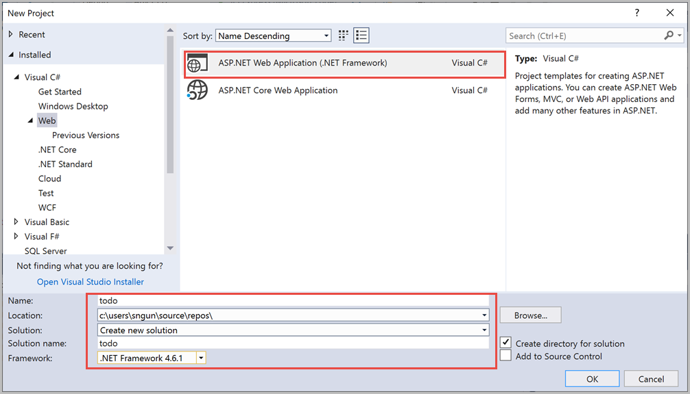

# Tutorial: Develop an ASP.NET MVC web application with Azure Cosmos DB

> [!div class="op_single_selector"]
> * [.NET](sql-api-dotnet-application.md)
> * [.NET Preview](sql-api-dotnet-application-preview.md)
> * [Java](sql-api-java-application.md)
> * [Node.js](sql-api-nodejs-application.md)
> * [Python](sql-api-python-application.md)
> * [Xamarin](mobile-apps-with-xamarin.md)
> 
This tutorial shows you how to use Azure Cosmos DB to store and access data from an ASP.NET MVC application that is hosted on Azure Websites. The items are stored as JSON documents in Azure Cosmos DB. The following image shows the web page that you will build by using the sample application: 

If you're looking for a tutorial to build a console application that can store and access data from Azure Cosmos DB, see [Build an Azure Cosmos DB C# console application](sql-api-get-started.md) article.

This tutorial covers:

> [!div class="checklist"]
> * Creating an Azure Cosmos DB account
> * Creating an ASP.NET MVC app
> * Connecting the app to Azure Cosmos DB 
> * Perform CRUD operations on the data

> [!TIP]
> This tutorial assumes that you have prior experience using ASP.NET MVC and Azure Websites. If you are new to ASP.NET or the [prerequisite tools](#_Toc395637760), we recommend you to download the complete sample project from [GitHub][GitHub] and following the instructions in this sample. Once you build the project, you can review this article to gain insight on the code in the context of the project.
> 

## <a name="_Toc395637760"></a>Prerequisites 
Before following the instructions in this article, ensure that you have the following resources:

* **An active Azure account:** If you don't have an Azure subscription, create a [free account](https://azure.microsoft.com/free/?WT.mc_id=A261C142F) before you begin. 

  [!INCLUDE [cosmos-db-emulator-docdb-api](../../includes/cosmos-db-emulator-docdb-api.md)]

* [!INCLUDE [cosmos-db-emulator-vs](../../includes/cosmos-db-emulator-vs.md)]  
* Microsoft Azure SDK for .NET for Visual Studio 2017, available through the Visual Studio Installer.

All the screen shots in this article have been taken using Microsoft Visual Studio Community 2017. If your system is configured with a different version, it is possible that your screens and options may not match entirely, but if you meet the above prerequisites this solution should work.

## <a name="_Toc395637761"></a>Step 1: Create an Azure Cosmos account

Let's start by creating an Azure Cosmos account. If you already have a SQL account for Azure Cosmos DB or if you are using the Azure Cosmos DB Emulator for this tutorial, you can skip to [Create a new ASP.NET MVC application](#_Toc395637762) section.

[!INCLUDE [create-dbaccount](../../includes/cosmos-db-create-dbaccount.md)]

[!INCLUDE [keys](../../includes/cosmos-db-keys.md)]

We will now walk through how to create a new ASP.NET MVC application. 


## <a name="_Toc395637762"></a>Step 2: Create a new ASP.NET MVC application

1. In Visual Studio, on the **File** menu, point to **New**, and then select **Project**. The **New Project** dialog box appears.

2. In the **Project types** pane, expand **Templates**, **Visual C#**, **Web**, and then select **ASP.NET Web Application**.

   

3. In the **Name** box, type the name of the project. This tutorial uses the name "todo". If you choose to use something other than this, then wherever this tutorial talks about the todo namespace, you need to adjust the provided code samples to use whatever you named your application. 

4. Select **Browse** to navigate to the folder where you would like to create the project, and then select **OK**. The **New ASP.NET Web Application** dialog box appears.

5. In the templates pane, select **MVC**.

6. Select **OK** and let Visual Studio do the scaffolding around the empty ASP.NET MVC template. 

7. Once Visual Studio has finished creating the boilerplate MVC application, you have an empty ASP.NET application that you can run locally.

## <a name="_Toc395637767"></a>Step 3: Add Azure Cosmos DB NuGet packages to the project

Now that we have most of the ASP.NET MVC framework code that we need for this solution, let's add the NuGet packages required to connect to Azure Cosmos DB.

1. The Azure Cosmos DB .NET SDK is packaged and distributed as a NuGet package. To get the NuGet package in Visual Studio, use the NuGet package manager in Visual Studio by right-clicking on the project in **Solution Explorer** and then select **Manage NuGet Packages**.
   
   
   
   The **Manage NuGet Packages** dialog box appears.

2. In the NuGet **Browse** box, type **Microsoft.Azure.Cosmos**. From the results, install the **Microsoft.Azure.Cosmos** 3.0.0-preview version. It downloads and installs the Azure Cosmos DB package and its dependencies, such as Newtonsoft.Json. Select **OK** in the **Preview** window, and **I Accept** in the **License Acceptance** window to complete the installation.
   
   Alternatively, you can use the Package Manager Console to install the NuGet package. To do so, on the **Tools** menu, select **NuGet Package Manager**, and then select **Package Manager Console**. At the prompt, type the following command:
   
   ```bash
   Install-Package Microsoft.Azure.Cosmos -Version 3.0.0-preview
   ```        

3. After the package is installed, your Visual Studio solution should contain the following two new references added, Microsoft.Azure.Cosmos.Client, Microsoft.Azure.Cosmos.Direct, and Newtonsoft.Json.
  
## <a name="_Toc395637763"></a>Step 4: Set up the ASP.NET MVC application

Now let's add the models, views, and controllers to this MVC application:

* [Add a model](#_Toc395637764).
* [Add a controller](#_Toc395637765).
* [Add views](#_Toc395637766).

### <a name="_Toc395637764"></a> Add a model

1. From the **Solution Explorer**, right-click the **Models** folder, select **Add**, and then **Class**. The **Add New Item** dialog box appears.

1. Name your new class **TodoItem.cs** and select **Add**. 

1. Next replace the code in "Todoitem" class with the following code:

   [!code-csharp[Main](~/samples-cosmosdb-dotnet-web-app/src/Models/TodoItem.cs)]
   
   The data stored in Azure Cosmos DB is passed over the wire and stored as JSON. To control the way your objects are serialized/deserialized by JSON.NET, you can use the **JsonProperty** attribute as demonstrated in the **TodoItem** class you created. Not only can you control the format of the property name that goes into JSON, you can also rename your .NET properties like you did with the **Description** property. 

### <a name="_Toc395637765"></a>Add a controller

1. From the **Solution Explorer**, right-click the **Controllers** folder, select **Add**, and then select **Controller**.  The **Add Scaffold** dialog box appears.

1. Select **MVC 5 Controller - Empty** and select **Add**.

   

1. Name your new controller, **ItemController, and replace the code in that file with the following code:

   [!code-csharp[Main](~/samples-cosmosdb-dotnet-web-app/src/Controllers/ItemController.cs)]

   **Security Note**: The **ValidateAntiForgeryToken** attribute is used here to help protect this application against cross-site request forgery attacks. There is more to it than just adding this attribute, your views need to work with this anti-forgery token as well. For more on the subject, and examples of how to implement this correctly, please see [Preventing Cross-Site Request Forgery][Preventing Cross-Site Request Forgery]. The source code provided on [GitHub][GitHub] has the full implementation in place.
   
   **Security Note**: We also use the **Bind** attribute on the method parameter to help protect against over-posting attacks. For more details, please see [Basic CRUD Operations in ASP.NET MVC][Basic CRUD Operations in ASP.NET MVC].
    
### <a name="_Toc395637766"></a>Add views

Now, let's create the views, in this tutorial, you will create the following three view classes:

* [Add a list item view](#AddItemIndexView).
* [Add a new item view](#AddNewIndexView).
* [Add an edit item view](#_Toc395888515).

#### <a name="AddItemIndexView"></a>Add a list item view

1. In **Solution Explorer**, expand the **Views**  folder, right-click the empty **Item** folder that Visual Studio created for you when you added the **ItemController** earlier, click **Add**, and then click **View**.
   
   

2. In the **Add View** dialog box, update the following values:
   
   * In the **View name** box, type ***Index***.
   * In the **Template** box, select ***List***.
   * In the **Model class** box, select ***Item (todo.Models)***.
   * In the layout page box, type ***~/Views/Shared/_Layout.cshtml***.
     
   

3. After you add these values, select **Add** and let Visual Studio create a new template view. Once done, it will open the cshtml file that was created. We can close that file in Visual Studio as we will come back to it later.

#### <a name="AddNewIndexView"></a>Add a new item view

Like how we created a view to list items, we will now create a new view to create new Items.

1. From the **Solution Explorer**, right-click the **Item** folder again, select **Add**, and then select **View**.

1. In the **Add View** dialog box, update the following values:
   
   * In the **View name** box, type ***Create***.
   * In the **Template** box, select ***Create***.
   * In the **Model class** box, select ***Item (todo.Models)***.
   * In the layout page box, type ***~/Views/Shared/_Layout.cshtml***.
   * Select **Add**.
   
#### <a name="_Toc395888515"></a>Add an edit item view

And finally, add a view to edit an item with the following steps:

1. From the **Solution Explorer**, right-click the **Item** folder again, select **Add**, and then select **View**.

1. In the **Add View** dialog box, do the following:
   
   * In the **View name** box, type ***Edit***.
   * In the **Template** box, select ***Edit***.
   * In the **Model class** box, select ***Item (todo.Models)***.
   * In the layout page box, type ***~/Views/Shared/_Layout.cshtml***.
   * Select **Add**.

Once this is done, close all the cshtml documents in Visual Studio as we will return to these views later.

## <a name="_Toc395637769"></a>Step 5: Connect to Azure Cosmos DB 

Now that the standard MVC stuff is taken care of, let's turn to adding the code to connect to Azure Cosmos DB and perform CRUD operations. 

### <a name="_Toc395637770"></a> Perform CRUD operations on the data

The first thing to do here is add a class that contains the logic to connect to and use Azure Cosmos DB. For this tutorial, we'll encapsulate this logic into a class called TodoItemService.cs. This code reads the Azure Cosmos DB endpoint values form the configuration file and performs CRUD operations such as listing incomplete items, creating, editing, and deleting the items. 

1. From **Solution Explorer**, Creates a new folder under your project named **Services**.

1. right-click the **Services** folder, select **Add**, and then select **Class**. Name the new class **TodoItemService** and select **Add**.

1. Add the following code to the **TodoItemService** class and replace the code in that file with the following code:

   [!code-csharp[Main](~/samples-cosmosdb-dotnet-web-app/src/Services/TodoItemService.cs)]
 
1. The previous code reads the connection string values from configuration file. To update the connection string values of your Azure Cosmos account, open the **Web.config** file in your project and add the following lines under the `<AppSettings>` section:

   ```csharp
    <add key="endpoint" value="<enter the URI from the Keys blade of the Azure Portal>" />
	<add key="primaryKey" value="<enter the PRIMARY KEY, or the SECONDARY KEY, from the Keys blade of the Azure  Portal>" />
	<add key="database" value="Tasks" />
	<add key="container" value="Items" />
   ```
 
1. Now, update the values for *endpoint* and *authKey* using the Keys blade of the Azure portal. Use the **URI** from the Keys blade as the value of the endpoint setting, and use the **PRIMARY KEY**, or **SECONDARY KEY** from the Keys blade as the value of the authKey setting.  This takes care of wiring up the Azure Cosmos DB repository, now let's add our application logic.

1. Open **Global.asax.cs** and add the following line to the **Application_Start** method 
   
   ```csharp
   TodoItemService.Initialize().GetAwaiter().GetResult();
   ```

   At this point, your solution should be able to build your project without any errors. If you run the application now, you will go to the **HomeController** and the **Index** view of that controller. This is the default behavior for the MVC template project we chose at the start. Let's change the routing on this MVC application to alter this behavior.

1. Open ***App\_Start\RouteConfig.cs*** and locate the line starting with "defaults:" and change it to resemble the following.

   ```csharp
   defaults: new { controller = "Item", action = "Index", id = UrlParameter.Optional }
   ```

  This code now tells ASP.NET MVC that if you have not specified a value in the URL to control the routing behavior, instead of **Home**, it uses **Item** as the controller and **Index** as the view.

Now if you run the application, it will call into your **ItemController that will call in to the repository class and use the GetItems method to return all the incomplete items to the **Views**\\**Item**\\**Index** view. 

If you build and run this project now, you should now see something that looks this.    


## <a name="_Toc395637773"></a>Step 6: Run the application locally

To test the application on your local machine, use the following steps:

1. Hit F5 in Visual Studio to build the application in debug mode. It should build the application and launch a browser with the empty grid page we saw before:
   
   
       
2. Click the **Create New** link and add values to the **Name** and **Description** fields. Leave the **Completed** check box unselected otherwise the new item will be added in a completed state and will not appear on the initial list.
   
3. Click **Create** and you are redirected back to the **Index** view and your item appears in the list. You can add a few more items to your todo list.

    
  
4. Click **Edit** next to an **Item** on the list and you are taken to the **Edit** view where you can update any property of your object, including the **Completed** flag. If you mark the **Complete** flag and click **Save**, the **Item** is removed from the list of incomplete tasks.
   
   

5. Once you've tested the app, press Ctrl+F5 to stop debugging the app. You're ready to deploy!

## <a name="_Toc395637774"></a>Step 7: Deploy the application 
Now that you have the complete application working correctly with Azure Cosmos DB we're going to deploy this web app to Azure App Service.  

1. To publish this application, you need to  right-click on the project in **Solution Explorer** and select **Publish**.
   
2. In the **Publish** dialog box, select **Microsoft Azure App Service**, then select **Create New** to create an App Service profile, or choose **Select Existing** to use an existing profile.

3. If you have an existing Azure App Service profile, enter your subscription name. Use the **View** filter to sort by resource group or resource type, then select your Azure App Service. 
   
   

4. To create a new Azure App Service profile, click **Create New** in the **Publish** dialog box. In the **Create App Service** dialog, enter your Web App name and the appropriate subscription, resource group, and App Service plan, then select **Create**.

   

In a few seconds, Visual Studio will finish publishing your web application and launch a browser where you can see your project running in Azure!

## <a name="_Toc395637775"></a>Next steps
In this tutorial, you've learned how to build a ASP.NET MVC web application that can access data stored in Azure Cosmos DB. You can now proceed to the next article:

> [!div class="nextstepaction"]
> [Build a Java application to access data stored in SQL API account of Azure Cosmos DB]( sql-api-java-application.md)

 [\*]: https://microsoft.sharepoint.com/teams/DocDB/Shared%20Documents/Documentation/Docs.LatestVersions/PicExportError
[Visual Studio Express]: http://www.visualstudio.com/products/visual-studio-express-vs.aspx
[Microsoft Web Platform Installer]: http://www.microsoft.com/web/downloads/platform.aspx
[Preventing Cross-Site Request Forgery]: http://go.microsoft.com/fwlink/?LinkID=517254
[Basic CRUD Operations in ASP.NET MVC]: http://go.microsoft.com/fwlink/?LinkId=317598
[GitHub]: https://github.com/Azure-Samples/cosmos-dotnet-todo-app
