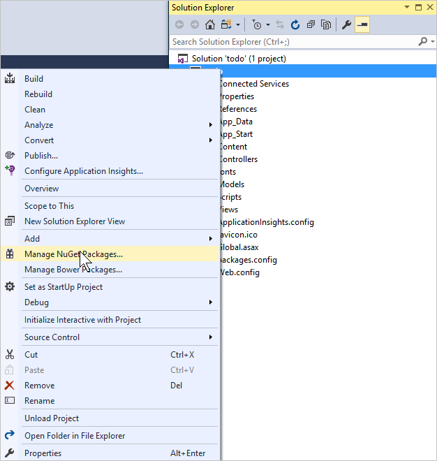
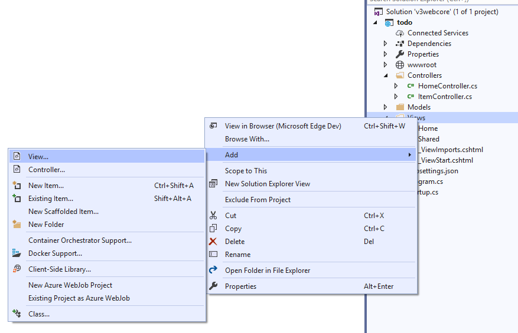
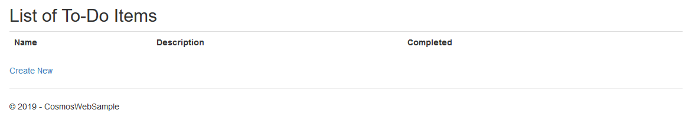

# Tutorial: Develop an ASP.NET Core MVC web application with Azure Cosmos DB by using .NET SDK 

> [!div class="op_single_selector"]
> * [.NET](sql-api-dotnet-application.md)
> * [Java](sql-api-java-application.md)
> * [Node.js](sql-api-nodejs-application.md)
> * [Python](sql-api-python-application.md)
> * [Xamarin](mobile-apps-with-xamarin.md)


This tutorial shows you how to use Azure Cosmos DB to store and access data from an ASP.NET MVC application that is hosted on Azure. In this tutorial, you use the .NET SDK V3. The following image shows the web page that you will build by using the sample in this article:
 


If you don't have time to complete the tutorial, you can download the complete sample project from [GitHub][GitHub].

This tutorial covers:

> [!div class="checklist"]
> * Creating an Azure Cosmos account
> * Creating an ASP.NET Core MVC app
> * Connecting the app to Azure Cosmos DB 
> * Perform CRUD operations on the data

> [!TIP]
> This tutorial assumes that you have prior experience using ASP.NET Core MVC and Azure App Service. If you are new to ASP.NET Core or the [prerequisite tools](#prerequisites), we recommend you to download the complete sample project from [GitHub][GitHub], add the required NuGet packages and run it. Once you build the project, you can review this article to gain insight on the code in the context of the project.

## <a name="prerequisites"></a>Prerequisites 

Before following the instructions in this article, ensure that you have the following resources:

* **An active Azure account:** If you don't have an Azure subscription, create a [free account](https://azure.microsoft.com/free/?WT.mc_id=A261C142F) before you begin. 

  [!INCLUDE [cosmos-db-emulator-docdb-api](../../includes/cosmos-db-emulator-docdb-api.md)]

* [!INCLUDE [cosmos-db-emulator-vs](../../includes/cosmos-db-emulator-vs.md)]  

All the screenshots in this article have been taken using Microsoft Visual Studio Community 2019. If your system is configured with a different version, it is possible that your screens and options may not match entirely, but if you meet the above prerequisites this solution should work.

## <a name="create-an-azure-cosmos-account"></a>Step 1: Create an Azure Cosmos account

Let's start by creating an Azure Cosmos account. If you already have an Azure Cosmos DB SQL API account or if you are using the Azure Cosmos DB emulator for this tutorial, you can skip to [Create a new ASP.NET MVC application](#create-a-new-mvc-application) section.

[!INCLUDE [create-dbaccount](../../includes/cosmos-db-create-dbaccount.md)]

[!INCLUDE [keys](../../includes/cosmos-db-keys.md)]

In the next section, you create a new ASP.NET Core MVC application. 

## <a name="create-a-new-mvc-application"></a>Step 2: Create a new ASP.NET Core MVC application

1. In Visual Studio, from the **File** menu, choose **New**, and then select **Project**. The **New Project** dialog box appears.

2. In the **New Project** window, use the **Search for templates** input box to search for "Web", and then select **ASP.NET Core Web Application**. 

   

3. In the **Name** box, type the name of the project. This tutorial uses the name "todo". If you choose to use something other than this name, then wherever this tutorial talks about the todo namespace, adjust the provided code samples to use whatever you named your application. 

4. Select **Browse** to navigate to the folder where you would like to create the project. Select **Create**. 

5. The **Create a new ASP.NET Core Web Application** dialog box appears. In the templates list, select **Web Application (Model-View-Controller)**.

6. Select **Create** and let Visual Studio do the scaffolding around the empty ASP.NET Core MVC template. 

7. Once Visual Studio has finished creating the boilerplate MVC application, you have an empty ASP.NET application that you can run locally.

## <a name="add-nuget-packages"></a>Step 3: Add Azure Cosmos DB NuGet package to the project

Now that we have most of the ASP.NET Core MVC framework code that we need for this solution, let's add the NuGet packages required to connect to Azure Cosmos DB.

1. The Azure Cosmos DB .NET SDK is packaged and distributed as a NuGet package. To get the NuGet package in Visual Studio, use the NuGet package manager in Visual Studio by right-clicking on the project in **Solution Explorer** and then select **Manage NuGet Packages**.
   
   
   
2. The **Manage NuGet Packages** dialog box appears. In the NuGet **Browse** box, type **Microsoft.Azure.Cosmos**. From the results, install the **Microsoft.Azure.Cosmos** package. It downloads and installs the Azure Cosmos DB package and its dependencies. Select **I Accept** in the **License Acceptance** window to complete the installation.
   
   Alternatively, you can use the Package Manager Console to install the NuGet package. To do so, on the **Tools** menu, select **NuGet Package Manager**, and then select **Package Manager Console**. At the prompt, type the following command:
   
   ```bash
   Install-Package Microsoft.Azure.Cosmos
   ```        

3. After the package is installed, your Visual Studio project should contain the library reference to Microsoft.Azure.Cosmos.
  
## <a name="set-up-the-mvc-application"></a>Step 4: Set up the ASP.NET Core MVC application

Now let's add the models, the views, and the controllers to this MVC application:

* [Add a model](#add-a-model).
* [Add a controller](#add-a-controller).
* [Add views](#add-views).

### <a name="add-a-model"></a> Add a model

1. From the **Solution Explorer**, right-click the **Models** folder, select **Add**, and then select **Class**. The **Add New Item** dialog box appears.

1. Name your new class **Item.cs** and select **Add**. 

1. Next replace the code in "Item.cs" class with the following code:

   [!code-csharp[Main](~/samples-cosmosdb-dotnet-core-web-app/src/Models/Item.cs)]
   
   The data stored in Azure Cosmos DB is passed over the wire and stored as JSON. To control the way your objects are serialized/deserialized by JSON.NET, you can use the **JsonProperty** attribute as demonstrated in the **Item** class you created. Not only can you control the format of the property name that goes into JSON, you can also rename your .NET properties like you did with the **Completed** property. 

### <a name="add-a-controller"></a>Add a controller

1. From the **Solution Explorer**, right-click the **Controllers** folder, select **Add**, and then select **Controller**. The **Add Scaffold** dialog box appears.

1. Select **MVC Controller - Empty** and select **Add**.

   

1. Name your new controller, **ItemController**, and replace the code in that file with the following code:

   [!code-csharp[Main](~/samples-cosmosdb-dotnet-core-web-app/src/Controllers/ItemController.cs)]

   The **ValidateAntiForgeryToken** attribute is used here to help protect this application against cross-site request forgery attacks. There is more to it than just adding this attribute, your views should work with this anti-forgery token as well. For more on the subject, and examples of how to implement this correctly, see [Preventing Cross-Site Request Forgery][Preventing Cross-Site Request Forgery]. The source code provided on [GitHub][GitHub] has the full implementation in place.

   We also use the **Bind** attribute on the method parameter to help protect against over-posting attacks. For more details, please see [Basic CRUD Operations in ASP.NET MVC][Basic CRUD Operations in ASP.NET MVC].

### <a name="add-views"></a>Add views

Next, let's create the following three views: 

* [Add a list item view](#AddItemIndexView).
* [Add a new item view](#AddNewIndexView).
* [Add an edit item view](#AddEditIndexView).

#### <a name="AddItemIndexView"></a>Add a list item view

1. In **Solution Explorer**, expand the **Views** folder, right-click the empty **Item** folder that Visual Studio created for you when you added the **ItemController** earlier, click **Add**, and then click **View**.
   
   

2. In the **Add View** dialog box, update the following values:
   
   * In the **View name** box, type ***Index***.
   * In the **Template** box, select ***List***.
   * In the **Model class** box, select ***Item (todo.Models)***.
   * In the layout page box, type ***~/Views/Shared/_Layout.cshtml***.
     
   

3. After you add these values, select **Add** and let Visual Studio create a new template view. Once done, it opens the cshtml file that is created. You can close that file in Visual Studio as you will come back to it later.

#### <a name="AddNewIndexView"></a>Add a new item view

Similar to how you created a view to list items, create a new view to create items by using the following steps:

1. From the **Solution Explorer**, right-click the **Item** folder again, select **Add**, and then select **View**.

1. In the **Add View** dialog box, update the following values:
   
   * In the **View name** box, type ***Create***.
   * In the **Template** box, select ***Create***.
   * In the **Model class** box, select ***Item (todo.Models)***.
   * In the layout page box, type ***~/Views/Shared/_Layout.cshtml***.
   * Select **Add**.
   
#### <a name="AddEditIndexView"></a>Add an edit item view

And finally, add a view to edit an item with the following steps:

1. From the **Solution Explorer**, right-click the **Item** folder again, select **Add**, and then select **View**.

1. In the **Add View** dialog box, do the following:
   
   * In the **View name** box, type ***Edit***.
   * In the **Template** box, select ***Edit***.
   * In the **Model class** box, select ***Item (todo.Models)***.
   * In the layout page box, type ***~/Views/Shared/_Layout.cshtml***.
   * Select **Add**.

Once this is done, close all the cshtml documents in Visual Studio as you return to these views later.

## <a name="connect-to-cosmosdb"></a>Step 5: Connect to Azure Cosmos DB 

Now that the standard MVC stuff is taken care of, let's turn to adding the code to connect to Azure Cosmos DB and perform CRUD operations. 

### <a name="perform-crud-operations"></a> Perform CRUD operations on the data

The first thing to do here is add a class that contains the logic to connect to and use Azure Cosmos DB. For this tutorial, we'll encapsulate this logic into a class called `CosmosDBService` and an interface called `ICosmosDBService`. This service performs the CRUD and read feed operations such as listing incomplete items, creating, editing, and deleting the items. 

1. From **Solution Explorer**, create a new folder under your project named **Services**.

1. Right-click the **Services** folder, select **Add**, and then select **Class**. Name the new class **CosmosDBService** and select **Add**.

1. Add the following code to the **CosmosDBService** class and replace the code in that file with the following code:

   [!code-csharp[Main](~/samples-cosmosdb-dotnet-core-web-app/src/Services/CosmosDbService.cs)]

1. Repeat steps 2-3, but this time, for a class named **ICosmosDBService**, and add the following code:

   [!code-csharp[Main](~/samples-cosmosdb-dotnet-core-web-app/src/Services/ICosmosDbService.cs)]
 
1. The previous code receives a `CosmosClient` as part of the constructor. Following ASP.NET Core pipeline, we need to go to the project's **Startup.cs** and initialize the client based on the configuration as a Singleton instance to be injected through [Dependency Injection](https://docs.microsoft.com/aspnet/core/fundamentals/dependency-injection). In the **ConfigureServices** handler, we define:

    ```csharp
    services.AddSingleton<ICosmosDbService>(InitializeCosmosClientInstanceAsync(Configuration.GetSection("CosmosDb")).GetAwaiter().GetResult());
    ```

1. Within the same file, we define our helper method **InitializeCosmosClientInstanceAsync**, which will read the configuration and initialize the client.

    [!code-csharp[](~/samples-cosmosdb-dotnet-core-web-app/src/Startup.cs?name=InitializeCosmosClientInstanceAsync)] 

1. The configuration is defined in the project's **appsettings.json** file. Open it and add a section called **CosmosDb**:

   ```csharp
     "CosmosDb": {
        "Account": "<enter the URI from the Keys blade of the Azure Portal>",
        "Key": "<enter the PRIMARY KEY, or the SECONDARY KEY, from the Keys blade of the Azure  Portal>",
        "DatabaseName": "Tasks",
        "ContainerName": "Items"
      }
   ```
 
Now if you run the application, ASP.NET Core's pipeline will instantiate **CosmosDbService** and maintain a single instance as Singleton; when **ItemController** is used to process client side requests, it will receive this single instance and be able to use it to perform CRUD operations.

If you build and run this project now, you should now see something that looks like this:




## <a name="run-the-application"></a>Step 6: Run the application locally

To test the application on your local machine, use the following steps:

1. Press F5 in Visual Studio to build the application in debug mode. It should build the application and launch a browser with the empty grid page we saw before:
   
   
       
2. Click the **Create New** link and add values to the **Name** and **Description** fields. Leave the **Completed** check box unselected otherwise the new item is added in a completed state and doesn't appear on the initial list.
   
3. Click **Create** and you are redirected back to the **Index** view and your item appears in the list. You can add a few more items to your todo list.

    
  
4. Click **Edit** next to an **Item** on the list and you are taken to the **Edit** view where you can update any property of your object, including the **Completed** flag. If you mark the **Complete** flag and click **Save**, the **Item** will be displayed as completed in the list.
   
   

5. You can verify at any point the state of the data in the Azure Cosmos DB service using [Cosmos Explorer](https://cosmos.azure.com) or the Azure Cosmos DB Emulator's Data Explorer.

6. Once you've tested the app, press Ctrl+F5 to stop debugging the app. You're ready to deploy!

## <a name="deploy-the-application-to-azure"></a>Step 7: Deploy the application 
Now that you have the complete application working correctly with Azure Cosmos DB we're going to deploy this web app to Azure App Service.  

1. To publish this application, right-click on the project in **Solution Explorer** and select **Publish**.
   
2. In the **Publish** dialog box, select **App Service**, then select **Create New** to create an App Service profile, or choose **Select Existing** to use an existing profile.

3. If you have an existing Azure App Service profile, select a **Subscription** from the dropdown. Use the **View** filter to sort by resource group or resource type. Next search the required Azure App Service and select **OK**.
   
   

4. To create a new Azure App Service profile, click **Create New** in the **Publish** dialog box. In the **Create App Service** dialog, enter your Web App name and the appropriate subscription, resource group, and App Service plan, then select **Create**.

   

In a few seconds, Visual Studio publishes your web application and launches a browser where you can see your project running in Azure!

## Next steps
In this tutorial, you've learned how to build an ASP.NET Core MVC web application that can access data stored in Azure Cosmos DB. You can now proceed to the next article:

* [Learn about partitioning your data in Azure Cosmos DB](./partitioning-overview.md)
* [Learn about how to do more advanced queries in Azure Cosmos DB](./how-to-sql-query.md)
* [Learn about how to model your data in a more advanced scenario](./how-to-model-partition-example.md)


[Visual Studio Express]: https://www.visualstudio.com/products/visual-studio-express-vs.aspx
[Microsoft Web Platform Installer]: https://www.microsoft.com/web/downloads/platform.aspx
[Preventing Cross-Site Request Forgery]: https://go.microsoft.com/fwlink/?LinkID=517254
[Basic CRUD Operations in ASP.NET MVC]: https://go.microsoft.com/fwlink/?LinkId=317598
[GitHub]: https://github.com/Azure-Samples/cosmos-dotnet-core-todo-app
