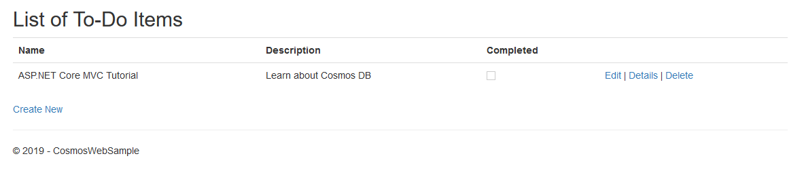
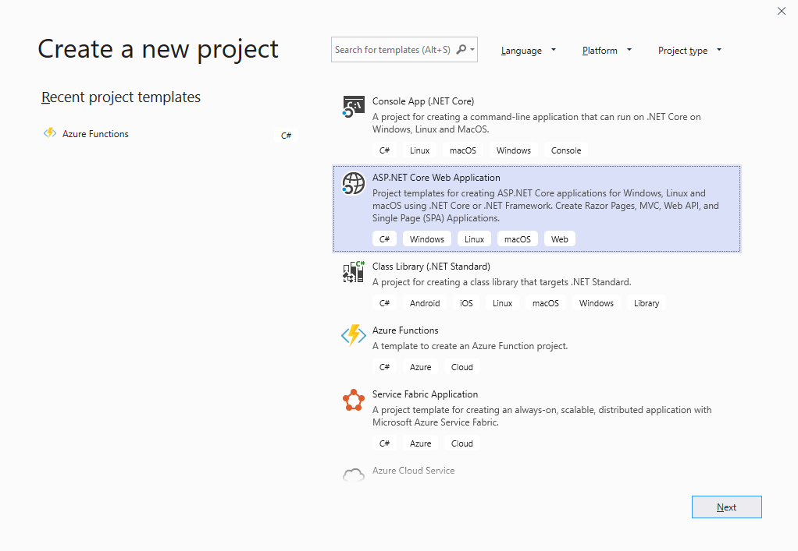
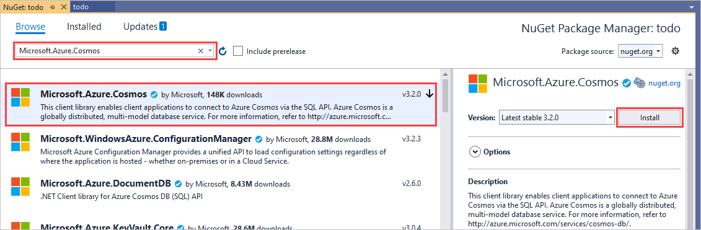
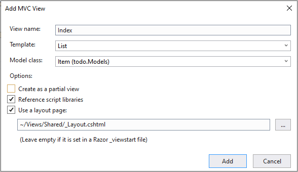
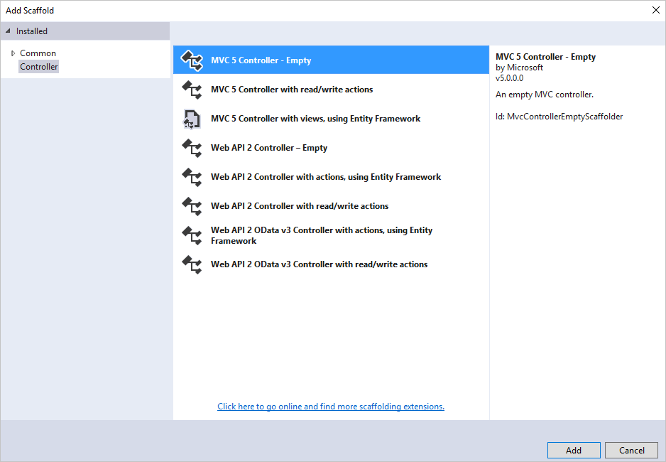
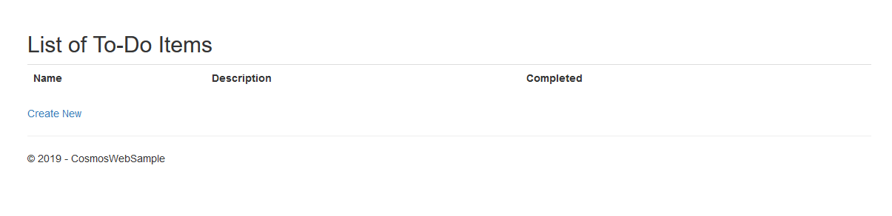
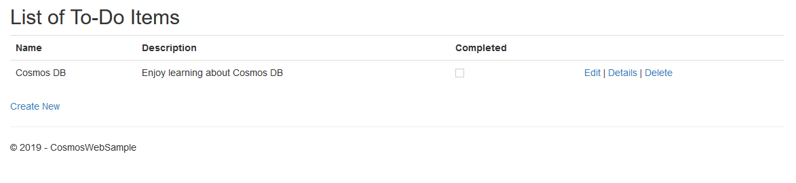
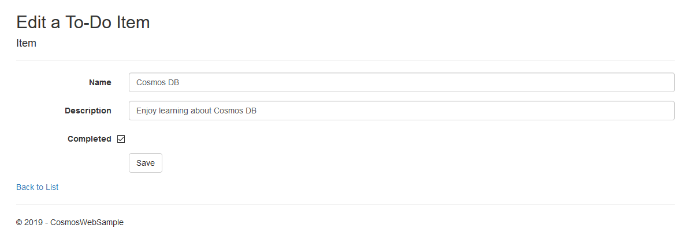
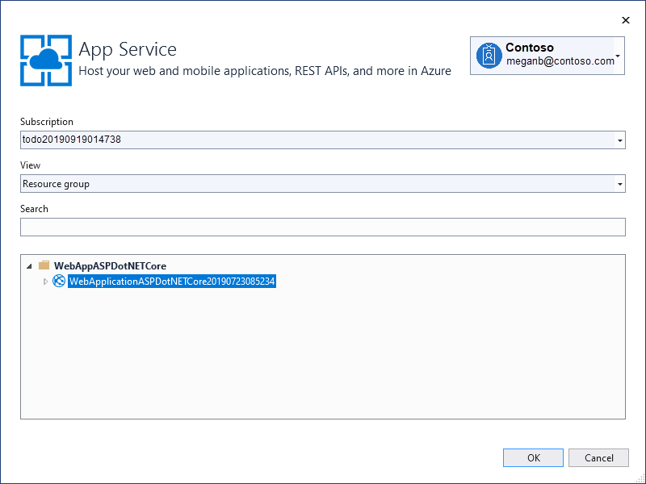
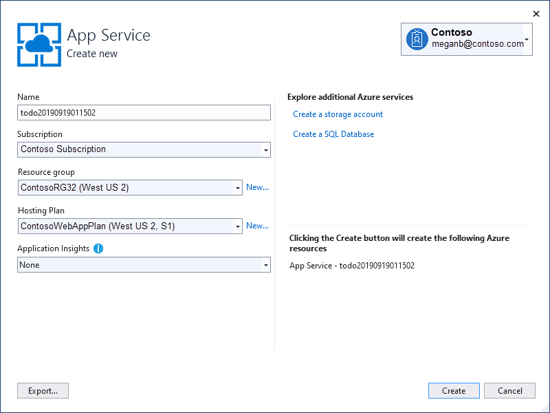

# Tutorial: Develop an ASP.NET Core MVC web application with Azure Cosmos DB by using .NET SDK

> [!div class="op_single_selector"]
> * [.NET](sql-api-dotnet-application.md)
> * [Java](sql-api-java-application.md)
> * [Node.js](sql-api-nodejs-application.md)
> * [Python](sql-api-python-application.md)
> * [Xamarin](mobile-apps-with-xamarin.md)

This tutorial shows you how to use Azure Cosmos DB to store and access data from an ASP.NET MVC application that is hosted on Azure. In this tutorial, you use the .NET SDK V3. The following image shows the web page that you'll build by using the sample in this article:



If you don't have time to complete the tutorial, you can download the complete sample project from [GitHub][GitHub].

This tutorial covers:

> [!div class="checklist"]
>
> * Creating an Azure Cosmos account
> * Creating an ASP.NET Core MVC app
> * Connecting the app to Azure Cosmos DB
> * Performing create, read, update, and delete (CRUD) operations on the data

> [!TIP]
> This tutorial assumes that you have prior experience using ASP.NET Core MVC and Azure App Service. If you are new to ASP.NET Core or the [prerequisite tools](#prerequisites), we recommend you to download the complete sample project from [GitHub][GitHub], add the required NuGet packages, and run it. Once you build the project, you can review this article to gain insight on the code in the context of the project.

## <a name="prerequisites"></a>Prerequisites

Before following the instructions in this article, make sure that you have the following resources:

* An active Azure account. If you don't have an Azure subscription, create a [free account](https://azure.microsoft.com/free/?WT.mc_id=A261C142F) before you begin.

  [!INCLUDE [cosmos-db-emulator-docdb-api](../../includes/cosmos-db-emulator-docdb-api.md)]

* Visual Studio 2019. [!INCLUDE [cosmos-db-emulator-vs](../../includes/cosmos-db-emulator-vs.md)]  

All the screenshots in this article are from Microsoft Visual Studio Community 2019. If you use a different version, your screens and options may not match entirely. The solution should work if you meet the prerequisites.

## <a name="create-an-azure-cosmos-account"></a>Step 1: Create an Azure Cosmos account

Let's start by creating an Azure Cosmos account. If you already have an Azure Cosmos DB SQL API account or if you're using the Azure Cosmos DB emulator, skip to [Step 2: Create a new ASP.NET MVC application](#create-a-new-mvc-application).

[!INCLUDE [create-dbaccount](../../includes/cosmos-db-create-dbaccount.md)]

[!INCLUDE [keys](../../includes/cosmos-db-keys.md)]

In the next section, you create a new ASP.NET Core MVC application.

## <a name="create-a-new-mvc-application"></a>Step 2: Create a new ASP.NET Core MVC application

1. Open Visual Studio and select **Create a new project**.

1. In **Create a new project**, find and select **ASP.NET Core Web Application** for C#. Select **Next** to continue.

   

1. In **Configure your new project**, name the project *todo* and select **Create**.

1. In **Create a new ASP.NET Core Web Application**, choose **Web Application (Model-View-Controller)**. Select **Create** to continue.

   Visual Studio creates an empty MVC application.

1. Select **Debug** > **Start Debugging** or F5 to run your ASP.NET application locally.

## <a name="add-nuget-packages"></a>Step 3: Add Azure Cosmos DB NuGet package to the project

Now that we have most of the ASP.NET Core MVC framework code that we need for this solution, let's add the NuGet packages required to connect to Azure Cosmos DB.

1. In **Solution Explorer**, right-click your project and select **Manage NuGet Packages**.

1. In the **NuGet Package Manager**, search for and select **Microsoft.Azure.Cosmos**. Select **Install**.

   

   Visual Studio  downloads and installs the Azure Cosmos DB package and its dependencies.

   You can also use **Package Manager Console** to install the NuGet package. To do so, select **Tools** > **NuGet Package Manager** > **Package Manager Console**. At the prompt, type the following command:

   ```ps
   Install-Package Microsoft.Azure.Cosmos
   ```
  
## <a name="set-up-the-mvc-application"></a>Step 4: Set up the ASP.NET Core MVC application

Now let's add the models, the views, and the controllers to this MVC application.

### <a name="add-a-model"></a> Add a model

1. In **Solution Explorer**, right-click the **Models** folder, select **Add** > **Class**.

1. In **Add New Item**, name your new class *Item.cs* and select **Add**.

1. Replace the contents of *Item.cs* class with the following code:

   :::code language="csharp" source="~/samples-cosmosdb-dotnet-core-web-app/src/Models/Item.cs":::

Azure Cosmos DB uses JSON to move and store data. You can use the `JsonProperty` attribute to control how JSON serializes and deserializes objects. The `Item` class demonstrates the `JsonProperty` attribute. This code controls the format of the property name that goes into JSON. It also renames the .NET property `Completed`.

### <a name="add-views"></a>Add views

Next, let's create the following three views.

* Add a list item view
* Add a new item view
* Add an edit item view

#### <a name="AddItemIndexView"></a>Add a list item view

1. In **Solution Explorer**, right-click the **Views** folder and select **Add** > **New Folder**. Name the folder *Item*.

1. Right-click the empty **Item** folder, then select **Add** > **View**.

1. In **Add MVC View**, provide the following values:

   * In **View name**, enter *Index*.
   * In **Template**, select **List**.
   * In **Model class**, select **Item (todo.Models)**.
   * Select **Use a layout page** and enter *~/Views/Shared/_Layout.cshtml*.

   

1. After you add these values, select **Add** and let Visual Studio create a new template view.

Once done, Visual Studio opens the *cshtml* file that it creates. You can close that file in Visual Studio. We'll come back to it later.

#### <a name="AddNewIndexView"></a>Add a new item view

Similar to how you created a view to list items, create a new view to create items by using the following steps:

1. In **Solution Explorer**, right-click the **Item** folder again, select **Add** > **View**.

1. In **Add MVC View**, make the following changes:

   * In **View name**, enter *Create*.
   * In **Template**, select **Create**.
   * In **Model class**, select **Item (todo.Models)**.
   * Select **Use a layout page** and enter *~/Views/Shared/_Layout.cshtml*.
   * Select **Add**.

#### <a name="AddEditIndexView"></a>Add an edit item view

And finally, add a view to edit an item with the following steps:

1. From the **Solution Explorer**, right-click the **Item** folder again, select **Add** > **View**.

1. In **Add MVC View**, make the following changes:

   * In the **View name** box, type *Edit*.
   * In the **Template** box, select **Edit**.
   * In the **Model class** box, select **Item (todo.Models)**.
   * Select **Use a layout page** and enter *~/Views/Shared/_Layout.cshtml*.
   * Select **Add**.

Once you complete these steps, close all the *cshtml* documents in Visual Studio as you return to these views later.

### <a name="initialize-services"></a>Declare and initialize services

First, we'll add a class that contains the logic to connect to and use Azure Cosmos DB. For this tutorial, we'll encapsulate this logic into a class called `CosmosDBService` and an interface called `ICosmosDBService`. This service does the CRUD operations. It also does read feed operations such as listing incomplete items, creating, editing, and deleting the items.

1. In **Solution Explorer**, right-click your project and select **Add** > **New Folder**. Name the folder *Services*.

1. Right-click the **Services** folder, select **Add** > **Class**. Name the new class *CosmosDBService* and select **Add**.

1. Replace the contents of *CosmosDBService.cs* with the following code:

   :::code language="csharp" source="~/samples-cosmosdb-dotnet-core-web-app/src/Services/CosmosDbService.cs":::

1. Right-click the **Services** folder, select **Add** > **Class**. Name the new class *ICosmosDBService* and select **Add**.

1. Add the following code to *ICosmosDBService* class:

   :::code language="csharp" source="~/samples-cosmosdb-dotnet-core-web-app/src/Services/ICosmosDbService.cs":::

1. Open the *Startup.cs* file in your solution and add the following method **InitializeCosmosClientInstanceAsync**, which reads the configuration and initializes the client.

   :::code language="csharp" source="~/samples-cosmosdb-dotnet-core-web-app/src/Startup.cs" id="InitializeCosmosClientInstanceAsync" :::

1. On that same file, replace the `ConfigureServices` method with:

   :::code language="csharp" source="~/samples-cosmosdb-dotnet-core-web-app/src/Startup.cs" id="ConfigureServices":::

   The code in this step initializes the client based on the configuration as a singleton instance to be injected through [Dependency injection in ASP.NET Core](https://docs.microsoft.com/aspnet/core/fundamentals/dependency-injection).

   And make sure to change the default MVC Controller to `Item` by editing the routes in the `Configure` method of the same file:

   ```csharp
    app.UseEndpoints(endpoints =>
          {
                endpoints.MapControllerRoute(
                   name: "default",
                   pattern: "{controller=Item}/{action=Index}/{id?}");
          });
   ```


1. Define the configuration in the project's *appsettings.json* file as shown in the following snippet:

   :::code language="json" source="~/samples-cosmosdb-dotnet-core-web-app/src/appsettings.json":::

### <a name="add-a-controller"></a>Add a controller

1. In **Solution Explorer**, right-click the **Controllers** folder, select **Add** > **Controller**.

1. In **Add Scaffold**, select **MVC Controller - Empty** and select **Add**.

   

1. Name your new controller *ItemController*.

1. Replace the contents of *ItemController.cs* with the following code:

   :::code language="csharp" source="~/samples-cosmosdb-dotnet-core-web-app/src/Controllers/ItemController.cs":::

The **ValidateAntiForgeryToken** attribute is used here to help protect this application against cross-site request forgery attacks. Your views should work with this anti-forgery token as well. For more information and examples, see [Preventing Cross-Site Request Forgery (CSRF) Attacks in ASP.NET MVC Application][Preventing Cross-Site Request Forgery]. The source code provided on [GitHub][GitHub] has the full implementation in place.

We also use the **Bind** attribute on the method parameter to help protect against over-posting attacks. For more information, see [Tutorial: Implement CRUD Functionality with the Entity Framework in ASP.NET MVC][Basic CRUD Operations in ASP.NET MVC].

## <a name="run-the-application"></a>Step 5: Run the application locally

To test the application on your local computer, use the following steps:

1. Press F5 in Visual Studio to build the application in debug mode. It should build the application and launch a browser with the empty grid page we saw before:

   
   
   If the application instead opens to the home page, append `/Item` to the url.

1. Select the **Create New** link and add values to the **Name** and **Description** fields. Leave the **Completed** check box unselected. If you select it, the app adds the new item in a completed state. The item no longer appears on the initial list.

1. Select **Create**. The app sends you back to the **Index** view, and your item appears in the list. You can add a few more items to your **To-Do** list.

    
  
1. Select **Edit** next to an **Item** on the list. The app opens the **Edit** view where you can update any property of your object, including the **Completed** flag. If you select **Completed** and select **Save**, the app displays the **Item** as completed in the list.

   

1. Verify the state of the data in the Azure Cosmos DB service using [Cosmos Explorer](https://cosmos.azure.com) or the Azure Cosmos DB Emulator's Data Explorer.

1. Once you've tested the app, select Ctrl+F5 to stop debugging the app. You're ready to deploy!

## <a name="deploy-the-application-to-azure"></a>Step 6: Deploy the application

Now that you have the complete application working correctly with Azure Cosmos DB we're going to deploy this web app to Azure App Service.  

1. To publish this application, right-click the project in **Solution Explorer** and select **Publish**.

1. In **Pick a publish target**, select **App Service**.

1. To use an existing App Service profile, choose **Select Existing**, then select **Publish**.

1. In **App Service**, select a **Subscription**. Use the **View** filter to sort by resource group or resource type.

1. Find your profile, and then select **OK**. Next search the required Azure App Service and select **OK**.

   

Another option is to create a new profile:

1. As in the previous procedure, right-click the project in **Solution Explorer** and select **Publish**.
  
1. In **Pick a publish target**, select **App Service**.

1. In **Pick a publish target**, select **Create New** and select **Publish**.

1. In **App Service**, enter your Web App name and the appropriate subscription, resource group, and hosting plan, then select **Create**.

   

In a few seconds, Visual Studio publishes your web application and launches a browser where you can see your project running in Azure!

## Next steps

In this tutorial, you've learned how to build an ASP.NET Core MVC web application. Your application can access data stored in Azure Cosmos DB. You can now continue with these resources:

* [Partitioning in Azure Cosmos DB](./partitioning-overview.md)
* [Getting started with SQL queries](./how-to-sql-query.md)
* [How to model and partition data on Azure Cosmos DB using a real-world example](./how-to-model-partition-example.md)

[Visual Studio Express]: https://www.visualstudio.com/products/visual-studio-express-vs.aspx
[Microsoft Web Platform Installer]: https://www.microsoft.com/web/downloads/platform.aspx
[Preventing Cross-Site Request Forgery]: https://docs.microsoft.com/aspnet/web-api/overview/security/preventing-cross-site-request-forgery-csrf-attacks
[Basic CRUD Operations in ASP.NET MVC]: https://go.microsoft.com/fwlink/?LinkId=317598
[GitHub]: https://github.com/Azure-Samples/cosmos-dotnet-core-todo-app
