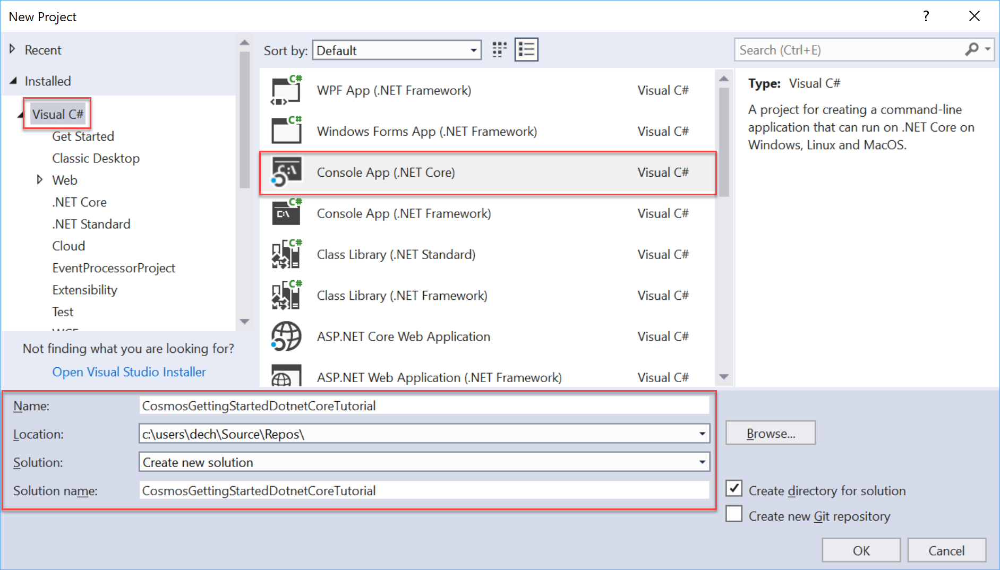
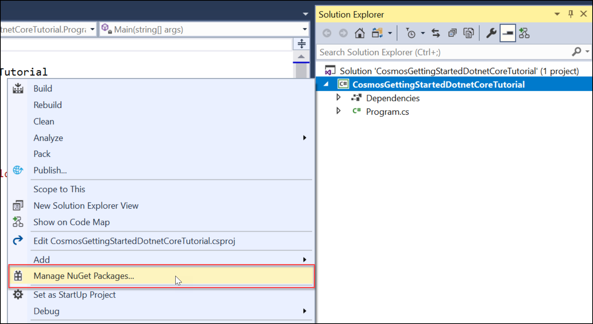
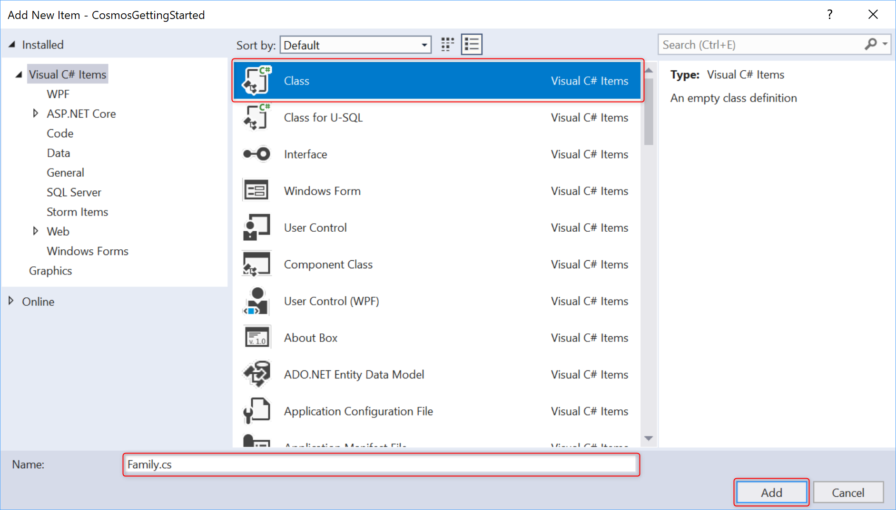

# Build a .NET Core console app to manage data in Azure Cosmos DB SQL API account (SDK Version 3 Preview)

> [!div class="op_single_selector"]
>
> - [.NET Core (Preview)](sql-api-dotnet-core-get-started-preview.md)
> - [.NET Core](sql-api-dotnetcore-get-started.md)
> - [.NET (Preview)](sql-api-dotnet-get-started-preview.md)
> - [.NET](sql-api-get-started.md)
> - [Java](sql-api-java-get-started.md)
> - [Async Java](sql-api-async-java-get-started.md)
> - [Node.js](sql-api-nodejs-get-started.md)

Welcome to the Azure Cosmos DB SQL API getting started with .NET Core tutorial! After following this tutorial, you'll have a .NET Core console application that creates and queries Azure Cosmos DB resources. This tutorial uses [Version 3.0+](https://www.nuget.org/packages/Microsoft.Azure.Cosmos) of the Azure Cosmos DB .NET SDK, which targets [.NET Standard 2.0.](https://docs.microsoft.com/dotnet/standard/net-standard)

This tutorial covers:

> [!div class="checklist"]
>
> - Creating and connecting to an Azure Cosmos account
> - Configuring your project in Visual Studio
> - Creating a database and a container
> - Adding items to the container
> - Querying the container
> - CRUD operations on the item
> - Deleting the database

Don't have time create the application? Don't worry! The complete solution is available on [GitHub](https://github.com/Azure-Samples/cosmos-dotnet-core-getting-started). Jump to the [Get the complete solution section](#GetSolution) for quick instructions.

Want to build a Xamarin iOS, Android, or Forms application using the SQL API and .NET Core SDK? See [Build mobile applications with Xamarin and Azure Cosmos DB](mobile-apps-with-xamarin.md).

## Prerequisites

- An active Azure account. If you don't have one, you can sign up for a [free account](https://azure.microsoft.com/free/).

  [!INCLUDE [cosmos-db-emulator-docdb-api](../../includes/cosmos-db-emulator-docdb-api.md)]

- If you don’t already have Visual Studio 2017 installed, you can download and use the free [Visual Studio 2017 Community Edition](https://www.visualstudio.com/downloads/). If you are developing a Universal Windows Platform (UWP) app, you should use **Visual Studio 2017 with version 15.4** or higher. Make sure that you enable the **Azure development** workload during the Visual Studio setup.

  - If you're working on MacOS or Linux, you can develop .NET Core apps from the command line by installing the [.NET Core SDK](https://www.microsoft.com/net/core#macos) for the platform of your choice.

  - If you're working on Windows, you can develop .NET Core apps from the command line by installing the [.NET Core SDK](https://www.microsoft.com/net/core#windows).

  - You can use your own editor, or download [Visual Studio Code](https://code.visualstudio.com/), which is free and works on Windows, Linux, and MacOS.

## Step 1: Create an Azure Cosmos DB account

Let's create an Azure Cosmos DB account. If you already have an account you want to use, you can skip ahead to [Setup your Visual Studio Solution](#SetupVS). If you are using the Azure Cosmos DB Emulator, follow the steps at [Azure Cosmos DB Emulator](local-emulator.md) to setup the emulator and skip ahead to [Setup your Visual Studio project](#SetupVS).

[!INCLUDE [create-dbaccount](../../includes/cosmos-db-create-dbaccount.md)]

## <a id="SetupVS"></a>Step 2: Setup your Visual Studio project

1. Open **Visual Studio 2017** on your computer.
1. On the **File** menu, select **New**, and then choose **Project**.
1. In the **New Project** dialog, select **Visual C#** / **Console App (.NET Core)**, name your project, and then click **OK**.
   
1. In the **Solution Explorer**, right click on your new console application, which is under your Visual Studio solution, and then click **Manage NuGet Packages...**

   

1. In the **NuGet** tab, click **Browse**, and type **Microsoft.Azure.Cosmos** in the search box.
1. Within the results, find **Microsoft.Azure.Cosmos** and click **Install**.
   The package ID for the Azure Cosmos DB SQL API Client Library is [Microsoft Azure Cosmos DB Client Library](https://www.nuget.org/packages/Microsoft.Azure.Cosmos/).
   

   If you get a message about reviewing changes to the solution, click **OK**. If you get a message about license acceptance, click **I accept**.

Great! Now that we finished the setup, let's start writing some code. You can find a completed code project of this tutorial at [GitHub](https://github.com/Azure-Samples/cosmos-dotnet-core-getting-started/).

## <a id="Connect"></a>Step 3: Connect to an Azure Cosmos DB account

1. First, replace the references at the beginning of your C# application, in the **Program.cs** file with these references:

   ```csharp
   using System;
   using System.Threading.Tasks;
   using Microsoft.Azure.Cosmos;
   using System.Collections.Generic;
   using System.Net;
   ```

1. Now, add these constants and variables into your public class `Program`.

   ```csharp
   public class Program
   {
       // ADD THIS PART TO YOUR CODE

       // The Azure Cosmos DB endpoint for running this sample.
       private static readonly string EndpointUri = "<your endpoint here>";
       // The primary key for the Azure Cosmos account.
       private static readonly string PrimaryKey = "<your primary key>";

       // The Cosmos client instance
       private CosmosClient cosmosClient;

       // The database we will create
       private CosmosDatabase database;

       // The container we will create.
       private CosmosContainer container;

       // The name of the database and container we will create
       private string databaseId = "FamilyDatabase";
       private string containerId = "FamilyContainer";
   }
   ```

   Note, if you are familiar with the previous version of the .NET SDK, you may be used to seeing the terms 'collection' and 'document.' Because Azure Cosmos DB supports multiple API models, version 3.0+ of the .NET SDK uses the generic terms 'container' and 'item.' A container can be a collection, graph, or table. An item can be a document, edge/vertex, or row, and is the content inside a container. [Learn more about databases, containers, and items.](databases-containers-items.md)

1. Retrieve your endpoint URL and primary key from the [Azure portal](https://portal.azure.com).

   In the Azure portal, navigate to your Azure Cosmos DB account, and then click **Keys**.

   Copy the URI from the portal and paste it into `<your endpoint URL>` in the `Program.cs` file. Copy the PRIMARY KEY from the portal and paste it into `<your primary key>`.

   

1. Next, we'll create a new instance of `CosmosClient` and set up some scaffolding for our program.

   Below the **Main** method, add a new asynchronous task called **GetStartedDemoAsync**, which will instantiate our new `CosmosClient`. We will use **GetStartedDemoAsync** as the entry point that calls methods that operate on Azure Cosmos DB resources.

   ```csharp
   public static async Task Main(string[] args)
   {
   }

   // ADD THIS PART TO YOUR CODE
   /*
       Entry point to call methods that operate on Azure Cosmos DB resources in this sample
   */
   public async Task GetStartedDemoAsync()
   {
       // Create a new instance of the Cosmos Client
       this.cosmosClient = new CosmosClient(EndpointUri, PrimaryKey);
   }
   ```

1. Add the following code to run the **GetStartedDemoAsync** asynchronous task from your **Main** method. The **Main** method will catch exceptions and write them to the console.

   ```csharp
   public static async Task Main(string[] args)
   {
       // ADD THIS PART TO YOUR CODE
       try
       {
           Console.WriteLine("Beginning operations...\n");
           Program p = new Program();
           await p.GetStartedDemoAsync();
       }
       catch (CosmosException de)
       {
           Exception baseException = de.GetBaseException();
           Console.WriteLine("{0} error occurred: {1}\n", de.StatusCode, de);
       }
       catch (Exception e)
       {
           Console.WriteLine("Error: {0}\n", e);
       }
       finally
       {
           Console.WriteLine("End of demo, press any key to exit.");
           Console.ReadKey();
       }
   }
   ```

1. Select **F5** to run your application. The console window output displays the message `End of demo, press any key to exit.` confirming that the connection to Azure Cosmos DB was made. You can then close the console window.

Congratulations! You have successfully connected to an Azure Cosmos DB account.

## Step 4: Create a database

A database can be created by using either the [**CreateDatabaseIfNotExistsAsync**](https://aka.ms/CosmosDotnetAPIDocs) or [**CreateDatabaseAsync**](https://aka.ms/CosmosDotnetAPIDocs) function of the **CosmosDatabases** class. A database is the logical container of items partitioned across containers.

1. Copy and paste the **CreateDatabase** method below your **GetStartedDemoAsync** method. **CreateDatabase** will create a new database with id `FamilyDatabase` if it does not already exist, with the id specified from the `databaseId` field.

   ```csharp
   /*
       Create the database if it does not exist
   */
   private async Task CreateDatabase()
   {
       // Create a new database
       this.database = await this.cosmosClient.Databases.CreateDatabaseIfNotExistsAsync(databaseId);
       Console.WriteLine("Created Database: {0}\n", this.database.Id);
   }
   ```

1. Copy and paste the code below where you instantiated the CosmosClient to call the **CreateDatabase** method you just added.

   ```csharp
   public async Task GetStartedDemoAsync()
   {
       // Create a new instance of the Cosmos Client
       this.cosmosClient = new CosmosClient(EndpointUri, PrimaryKey);

       //ADD THIS PART TO YOUR CODE
       await this.CreateDatabase();
   }
   ```

   At this point, your code should now look like this, with your endpoint and primary key filled in. Note your namespace will differ based on the name of your project.

   ```csharp
   using System;
   using System.Threading.Tasks;
   using Microsoft.Azure.Cosmos;
   using System.Collections.Generic;
   using System.Net;

   namespace CosmosGettingStartedDotnetCoreTutorial
   {
       class Program
       {
           // The Azure Cosmos DB endpoint for running this sample.
           private static readonly string EndpointUri = "<your endpoint here>";
           // The primary key for the Azure Cosmos account.
           private static readonly string PrimaryKey = "<your primary key>";

           // The Cosmos client instance
           private CosmosClient cosmosClient;

           // The database we will create
           private CosmosDatabase database;

           // The container we will create.
           private CosmosContainer container;

           // The name of the database and container we will create
           private string databaseId = "FamilyDatabase";
           private string containerId = "FamilyContainer";

           public static async Task Main(string[] args)
           {
               try
               {
                   Console.WriteLine("Beginning operations...");
                   Program p = new Program();
                   await p.GetStartedDemoAsync();
               }
               catch (CosmosException de)
               {
                   Exception baseException = de.GetBaseException();
                   Console.WriteLine("{0} error occurred: {1}\n", de.StatusCode, de);
               }
               catch (Exception e)
               {
                   Console.WriteLine("Error: {0}\n", e);
               }
               finally
               {
                   Console.WriteLine("End of demo, press any key to exit.");
                   Console.ReadKey();
               }
           }

           /*
               Entry point to call methods that operate on Azure Cosmos DB resources in this sample
           */
           public async Task GetStartedDemoAsync()
           {
               // Create a new instance of the Cosmos Client
               this.cosmosClient = new CosmosClient(EndpointUri, PrimaryKey);
               await this.CreateDatabase();
           }

           /*
               Create the database if it does not exist
           */
           private async Task CreateDatabase()
           {
               // Create a new database
               this.database = await this.cosmosClient.Databases.CreateDatabaseIfNotExistsAsync(databaseId);
               Console.WriteLine("Created Database: {0}\n", this.database.Id);
           }
       }
   }
   ```

Select **F5** to run your application.

Congratulations! You have successfully created an Azure Cosmos DB database.

## <a id="CreateColl"></a>Step 5: Create a container

> [!WARNING]
> Calling the method **CreateContainerIfNotExistsAsync** will create a new container, which has pricing implications. For more details, please visit our [pricing page](https://azure.microsoft.com/pricing/details/cosmos-db/).

A container can be created by using either the [**CreateContainerIfNotExistsAsync**](https://aka.ms/CosmosDotnetAPIDocs) or [**CreateContainerAsync**](https://aka.ms/CosmosDotnetAPIDocs) function in the **CosmosContainers** class. A container consists of items (which in the case of the SQL API is JSON documents) and associated JavaScript server-side application logic, e.g. stored procedures, user-defined functions, and triggers.

1. Copy and paste the **CreateContainer** method below your **CreateDatabase** method. **CreateContainer** will create a new container with id `FamilyContainer` if it does not already exist, with the id specified from the `containerId` field.

   ```csharp
   /*
       Create the container if it does not exist.
       Specify "/LastName" as the partition key since we're storing family information, to ensure good distribution of requests and storage.
   */
   private async Task CreateContainer()
   {
       // Create a new container
       this.container = await this.database.Containers.CreateContainerIfNotExistsAsync(containerId, "/LastName");
       Console.WriteLine("Created Container: {0}\n", this.container.Id);
   }
   ```

1. Copy and paste the code below where you instantiated the CosmosClient to call the **CreateContainer** method you just added.

   ```csharp
   public async Task GetStartedDemoAsync()
   {
       // Create a new instance of the Cosmos Client
       this.cosmosClient = new CosmosClient(EndpointUri, PrimaryKey);
       await this.CreateDatabase();

       //ADD THIS PART TO YOUR CODE
       await this.CreateContainer();
   }
   ```

Select **F5** to run your application.

Congratulations! You have successfully created an Azure Cosmos DB container.

## <a id="CreateDoc"></a>Step 6: Add items to the container

An item can be created by using the [**CreateItemAsync**](https://aka.ms/CosmosDotnetAPIDocs) function of the **CosmosItems** class. When using the SQL API, items are projected as documents, which are user-defined (arbitrary) JSON content. You can now insert an item into your Azure Cosmos DB container.

First, we need to create a **Family** class that will represent objects stored within Azure Cosmos DB in this sample. We will also create **Parent**, **Child**, **Pet**, **Address** subclasses that are used within **Family**. Note that documents must have an **Id** property serialized as **id** in JSON.

1.  Select **Ctrl+Shift+A** to open the **Add New Item** dialog. Add a new class **Family.cs** to your project.

    

1.  Copy and paste the **Family**, **Parent**, **Child**, **Pet**, and **Address** class into **Family.cs**. Note your namespace will differ based on the name of your project.

    ```csharp
    using Newtonsoft.Json;

    namespace CosmosGettingStartedDotnetCoreTutorial
    {
        public class Family
        {
            [JsonProperty(PropertyName = "id")]
            public string Id { get; set; }
            public string LastName { get; set; }
            public Parent[] Parents { get; set; }
            public Child[] Children { get; set; }
            public Address Address { get; set; }
            public bool IsRegistered { get; set; }
            public override string ToString()
            {
                return JsonConvert.SerializeObject(this);
            }
        }

        public class Parent
        {
            public string FamilyName { get; set; }
            public string FirstName { get; set; }
        }

        public class Child
        {
            public string FamilyName { get; set; }
            public string FirstName { get; set; }
            public string Gender { get; set; }
            public int Grade { get; set; }
            public Pet[] Pets { get; set; }
        }

        public class Pet
        {
            public string GivenName { get; set; }
        }

        public class Address
        {
            public string State { get; set; }
            public string County { get; set; }
            public string City { get; set; }
        }
    }
    ```

1.  Navigate back to **Program.cs** and add the **AddItemsToContainer** method under your **CreateContainer** method.
    The code checks to make sure an item with the same id does not already exist before creating it. We will insert two items, one each for the Andersen Family and the Wakefield Family.

    ```csharp
     /*
         Add Family items to the container
     */
     private async Task AddItemsToContainer()
     {
         // Create a family object for the Andersen family
         Family andersenFamily = new Family
         {
             Id = "Andersen.1",
             LastName = "Andersen",
             Parents = new Parent[]
             {
                 new Parent { FirstName = "Thomas" },
                 new Parent { FirstName = "Mary Kay" }
             },
             Children = new Child[]
             {
                 new Child
                 {
                     FirstName = "Henriette Thaulow",
                     Gender = "female",
                     Grade = 5,
                     Pets = new Pet[]
                     {
                         new Pet { GivenName = "Fluffy" }
                     }
                 }
             },
             Address = new Address { State = "WA", County = "King", City = "Seattle" },
             IsRegistered = true
         };

         // Read the item to see if it exists. Note ReadItemAsync will not throw an exception if an item does not exist. Instead, we check the StatusCode property off the response object.
         CosmosItemResponse<Family> andersenFamilyResponse = await this.container.Items.ReadItemAsync<Family>(andersenFamily.LastName, andersenFamily.Id);

         if (andersenFamilyResponse.StatusCode == HttpStatusCode.NotFound)
         {
             // Create an item in the container representing the Andersen family. Note we provide the value of the partition key for this item, which is "Andersen"
             andersenFamilyResponse = await this.container.Items.CreateItemAsync<Family>(andersenFamily.LastName, andersenFamily);

             // Note that after creating the item, we can access the body of the item with the Resource property off the CosmosItemResponse.
             //We can also access the RequestCharge property to see the amount of RUs consumed on this request.
             Console.WriteLine("Created item in database with id: {0} Operation consumed {1} RUs.\n", andersenFamilyResponse.Resource.Id, andersenFamilyResponse.RequestCharge);
         }
         else
         {
             Console.WriteLine("Item in database with id: {0} already exists\n", andersenFamilyResponse.Resource.Id);
         }

         // Create a family object for the Wakefield family
         Family wakefieldFamily = new Family
         {
             Id = "Wakefield.7",
             LastName = "Wakefield",
             Parents = new Parent[]
             {
                 new Parent { FamilyName = "Wakefield", FirstName = "Robin" },
                 new Parent { FamilyName = "Miller", FirstName = "Ben" }
             },
             Children = new Child[]
             {
                 new Child
                 {
                     FamilyName = "Merriam",
                     FirstName = "Jesse",
                     Gender = "female",
                     Grade = 8,
                     Pets = new Pet[]
                     {
                         new Pet { GivenName = "Goofy" },
                         new Pet { GivenName = "Shadow" }
                     }
                 },
                 new Child
                 {
                     FamilyName = "Miller",
                     FirstName = "Lisa",
                     Gender = "female",
                     Grade = 1
                 }
             },
             Address = new Address { State = "NY", County = "Manhattan", City = "NY" },
             IsRegistered = false
         };

         // Read the item to see if it exists
         CosmosItemResponse<Family> wakefieldFamilyResponse = await this.container.Items.ReadItemAsync<Family>(wakefieldFamily.LastName, wakefieldFamily.Id);

         if (wakefieldFamilyResponse.StatusCode == HttpStatusCode.NotFound)
         {
             // Create an item in the container representing the Wakefield family. Note we provide the value of the partition key for this item, which is "Wakefield"
             wakefieldFamilyResponse = await this.container.Items.CreateItemAsync<Family>(wakefieldFamily.LastName, wakefieldFamily);

             // Note that after creating the item, we can access the body of the item with the Resource property off the CosmosItemResponse.
             //We can also access the RequestCharge property to see the amount of RUs consumed on this request.
             Console.WriteLine("Created item in database with id: {0} Operation consumed {1} RUs.\n", wakefieldFamilyResponse.Resource.Id, wakefieldFamilyResponse.RequestCharge);
         }
         else
         {
             Console.WriteLine("Item in database with id: {0} already exists\n", wakefieldFamilyResponse.Resource.Id);
         }
     }
    
    ```

1.  Add a call to `AddItemsToContainer` in the `GetStartedDemoAsync` method.

    ```csharp
    public async Task GetStartedDemoAsync()
    {
        // Create a new instance of the Cosmos Client
        this.cosmosClient = new CosmosClient(EndpointUri, PrimaryKey);
        await this.CreateDatabase();
        await this.CreateContainer();

        //ADD THIS PART TO YOUR CODE
        await this.AddItemsToContainer();
    }
    ```

Select **F5** to run your application.

Congratulations! You have successfully created two Azure Cosmos DB items.

## <a id="Query"></a>Step 7: Query Azure Cosmos DB resources

Azure Cosmos DB supports rich [queries](sql-api-sql-query.md) against JSON documents stored in each collection. The following sample code shows how to run a query against the items we inserted in the previous step.

1. Copy and paste the **RunQuery** method below your **AddItemsToContainer** method.

   ```csharp
   /*
       Run a query (using Azure Cosmos DB SQL syntax) against the container
   */
   private async Task RunQuery()
   {
       var sqlQueryText = "SELECT * FROM c WHERE c.LastName = 'Andersen'";
       var partitionKeyValue = "Andersen";

       Console.WriteLine("Running query: {0}\n", sqlQueryText);

       CosmosSqlQueryDefinition queryDefinition = new CosmosSqlQueryDefinition(sqlQueryText);
       CosmosResultSetIterator<Family> queryResultSetIterator = this.container.Items.CreateItemQuery<Family>(queryDefinition, partitionKeyValue);

       List<Family> families = new List<Family>();

       while (queryResultSetIterator.HasMoreResults)
       {
           CosmosQueryResponse<Family> currentResultSet = await queryResultSetIterator.FetchNextSetAsync();
           foreach (Family family in currentResultSet)
           {
               families.Add(family);
               Console.WriteLine("\tRead {0}\n", family);
           }
       }
   }
   ```

1. Add a call to `RunQuery` in the `GetStartedDemoAsync` method.

   ```csharp
   public async Task GetStartedDemoAsync()
   {
       // Create a new instance of the Cosmos Client
       this.cosmosClient = new CosmosClient(EndpointUri, PrimaryKey);
       await this.CreateDatabase();
       await this.CreateContainer();
       await this.AddItemsToContainer();

       //ADD THIS PART TO YOUR CODE
       await this.RunQuery();
   }
   ```

Select **F5** to run your application.

Congratulations! You have successfully queried against an Azure Cosmos DB container.

## <a id="ReplaceItem"></a>Step 8: Replace a JSON item

Now, we will update an item in Azure Cosmos DB.

1. Copy and paste the **ReplaceFamilyItem** method below your **RunQuery** method. Note we are changing the `IsRegistered` property of the Family and the `Grade` of one of the children.

   ```csharp
   /*
   Update an item in the container
   */
   private async Task ReplaceFamilyItem()
   {
       CosmosItemResponse<Family> wakefieldFamilyResponse = await this.container.Items.ReadItemAsync<Family>("Wakefield", "Wakefield.7");
       var itemBody = wakefieldFamilyResponse.Resource;

       // update registration status from false to true
       itemBody.IsRegistered = true;
       // update grade of child
       itemBody.Children[0].Grade = 6;

       // replace the item with the updated content
       wakefieldFamilyResponse = await this.container.Items.ReplaceItemAsync<Family>(itemBody.LastName, itemBody.Id, itemBody);
       Console.WriteLine("Updated Family [{0},{1}]\n. Body is now: {2}\n", itemBody.LastName, itemBody.Id, wakefieldFamilyResponse.Resource);
   }
   ```

1. Add a call to `ReplaceFamilyItem` in the `GetStartedDemo` method.

   ```csharp
   public async Task GetStartedDemoAsync()
   {
       // Create a new instance of the Cosmos Client
       this.cosmosClient = new CosmosClient(EndpointUri, PrimaryKey);
       await this.CreateDatabase();
       await this.CreateContainer();
       await this.AddItemsToContainer();
       await this.RunQuery();

       //ADD THIS PART TO YOUR CODE
       await this.ReplaceFamilyItem();
   }
   ```

Select **F5** to run your application.

Congratulations! You have successfully replaced an Azure Cosmos DB item.

## <a id="DeleteDocument"></a>Step 9: Delete item

Now, we will delete an item in Azure Cosmos DB.

1. Copy and paste the **DeleteFamilyItem** method below your **ReplaceFamilyItem** method.

   ```csharp
   /*
   Delete an item in the container
   */
   private async Task DeleteFamilyItem()
   {
       var partitionKeyValue = "Wakefield";
       var familyId = "Wakefield.7";

       // Delete an item. Note we must provide the partition key value and id of the item to delete
       CosmosItemResponse<Family> wakefieldFamilyResponse = await this.container.Items.DeleteItemAsync<Family>(partitionKeyValue, familyId);
       Console.WriteLine("Deleted Family [{0},{1}]\n", partitionKeyValue, familyId);
   }
   ```

1. Add a call to `DeleteFamilyItem` in the `GetStartedDemo` method.

   ```csharp
   public async Task GetStartedDemoAsync()
   {
       // Create a new instance of the Cosmos Client
       this.cosmosClient = new CosmosClient(EndpointUri, PrimaryKey);
       await this.CreateDatabase();
       await this.CreateContainer();
       await this.AddItemsToContainer();
       await this.RunQuery();
       await this.ReplaceFamilyItem();

       //ADD THIS PART TO YOUR CODE
       await this.DeleteFamilyItem();
   }
   ```

Select **F5** to run your application.

Congratulations! You have successfully deleted an Azure Cosmos DB item.

## <a id="DeleteDatabase"></a>Step 10: Delete the database

Now we will delete our database. Deleting the created database will remove the database and all children resources (containers, items, and any stored procedures, user-defined functions, and triggers). We will also dispose of the **CosmosClient** instance.

1. Copy and paste the **DeleteDatabaseAndCleanup** method below your **DeleteFamilyItem** method.

   ```csharp
   /*
   Delete the database and dispose of the Cosmos Client instance
   */
   private async Task DeleteDatabaseAndCleanup()
   {
       CosmosDatabaseResponse databaseResourceResponse = await this.database.DeleteAsync();
       // Also valid: await this.cosmosClient.Databases["FamilyDatabase"].DeleteAsync();

       Console.WriteLine("Deleted Database: {0}\n", this.databaseId);

       //Dispose of CosmosClient
       this.cosmosClient.Dispose();
   }
   ```

1. Add a call to `DeleteDatabaseAndCleanup` in the `GetStartedDemo` method.

   ```csharp
   public async Task GetStartedDemoAsync()
   {
       // Create a new instance of the Cosmos Client
       this.cosmosClient = new CosmosClient(EndpointUri, PrimaryKey);
       await this.CreateDatabase();
       await this.CreateContainer();
       await this.AddItemsToContainer();
       await this.RunQuery();
       await this.ReplaceFamilyItem();
       await this.DeleteFamilyItem();

       //ADD THIS PART TO YOUR CODE
       await this.DeleteDatabaseAndCleanup();
   }
   ```

Select **F5** to run your application.

Congratulations! You have successfully deleted an Azure Cosmos DB database.

## <a id="Run"></a>Step 11: Run your C# console application all together!

Select **F5** in Visual Studio to build the application in debug mode.

You should see the output of your entire get started app in a console window. The output will show the results of the queries we added and should match the example text below.

```
Beginning operations...

Created Database: FamilyDatabase

Created Container: FamilyContainer

Created item in database with id: Andersen.1 Operation consumed 11.43 RUs.

Created item in database with id: Wakefield.7 Operation consumed 14.29 RUs.

Running query: SELECT * FROM c WHERE c.LastName = 'Andersen'

        Read {"id":"Andersen.1","LastName":"Andersen","Parents":[{"FamilyName":null,"FirstName":"Thomas"},{"FamilyName":null,"FirstName":"Mary Kay"}],"Children":[{"FamilyName":null,"FirstName":"Henriette Thaulow","Gender":"female","Grade":5,"Pets":[{"GivenName":"Fluffy"}]}],"Address":{"State":"WA","County":"King","City":"Seattle"},"IsRegistered":false}

Updated Family [Wakefield,Wakefield.7].
        Body is now: {"id":"Wakefield.7","LastName":"Wakefield","Parents":[{"FamilyName":"Wakefield","FirstName":"Robin"},{"FamilyName":"Miller","FirstName":"Ben"}],"Children":[{"FamilyName":"Merriam","FirstName":"Jesse","Gender":"female","Grade":6,"Pets":[{"GivenName":"Goofy"},{"GivenName":"Shadow"}]},{"FamilyName":"Miller","FirstName":"Lisa","Gender":"female","Grade":1,"Pets":null}],"Address":{"State":"NY","County":"Manhattan","City":"NY"},"IsRegistered":true}

Deleted Family [Wakefield,Wakefield.7]

Deleted Database: FamilyDatabase

End of demo, press any key to exit.
```

Congratulations! You've completed the tutorial and have a working C# console application!

## <a id="GetSolution"></a> Get the complete tutorial solution

To build the GetStarted solution that contains all the samples in this article, you will need the following:

- An active Azure account. If you don't have one, you can sign up for a [free account](https://azure.microsoft.com/free/).
- An [Azure Cosmos DB account][cosmos-db-create-account].
- The [GetStarted](https://github.com/Azure-Samples/cosmos-dotnet-core-getting-started) solution available on GitHub.

To restore the references to the SQL API for Azure Cosmos DB .NET Core SDK in Visual Studio, right-click the **GetStarted** solution in Solution Explorer, and then select **Restore NuGet Packages**. Next, in the **Program.cs** file, update the `EndpointUri` and `PrimaryKey` values as described in [Connect to an Azure Cosmos DB account](#Connect).

## Next steps

In this tutorial, you've learned how to build a .NET Core app to manage Azure Cosmos DB SQL API data. You can now import additional data to your Cosmos DB account.

> [!div class="nextstepaction"]
> [Import data into Azure Cosmos DB](import-data.md)

[cosmos-db-create-account]: create-sql-api-dotnet-preview.md#create-account
