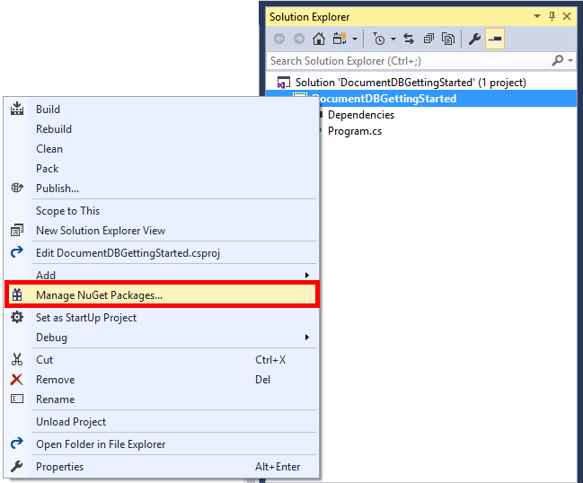
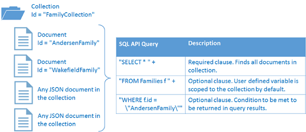

# Azure Cosmos DB: Getting started with the SQL API and .NET Core

> [!div class="op_single_selector"]
> * [.NET](sql-api-get-started.md)
> * [.NET Core](sql-api-dotnetcore-get-started.md)
> * [Java](sql-api-java-get-started.md)
> * [Async Java](sql-api-async-java-get-started.md)
> * [Node.js](sql-api-nodejs-get-started.md)
> 

Welcome to the SQL API for Azure Cosmos DB getting started with .NET Core tutorial! After following this tutorial, you'll have a console application that creates and queries Azure Cosmos DB resources.

This tutorial covers:

* Creating and connecting to an Azure Cosmos DB account
* Configuring your Visual Studio Solution
* Creating an online database
* Creating a collection
* Creating JSON documents
* Querying the collection
* Replacing a document
* Deleting a document
* Deleting the database

Don't have time? Don't worry! The complete solution is available on [GitHub](https://github.com/Azure-Samples/documentdb-dotnet-core-getting-started). Jump to the [Get the complete solution section](#GetSolution) for quick instructions.

Want to build a Xamarin iOS, Android, or Forms application using the SQL API and .NET Core SDK? See [Build mobile applications with Xamarin and Azure Cosmos DB](mobile-apps-with-xamarin.md).

Now let's get started!

## Prerequisites

* An active Azure account. If you don't have one, you can sign up for a [free account](https://azure.microsoft.com/free/). 

  [!INCLUDE [cosmos-db-emulator-docdb-api](../../includes/cosmos-db-emulator-docdb-api.md)]

* If you don’t already have Visual Studio 2017 installed, you can download and use the free [Visual Studio 2017 Community Edition](https://www.visualstudio.com/downloads/). If you are developing a Universal Windows Platform (UWP) app, you should use **Visual Studio 2017 with version 15.4** or higher. Make sure that you enable **Azure development** during the Visual Studio setup.
    * If you're working on MacOS or Linux, you can develop .NET Core apps from the command line by installing the [.NET Core SDK](https://www.microsoft.com/net/core#macos) for the platform of your choice. 
    * If you're working on Windows, you can develop .NET Core apps from the command line by installing the [.NET Core SDK](https://www.microsoft.com/net/core#windows). 
    * You can use your own editor, or download [Visual Studio Code](https://code.visualstudio.com/), which is free and works on Windows, Linux, and MacOS. 

## Step 1: Create an Azure Cosmos DB account
Let's create an Azure Cosmos DB account. If you already have an account you want to use, you can skip ahead to [Setup your Visual Studio Solution](#SetupVS). If you are using the Azure Cosmos DB Emulator, follow the steps at [Azure Cosmos DB Emulator](local-emulator.md) to setup the emulator and skip ahead to [Setup your Visual Studio Solution](#SetupVS).

[!INCLUDE [cosmos-db-create-dbaccount](../../includes/cosmos-db-create-dbaccount.md)]

## <a id="SetupVS"></a>Step 2: Setup your Visual Studio solution
1. Open **Visual Studio 2017** on your computer.
2. On the **File** menu, select **New**, and then choose **Project**.
3. In the **New Project** dialog, select **Templates** / **Visual C#** / **.NET Core**/**Console Application (.NET Core)**, name your project **DocumentDBGettingStarted**, and then click **OK**.

   
4. In the **Solution Explorer**, right click on **DocumentDBGettingStarted**.
5. Then without leaving the menu, click on **Manage NuGet Packages...**.

   
6. In the **NuGet** tab, click **Browse** at the top of the window, and type **azure documentdb** in the search box.
7. Within the results, find **Microsoft.Azure.DocumentDB.Core** and click **Install**.
   The package ID for the library is [Microsoft.Azure.DocumentDB.Core](https://www.nuget.org/packages/Microsoft.Azure.DocumentDB.Core). If you are targeting a .NET Framework version (like net461) that is not supported by this .NET Core NuGet package, then use [Microsoft.Azure.DocumentDB](https://www.nuget.org/packages/Microsoft.Azure.DocumentDB) that supports all .NET Framework versions starting .NET Framework 4.5.
8. At the prompts, accept the NuGet package installations and the license agreement.

Great! Now that setup is complete, let's start writing some code. You can find a completed code project of this tutorial at [GitHub](https://github.com/Azure-Samples/documentdb-dotnet-core-getting-started).

## <a id="Connect"></a>Step 3: Connect to an Azure Cosmos DB account
First, add these references to the beginning of your C# application, in the Program.cs file:

```csharp
using System;

// ADD THIS PART TO YOUR CODE
using System.Linq;
using System.Threading.Tasks;
using System.Net;
using Microsoft.Azure.Documents;
using Microsoft.Azure.Documents.Client;
using Newtonsoft.Json;
```

> [!IMPORTANT]
> In order to complete this tutorial, make sure you add the dependencies above.

Now, add these two constants and your *client* variable underneath your public class *Program*.

```csharp
class Program
{
    // ADD THIS PART TO YOUR CODE
    private const string EndpointUri = "<your endpoint URI>";
    private const string PrimaryKey = "<your key>";
    private DocumentClient client;
```

Next, head to the [Azure portal](https://portal.azure.com) to retrieve your URI and primary key. The Azure Cosmos DB URI and primary key are necessary for your application to understand where to connect to, and for Azure Cosmos DB to trust your application's connection.

In the Azure portal, navigate to your Azure Cosmos DB account, and then click **Keys**.

Copy the URI from the portal and paste it into `<your endpoint URI>` in the program.cs file. Then copy the PRIMARY KEY from the portal and paste it into `<your key>`. If you are using the Azure Cosmos DB Emulator, use `https://localhost:8081` as the endpoint, and the well-defined authorization key from [How to develop using the Azure Cosmos DB Emulator](local-emulator.md). Make sure to remove the < and > but leave the double quotes around your endpoint and key.

![Screen shot of the Azure portal used by the NoSQL tutorial to create a C# console application. Shows an Azure Cosmos DB account, with the ACTIVE hub highlighted, the KEYS button highlighted on the Azure Cosmos DB account page, and the URI, PRIMARY KEY, and SECONDARY KEY values highlighted on the Keys page][keys]

We'll start the getting started application by creating a new instance of the **DocumentClient**.

Below the **Main** method, add this new asynchronous task called **GetStartedDemo**, which will instantiate our new **DocumentClient**.

```csharp
static void Main(string[] args)
{
}

// ADD THIS PART TO YOUR CODE
private async Task GetStartedDemo()
{
    this.client = new DocumentClient(new Uri(EndpointUri), PrimaryKey);
}
```

Add the following code to run your asynchronous task from your **Main** method. The **Main** method catches exceptions and write them to the console.

```csharp
static void Main(string[] args)
{
        // ADD THIS PART TO YOUR CODE
        try
        {
                Program p = new Program();
                p.GetStartedDemo().Wait();
        }
        catch (DocumentClientException de)
        {
                Exception baseException = de.GetBaseException();
                Console.WriteLine("{0} error occurred: {1}, Message: {2}", de.StatusCode, de.Message, baseException.Message);
        }
        catch (Exception e)
        {
                Exception baseException = e.GetBaseException();
                Console.WriteLine("Error: {0}, Message: {1}", e.Message, baseException.Message);
        }
        finally
        {
                Console.WriteLine("End of demo, press any key to exit.");
                Console.ReadKey();
        }
```

Press the **DocumentDBGettingStarted** button to build and run the application.

Congratulations! You have successfully connected to an Azure Cosmos DB account, let's now take a look at working with Azure Cosmos DB resources.  

## Step 4: Create a database
Before you add the code for creating a database, add a helper method for writing to the console.

Copy and paste the **WriteToConsoleAndPromptToContinue** method underneath the **GetStartedDemo** method.

```csharp
// ADD THIS PART TO YOUR CODE
private void WriteToConsoleAndPromptToContinue(string format, params object[] args)
{
        Console.WriteLine(format, args);
        Console.WriteLine("Press any key to continue ...");
        Console.ReadKey();
}
```

Your Azure Cosmos DB [database](sql-api-resources.md#databases) can be created by using the [CreateDatabaseAsync](https://msdn.microsoft.com/library/microsoft.azure.documents.client.documentclient.createdatabaseasync.aspx) method of the **DocumentClient** class. A database is the logical container of JSON document storage partitioned across collections.

Copy and paste the following code to your **GetStartedDemo** method underneath the client creation. This creates a database named *FamilyDB*.

```csharp
private async Task GetStartedDemo()
{
    this.client = new DocumentClient(new Uri(EndpointUri), PrimaryKey);

    // ADD THIS PART TO YOUR CODE
    await this.client.CreateDatabaseIfNotExistsAsync(new Database { Id = "FamilyDB_oa" });
```

Press the **DocumentDBGettingStarted** button to run your application.

Congratulations! You have successfully created an Azure Cosmos DB database.  

## <a id="CreateColl"></a>Step 5: Create a collection
> [!WARNING]
> **CreateDocumentCollectionAsync** creates a new collection with reserved throughput, which has pricing implications. For more details, please visit our [pricing page](https://azure.microsoft.com/pricing/details/cosmos-db/).

A [collection](sql-api-resources.md#collections) can be created by using the [CreateDocumentCollectionAsync](https://msdn.microsoft.com/library/microsoft.azure.documents.client.documentclient.createdocumentcollectionasync.aspx) method of the **DocumentClient** class. A collection is a container of JSON documents and associated JavaScript application logic.

Copy and paste the following code to your **GetStartedDemo** method underneath the database creation. This creates a document collection named *FamilyCollection_oa*.

```csharp
    this.client = new DocumentClient(new Uri(EndpointUri), PrimaryKey);

    await this.client.CreateDatabaseIfNotExistsAsync("FamilyDB_oa");

    // ADD THIS PART TO YOUR CODE
    await this.client.CreateDocumentCollectionIfNotExistsAsync(UriFactory.CreateDatabaseUri("FamilyDB_oa"), new DocumentCollection { Id = "FamilyCollection_oa" });
```

Press the **DocumentDBGettingStarted** button to run your application.

Congratulations! You have successfully created an Azure Cosmos DB document collection.  

## <a id="CreateDoc"></a>Step 6: Create JSON documents
A [document](sql-api-resources.md#documents) can be created by using the [CreateDocumentAsync](https://msdn.microsoft.com/library/microsoft.azure.documents.client.documentclient.createdocumentasync.aspx) method of the **DocumentClient** class. Documents are user-defined (arbitrary) JSON content. We can now insert one or more documents. If you already have data you'd like to store in your database, you can use Azure Cosmos DB's [Data Migration tool](import-data.md).

First, we need to create a **Family** class that will represent objects stored within Azure Cosmos DB in this sample. We will also create **Parent**, **Child**, **Pet**, **Address** subclasses that are used within **Family**. Note that documents must have an **Id** property serialized as **id** in JSON. Create these classes by adding the following internal sub-classes after the **GetStartedDemo** method.

Copy and paste the **Family**, **Parent**, **Child**, **Pet**, and **Address** classes underneath the **WriteToConsoleAndPromptToContinue** method.

```csharp
private void WriteToConsoleAndPromptToContinue(string format, params object[] args)
{
    Console.WriteLine(format, args);
    Console.WriteLine("Press any key to continue ...");
    Console.ReadKey();
}

// ADD THIS PART TO YOUR CODE
public class Family
{
    [JsonProperty(PropertyName = "id")]
    public string Id { get; set; }
    public string LastName { get; set; }
    public Parent[] Parents { get; set; }
    public Child[] Children { get; set; }
    public Address Address { get; set; }
    public bool IsRegistered { get; set; }
    public override string ToString()
    {
            return JsonConvert.SerializeObject(this);
    }
}

public class Parent
{
    public string FamilyName { get; set; }
    public string FirstName { get; set; }
}

public class Child
{
    public string FamilyName { get; set; }
    public string FirstName { get; set; }
    public string Gender { get; set; }
    public int Grade { get; set; }
    public Pet[] Pets { get; set; }
}

public class Pet
{
    public string GivenName { get; set; }
}

public class Address
{
    public string State { get; set; }
    public string County { get; set; }
    public string City { get; set; }
}
```

Copy and paste the **CreateFamilyDocumentIfNotExists** method underneath your **CreateDocumentCollectionIfNotExists** method.

```csharp
// ADD THIS PART TO YOUR CODE
private async Task CreateFamilyDocumentIfNotExists(string databaseName, string collectionName, Family family)
{
    try
    {
        await this.client.ReadDocumentAsync(UriFactory.CreateDocumentUri(databaseName, collectionName, family.Id));
        this.WriteToConsoleAndPromptToContinue("Found {0}", family.Id);
    }
    catch (DocumentClientException de)
    {
        if (de.StatusCode == HttpStatusCode.NotFound)
        {
            await this.client.CreateDocumentAsync(UriFactory.CreateDocumentCollectionUri(databaseName, collectionName), family);
            this.WriteToConsoleAndPromptToContinue("Created Family {0}", family.Id);
        }
        else
        {
            throw;
        }
    }
}
```

And insert two documents, one each for the Andersen Family and the Wakefield Family.

Copy and paste the code that follows `// ADD THIS PART TO YOUR CODE` to your **GetStartedDemo** method underneath the document collection creation.

```csharp
await this.CreateDatabaseIfNotExistsAsync("FamilyDB_oa");

await this.CreateDocumentCollectionIfNotExists("FamilyDB_oa", "FamilyCollection_oa");

// ADD THIS PART TO YOUR CODE
Family andersenFamily = new Family
{
        Id = "Andersen.1",
        LastName = "Andersen",
        Parents = new Parent[]
        {
                new Parent { FirstName = "Thomas" },
                new Parent { FirstName = "Mary Kay" }
        },
        Children = new Child[]
        {
                new Child
                {
                        FirstName = "Henriette Thaulow",
                        Gender = "female",
                        Grade = 5,
                        Pets = new Pet[]
                        {
                                new Pet { GivenName = "Fluffy" }
                        }
                }
        },
        Address = new Address { State = "WA", County = "King", City = "Seattle" },
        IsRegistered = true
};

await this.CreateFamilyDocumentIfNotExists("FamilyDB_oa", "FamilyCollection_oa", andersenFamily);

Family wakefieldFamily = new Family
{
        Id = "Wakefield.7",
        LastName = "Wakefield",
        Parents = new Parent[]
        {
                new Parent { FamilyName = "Wakefield", FirstName = "Robin" },
                new Parent { FamilyName = "Miller", FirstName = "Ben" }
        },
        Children = new Child[]
        {
                new Child
                {
                        FamilyName = "Merriam",
                        FirstName = "Jesse",
                        Gender = "female",
                        Grade = 8,
                        Pets = new Pet[]
                        {
                                new Pet { GivenName = "Goofy" },
                                new Pet { GivenName = "Shadow" }
                        }
                },
                new Child
                {
                        FamilyName = "Miller",
                        FirstName = "Lisa",
                        Gender = "female",
                        Grade = 1
                }
        },
        Address = new Address { State = "NY", County = "Manhattan", City = "NY" },
        IsRegistered = false
};

await this.CreateFamilyDocumentIfNotExists("FamilyDB_oa", "FamilyCollection_oa", wakefieldFamily);
```

Press the **DocumentDBGettingStarted** button to run your application.

Congratulations! You have successfully created two Azure Cosmos DB documents.  


## <a id="Query"></a>Step 7: Query Azure Cosmos DB resources
Azure Cosmos DB supports rich [queries](sql-api-sql-query.md) against JSON documents stored in each collection.  The following sample code shows various queries - using both Azure Cosmos DB SQL syntax as well as LINQ - that we can run against the documents we inserted in the previous step.

Copy and paste the **ExecuteSimpleQuery** method underneath your **CreateFamilyDocumentIfNotExists** method.

```csharp
// ADD THIS PART TO YOUR CODE
private void ExecuteSimpleQuery(string databaseName, string collectionName)
{
    // Set some common query options
    FeedOptions queryOptions = new FeedOptions { MaxItemCount = -1 };

        // Here we find the Andersen family via its LastName
        IQueryable<Family> familyQuery = this.client.CreateDocumentQuery<Family>(
                UriFactory.CreateDocumentCollectionUri(databaseName, collectionName), queryOptions)
                .Where(f => f.LastName == "Andersen");

        // The query is executed synchronously here, but can also be executed asynchronously via the IDocumentQuery<T> interface
        Console.WriteLine("Running LINQ query...");
        foreach (Family family in familyQuery)
        {
            Console.WriteLine("\tRead {0}", family);
        }

        // Now execute the same query via direct SQL
        IQueryable<Family> familyQueryInSql = this.client.CreateDocumentQuery<Family>(
                UriFactory.CreateDocumentCollectionUri(databaseName, collectionName),
                "SELECT * FROM Family WHERE Family.LastName = 'Andersen'",
                queryOptions);

        Console.WriteLine("Running direct SQL query...");
        foreach (Family family in familyQueryInSql)
        {
                Console.WriteLine("\tRead {0}", family);
        }

        Console.WriteLine("Press any key to continue ...");
        Console.ReadKey();
}
```

Copy and paste the following code to your **GetStartedDemo** method underneath the second document creation.

```csharp
await this.CreateFamilyDocumentIfNotExists("FamilyDB_oa", "FamilyCollection_oa", wakefieldFamily);

// ADD THIS PART TO YOUR CODE
this.ExecuteSimpleQuery("FamilyDB_oa", "FamilyCollection_oa");
```

Press the **DocumentDBGettingStarted** button to run your application.

Congratulations! You have successfully queried against an Azure Cosmos DB collection.

The following diagram illustrates how the Azure Cosmos DB SQL query syntax is called against the collection you created, and the same logic applies to the LINQ query as well.



The [FROM](sql-api-sql-query.md#FromClause) keyword is optional in the query because Azure Cosmos DB queries are already scoped to a single collection. Therefore, "FROM Families f" can be swapped with "FROM root r", or any other variable name you choose. Azure Cosmos DB infers the Families, root, or the variable name you chose, reference the current collection by default.

## <a id="ReplaceDocument"></a>Step 8: Replace JSON document
Azure Cosmos DB supports replacing JSON documents.  

Copy and paste the **ReplaceFamilyDocument** method underneath your **ExecuteSimpleQuery** method.

```csharp
// ADD THIS PART TO YOUR CODE
private async Task ReplaceFamilyDocument(string databaseName, string collectionName, string familyName, Family updatedFamily)
{
    await this.client.ReplaceDocumentAsync(UriFactory.CreateDocumentUri(databaseName, collectionName, familyName), updatedFamily);
    this.WriteToConsoleAndPromptToContinue("Replaced Family {0}", familyName);
}
```

Copy and paste the following code to your **GetStartedDemo** method underneath the query execution. After replacing the document, this will run the same query again to view the changed document.

```csharp
await this.CreateFamilyDocumentIfNotExists("FamilyDB_oa", "FamilyCollection_oa", wakefieldFamily);

this.ExecuteSimpleQuery("FamilyDB_oa", "FamilyCollection_oa");

// ADD THIS PART TO YOUR CODE
// Update the Grade of the Andersen Family child
andersenFamily.Children[0].Grade = 6;

await this.ReplaceFamilyDocument("FamilyDB_oa", "FamilyCollection_oa", "Andersen.1", andersenFamily);

this.ExecuteSimpleQuery("FamilyDB_oa", "FamilyCollection_oa");
```

Press the **DocumentDBGettingStarted** button to run your application.

Congratulations! You have successfully replaced an Azure Cosmos DB document.

## <a id="DeleteDocument"></a>Step 9: Delete JSON document
Azure Cosmos DB supports deleting JSON documents.  

Copy and paste the **DeleteFamilyDocument** method underneath your **ReplaceFamilyDocument** method.

```csharp
// ADD THIS PART TO YOUR CODE
private async Task DeleteFamilyDocument(string databaseName, string collectionName, string documentName)
{
    await this.client.DeleteDocumentAsync(UriFactory.CreateDocumentUri(databaseName, collectionName, documentName));
    Console.WriteLine("Deleted Family {0}", documentName);
}
```

Copy and paste the following code to your **GetStartedDemo** method underneath the second query execution.

```csharp
await this.ReplaceFamilyDocument("FamilyDB_oa", "FamilyCollection_oa", "Andersen.1", andersenFamily);

this.ExecuteSimpleQuery("FamilyDB_oa", "FamilyCollection_oa");

// ADD THIS PART TO CODE
await this.DeleteFamilyDocument("FamilyDB_oa", "FamilyCollection_oa", "Andersen.1");
```

Press the **DocumentDBGettingStarted** button to run your application.

Congratulations! You have successfully deleted an Azure Cosmos DB document.

## <a id="DeleteDatabase"></a>Step 10: Delete the database
Deleting the created database will remove the database and all children resources (collections, documents, etc.).

Copy and paste the following code to your **GetStartedDemo** method underneath the document delete to delete the entire database and all children resources.

```csharp
this.ExecuteSimpleQuery("FamilyDB_oa", "FamilyCollection_oa");

await this.DeleteFamilyDocument("FamilyDB_oa", "FamilyCollection_oa", "Andersen.1");

// ADD THIS PART TO CODE
// Clean up/delete the database
await this.client.DeleteDatabaseAsync(UriFactory.CreateDatabaseUri("FamilyDB_oa"));
```

Press the **DocumentDBGettingStarted** button to run your application.

Congratulations! You have successfully deleted an Azure Cosmos DB database.

## <a id="Run"></a>Step 11: Run your C# console application all together!
Press the **DocumentDBGettingStarted** button in Visual Studio to build the application in debug mode.

You should see the output of your get started app in the console window. The output will show the results of the queries we added and should match the example text below.

```
Created FamilyDB_oa
Press any key to continue ...
Created FamilyCollection_oa
Press any key to continue ...
Created Family Andersen.1
Press any key to continue ...
Created Family Wakefield.7
Press any key to continue ...
Running LINQ query...
    Read {"id":"Andersen.1","LastName":"Andersen","District":"WA5","Parents":[{"FamilyName":null,"FirstName":"Thomas"},{"FamilyName":null,"FirstName":"Mary Kay"}],"Children":[{"FamilyName":null,"FirstName":"Henriette Thaulow","Gender":"female","Grade":5,"Pets":[{"GivenName":"Fluffy"}]}],"Address":{"State":"WA","County":"King","City":"Seattle"},"IsRegistered":true}
Running direct SQL query...
    Read {"id":"Andersen.1","LastName":"Andersen","District":"WA5","Parents":[{"FamilyName":null,"FirstName":"Thomas"},{"FamilyName":null,"FirstName":"Mary Kay"}],"Children":[{"FamilyName":null,"FirstName":"Henriette Thaulow","Gender":"female","Grade":5,"Pets":[{"GivenName":"Fluffy"}]}],"Address":{"State":"WA","County":"King","City":"Seattle"},"IsRegistered":true}
Replaced Family Andersen.1
Press any key to continue ...
Running LINQ query...
    Read {"id":"Andersen.1","LastName":"Andersen","District":"WA5","Parents":[{"FamilyName":null,"FirstName":"Thomas"},{"FamilyName":null,"FirstName":"Mary Kay"}],"Children":[{"FamilyName":null,"FirstName":"Henriette Thaulow","Gender":"female","Grade":6,"Pets":[{"GivenName":"Fluffy"}]}],"Address":{"State":"WA","County":"King","City":"Seattle"},"IsRegistered":true}
Running direct SQL query...
    Read {"id":"Andersen.1","LastName":"Andersen","District":"WA5","Parents":[{"FamilyName":null,"FirstName":"Thomas"},{"FamilyName":null,"FirstName":"Mary Kay"}],"Children":[{"FamilyName":null,"FirstName":"Henriette Thaulow","Gender":"female","Grade":6,"Pets":[{"GivenName":"Fluffy"}]}],"Address":{"State":"WA","County":"King","City":"Seattle"},"IsRegistered":true}
Deleted Family Andersen.1
End of demo, press any key to exit.
```

Congratulations! You've completed the tutorial and have a working C# console application!

## <a id="GetSolution"></a> Get the complete tutorial solution
To build the GetStarted solution that contains all the samples in this article, you will need the following:

* An active Azure account. If you don't have one, you can sign up for a [free account](https://azure.microsoft.com/free/).
* An [Azure Cosmos DB account][create-sql-api-dotnet.md#create-account].
* The [GetStarted](https://github.com/Azure-Samples/documentdb-dotnet-core-getting-started) solution available on GitHub.

To restore the references to the SQL API for Azure Cosmos DB .NET Core SDK in Visual Studio, right-click the **GetStarted** solution in Solution Explorer, and then click **Enable NuGet Package Restore**. Next, in the Program.cs file, update the EndpointUrl and AuthorizationKey values as described in [Connect to an Azure Cosmos DB account](#Connect).

## Next steps
* Want a more complex ASP.NET MVC tutorial? See [ASP.NET MVC Tutorial: Web application development with Azure Cosmos DB](sql-api-dotnet-application.md).
* Want to develop a Xamarin iOS, Android, or Forms application using the SQL API for Azure Cosmos DB .NET Core SDK? See [Build mobile applications with Xamarin and Azure Cosmos DB](mobile-apps-with-xamarin.md).
* Want to perform scale and performance testing with Azure Cosmos DB? See [Performance and scale testing with Azure Cosmos DB](performance-testing.md)
* Learn how to [Monitor Azure Cosmos DB requests, usage, and storage](monitor-accounts.md).
* Run queries against our sample dataset in the [Query Playground](https://www.documentdb.com/sql/demo).
* To learn more about the programming model, see [Azure Cosmos DB](https://azure.microsoft.com/services/cosmos-db/).

[create-sql-api-dotnet.md#create-account]: create-sql-api-dotnet.md#create-account
[keys]: media/sql-api-dotnetcore-get-started/nosql-tutorial-keys.png
