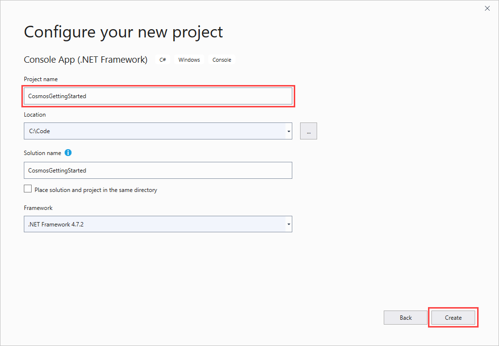
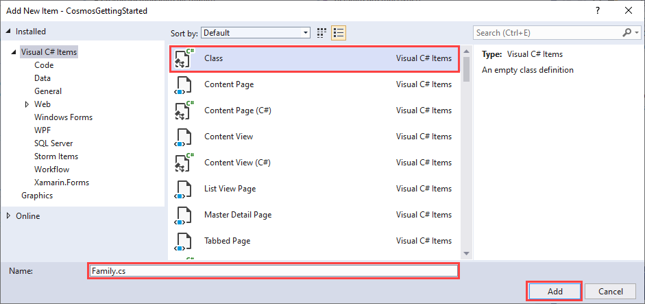

# Tutorial: Build a .NET console app to manage data in Azure Cosmos DB SQL API account

> [!div class="op_single_selector"]
> * [.NET](sql-api-get-started.md)
> * [Java](sql-api-java-get-started.md)
> * [Async Java](sql-api-async-java-get-started.md)
> * [Node.js](sql-api-nodejs-get-started.md)
>

Welcome to the Azure Cosmos DB SQL API get started tutorial. After following this tutorial, you'll have a console application that creates and queries Azure Cosmos DB resources.

This tutorial uses version 3.0 or later of the [Azure Cosmos DB .NET SDK](https://www.nuget.org/packages/Microsoft.Azure.Cosmos). You can work with [.NET Framework or .NET Core](https://dotnet.microsoft.com/download).

This tutorial covers:

> [!div class="checklist"]
>
> * Creating and connecting to an Azure Cosmos account
> * Configuring your project in Visual Studio
> * Creating a database and a container
> * Adding items to the container
> * Querying the container
> * Performing create, read, update, and delete (CRUD) operations on the item
> * Deleting the database

Don't have time? Don't worry! The complete solution is available on [GitHub](https://github.com/Azure-Samples/cosmos-dotnet-getting-started). Jump to the [Get the complete tutorial solution section](#GetSolution) for quick instructions.

Now let's get started!

## Prerequisites

* An active Azure account. If you don't have one, you can sign up for a [free account](https://azure.microsoft.com/free/).

  [!INCLUDE [cosmos-db-emulator-docdb-api](../../includes/cosmos-db-emulator-docdb-api.md)]

* [!INCLUDE [cosmos-db-emulator-vs](../../includes/cosmos-db-emulator-vs.md)]

## Step 1: Create an Azure Cosmos DB account

Let's create an Azure Cosmos DB account. If you already have an account you want to use, skip this section. To use the Azure Cosmos DB Emulator, follow the steps at [Azure Cosmos DB Emulator](local-emulator.md) to set up the emulator. Then skip ahead to [Step 2: Set up your Visual Studio project](#SetupVS).

[!INCLUDE [create-dbaccount-preview](../../includes/cosmos-db-create-dbaccount.md)]

## <a id="SetupVS"></a>Step 2: Set up your Visual Studio project

1. Open Visual Studio and select **Create a new project**.
1. In **Create a new project**, choose **Console App (.NET Framework)** for C#, then select **Next**.
1. Name your project *CosmosGettingStartedTutorial*, and then select **Create**.

    

1. In the **Solution Explorer**, right-click your new console application, which is under your Visual Studio solution, and select **Manage NuGet Packages**.
1. In the **NuGet Package Manager**, select **Browse** and search for *Microsoft.Azure.Cosmos*. Choose **Microsoft.Azure.Cosmos** and select **Install**.

   

   The package ID for the Azure Cosmos DB SQL API Client Library is [Microsoft Azure Cosmos DB Client Library](https://www.nuget.org/packages/Microsoft.Azure.Cosmos/).

Great! Now that we finished the setup, let's start writing some code. For the completed project of this tutorial, see [Developing a .NET console app using Azure Cosmos DB](https://github.com/Azure-Samples/cosmos-dotnet-getting-started).

## <a id="Connect"></a>Step 3: Connect to an Azure Cosmos DB account

1. Replace the references at the beginning of your C# application in the *Program.cs* file with these references:

   ```csharp
   using System;
   using System.Threading.Tasks;
   using System.Configuration;
   using System.Collections.Generic;
   using System.Net;
   using Microsoft.Azure.Cosmos;
   ```

1. Add these constants and variables into your `Program` class.

    ```csharp
    public class Program
    {
        // ADD THIS PART TO YOUR CODE

        // The Azure Cosmos DB endpoint for running this sample.
        private static readonly string EndpointUri = "<your endpoint here>";
        // The primary key for the Azure Cosmos account.
        private static readonly string PrimaryKey = "<your primary key>";

        // The Cosmos client instance
        private CosmosClient cosmosClient;

        // The database we will create
        private Database database;

        // The container we will create.
        private Container container;

        // The name of the database and container we will create
        private string databaseId = "FamilyDatabase";
        private string containerId = "FamilyContainer";
    }
    ```

   > [!NOTE]
   > If you're familiar with the previous version of the .NET SDK, you may be familiar with the terms *collection* and *document*. Because Azure Cosmos DB supports multiple API models, version 3.0 of the .NET SDK uses the generic terms *container* and *item*. A *container* can be a collection, graph, or table. An *item* can be a document, edge/vertex, or row, and is the content inside a container. For more information, see [Work with databases, containers, and items in Azure Cosmos DB](databases-containers-items.md).

1. Open the [Azure portal](https://portal.azure.com). Find your Azure Cosmos DB account, and then select **Keys**.

   

1. In *Program.cs*, replace `<your endpoint URL>` with the value of **URI**. Replace `<your primary key>` with the value of **PRIMARY KEY**.

1. Below the **Main** method, add a new asynchronous task called **GetStartedDemoAsync**, which instantiates our new `CosmosClient`.

    ```csharp
    public static async Task Main(string[] args)
    {
    }

    // ADD THIS PART TO YOUR CODE
    /*
        Entry point to call methods that operate on Azure Cosmos DB resources in this sample
    */
    public async Task GetStartedDemoAsync()
    {
        // Create a new instance of the Cosmos Client
        this.cosmosClient = new CosmosClient(EndpointUri, PrimaryKey);
    }
    ```

    We use **GetStartedDemoAsync** as the entry point that calls methods that operate on Azure Cosmos DB resources.

1. Add the following code to run the **GetStartedDemoAsync** asynchronous task from your **Main** method. The **Main** method catches exceptions and writes them to the console.

    [!code-csharp[](~/cosmos-dotnet-getting-started/CosmosGettingStartedTutorial/Program.cs?name=Main)]

1. Select F5 to run your application.

    The console displays the message: **End of demo, press any key to exit.** This message confirms that your application made a connection to Azure Cosmos DB. You can then close the console window.

Congratulations! You've successfully connected to an Azure Cosmos DB account.

## Step 4: Create a database

A database is the logical container of items partitioned across containers. Either the `CreateDatabaseIfNotExistsAsync` or `CreateDatabaseAsync` method of the [CosmosClient](https://docs.microsoft.com/dotnet/api/microsoft.azure.cosmos.cosmosclient) class can create a database.

1. Copy and paste the `CreateDatabaseAsync` method below your `GetStartedDemoAsync` method.

    [!code-csharp[](~/cosmos-dotnet-getting-started/CosmosGettingStartedTutorial/Program.cs?name=CreateDatabaseAsync&highlight=7)]

    `CreateDatabaseAsync` creates a new database with ID `FamilyDatabase` if it doesn't already exist, that has the ID specified from the `databaseId` field.

1. Copy and paste the code below where you instantiate the CosmosClient to call the **CreateDatabaseAsync** method you just added.

    ```csharp
    public async Task GetStartedDemoAsync()
    {
        // Create a new instance of the Cosmos Client
        this.cosmosClient = new CosmosClient(EndpointUri, PrimaryKey);

        //ADD THIS PART TO YOUR CODE
        await this.CreateDatabaseAsync();
    }
    ```

    Your *Program.cs* should now look like this, with your endpoint and primary key filled in.

    ```csharp
    using System;
    using System.Threading.Tasks;
    using System.Configuration;
    using System.Collections.Generic;
    using System.Net;
    using Microsoft.Azure.Cosmos;

    namespace CosmosGettingStartedTutorial
    {
        class Program
        {
            // The Azure Cosmos DB endpoint for running this sample.
            private static readonly string EndpointUri = "<your endpoint here>";
            // The primary key for the Azure Cosmos account.
            private static readonly string PrimaryKey = "<your primary key>";

            // The Cosmos client instance
            private CosmosClient cosmosClient;

            // The database we will create
            private Database database;

            // The container we will create.
            private Container container;

            // The name of the database and container we will create
            private string databaseId = "FamilyDatabase";
            private string containerId = "FamilyContainer";

            public static async Task Main(string[] args)
            {
                try
                {
                    Console.WriteLine("Beginning operations...");
                    Program p = new Program();
                    await p.GetStartedDemoAsync();
                }
                catch (CosmosException de)
                {
                    Exception baseException = de.GetBaseException();
                    Console.WriteLine("{0} error occurred: {1}\n", de.StatusCode, de);
                }
                catch (Exception e)
                {
                    Console.WriteLine("Error: {0}\n", e);
                }
                finally
                {
                    Console.WriteLine("End of demo, press any key to exit.");
                    Console.ReadKey();
                }
            }

            /// <summary>
            /// Entry point to call methods that operate on Azure Cosmos DB resources in this sample
            /// </summary>
            public async Task GetStartedDemoAsync()
            {
                // Create a new instance of the Cosmos Client
                this.cosmosClient = new CosmosClient(EndpointUri, PrimaryKey);
                await this.CreateDatabaseAsync();
            }

            /// <summary>
            /// Create the database if it does not exist
            /// </summary>
            private async Task CreateDatabaseAsync()
            {
                // Create a new database
                this.database = await this.cosmosClient.CreateDatabaseIfNotExistsAsync(databaseId);
                Console.WriteLine("Created Database: {0}\n", this.database.Id);
            }
        }
    }
    ```

1. Select F5 to run your application.

   > [!NOTE]
   > If you get a "503 service unavailable exception" error, it's possible that the required [ports](performance-tips.md#networking) for direct connectivity mode are blocked by a firewall. To fix this issue, either open the required ports or use the gateway mode connectivity as shown in the following code:
   ```csharp
     // Create a new instance of the Cosmos Client in Gateway mode
     this.cosmosClient = new CosmosClient(EndpointUri, PrimaryKey, new CosmosClientOptions()
            {
                ConnectionMode = ConnectionMode.Gateway
            });
   ```

Congratulations! You've successfully created an Azure Cosmos database.  

## <a id="CreateColl"></a>Step 5: Create a container

> [!WARNING]
> The method `CreateContainerIfNotExistsAsync` creates a new container, which has pricing implications. For more details, please visit our [pricing page](https://azure.microsoft.com/pricing/details/cosmos-db/).
>
>

A container can be created by using either the [**CreateContainerIfNotExistsAsync**](/dotnet/api/microsoft.azure.cosmos.database.createcontainerifnotexistsasync?view=azure-dotnet#Microsoft_Azure_Cosmos_Database_CreateContainerIfNotExistsAsync_Microsoft_Azure_Cosmos_ContainerProperties_System_Nullable_System_Int32__Microsoft_Azure_Cosmos_RequestOptions_System_Threading_CancellationToken_) or [**CreateContainerAsync**](/dotnet/api/microsoft.azure.cosmos.database.createcontainerasync?view=azure-dotnet#Microsoft_Azure_Cosmos_Database_CreateContainerAsync_Microsoft_Azure_Cosmos_ContainerProperties_System_Nullable_System_Int32__Microsoft_Azure_Cosmos_RequestOptions_System_Threading_CancellationToken_) method in the `CosmosDatabase` class. A container consists of items (JSON documents if SQL API) and associated server-side application logic in JavaScript, for example, stored procedures, user-defined functions, and triggers.

1. Copy and paste the `CreateContainerAsync` method below your `CreateDatabaseAsync` method. `CreateContainerAsync`  creates a new container with the ID `FamilyContainer` if it doesn't already exist, by using the ID specified from the `containerId` field partitioned by `LastName` property.

    [!code-csharp[](~/cosmos-dotnet-getting-started/CosmosGettingStartedTutorial/Program.cs?name=CreateContainerAsync&highlight=9)]

1. Copy and paste the code below where you instantiated the CosmosClient to call the **CreateContainer** method you just added.

    ```csharp
    public async Task GetStartedDemoAsync()
    {
        // Create a new instance of the Cosmos Client
        this.cosmosClient = new CosmosClient(EndpointUri, PrimaryKey);
        await this.CreateDatabaseAsync();

        //ADD THIS PART TO YOUR CODE
        await this.CreateContainerAsync();
    }
    ```

1. Select F5 to run your application.

Congratulations! You've successfully created an Azure Cosmos container.  

## <a id="CreateDoc"></a>Step 6: Add items to the container

The [**CreateItemAsync**](/dotnet/api/microsoft.azure.cosmos.container.createitemasync?view=azure-dotnet#Microsoft_Azure_Cosmos_Container_CreateItemAsync__1___0_System_Nullable_Microsoft_Azure_Cosmos_PartitionKey__Microsoft_Azure_Cosmos_ItemRequestOptions_System_Threading_CancellationToken_) method of the `CosmosContainer` class can create an item. When using the SQL API, items are projected as documents, which are user-defined arbitrary JSON content. You can now insert an item into your Azure Cosmos container.

First, let's create a `Family` class that represents objects stored within Azure Cosmos DB in this sample. We'll also create `Parent`, `Child`, `Pet`, `Address` subclasses that are used within `Family`. The item must have an `Id` property serialized as `id` in JSON.

1. Select Ctrl+Shift+A to open **Add New Item**. Add a new class `Family.cs` to your project.

    

1. Copy and paste the `Family`, `Parent`, `Child`, `Pet`, and `Address` class into `Family.cs`.

    [!code-csharp[](~/cosmos-dotnet-getting-started/CosmosGettingStartedTutorial/Family.cs)]


1. Back in *Program.cs*, add the `AddItemsToContainerAsync` method after your `CreateContainerAsync` method.

    [!code-csharp[](~/cosmos-dotnet-getting-started/CosmosGettingStartedTutorial/Program.cs?name=AddItemsToContainerAsync)]


    The code checks to make sure an item with the same ID doesn't already exist. We'll insert two items, one each for the *Andersen Family* and the *Wakefield Family*.

1. Add a call to `AddItemsToContainerAsync` in the `GetStartedDemoAsync` method.

    ```csharp
    public async Task GetStartedDemoAsync()
    {
        // Create a new instance of the Cosmos Client
        this.cosmosClient = new CosmosClient(EndpointUri, PrimaryKey);
        await this.CreateDatabaseAsync();
        await this.CreateContainerAsync();

        //ADD THIS PART TO YOUR CODE
        await this.AddItemsToContainerAsync();
    }
    ```

1. Select F5 to run your application.

Congratulations! You've successfully created two Azure Cosmos items.  

## <a id="Query"></a>Step 7: Query Azure Cosmos DB resources

Azure Cosmos DB supports rich queries against JSON documents stored in each container. For more information, see [Getting started with SQL queries](sql-api-sql-query.md). The following sample code shows how to run a query against the items we inserted in the previous step.

1. Copy and paste the `QueryItemsAsync` method after your `AddItemsToContainerAsync` method.

    [!code-csharp[](~/cosmos-dotnet-getting-started/CosmosGettingStartedTutorial/Program.cs?name=QueryItemsAsync&highlight=10-11,17-18)]

1. Add a call to ``QueryItemsAsync`` in the ``GetStartedDemoAsync`` method.

    ```csharp
    public async Task GetStartedDemoAsync()
    {
        // Create a new instance of the Cosmos Client
        this.cosmosClient = new CosmosClient(EndpointUri, PrimaryKey);
        await this.CreateDatabaseAsync();
        await this.CreateContainerAsync();
        await this.AddItemsToContainerAsync();

        //ADD THIS PART TO YOUR CODE
        await this.QueryItemsAsync();
    }
    ```

1. Select F5 to run your application.

Congratulations! You've successfully queried an Azure Cosmos container.

## <a id="ReplaceItem"></a>Step 8: Replace a JSON item

Now, we'll update an item in Azure Cosmos DB. We'll change the `IsRegistered` property of the `Family` and the `Grade` of one of the children.

1. Copy and paste the `ReplaceFamilyItemAsync` method after your `QueryItemsAsync` method.

    [!code-csharp[](~/cosmos-dotnet-getting-started/CosmosGettingStartedTutorial/Program.cs?name=ReplaceFamilyItemAsync&highlight=15)]

1. Add a call to `ReplaceFamilyItemAsync` in the `GetStartedDemoAsync` method.

    ```csharp
    public async Task GetStartedDemoAsync()
    {
        // Create a new instance of the Cosmos Client
        this.cosmosClient = new CosmosClient(EndpointUri, PrimaryKey);
        await this.CreateDatabaseAsync();
        await this.CreateContainerAsync();
        await this.AddItemsToContainerAsync();
        await this.QueryItemsAsync();

        //ADD THIS PART TO YOUR CODE
        await this.ReplaceFamilyItemAsync();
    }
    ```

1. Select F5 to run your application.

Congratulations! You've successfully replaced an Azure Cosmos item.

## <a id="DeleteDocument"></a>Step 9: Delete item

Now, we'll delete an item in Azure Cosmos DB.

1. Copy and paste the `DeleteFamilyItemAsync` method after your `ReplaceFamilyItemAsync` method.

    [!code-csharp[](~/cosmos-dotnet-getting-started/CosmosGettingStartedTutorial/Program.cs?name=DeleteFamilyItemAsync&highlight=10)]

1. Add a call to `DeleteFamilyItemAsync` in the `GetStartedDemoAsync` method.

    ```csharp
    public async Task GetStartedDemoAsync()
    {
        // Create a new instance of the Cosmos Client
        this.cosmosClient = new CosmosClient(EndpointUri, PrimaryKey);
        await this.CreateDatabaseAsync();
        await this.CreateContainerAsync();
        await this.AddItemsToContainerAsync();
        await this.QueryItemsAsync();
        await this.ReplaceFamilyItemAsync();

        //ADD THIS PART TO YOUR CODE
        await this.DeleteFamilyItemAsync();
    }
    ```

1. Select F5 to run your application.

Congratulations! You've successfully deleted an Azure Cosmos item.

## <a id="DeleteDatabase"></a>Step 10: Delete the database

Now we'll delete our database. Deleting the created database removes the database and all children resources. The resources include containers, items, and any stored procedures, user-defined functions, and triggers. We also dispose of the `CosmosClient` instance.

1. Copy and paste the `DeleteDatabaseAndCleanupAsync` method after your `DeleteFamilyItemAsync` method.

    [!code-csharp[](~/cosmos-dotnet-getting-started/CosmosGettingStartedTutorial/Program.cs?name=DeleteDatabaseAndCleanupAsync)]

1. Add a call to ``DeleteDatabaseAndCleanupAsync`` in the ``GetStartedDemoAsync`` method.

    [!code-csharp[](~/cosmos-dotnet-getting-started/CosmosGettingStartedTutorial/Program.cs?name=GetStartedDemoAsync&highlight=14)]

1. Select F5 to run your application.

Congratulations! You've successfully deleted an Azure Cosmos database.

## <a id="Run"></a>Step 11: Run your C# console application all together!

Select F5 in Visual Studio to build and run the application in debug mode.

You should see the output of your entire app in a console window. The output shows the results of the queries we added. It should match the example text below.

```cmd
Beginning operations...

Created Database: FamilyDatabase

Created Container: FamilyContainer

Created item in database with id: Andersen.1 Operation consumed 11.43 RUs.

Created item in database with id: Wakefield.7 Operation consumed 14.29 RUs.

Running query: SELECT * FROM c WHERE c.LastName = 'Andersen'

        Read {"id":"Andersen.1","LastName":"Andersen","Parents":[{"FamilyName":null,"FirstName":"Thomas"},{"FamilyName":null,"FirstName":"Mary Kay"}],"Children":[{"FamilyName":null,"FirstName":"Henriette Thaulow","Gender":"female","Grade":5,"Pets":[{"GivenName":"Fluffy"}]}],"Address":{"State":"WA","County":"King","City":"Seattle"},"IsRegistered":false}

Updated Family [Wakefield,Wakefield.7].
        Body is now: {"id":"Wakefield.7","LastName":"Wakefield","Parents":[{"FamilyName":"Wakefield","FirstName":"Robin"},{"FamilyName":"Miller","FirstName":"Ben"}],"Children":[{"FamilyName":"Merriam","FirstName":"Jesse","Gender":"female","Grade":6,"Pets":[{"GivenName":"Goofy"},{"GivenName":"Shadow"}]},{"FamilyName":"Miller","FirstName":"Lisa","Gender":"female","Grade":1,"Pets":null}],"Address":{"State":"NY","County":"Manhattan","City":"NY"},"IsRegistered":true}

Deleted Family [Wakefield,Wakefield.7]

Deleted Database: FamilyDatabase

End of demo, press any key to exit.
```

Congratulations! You've completed the tutorial and have a working C# console application!

## <a id="GetSolution"></a> Get the complete tutorial solution

If you didn't have time to complete the steps in this tutorial, or just want to download the code samples, you can download it.

To build the `GetStarted` solution, you need the following prerequisites:

* An active Azure account. If you don't have one, you can sign up for a [free account](https://azure.microsoft.com/free/).
* An [Azure Cosmos DB account][cosmos-db-create-account].
* The [GetStarted](https://github.com/Azure-Samples/cosmos-dotnet-getting-started) solution available on GitHub.

To restore the references to the Azure Cosmos DB .NET SDK in Visual Studio, right-click the solution in **Solution Explorer**, and then select **Restore NuGet Packages**. Next, in the *App.config* file, update the `EndPointUri` and `PrimaryKey` values as described in [Step 3: Connect to an Azure Cosmos DB account](#Connect).

That's it, build it, and you're on your way!

## Next steps

* Want a more complex ASP.NET MVC tutorial? See [Tutorial: Develop an ASP.NET Core MVC web application with Azure Cosmos DB by using .NET SDK](sql-api-dotnet-application.md).
* Want to do scale and performance testing with Azure Cosmos DB? See [Performance and scale testing with Azure Cosmos DB](performance-testing.md).
* To learn how to monitor Azure Cosmos DB requests, usage, and storage, see [Monitor performance and storage metrics in Azure Cosmos DB](monitor-accounts.md).
* To run queries against our sample dataset, see the [Query Playground](https://www.documentdb.com/sql/demo).
* To learn more about Azure Cosmos DB, see [Welcome to Azure Cosmos DB](https://docs.microsoft.com/azure/cosmos-db/introduction).

[cosmos-db-create-account]: create-sql-api-java.md#create-a-database-account
