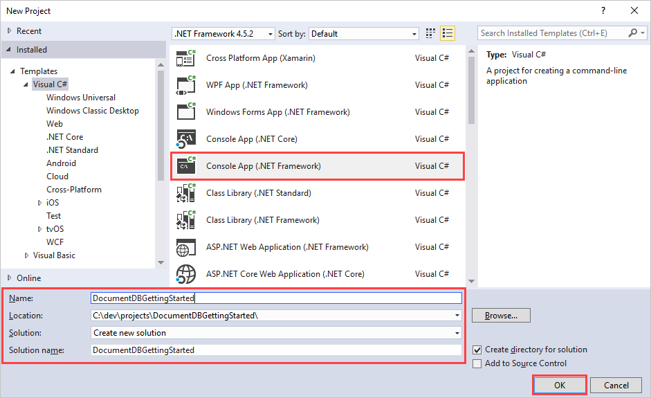
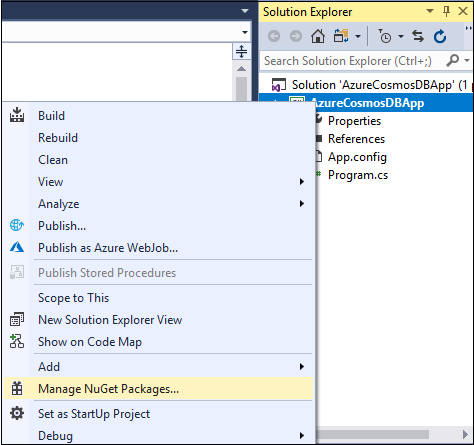
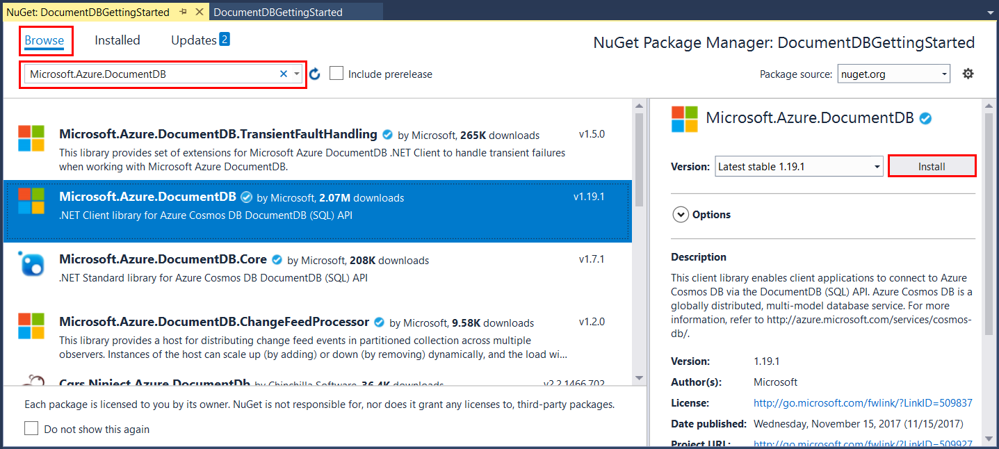
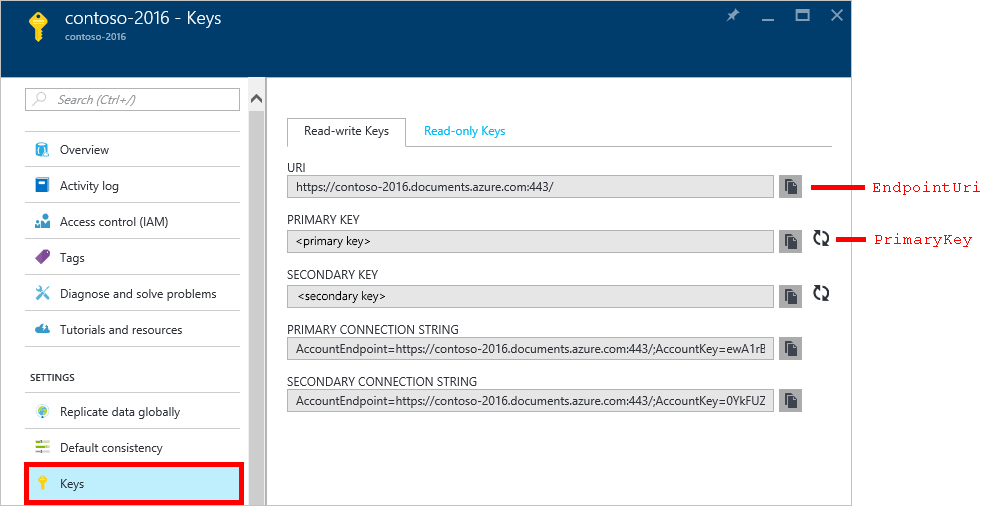
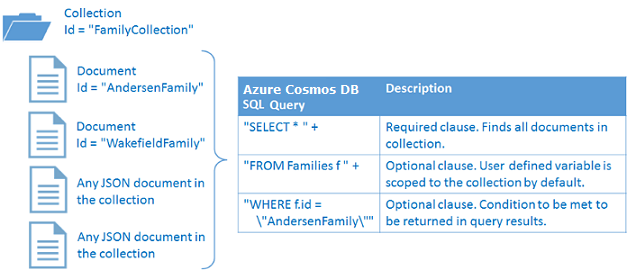

# Build a .NET console app to manage data in Azure Cosmos DB SQL API account

> [!div class="op_single_selector"]
> * [.NET](sql-api-get-started.md)
> * [.NET (Preview)](sql-api-dotnet-get-started-preview.md)
> * [.NET Core](sql-api-dotnetcore-get-started.md)
> * [.NET Core (Preview)](sql-api-dotnet-core-get-started-preview.md)
> * [Java](sql-api-java-get-started.md)
> * [Async Java](sql-api-async-java-get-started.md)
> * [Node.js](sql-api-nodejs-get-started.md)
> 

Welcome to the Azure Cosmos DB SQL API get started tutorial. After you complete this tutorial, you'll have a console app that creates and queries Azure Cosmos DB resources.

This tutorial shows you how to:

> [!div class="checklist"]
>
> - Create an Azure Cosmos DB account and connect to it
> - Configure a Visual Studio solution
> - Create a database
> - Create a collection
> - Create JSON documents
> - Query the collection
> - Update a JSON document
> - Delete a document
> - Delete the database

## Prerequisites

Visual Studio 2017 with the Azure development workflow installed:
- You can download and use the **free** [Visual Studio 2017 Community Edition](https://www.visualstudio.com/downloads/). Make sure that you enable **Azure development** during the Visual Studio setup. 

An Azure subscription or free Cosmos DB trial account:
- [!INCLUDE [quickstarts-free-trial-note](../../includes/quickstarts-free-trial-note.md)] 
  
- [!INCLUDE [cosmos-db-emulator-docdb-api](../../includes/cosmos-db-emulator-docdb-api.md)]  
  
- If you're using the Azure Cosmos DB Emulator, follow the steps at [Azure Cosmos DB Emulator](local-emulator.md) to set up the emulator. Then start the tutorial at [Set up the Visual Studio solution](#SetupVS).
  
## Get the completed solution

If you don't have time to complete the tutorial, or just want the code samples, you can download the complete solution from [GitHub](https://github.com/Azure-Samples/documentdb-dotnet-getting-started). 

To run the downloaded complete solution: 

1. Make sure you have the [Prerequisites](#prerequisites) installed. 
1. Open the downloaded *GetStarted.sln* solution file in Visual Studio.
1. In **Solution Explorer**, right-click the **GetStarted** project, and select **Manage NuGet Packages**.
1. On the **NuGet** tab, select **Restore** to restore the references to the Azure Cosmos DB .NET SDK.
1. In the *App.config* file, update the `EndpointUrl` and `PrimaryKey` values as described in the [Connect to the Azure Cosmos DB account](#Connect) section.
1. Select **Debug** > **Start Without Debugging** or press **Ctrl**+**F5** to build and run the app.

## Create an Azure Cosmos DB account

Follow these instructions to create an Azure Cosmos DB account in the Azure portal. If you already have an Azure Cosmos DB account to use, skip ahead to [Set up the Visual Studio solution](#SetupVS). 

[!INCLUDE [create-dbaccount](../../includes/cosmos-db-create-dbaccount.md)]

## <a id="SetupVS"></a>Set up the Visual Studio solution

1. In Visual Studio 2017, select **File** > **New** > **Project**.
   
1. In the **New Project** dialog, select **Visual C#** > **Console App (.NET Framework)**, name your project *AzureCosmosDBApp*, and then select **OK**.
   
   
   
1. In **Solution Explorer**, right-click the **AzureCosmosDBApp** project and select **Manage NuGet Packages**.
   
   
   
1. On the **NuGet** tab, select **Browse**, and enter *azure documentdb* in the search box.
   
1. Find and select **Microsoft.Azure.DocumentDB**, and select **Install** if it's not already installed.
   
   The package ID for the Azure Cosmos DB SQL API Client Library is [Microsoft Azure Cosmos DB Client Library](https://www.nuget.org/packages/Microsoft.Azure.DocumentDB/).

   > [!NOTE]
   > If you are using .NET Core, please see [the .NET Core docs](./sql-api-dotnetcore-get-started.md).

   
   
   If you get a message about previewing changes to the solution, select **OK**. If you get a message about license acceptance, select **I accept**.

## <a id="Connect"></a>Connect to the Azure Cosmos DB account

Now, get started writing some code. The complete *Project.cs* file for this tutorial is in [GitHub](https://github.com/Azure-Samples/documentdb-dotnet-getting-started/blob/master/src/Program.cs).

1. In **Solution Explorer**, select *Program.cs*, and in the code editor, add the following references to the beginning of the file:
   
   ```csharp
   using System.Net;
   using Microsoft.Azure.Documents;
   using Microsoft.Azure.Documents.Client;
   using Newtonsoft.Json;
   ```
   
1. Next, add the following two constants and the `client` variable to `public class Program`.
   
   ```csharp
   
   public class Program
   {
      private const string EndpointUrl = "<your endpoint URL>";
      private const string PrimaryKey = "<your primary key>";
      private DocumentClient client;
   ```
   
1. The endpoint URL and primary key allow your app to connect to your Azure Cosmos DB account, and the Azure Cosmos DB account to trust the connection. Copy the keys from the [Azure portal](https://portal.azure.com), and paste them into your code. 

   
   1. In your Azure Cosmos DB account left navigation, select **Keys**.
      
      
      
   1. Under **Read-write Keys**, copy the **URI** value using the copy button at the right, and paste it into `<your endpoint URL>` in *Program.cs*. For example: 
      
      `private const string EndpointUrl = "https://mysqlapicosmosdb.documents.azure.com:443/";`
      
   1. Copy the **PRIMARY KEY** value and paste it into `<your primary key>` in *Program.cs*. For example: 
      
      `private const string PrimaryKey = "19ZDNJAiYL26tmnRvoez6hmtIfBGwjun50PWRjNYMC2ig8Ob9hYk7Fq1RYSv8FcIYnh1TdBISvCh7s6yyb0000==";`
   
1. After the `Main` method, add a new asynchronous task called `GetStartedDemo`, which instantiates a new `DocumentClient` called `client`.
   
   ```csharp
      private async Task GetStartedDemo()
      {
        client = new DocumentClient(new Uri(EndpointUrl), PrimaryKey);
      }
   ```

   If you are using a proxy object to connect to Azure Cosmos DB, you should instead use the following code block to create the DocumentClient object. The sample in this document doesn't use a proxy object, so the example below is just for your reference:

   ```csharp
   HttpClientHandler handler = new HttpClientHandler()
   {
     Proxy = proxyObject
     UseProxy = true,
   };

   //Pass handler to the constructor of DocumentClient.
   DocumentClient client = new DocumentClient(new Uri(EndpointUrl), PrimaryKey, handler);
   
   ```
   
1. Add the following code to the `Main` method to run the `GetStartedDemo` task. The `Main` method catches exceptions and writes them to the console.
   
   ```csharp
      static void Main(string[] args)
      {
        try
        {
           Program p = new Program();
           p.GetStartedDemo().Wait();
        }
        catch (DocumentClientException de)
        {
           Exception baseException = de.GetBaseException();
           Console.WriteLine($"{de.StatusCode} error occurred: {de.Message}, Message: {baseException.Message}");
        }
        catch (Exception e)
        {
           Exception baseException = e.GetBaseException();
           Console.WriteLine($"Error: {e.Message}, Message: {baseException.Message}");
        }
        finally
        {
           Console.WriteLine("End of demo, press any key to exit.");
           Console.ReadKey();
        }
      }
   ```
   
1. Press **F5** to run your app. 
   
1. When you see the message **End of demo, press any key to exit** in the console window, it means the connection was successful. Press any key to close the console window. 

You've successfully connected to your Azure Cosmos DB account. Now, work with some Azure Cosmos DB resources.  

## Create a database

An Azure Cosmos DB [database](databases-containers-items.md#azure-cosmos-databases) is the logical container of JSON document storage partitioned across collections. You create a database by using the [CreateDatabaseIfNotExistsAsync](/dotnet/api/microsoft.azure.documents.client.documentclient.createdatabaseifnotexistsasync) method of the `DocumentClient` class. 

1. Before you add the code for creating a database, add a helper method for writing to the console. Copy and paste the following `WriteToConsoleAndPromptToContinue` method after the `GetStartedDemo` method in your code.
   
   ```csharp
   private void WriteToConsoleAndPromptToContinue(string format, params object[] args)
   {
      Console.WriteLine(format, args);
      Console.WriteLine("Press any key to continue...");
      Console.ReadKey();
   }
   ```
   
1. Copy and paste the following line to your `GetStartedDemo` method, after the `client = new DocumentClient(new Uri(EndpointUrl), PrimaryKey);` line. This code creates a database named `FamilyDB`.
   
   ```csharp
      await client.CreateDatabaseIfNotExistsAsync(new Database { Id = "FamilyDB" });
   ```
   
1. Press **F5** to run your app.

You've successfully created an Azure Cosmos DB database. You can see the database in the [Azure portal](https://portal.azure.com) by selecting **Data Explorer** in your Azure Cosmos DB account left navigation. 

## <a id="CreateColl"></a>Create a collection

A collection is a container of JSON documents and associated JavaScript application logic. You create a collection by using the [CreateDocumentCollectionIfNotExistsAsync](/dotnet/api/microsoft.azure.documents.client.documentclient.createdocumentcollectionifnotexistsasync#overloads) method of the `DocumentClient` class. 

> [!IMPORTANT]
> **CreateDocumentCollectionIfNotExistsAsync** creates a new collection with reserved throughput, which has pricing implications. For more details, visit the [pricing page](https://azure.microsoft.com/pricing/details/cosmos-db/).
> 

1. Copy and paste the following code to your `GetStartedDemo` method after the `await client.CreateDatabaseIfNotExistsAsync(new Database { Id = "FamilyDB" });` line. This code creates a document collection named `FamilyCollection`.
   
   ```csharp
      await client.CreateDocumentCollectionIfNotExistsAsync(UriFactory.CreateDatabaseUri("FamilyDB"), new DocumentCollection { Id = "FamilyCollection" });
   ```
   
1. Press **F5** to run your app.

You've successfully created an Azure Cosmos DB document collection. You can see the collection under your **FamilyDB** database in **Data Explorer** in the Azure portal.  

## <a id="CreateDoc"></a>Create JSON documents

Documents are user-defined, arbitrary JSON content. Documents must have an ID property serialized as `id` in JSON. You create documents by using the [CreateDocumentAsync](/dotnet/api/microsoft.azure.documents.client.documentclient.createdocumentasync#overloads) method of the `DocumentClient` class. 

> [!TIP]
> If you already have data you'd like to store in your database, you can use the Azure Cosmos DB [Data Migration tool](import-data.md) to import it.
>

The following code creates and inserts two documents into your database collection. First, you create a `Family` class, and `Parent`, `Child`, `Pet`, and `Address` subclasses to use within `Family`. Then, you create a `CreateFamilyDocumentIfNotExists` method, and then create and insert two documents. 

1. Copy and paste the following `Family`, `Parent`, `Child`, `Pet`, and `Address` classes after the `WriteToConsoleAndPromptToContinue` method in your code.
   
   ```csharp
    public class Family
    {
        [JsonProperty(PropertyName = "id")]
        public string Id { get; set; }
        public string LastName { get; set; }
        public Parent[] Parents { get; set; }
        public Child[] Children { get; set; }
        public Address Address { get; set; }
        public bool IsRegistered { get; set; }
        public override string ToString()
        {
            return JsonConvert.SerializeObject(this);
        }
    }

    public class Parent
    {
        public string FamilyName { get; set; }
        public string FirstName { get; set; }
    }

    public class Child
    {
        public string FamilyName { get; set; }
        public string FirstName { get; set; }
        public string Gender { get; set; }
        public int Grade { get; set; }
        public Pet[] Pets { get; set; }
    }

    public class Pet
    {
        public string GivenName { get; set; }
    }

    public class Address
    {
        public string State { get; set; }
        public string County { get; set; }
        public string City { get; set; }
    }
   ```
   
1. Copy and paste the following `CreateFamilyDocumentIfNotExists` method after the `Address` class you just added.
   
   ```csharp
    private async Task CreateFamilyDocumentIfNotExists(string databaseName, string collectionName, Family family)
    {
        try
        {
            await client.ReadDocumentAsync(UriFactory.CreateDocumentUri(databaseName, collectionName, family.Id));
            WriteToConsoleAndPromptToContinue($"Found {family.Id}");
        }
        catch (DocumentClientException de)
        {
            if (de.StatusCode == HttpStatusCode.NotFound)
            {
                await client.CreateDocumentAsync(UriFactory.CreateDocumentCollectionUri(databaseName, collectionName), family);
                WriteToConsoleAndPromptToContinue($"Created Family {family.Id}");
            }
            else
            {
                throw;
            }
        }
    }
   ```
   
1. Copy and paste the following code at the end of your `GetStartedDemo` method, after the `await client.CreateDocumentCollectionIfNotExistsAsync` line. This code creates and inserts two documents, one each for the Andersen and Wakefield families.
   
   ```csharp
    Family andersenFamily = new Family
    {
        Id = "AndersenFamily",
        LastName = "Andersen",
        Parents = new Parent[]
        {
            new Parent { FirstName = "Thomas" },
            new Parent { FirstName = "Mary Kay" }
        },
        Children = new Child[]
        {
            new Child
            {
                FirstName = "Henriette Thaulow",
                Gender = "female",
                Grade = 5,
                Pets = new Pet[]
                {
                    new Pet { GivenName = "Fluffy" }
                }
            }
        },
        Address = new Address { State = "WA", County = "King", City = "Seattle" },
        IsRegistered = true
    };

    await CreateFamilyDocumentIfNotExists("FamilyDB", "FamilyCollection", andersenFamily);

    Family wakefieldFamily = new Family
    {
        Id = "WakefieldFamily",
        LastName = "Wakefield",
        Parents = new Parent[]
        {
            new Parent { FamilyName = "Wakefield", FirstName = "Robin" },
            new Parent { FamilyName = "Miller", FirstName = "Ben" }
        },
        Children = new Child[]
        {
            new Child
            {
                FamilyName = "Merriam",
                FirstName = "Jesse",
                Gender = "female",
                Grade = 8,
                Pets = new Pet[]
                {
                    new Pet { GivenName = "Goofy" },
                    new Pet { GivenName = "Shadow" }
                }
            },
            new Child
            {
                FamilyName = "Miller",
                FirstName = "Lisa",
                Gender = "female",
                Grade = 1
            }
        },
        Address = new Address { State = "NY", County = "Manhattan", City = "NY" },
        IsRegistered = false
    };

    await CreateFamilyDocumentIfNotExists("FamilyDB", "FamilyCollection", wakefieldFamily);
   ```
   
1. Press **F5** to run your app.

You've successfully created two Azure Cosmos DB documents. You can see the documents under your **FamilyDB** database and **FamilyCollection** collection in **Data Explorer** in the Azure portal.   


## <a id="Query"></a>Query Azure Cosmos DB resources

Azure Cosmos DB supports rich [queries](how-to-sql-query.md) against JSON documents stored in collections. The following sample code uses LINQ and Azure Cosmos DB SQL syntax to run a query against the sample documents.

1. Copy and paste the following `ExecuteSimpleQuery` method after the `CreateFamilyDocumentIfNotExists` method in your code.
   
   ```csharp
    private void ExecuteSimpleQuery(string databaseName, string collectionName)
    {
        // Set some common query options.
        FeedOptions queryOptions = new FeedOptions { MaxItemCount = -1 };

        // Find the Andersen family by its LastName.
        IQueryable<Family> familyQuery = client.CreateDocumentQuery<Family>(
            UriFactory.CreateDocumentCollectionUri(databaseName, collectionName), queryOptions)
            .Where(f => f.LastName == "Andersen");

        // Execute the query synchronously. 
        // You could also execute it asynchronously using the IDocumentQuery<T> interface.
        Console.WriteLine("Running LINQ query...");
        foreach (Family family in familyQuery)
        {
            Console.WriteLine($"\tRead {family}");
        }

        // Now execute the same query using direct SQL.
        IQueryable<Family> familyQueryInSql = client.CreateDocumentQuery<Family>(
            UriFactory.CreateDocumentCollectionUri(databaseName, collectionName),
            "SELECT * FROM Family WHERE Family.LastName = 'Andersen'",
            queryOptions);

        Console.WriteLine("Running direct SQL query...");
        foreach (Family family in familyQueryInSql)
        {
            Console.WriteLine($"\tRead {family}");
        }

        Console.WriteLine("Press any key to continue ...");
        Console.ReadKey();
    }
   ```
   
1. Copy and paste the following code at the end of your `GetStartedDemo` method, after the `await CreateFamilyDocumentIfNotExists("FamilyDB", "FamilyCollection", wakefieldFamily);` line.
   
   ```csharp
      ExecuteSimpleQuery("FamilyDB", "FamilyCollection");
   ```
   
1. Press **F5** to run your app.

The preceding query returns the complete item for the Andersen family. You've successfully queried against an Azure Cosmos DB collection.

The following diagram illustrates how the Azure Cosmos DB SQL query syntax calls against the collection. The same logic applies to the LINQ query.



The [FROM](sql-query-from.md) keyword in the SQL query is optional, because Azure Cosmos DB queries are already scoped to a single collection. You can swap `FROM Families f` with `FROM root r`, or any other variable name you choose. Azure Cosmos DB will infer that `Families`, `root`, or the variable name you choose refers to the current collection.

## <a id="ReplaceDocument"></a>Update a JSON document

Azure Cosmos DB SQL API supports updating and replacing JSON documents.  

1. Copy and paste the following `ReplaceFamilyDocument` method after the `ExecuteSimpleQuery` method in your code.
   
   ```csharp
    private async Task ReplaceFamilyDocument(string databaseName, string collectionName, string familyName, Family updatedFamily)
    {
       await client.ReplaceDocumentAsync(UriFactory.CreateDocumentUri(databaseName, collectionName, familyName), updatedFamily);
       WriteToConsoleAndPromptToContinue($"Replaced Family {familyName}");
    }
   ```
   
1. Copy and paste the following code at the end of your `GetStartedDemo` method, after the `ExecuteSimpleQuery("FamilyDB", "FamilyCollection");` line. The code updates the data in one of the documents, and then runs the query again to show the changed document.
   
   ```csharp
   // Update the Grade of the Andersen Family child
   andersenFamily.Children[0].Grade = 6;
   await ReplaceFamilyDocument("FamilyDB", "FamilyCollection", "AndersenFamily", andersenFamily);
   ExecuteSimpleQuery("FamilyDB", "FamilyCollection");
   ```
   
1. Press **F5** to run your app.

The query output shows that the `Grade` for the Andersen Family's child updated from `5` to `6`. You've successfully updated and replaced an Azure Cosmos DB document. 

## <a id="DeleteDocument"></a>Delete a JSON document

Azure Cosmos DB SQL API supports deleting JSON documents.  

1. Copy and paste the following `DeleteFamilyDocument` method after the `ReplaceFamilyDocument` method.
   
   ```csharp
    private async Task DeleteFamilyDocument(string databaseName, string collectionName, string documentName)
    {
        await client.DeleteDocumentAsync(UriFactory.CreateDocumentUri(databaseName, collectionName, documentName));
        Console.WriteLine($"Deleted Family {documentName}");
    }
   ```
   
1. Copy and paste the following code at the end of your `GetStartedDemo` method, after the second `ExecuteSimpleQuery("FamilyDB", "FamilyCollection");` line.
   
   ```csharp
   await DeleteFamilyDocument("FamilyDB", "FamilyCollection", "AndersenFamily");
   ```
   
1. Press **F5** to run your app.

You've successfully deleted an Azure Cosmos DB document. 

## <a id="DeleteDatabase"></a>Delete the database

Delete the database you created to remove it and all its child resources, including the collection and documents. 

1. Copy and paste the following code at the end of your `GetStartedDemo` method, after the `await DeleteFamilyDocument("FamilyDB", "FamilyCollection", "AndersenFamily");` line. 
   
   ```csharp
   // Clean up - delete the database
   await client.DeleteDatabaseAsync(UriFactory.CreateDatabaseUri("FamilyDB"));
   ```
   
1. Press **F5** to run your app.

You've successfully deleted the Azure Cosmos DB database. You can see in the **Data Explorer** for your Azure Cosmos DB account that the FamilyDB database is deleted. 

## <a id="Run"></a>Run the entire C# console app

Press **F5** in Visual Studio to build and run the complete C# console app in debug mode. You should see the following output in the console window:

```bash
Created Family AndersenFamily
Press any key to continue ...
 Created Family WakefieldFamily
Press any key to continue ...
 Running LINQ query...
        Read {"id":"AndersenFamily","LastName":"Andersen","Parents":[{"FamilyName":null,"FirstName":"Thomas"},{"FamilyName":null,"FirstName":"Mary Kay"}],"Children":[{"FamilyName":null,"FirstName":"Henriette Thaulow","Gender":"female","Grade":5,"Pets":[{"GivenName":"Fluffy"}]}],"Address":{"State":"WA","County":"King","City":"Seattle"},"IsRegistered":true}
Running direct SQL query...
        Read {"id":"AndersenFamily","LastName":"Andersen","Parents":[{"FamilyName":null,"FirstName":"Thomas"},{"FamilyName":null,"FirstName":"Mary Kay"}],"Children":[{"FamilyName":null,"FirstName":"Henriette Thaulow","Gender":"female","Grade":5,"Pets":[{"GivenName":"Fluffy"}]}],"Address":{"State":"WA","County":"King","City":"Seattle"},"IsRegistered":true}
Press any key to continue ...
 Replaced Family AndersenFamily
Press any key to continue ...
 Running LINQ query...
        Read {"id":"AndersenFamily","LastName":"Andersen","Parents":[{"FamilyName":null,"FirstName":"Thomas"},{"FamilyName":null,"FirstName":"Mary Kay"}],"Children":[{"FamilyName":null,"FirstName":"Henriette Thaulow","Gender":"female","Grade":6,"Pets":[{"GivenName":"Fluffy"}]}],"Address":{"State":"WA","County":"King","City":"Seattle"},"IsRegistered":true}
Running direct SQL query...
        Read {"id":"AndersenFamily","LastName":"Andersen","Parents":[{"FamilyName":null,"FirstName":"Thomas"},{"FamilyName":null,"FirstName":"Mary Kay"}],"Children":[{"FamilyName":null,"FirstName":"Henriette Thaulow","Gender":"female","Grade":6,"Pets":[{"GivenName":"Fluffy"}]}],"Address":{"State":"WA","County":"King","City":"Seattle"},"IsRegistered":true}
Press any key to continue ...
 Deleted Family AndersenFamily
End of demo, press any key to exit.
```

Congratulations! You've completed the tutorial, and have a working C# console app that creates, queries, updates, and deletes Azure Cosmos DB resources.  

## Next steps
* To learn more about Azure Cosmos DB, see [Welcome to Azure Cosmos DB](introduction.md).
* For a more complex ASP.NET MVC tutorial, see [ASP.NET MVC Tutorial: Web application development with Azure Cosmos DB](sql-api-dotnet-application.md).
* To perform scale and performance testing with Azure Cosmos DB, see [Performance and scale testing with Azure Cosmos DB](performance-testing.md).
* To learn how to monitor Azure Cosmos DB requests, usage, and storage, see [Monitor accounts](monitor-accounts.md).
* Run queries against a sample dataset in the [Query Playground](https://www.documentdb.com/sql/demo).

