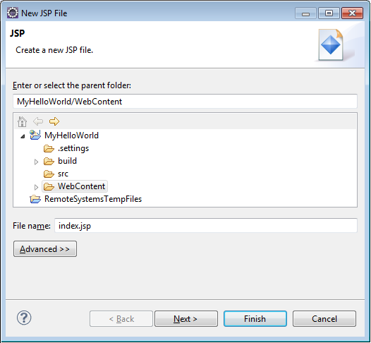

# Tutorial: Build a Java web application using Azure Cosmos DB and the SQL API

> [!div class="op_single_selector"]
> * [.NET](sql-api-dotnet-application.md)
> * [Java](sql-api-java-application.md)
> * [Node.js](sql-api-nodejs-application.md)
> * [Python](sql-api-python-application.md)
> * [Xamarin](mobile-apps-with-xamarin.md)
> 

This Java web application tutorial shows you how to use the [Microsoft Azure Cosmos DB](https://azure.microsoft.com/services/cosmos-db/) service to store and access data from a Java application hosted on Azure App Service Web Apps. In this article, you will learn:

* How to build a basic JavaServer Pages (JSP) application in Eclipse.
* How to work with the Azure Cosmos DB service using the [Azure Cosmos DB Java SDK](https://github.com/Azure/azure-documentdb-java).

This Java application tutorial shows you how to create a web-based task-management application that enables you to create, retrieve, and mark tasks as complete, as shown in the following image. Each of the tasks in the ToDo list is stored as JSON documents in Azure Cosmos DB.


> [!TIP]
> This application development tutorial assumes that you have prior experience using Java. If you are new to Java or the [prerequisite tools](#Prerequisites), we recommend downloading the complete [todo](https://github.com/Azure-Samples/documentdb-java-todo-app) project from GitHub and building it using [the instructions at the end of this article](#GetProject). Once you have it built, you can review the article to gain insight on the code in the context of the project.  
>

## <a id="Prerequisites"></a>Prerequisites for this Java web application tutorial

Before you begin this application development tutorial, you must have the following:

* If you don't have an Azure subscription, create a [free account](https://azure.microsoft.com/free/?WT.mc_id=A261C142F) before you begin. 

  [!INCLUDE [cosmos-db-emulator-docdb-api](../../includes/cosmos-db-emulator-docdb-api.md)]

* [Java Development Kit (JDK) 7+](/java/azure/jdk/?view=azure-java-stable).
* [Eclipse IDE for Java EE Developers.](https://www.eclipse.org/downloads/packages/release/luna/sr1/eclipse-ide-java-ee-developers)
* [An Azure Web Site with a Java runtime environment (e.g. Tomcat or Jetty) enabled.](../app-service/app-service-web-get-started-java.md)

If you're installing these tools for the first time, coreservlets.com provides a walk-through of the installation process in the quickstart section of their [Tutorial: Installing TomCat7 and Using it with Eclipse](http://www.coreservlets.com/Apache-Tomcat-Tutorial/tomcat-7-with-eclipse.html) article.

## <a id="CreateDB"></a>Create an Azure Cosmos DB account

Let's start by creating an Azure Cosmos DB account. If you already have an account or if you are using the Azure Cosmos DB Emulator for this tutorial, you can skip to [Step 2: Create the Java JSP application](#CreateJSP).

[!INCLUDE [create-dbaccount](../../includes/cosmos-db-create-dbaccount.md)]

[!INCLUDE [keys](../../includes/cosmos-db-keys.md)]

## <a id="CreateJSP"></a>Create the Java JSP application

To create the JSP application:

1. First, we'll start off by creating a Java project. Start Eclipse, then click **File**, click **New**, and then click **Dynamic Web Project**. If you don't see **Dynamic Web Project** listed as an available project, do the following: click **File**, click **New**, click **Project**…, expand **Web**, click **Dynamic Web Project**, and click **Next**.
   
    

1. Enter a project name in the **Project name** box, and in the **Target Runtime** drop-down menu, optionally select a value (e.g. Apache Tomcat v7.0), and then click **Finish**. Selecting a target runtime enables you to run your project locally through Eclipse.

1. In Eclipse, in the Project Explorer view, expand your project. Right-click **WebContent**, click **New**, and then click **JSP File**.

1. In the **New JSP File** dialog box, name the file **index.jsp**. Keep the parent folder as **WebContent**, as shown in the following illustration, and then click **Next**.
   
    

1. In the **Select JSP Template** dialog box, for the purpose of this tutorial select **New JSP File (html)**, and then click **Finish**.

1. When the *index.jsp* file opens in Eclipse, add text to display **Hello World!** within the existing `<body>` element. The updated `<body>` content should look like the following code:

   ```html
   <body>
     <% out.println("Hello World!"); %>
   </body>
   ```

1. Save the *index.jsp* file.

1. If you set a target runtime in step 2, you can click **Project** and then **Run** to run your JSP application locally:

  

## <a id="InstallSDK"></a>Install the SQL Java SDK

The easiest way to pull in the SQL Java SDK and its dependencies is through [Apache Maven](https://maven.apache.org/). To do this, you need to convert your project to a Maven project by using the following steps:

1. Right-click your project in the Project Explorer, click **Configure**, click **Convert to Maven Project**.

1. In the **Create new POM** window, accept the defaults, and click **Finish**.

1. In **Project Explorer**, open the pom.xml file.

1. On the **Dependencies** tab, in the **Dependencies** pane, click **Add**.

1. In the **Select Dependency** window, do the following:
   
   * In the **Group Id** box, enter `com.azure`.
   * In the **Artifact Id** box, enter `azure-cosmos`.
   * In the **Version** box, enter `4.0.1-beta.1`.
  
   Or, you can add the dependency XML for Group ID and Artifact ID directly to the *pom.xml* file:

   ```xml
   <dependency>
      <groupId>com.azure</groupId>
      <artifactId>azure-cosmos</artifactId>
      <version>4.0.1-beta.1</version>
   </dependency>
   ```

1. Click **OK** and Maven will install the SQL Java SDK or save the pom.xml file.

## <a id="UseService"></a>Use the Azure Cosmos DB service in your Java application

Now let's add the models, the views, and the controllers to your web application.

### Add a model

First, let's define a model within a new file *TodoItem.java*. The `TodoItem` class defines the schema of an item along with the getter and setter methods:

:::code language="java" source="~/samples-cosmosdb-java-v4-web-app/src/com/microsoft/azure/documentdb/sample/model/TodoItem.java":::

### Add the Data Access Object(DAO) classes

Create a Data Access Object (DAO) to abstract persisting the ToDo items to Azure Cosmos DB. In order to save ToDo items to a collection, the client needs to know which database and collection to persist to (as referenced by self-links). In general, it is best to cache the database and collection when possible to avoid additional round-trips to the database.

1. To invoke the Azure Cosmos DB service, you must instantiate a new `cosmosClient` object. In general, it is best to reuse the `cosmosClient` object rather than constructing a new client for each subsequent request. You can reuse the client by defining it within the `cosmosClientFactory` class. Update the HOST and MASTER_KEY values that you saved in [step 1](#CreateDB). Replace the HOST variable with with your URI and replace the MASTER_KEY with your PRIMARY KEY. Use the following code to create the `CosmosClientFactory` class within the *CosmosClientFactory.java* file:

   :::code language="java" source="~/samples-cosmosdb-java-v4-web-app/src/com/microsoft/azure/documentdb/sample/dao/CosmosClientFactory.java":::

1. Create a new *TodoDao.java* file and add the `TodoDao` class to create, update, read, and delete the todo items:

   :::code language="java" source="~/samples-cosmosdb-java-v4-web-app/src/com/microsoft/azure/documentdb/sample/dao/TodoDao.java":::

1. Create a new *MockDao.java* file and add the `MockDao` class, this class implements the `TodoDao` class to perform CRUD operations on the items:

   :::code language="java" source="~/samples-cosmosdb-java-v4-web-app/src/com/microsoft/azure/documentdb/sample/dao/MockDao.java":::

1. Create a new *DocDbDao.java* file and add the `DocDbDao` class. This class defines code to persist the TodoItems into the container, retrieves your database and collection, if it exists, or create a new one if it doesn't exist. This example uses [Gson](https://code.google.com/p/google-gson/) to serialize and de-serialize the TodoItem Plain Old Java Objects (POJOs) to JSON documents. In order to save ToDo items to a collection, the client needs to know which database and collection to persist to (as referenced by self-links). This class also defines helper function to retrieve the documents by another attribute (e.g. "ID") rather than self-link. You can use the helper method to retrieve a TodoItem JSON document by ID and then deserialize it to a POJO.

   You can also use the `cosmosClient` client object to get a collection or list of TodoItems using a SQL query. Finally, you define the delete method to delete a TodoItem from your list. The following code shows the contents of the `DocDbDao` class:

   :::code language="java" source="~/samples-cosmosdb-java-v4-web-app/src/com/microsoft/azure/documentdb/sample/dao/DocDbDao.java":::

1. Next, create a new *TodoDaoFactory.java* file and add the `TodoDaoFactory` class that creates a new DocDbDao object:

   :::code language="java" source="~/samples-cosmosdb-java-v4-web-app/src/com/microsoft/azure/documentdb/sample/dao/TodoDaoFactory.java":::

### Add a controller

Add the *TodoItemController* controller to your application. In this project, you are using [Project Lombok](https://projectlombok.org/) to generate the constructor, getters, setters, and a builder. Alternatively, you can write this code manually or have the IDE generate it.:

:::code language="java" source="~/samples-cosmosdb-java-v4-web-app/src/com/microsoft/azure/documentdb/sample/controller/TodoItemController.java":::

### Create a servlet

Next, create a servlet to route HTTP requests to the controller. Create the *ApiServlet.java* file and define the following code under it:

:::code language="java" source="~/samples-cosmosdb-java-v4-web-app/src/com/microsoft/azure/documentdb/sample/ApiServlet.java":::

## <a id="Wire"></a>Wire the rest of the of Java app together

Now that we've finished the fun bits, all that's left is to build a quick user interface and wire it up to your DAO.

1. You need a web user interface to display to the user. Let's re-write the *index.jsp* we created earlier with the following code:

   :::code language="java" source="~/samples-cosmosdb-java-v4-web-app/WebContent/index.jsp":::

1. Finally, write some client-side JavaScript to tie the web user interface and the servlet together:

   :::code language="java" source="~/samples-cosmosdb-java-v4-web-app/WebContent/assets/todo.js":::

1. Now all that's left is to test the application. Run the application locally, and add some Todo items by filling in the item name and category and clicking **Add Task**. After the item appears, you can update whether it's complete by toggling the checkbox and clicking **Update Tasks**.

## <a id="Deploy"></a>Deploy your Java application to Azure Web Sites

Azure Web Sites makes deploying Java applications as simple as exporting your application as a WAR file and either uploading it via source control (e.g. Git) or FTP.

1. To export your application as a WAR file, right-click on your project in **Project Explorer**, click **Export**, and then click **WAR File**.

1. In the **WAR Export** window, do the following:
   
   * In the Web project box, enter azure-documentdb-java-sample.
   * In the Destination box, choose a destination to save the WAR file.
   * Click **Finish**.

1. Now that you have a WAR file in hand, you can simply upload it to your Azure Web Site's **webapps** directory. For instructions on uploading the file, see [Add a Java application to Azure App Service Web Apps](../app-service/web-sites-java-add-app.md). After the WAR file is uploaded to the webapps directory, the runtime environment will detect that you've added it and will automatically load it.

1. To view your finished product, navigate to `http://YOUR\_SITE\_NAME.azurewebsites.net/azure-java-sample/` and start adding your tasks!

## <a id="GetProject"></a>Get the project from GitHub

All the samples in this tutorial are included in the [todo](https://github.com/Azure-Samples/documentdb-java-todo-app) project on GitHub. To import the todo project into Eclipse, ensure you have the software and resources listed in the [Prerequisites](#Prerequisites) section, then do the following:

1. Install [Project Lombok](https://projectlombok.org/). Lombok is used to generate constructors, getters, setters in the project. Once you have downloaded the lombok.jar file, double-click it to install it or install it from the command line.

1. If Eclipse is open, close it and restart it to load Lombok.

1. In Eclipse, on the **File** menu, click **Import**.

1. In the **Import** window, click **Git**, click **Projects from Git**, and then click **Next**.

1. On the **Select Repository Source** screen, click **Clone URI**.

1. On the **Source Git Repository** screen, in the **URI** box, enter https://github.com/Azure-Samples/documentdb-java-todo-app.git, and then click **Next**.

1. On the **Branch Selection** screen, ensure that **master** is selected, and then click **Next**.

1. On the **Local Destination** screen, click **Browse** to select a folder where the repository can be copied, and then click **Next**.

1. On the **Select a wizard to use for importing projects** screen, ensure that **Import existing projects** is selected, and then click **Next**.

1. On the **Import Projects** screen, unselect the **DocumentDB** project, and then click **Finish**. The DocumentDB project contains the Azure Cosmos DB Java SDK, which we will add as a dependency instead.

1. In **Project Explorer**, navigate to azure-documentdb-java-sample\src\com.microsoft.azure.documentdb.sample.dao\DocumentClientFactory.java and replace the HOST and MASTER_KEY values with the URI and PRIMARY KEY for your Azure Cosmos DB account, and then save the file. For more information, see [Step 1. Create an Azure Cosmos database account](#CreateDB).

1. In **Project Explorer**, right-click the **azure-documentdb-java-sample**, click **Build Path**, and then click **Configure Build Path**.

1. On the **Java Build Path** screen, in the right pane, select the **Libraries** tab, and then click **Add External JARs**. Navigate to the location of the lombok.jar file, and click **Open**, and then click **OK**.

1. Use step 12 to open the **Properties** window again, and then in the left pane click **Targeted Runtimes**.

1. On the **Targeted Runtimes** screen, click **New**, select **Apache Tomcat v7.0**, and then click **OK**.

1. Use step 12 to open the **Properties** window again, and then in the left pane click **Project Facets**.

1. On the **Project Facets** screen, select **Dynamic Web Module** and **Java**, and then click **OK**.

1. On the **Servers** tab at the bottom of the screen, right-click **Tomcat v7.0 Server at localhost** and then click **Add and Remove**.

1. On the **Add and Remove** window, move **azure-documentdb-java-sample** to the **Configured** box, and then click **Finish**.

1. In the **Servers** tab, right-click **Tomcat v7.0 Server at localhost**, and then click **Restart**.

1. In a browser, navigate to `http://localhost:8080/azure-documentdb-java-sample/` and start adding to your task list. Note that if you changed your default port values, change 8080 to the value you selected.

1. To deploy your project to an Azure web site, see [Step 6. Deploy your application to Azure Web Sites](#Deploy).

## Next steps

> [!div class="nextstepaction"]
> [Build a node.js application with Azure Cosmos DB](sql-api-nodejs-application.md)
