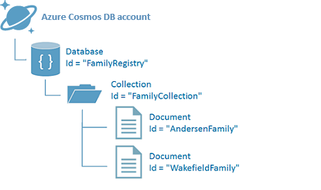

# NoSQL tutorial: Build a SQL API Java console application

> [!div class="op_single_selector"]
> * [.NET](sql-api-get-started.md)
> * [.NET Core](sql-api-dotnetcore-get-started.md)
> * [Java](sql-api-java-get-started.md)
> * [Async Java](sql-api-async-java-get-started.md)
> * [Node.js](sql-api-nodejs-get-started.md)
> 

Welcome to the NoSQL tutorial for the SQL API for Azure Cosmos DB Java SDK! After following this tutorial, you'll have a console application that creates and queries Azure Cosmos DB resources.

We cover:

* Creating and connecting to an Azure Cosmos DB account
* Configuring your Visual Studio Solution
* Creating an online database
* Creating a collection
* Creating JSON documents
* Querying the collection
* Creating JSON documents
* Querying the collection
* Replacing a document
* Deleting a document
* Deleting the database

Now let's get started!

## Prerequisites
Make sure you have the following:

* An active Azure account. If you don't have one, you can sign up for a [free account](https://azure.microsoft.com/free/). 

  [!INCLUDE [cosmos-db-emulator-docdb-api](../../includes/cosmos-db-emulator-docdb-api.md)]

* [Git](https://git-scm.com/downloads).
* [Java Development Kit (JDK) 7+](http://www.oracle.com/technetwork/java/javase/downloads/index.html).
* [Maven](http://maven.apache.org/download.cgi).

## Step 1: Create an Azure Cosmos DB account
Let's create an Azure Cosmos DB account. If you already have an account you want to use, you can skip ahead to [Clone the GitHub project](#GitClone). If you are using the Azure Cosmos DB Emulator, follow the steps at [Azure Cosmos DB Emulator](local-emulator.md) to set up the emulator and skip ahead to [Clone the GitHub project](#GitClone).

[!INCLUDE [cosmos-db-create-dbaccount](../../includes/cosmos-db-create-dbaccount.md)]

## Step 2: Clone the GitHub project
You can get started by cloning the GitHub repository for [Get Started with Azure Cosmos DB and Java](https://github.com/Azure-Samples/documentdb-java-getting-started). For example, from a local directory run the following to retrieve the sample project locally.

    git clone git@github.com:Azure-Samples/azure-cosmos-db-documentdb-java-getting-started.git

    cd azure-cosmos-db-documentdb-java-getting-started

The directory contains a `pom.xml` for the project and a `src` folder containing Java source code including `Program.java` which shows how perform simple operations with Azure Cosmos DB like creating documents and querying data within a collection. The `pom.xml` includes a dependency on the [Azure Cosmos DB Java SDK on Maven](https://mvnrepository.com/artifact/com.microsoft.azure/azure-documentdb).

    <dependency>
        <groupId>com.microsoft.azure</groupId>
        <artifactId>azure-documentdb</artifactId>
        <version>LATEST</version>
    </dependency>

## Step 3: Connect to an Azure Cosmos DB account
Next, head back to the [Azure Portal](https://portal.azure.com) to retrieve your endpoint and primary master key. The Azure Cosmos DB endpoint and primary key are necessary for your application to understand where to connect to, and for Azure Cosmos DB to trust your application's connection.

In the Azure Portal, navigate to your Azure Cosmos DB account, and then click **Keys**. Copy the URI from the portal and paste it into `https://FILLME.documents.azure.com` in the Program.java file. Then copy the PRIMARY KEY from the portal and paste it into `FILLME`.

    this.client = new DocumentClient(
        "https://FILLME.documents.azure.com",
        "FILLME"
        , new ConnectionPolicy(),
        ConsistencyLevel.Session);

![Screen shot of the Azure Portal used by the NoSQL tutorial to create a Java console application. Shows an Azure Cosmos DB account, with the ACTIVE hub highlighted, the KEYS button highlighted on the Azure Cosmos DB account blade, and the URI, PRIMARY KEY and SECONDARY KEY values highlighted on the Keys blade][keys]

## Step 4: Create a database
Your Azure Cosmos DB [database](sql-api-resources.md#databases) can be created by using the [createDatabase](/java/api/com.microsoft.azure.documentdb._document_client.createdatabase) method of the **DocumentClient** class. A database is the logical container of JSON document storage partitioned across collections.

    Database database = new Database();
    database.setId("familydb");
    this.client.createDatabase(database, null);

## Step 5: Create a collection
> [!WARNING]
> **createCollection** creates a new collection with reserved throughput, which has pricing implications. For more details, visit our [pricing page](https://azure.microsoft.com/pricing/details/cosmos-db/).
> 
> 

A [collection](sql-api-resources.md#collections) can be created by using the [createCollection](/java/api/com.microsoft.azure.documentdb._document_client.createcollection) method of the **DocumentClient** class. A collection is a container of JSON documents and associated JavaScript application logic.

    DocumentCollection collectionInfo = new DocumentCollection();
    collectionInfo.setId("familycoll");

    // Azure Cosmos DB collections can be reserved with throughput specified in request units/second. 
    // Here we create a collection with 400 RU/s.
    RequestOptions requestOptions = new RequestOptions();
    requestOptions.setOfferThroughput(400);

    this.client.createCollection("/dbs/familydb", collectionInfo, requestOptions);

## Step 6: Create JSON documents
A [document](sql-api-resources.md#documents) can be created by using the [createDocument](/java/api/com.microsoft.azure.documentdb._document_client.createdocument) method of the **DocumentClient** class. Documents are user-defined (arbitrary) JSON content. We can now insert one or more documents. If you already have data you'd like to store in your database, you can use Azure Cosmos DB's [Data Migration tool](import-data.md) to import the data into a database.

    // Insert your Java objects as documents 
    Family andersenFamily = new Family();
    andersenFamily.setId("Andersen.1");
    andersenFamily.setLastName("Andersen")

    // More initialization skipped for brevity. You can have nested references
    andersenFamily.setParents(new Parent[] { parent1, parent2 });
    andersenFamily.setDistrict("WA5");
    Address address = new Address();
    address.setCity("Seattle");
    address.setCounty("King");
    address.setState("WA");

    andersenFamily.setAddress(address);
    andersenFamily.setRegistered(true);

    this.client.createDocument("/dbs/familydb/colls/familycoll", family, new RequestOptions(), true);

## Step 7: Query Azure Cosmos DB resources
Azure Cosmos DB supports rich [queries](sql-api-sql-query.md) against JSON documents stored in each collection.  The following sample code shows how to query documents in Azure Cosmos DB using SQL syntax with the [queryDocuments](/java/api/com.microsoft.azure.documentdb._document_client.querydocuments) method.

    FeedResponse<Document> queryResults = this.client.queryDocuments(
        "/dbs/familydb/colls/familycoll",
        "SELECT * FROM Family WHERE Family.lastName = 'Andersen'", 
        null);

    System.out.println("Running SQL query...");
    for (Document family : queryResults.getQueryIterable()) {
        System.out.println(String.format("\tRead %s", family));
    }

## Step 8: Replace JSON document
Azure Cosmos DB supports updating JSON documents using the [replaceDocument](/java/api/com.microsoft.azure.documentdb._document_client.replacedocument) method.

    // Update a property
    andersenFamily.Children[0].Grade = 6;

    this.client.replaceDocument(
        "/dbs/familydb/colls/familycoll/docs/Andersen.1", 
        andersenFamily,
        null);

## Step 9: Delete JSON document
Similarly, Azure Cosmos DB supports deleting JSON documents using the [deleteDocument](/java/api/com.microsoft.azure.documentdb._document_client.deletedocument) method.  

    this.client.delete("/dbs/familydb/colls/familycoll/docs/Andersen.1", null);

## Step 10: Delete the database
Deleting the created database removes the database and all children resources (collections, documents, etc.).

    this.client.deleteDatabase("/dbs/familydb", null);

## Step 11: Run your Java console application all together!
To run the application from the console, navigate to the project folder and compile using Maven:
    
    mvn package

Running `mvn package` downloads the latest Azure Cosmos DB library from Maven and produces `GetStarted-0.0.1-SNAPSHOT.jar`. Then run the app by running:

    mvn exec:java -D exec.mainClass=GetStarted.Program

Congratulations! You've completed this NoSQL tutorial and have a working Java console application!

## Next steps
* Want a Java web app tutorial? See [Build a web application with Java using Azure Cosmos DB](sql-api-java-application.md).
* Learn how to [monitor an Azure Cosmos DB account](monitor-accounts.md).
* Run queries against our sample dataset in the [Query Playground](https://www.documentdb.com/sql/demo).

[keys]: media/sql-api-get-started/nosql-tutorial-keys.png
