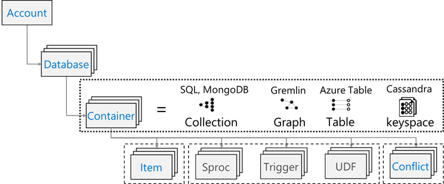
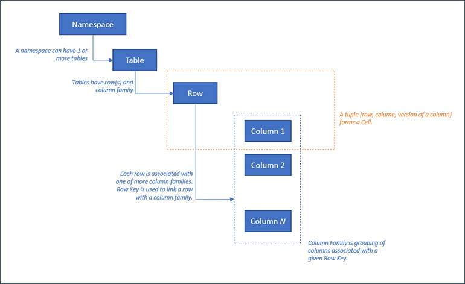
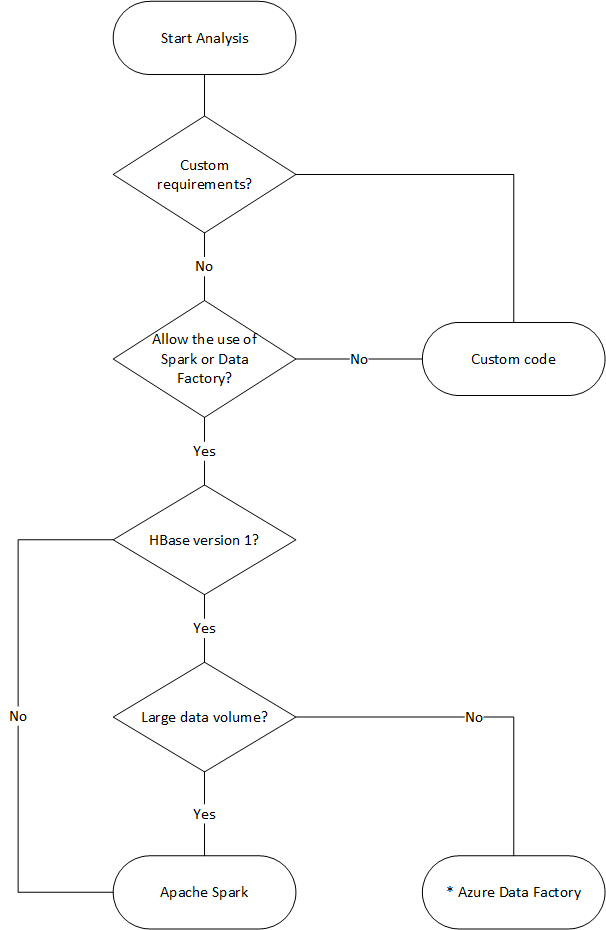

# Migrate from Apache HBase to Cosmos DB SQL API

Azure Cosmos DB is a scalable, globally distributed, fully managed database. It provides guaranteed low latency access to your data. To learn more about Azure Cosmos DB, see the [overview](https://docs.microsoft.com/azure/cosmos-db/introduction) article. This section provides guide to migrate from HBase to Cosmos DB.

## Key differences
Before migrating, one must understand the differences between Cosmos DB and HBase.

### Cosmos DB resource model ####

The resource model of Cosmos DB is as follows.


HBase resource model is as follows.



### Resource mapping

The table below shows a conceptual mapping between Apache HBase, Apache Phoenix and Cosmos DB.

| **HBase**           | **Phoenix**          | **Cosmos DB**   |
| ------------------- | -------------------- | --------------- |
| Cluster | Cluster | Account |
| Namespace | Schema (if enabled) | Database |
| Table | Table | Container/Collection |
| Column family | Column family | N/A |
| Row | Row | Item/Document |
| Version (Timestamp) | Version (Timestamp) | N/A |
| N/A | Primary Key | Partition Key |
| N/A | Index | Index |
| N/A | Secondary Index | Secondary Index |
| N/A | View | N/A |
| N/A | Sequence | N/A |


### Data Structure Comparison and Differences

The key differences regarding the data structure of Cosmos DB and HBase data are as follows:

**RowKey**

HBase is sorted and stored by [RowKey](https://hbase.apache.org/book.html#rowkey.design) and horizontally partitioned into Regions by the range of RowKey specified at the time of creation of a table. Cosmos DB is distributes data into partitions based on hash value of specified [Partition key](https://docs.microsoft.com/azure/cosmos-db/partitioning-overview).

**Column Family**

HBase columns are grouped within a Column Family (CF). Cosmos DB (SQL API) stores data as [JSON](https://www.json.org/json-en.html) document. Hence, all properties associated with a JSON data structure apply.

**Timestamp**

HBase uses timestamp to version multiple instances of a given cell. Users can query different versions of a cell using timestamp. Cosmos DB ships with[ Change Feed feature](https://docs.microsoft.com/azure/cosmos-db/change-feed) which tracks persistent record of changes to a container in the order they occur. It then outputs the sorted list of documents that were changed in the order in which they were modified.  

**HBase data format**

The following is an example of HBase table row.

It consists of RowKey, Column Family: Column Name, Timestamp, Value.

```console
ROW                                COLUMN+CELL
 1000                              column=Office:Address, timestamp=1611408732448, value=1111 San Gabriel Dr.
 1000                              column=Office:Phone, timestamp=1611408732418, value=1-425-000-0002
 1000                              column=Personal:Name, timestamp=1611408732340, value=John Dole
 1000                              column=Personal:Phone, timestamp=1611408732385, value=1-425-000-0001

```

**Cosmos DB data format**

The following is an example of Cosmos DB document.

The JSON object represents the data format in the Azure Cosmos DB SQL API. The partition key resides in a field in the document and sets which field is the partition key for the collection. Cosmos DB does not have the concept of timestamp used for Column Family or version. As highlighted previously, it has Change Feed support through which one can track/record changes performed on a Cosmos DB container.

```json
{
    "RowId": "1000",
    "OfficeAddress": "1111 San Gabriel Dr.",
    "OfficePhone": "1-425-000-0002",
    "PersonalName": "John Dole",
    "PersonalPhone": "1-425-000-0001",
}

```


> [!TIP]
HBase stores data in byte array, so if you want to migrate data that contains double-byte characters to Cosmos DB, the data must be UTF-8 encoded.


### Consistency model

HBase offers strictly consistent reads and writes. Cosmos DB offers [five well-defined consistency levels](https://docs.microsoft.com/azure/cosmos-db/consistency-levels). 

Each level provides availability and performance trade-offs. From strongest to weakest, the consistency levels supported by Cosmos DB are:

* Strong
* Bounded staleness
* Session
* Consistent prefix
* Eventual

### Sizing

**HBase**

For an enterprise-scale deployment of HBase,Master; Region servers; and ZooKeeper drive bulk of the sizing. Like any distributed application, HBase is designed to scale-out. HBase performance is primarily driven by the size of the HBase RegionServers See the following section under HBase IaaS migrations for more details. Sizing is primarily driven by two key requirements – throughput and size of dataset that must be stored on HBase.

**Cosmos DB**

Cosmos DB is a PaaS offering from Microsoft and underlying infrastructure deployment details are abstracted from the end-users. When a Cosmos DB container is provisioned, Azure platform automatically provisions underlying infrastructure (compute, storage, memory, networking stack) to support the performance requirements of a given workload. The cost of all database operations is normalized by Azure Cosmos DB and is expressed by [Request Units (or RUs, for short).](https://docs.microsoft.com/azure/cosmos-db/request-units) 

To estimate RUs consumed by your workload, consider the following [factors](https://docs.microsoft.com/azure/cosmos-db/request-units#request-unit-considerations):

There is a [capacity calculator](https://cosmos.azure.com/capacitycalculator/) available to assist with sizing exercise for RUs.

You can also use [auto-scaling provisioning throughput](https://docs.microsoft.com/azure/cosmos-db/provision-throughput-autoscale) in Azure Cosmos DB to automatically and instantly scale your database or container throughput (RU / sec). Throughput is scaled based on usage without impacting workload availability, latency, throughput, or performance.

### Distribution

**HBase**

 HBase is sorts data according to RowKey. The data is then partitioned into Regions and stored in RegionServers. The automatic partitioning divides Regions horizontally according to the partitioning policy. This is controlled by the value assigned to HBase parameter hbase.hregion.max.filesize (default 10GB). A row on HBase with a given RowKey always belongs to one Region. In addition, the data is separated on disk for each column family. This enables filtering at the time of reading and isolation of I/O on HFile.

**Cosmos DB**

  Cosmos DB uses [partitioning](https://docs.microsoft.com/azure/cosmos-db/partitioning-overview) to scale individual containers in the database. Partitioning divides the items in a container into specific subsets called "logical partitions". Logical partitions are formed based on the value of the "partition key" associated with each item in the container. All items in a logical partition have the same partition key value. Each logical partition can hold up to 20GB of data.

Physical partitions each contain a replica of your data and an instance of the Cosmos DB database engine. This structure makes your data durable and highly available and throughput is divided equally amongst the local physical partitions. Physical partitions are automatically created and configured, and it's not possible to control their size, location, or which logical partitions they contain. Logical partitions are not split between physical partitions.

As with HBase RowKey, partition key design is important for Cosmos DB. HBase's Row Key works by sorting data and storing continuous data, and Cosmos DB's Partition Key is a completely different mechanism because it hash-distributes data. Assuming your application using HBase is optimized for data access patterns to HBase, using the same RowKey for HBase for the Cosmos DB Partition Key will not give good performance results. Given that it's sorted data on HBase, the Cosmos DB Composite index may be useful. It is required if you want to use the ORDER BY clause in more than one field. You can also improve the performance of many equal and range queries by defining a composite index.

### Availability

**HBase**

HBase consists of Master; Region Server; and ZooKeeper. High availability in a single cluster can be achieved by making each component redundant. When configuring geo-redundancy, one can deploy HBase clusters across different physical data centers and use replication to keep multiple clusters in-sync.

**Cosmos DB**

Cosmos DB does not require any configuration such as cluster component redundancy. It provides a comprehensive SLA for high availability, consistency, and latency. With Cosmos DB, you can place data in multiple regions simply by specifying the Azure region where you want to place the replica. This allows you to maintain high availability in the unlikely event of a regional failure.

### Data reliability

**HBase**

HBase is built on HDFS and data stored on HDFS is replicated 3 times.

**Cosmos DB**

Azure Cosmos DB primarily provides high availability in two ways. First, Azure Cosmos DB replicates data between regions configured within your Cosmos account. Second, Azure Cosmos DB keeps four replicas of the data in the region.

## Planning

### System dependencies

This aspect of planning focuses on understanding upstream and downstream dependencies for HBase instance which is being migrated to Azure Cosmos DB.

Example of downstream dependencies could be applications that read data from HBase. These must be refactored to read from Cosmos DB. These must be considered as part of the migration plan to Cosmos DB.

* Questions for assessing dependencies Is the current HBase system a completely independent component? Or Does it call a process on another system, or is it called by a process on another system, or is it accessed using a directory service? Are other important processes working in your HBase cluster? These system dependencies need to be clarified to determine the impact of migration.
* What is the RPO and RTO for HBase deployment on-premises?

### Data migration

For successful data migration, it is important to understand the characteristics of the business that uses the database and decide how to do it. Select offline migration if you can completely shut down the system, perform data migration, and restart the system at the destination. Also, if your database is always busy and you can't afford a long outage, consider migrating online. This document covers only offline migration.

When performing offline data migration, it depends on the version of HBase you are currently running and the tools available. See the Data Migration chapter for details. 
 
### Performance considerations

This aspect of planning is to understand performance targets for HBase and then translating them across to Cosmos DB semantics. For example – to hit *“X”* IOPS on HBase, how many Request Units ([RUs](https://docs.microsoft.com/azure/cosmos-db/request-units)) will be required on Cosmos DB. There are differences between HBase and Cosmos DB, this exercise focuses on building a view of how performance targets from HBase will be translated across to Cosmos DB. This will drive scaling exercise for Cosmos DB.

Questions to ask:

- Is the HBase deployment read-heavy or write-heavy?
- What is the split between reads and writes?
- What is the target IOPS expresses as percentile?
- How/what applications are used to load data into HBase?
- How/what applications are used to read data from HBase?

When executing queries that request sorted data, HBase will return the result quickly because the data is sorted by RowKey. However, Cosmos DB doesn’t have such a concept. In order to optimize the performance, you can use composite index as needed.

See this document for more details.

https://docs.microsoft.com/azure/cosmos-db/index-policy#composite-indexes

## Assessment

Data Discovery

Gather information in advance from your existing HBase cluster to identify the data you want to migrate. These can help you identify how to migrate, decide which tables to migrate, understand the structure within those tables, and decide how to build your data model.

* HBase version
* Migration target tables
* Column family information
* Table status

Here the data is collected using an “hbase shell” script and stored in the local file system of the operating machine.

HBase version

```console
hbase version -n > hbase-version.txt
```

Output example

```console
cat hbase-version.txt
HBase 2.1.8.4.1.2.5

```

Table list

You can get a list of tables stored in HBase. If you have created a namespace other than default, it will be output in the “Namespace: Table” format.

```console
echo "list" | hbase shell -n > table-list.txt
HBase 2.1.8.4.1.2.5

```

Output example

```console
echo "list" | hbase shell -n > table-list.txt
cat table-list.txt
TABLE
COMPANY
Contacts
ns1:t1
3 row(s)
Took 0.4261 seconds
COMPANY
Contacts
ns1:t1


```

Check the output table list to identify the table to be migrated.
The details of the column families in the table by specifying the table name to be migrated.

```console
echo "describe '({Namespace}:){Table name}'" | hbase shell -n > {Table name} -schema.txt
```

Output example

```console
cat {Table name} -schema.txt
Table {Table name} is ENABLED
{Table name}
COLUMN FAMILIES DESCRIPTION
{NAME => 'cf1', VERSIONS => '1', EVICT_BLOCKS_ON_CLOSE => 'false', NEW_VERSION_BEHAVIOR => 'false', KEEP_DELETED_CELLS => 'FALSE', CACHE_DATA_ON_WRITE => 'false', DATA_BLOCK_ENCODING => 'NONE', TTL => 'FOREVER', MIN_VERSIONS => '0', REPLICATION_SCOPE => '0', BLOOMFILTER => 'ROW', CACHE_INDEX_ON_WRITE => 'false', IN_MEMORY => 'false', CACHE_BLOOMS_ON_WRITE => 'false', PREFETCH_BLOCKS_ON_OPEN => 'false', COMPRESSION => 'NONE', BLOCKCACHE => 'true', BLOCKSIZE => '65536'}
{NAME => 'cf2', VERSIONS => '1', EVICT_BLOCKS_ON_CLOSE => 'false', NEW_VERSION_BEHAVIOR => 'false', KEEP_DELETED_CELLS => 'FALSE', CACHE_DATA_ON_WRITE => 'false', DATA_BLOCK_ENCODING => 'NONE', TTL => 'FOREVER', MIN_VERSIONS => '0', REPLICATION_SCOPE => '0', BLOOMFILTER => 'ROW', CACHE_INDEX_ON_WRITE => 'false', IN_MEMORY => 'false', CACHE_BLOOMS_ON_WRITE => 'false', PREFETCH_BLOCKS_ON_OPEN => 'false', COMPRESSION => 'NONE', BLOCKCACHE => 'true', BLOCKSIZE => '65536'}
2 row(s)
Took 0.5775 seconds

```

You will get the column families in the table and their settings.

All tables status.

```console
echo "status 'detailed'" | hbase shell -n > hbase-status.txt
```

Output example

```console
{HBase version}
0 regionsInTransition
active master:  {Server:Port number}
2 backup masters
    {Server:Port number}
    {Server:Port number}
master coprocessors: []
# live servers
    {Server:Port number}
        requestsPerSecond=0.0, numberOfOnlineRegions=44, usedHeapMB=1420, maxHeapMB=15680, numberOfStores=49, numberOfStorefiles=14, storefileUncompressedSizeMB=7, storefileSizeMB=7, compressionRatio=1.0000, memstoreSizeMB=0, storefileIndexSizeKB=15, readRequestsCount=36210, filteredReadRequestsCount=415729, writeRequestsCount=439, rootIndexSizeKB=15, totalStaticIndexSizeKB=5, totalStaticBloomSizeKB=16, totalCompactingKVs=464, currentCompactedKVs=464, compactionProgressPct=1.0, coprocessors=[GroupedAggregateRegionObserver, Indexer, MetaDataEndpointImpl, MetaDataRegionObserver, MultiRowMutationEndpoint, ScanRegionObserver, SecureBulkLoadEndpoint, SequenceRegionObserver, ServerCachingEndpointImpl, UngroupedAggregateRegionObserver]

    [...]

        "Contacts,,1611126188216.14a597a0964383a3d923b2613524e0bd."
            numberOfStores=2, numberOfStorefiles=2, storefileUncompressedSizeMB=7168, lastMajorCompactionTimestamp=0, storefileSizeMB=7, compressionRatio=0.0010, memstoreSizeMB=0, readRequestsCount=4393, writeRequestsCount=0, rootIndexSizeKB=14, totalStaticIndexSizeKB=5, totalStaticBloomSizeKB=16, totalCompactingKVs=0, currentCompactedKVs=0, compactionProgressPct=NaN, completeSequenceId=-1, dataLocality=0.0

[...]

```

You can get useful sizing information such as the size of heap memory, the number of regions, the number of requests as the status of the cluster, and the size of the data in compressed / uncompressed as the status of the table.

If you are using Apache Phoenix on HBase cluster, you need to collect data from Phoenix as well.

* Migration target table
* Table schemas
* Indexes
* Primary key


Connect to Apache Phoenix on your cluster.

```console
sqlline.py ZOOKEEPER/hbase-unsecure
```

Table list

```console
!tables
```

Table details

```console
!describe <Table Name> 
```

Index details

 ```console
!indexes <Table Name>
```

Primary key details

 ```console
!primarykeys <Table Name> 
```

## Building

### Deployment

You can use [the Azure portal or Azure Cli to deploy the Cosmos DB SQL API](https://docs.microsoft.com/azure/cosmos-db/create-cosmosdb-resources-portal). Since the migration destination is Cosmos DB SQL API, select "Core (SQL)" for the API as a parameter when deploying. In addition, set Geo-Redundancy, Multi-region Writes, and Availability Zones according to your availability requirements.


### Network consideration

Cosmos DB has three main network options. The first is a configuration that uses a Public IP address and controls access with an IP firewall (default). The second is a configuration that uses a Public IP address and allows access only from a specific subnet of a specific virtual network (service endpoint). The third is a configuration (private endpoint) that joins a private network using a Private IP address.

See the following documents for more information on the three network options:

* [Public IP with Firewall](https://docs.microsoft.com/azure/cosmos-db/how-to-configure-firewall)
* [Public IP with Service Endpoint](https://docs.microsoft.com/azure/cosmos-db/how-to-configure-vnet-service-endpoint)
* [Private Endpoint](https://docs.microsoft.com/azure/cosmos-db/how-to-configure-private-endpoints)

## Data migration

### Data migration options

There are various methods for data migration with Offline, but here we will introduce the method using Azure Data Factory and Data Migration Tool.

| Solution                                          | Source       | Considerations                                               |
| ------------------------------------------------- | ------------ | ------------------------------------------------------------ |
| Azure Data Factory                                | HBase < 2    | Easy to set up  Suitable for large datasets  Doesn’t support HBase  2 or later |
| Apache Spark                                      | All versions | Support all versions  of HBase  Suitable for large  datasets  Spark setup required |
| Custom tool with  Cosmos DB bulk executor library | All versions | Most flexible to  create custom data migration tools using libraries  Requires more effort  to setup |


The following flowchart uses some conditions to reach the available data migration methods.




**Data Factory**

Suitable for large datasets. The Azure Cosmos DB Bulk Executor library is used. Please note that there are no checkpoints, so if you encounter any issues during the migration you will have to restart the migration process from the beginning. You can also use Data Factory's Self-Hosted Integration Runtime to connect to your on-premises HBase, or deploy Data Factory to a Managed VNET and connect to your on-premises network via VPN or ExpressRoute.

Data Factory's Copy activity supports HBase as a data source. Please refer to the following documents for the detailed method.

[Copy data from HBase using Azure Data Factory](https://docs.microsoft.com/azure/data-factory/connector-hbase)

You can specify Cosmos DB (SQL API) as the destination for your data. Please refer to the following documents for the detailed method.

[Copy and transform data in Azure Cosmos DB (SQL API) by using Azure Data Factory](https://docs.microsoft.com/azure/data-factory/connector-azure-cosmos-db)


**Apache Spark - Apache HBase Connector & Cosmos DB Spark connector**

Here is an example assuming that HBase 2.1.0 and Spark 2.4.0 are running in the same cluster.

Apache Spark – Apache HBase Connector repository can be found at:

[Apache Spark - Apache HBase Connector](https://github.com/hortonworks-spark/shc)

For Cosmos DB Spark connector, refer to the following and download the appropriate library for your Spark version. 

[Quick Start Guide for Cosmos DB Spark Connector](https://docs.microsoft.com/azure/cosmos-db/spark-connector)

Copy hbase-site.xml to Spark configuration directory.

 ```console
cp /etc/hbase/conf/hbase-site.xml /etc/spark2/conf/
```

Run spark -shell with Spark HBase connector and Cosmos DB Spark connector.

 ```console
spark-shell --packages com.hortonworks.shc:shc-core:1.1.0.3.1.2.2-1 --repositories http://repo.hortonworcontent/groups/public/ --jars azure-cosmosdb-spark_2.4.0_2.11-3.6.8-uber.jar
```

After the Spark shell starts, execute the Scala code as follows. Import the libraries needed to load data from HBase.

 ```console
// Import libraries
import org.apache.spark.sql.{SQLContext, _}
import org.apache.spark.sql.execution.datasources.hbase._
import org.apache.spark.{SparkConf, SparkContext}
import spark.sqlContext.implicits._

```

Define the Spark Catalog schema for your HBase tables. Here the Namespace is “default” and the table name is “Contacts”. The row key is specified as the key. Below Columns, Column Family and Column are mapped to Spark's catalog.

```console
// define a catalog for the Contacts table you created in HBase
def catalog = s"""{
    |"table":{"namespace":"default", "name":"Contacts"},
    |"rowkey":"key",
    |"columns":{
    |"rowkey":{"cf":"rowkey", "col":"key", "type":"string"},
    |"officeAddress":{"cf":"Office", "col":"Address", "type":"string"},
    |"officePhone":{"cf":"Office", "col":"Phone", "type":"string"},
    |"personalName":{"cf":"Personal", "col":"Name", "type":"string"},
    |"personalPhone":{"cf":"Personal", "col":"Phone", "type":"string"}
    |}
|}""".stripMargin

```

Next, define a method to get the data from the HBase Contacts table as a DataFrame. 

```console
def withCatalog(cat: String): DataFrame = {
    spark.sqlContext
    .read
    .options(Map(HBaseTableCatalog.tableCatalog->cat))
    .format("org.apache.spark.sql.execution.datasources.hbase")
    .load()
 }

```

Create a DataFrame using the defined method.

 ```console
val df = withCatalog(catalog)
```

Then import the libraries needed to use the Cosmos DB Spark connector. 

 ```console
import com.microsoft.azure.cosmosdb.spark.schema._
import com.microsoft.azure.cosmosdb.spark._
import com.microsoft.azure.cosmosdb.spark.config.Config
```

Make settings for writing data to Cosmos DB.

 ```console
val writeConfig = Config(Map(   "Endpoint" -> "https://<cosmos-db-account-name>.documents.azure.com:443/",   "Masterkey" -> "<comsmos-db-master-key>",   "Database" -> "<database-name>",   "Collection" -> "<collection-name>",   "Upsert" -> "true" ))
```

Writes DataFrame data to Cosmos DB. 

```console
import org.apache.spark.sql.SaveMode df.write.mode(SaveMode.Overwrite).cosmosDB(writeConfig)
```

It writes in parallel at high speed, its performance is quite high. On the other hand, note that it may consume up RU on the Cosmos DB side.

### Phoenix

Phoenix is supported as a Data Factory data source. Please refer to the following documents for detailed steps.

* [Copy data from Phoenix using Azure Data Factory](https://docs.microsoft.com/azure/data-factory/connector-phoenix)
* [Tutorial: Use Data migration tool to migrate your data to Azure Cosmos DB](https://docs.microsoft.com/azure/cosmos-db/import-data)
* [Copy data from HBase using Azure Data Factory](https://docs.microsoft.com/azure/data-factory/connector-hbase)

## Migrate your code

This section describes the differences between creating Cosmos DB SQL APIs and HBase applications.

This example uses Apache HBase 2.x APIs and Cosmos DB Java SDK v4.

These HBase's sample codes are based on those described in [HBase's official documentation](https://hbase.apache.org/book.html).

[Azure Cosmos DB Java SDK v4 for Core (SQL) API: release notes and resources](https://docs.microsoft.com/azure/cosmos-db/sql-api-sdk-java-v4)

The code for Cosmos DB presented here is based on the following documentation. You can access the full code example from the documentation. 

[Azure Cosmos DB SQL API: Java SDK v4 examples](https://docs.microsoft.com/azure/cosmos-db/sql-api-java-sdk-samples)

The mappings for code migration are shown here, but the HBase RowKeys and Cosmos DB Partition Keys used in these examples are not always well-designed. Please design according to the actual data model of the migration source.

### Establish connection

HBase

```java
Configuration config = HBaseConfiguration.create(); 
config.set("hbase.zookeeper.quorum","zookeepernode0,zookeepernode1,zookeepernode2"); 
config.set("hbase.zookeeper.property.clientPort", "2181"); 
config.set("hbase.cluster.distributed", "true"); 
Connection connection = ConnectionFactory.createConnection(config)
```

Phoenix

```java
//Use JDBC to get a connection to an HBase cluster 
Connection conn = DriverManager.getConnection("jdbc:phoenix:server1,server2:3333",props);
```

Azure Cosmos DB

 ```java
// Create sync client 
client = new CosmosClientBuilder()              
    .endpoint(AccountSettings.HOST)              
    .key(AccountSettings.MASTER_KEY)              
    .consistencyLevel(ConsistencyLevel.{ConsistencyLevel})              
    .contentResponseOnWriteEnabled(true)              
    .buildClient();
```

### Create Database/Table/Collection

HBase

```java
// create an admin object using the config     
HBaseAdmin admin = new HBaseAdmin(config);      
// create the table...     
HTableDescriptor tableDescriptor = new HTableDescriptor(TableName.valueOf(“FamilyTable”));     
// ... with single column families     
tableDescriptor.addFamily(new HColumnDescriptor(“ColFam”));     
admin.createTable(tableDescriptor);
```

Phoenix

```java
CREATE IF NOT EXISTS FamilyTable (“id” BIGINT not null primary key, “ColFam”.“lastName” VARCHAR(50));
```

Azure Cosmos DB

 ```java
//  Create database if not exists 
CosmosDatabaseResponse databaseResponse = client.createDatabaseIfNotExists(databaseName); 
database = client.getDatabase(databaseResponse.getProperties().getId());  

//  Create container if not exists 
CosmosContainerProperties containerProperties = new CosmosContainerProperties(“FamilyContainer”, "/lastName");  

// Provision throughput 
ThroughputProperties throughputProperties = ThroughputProperties.createManualThroughput(400);  

//  Create container with 400 RU/s 
CosmosContainerResponse databaseResponse = database.createContainerIfNotExists(containerProperties, throughputProperties); 
container = database.getContainer(databaseResponse.getProperties().getId());
```

### Create Row / Document

HBase

```java
HTable table = new HTable(config, “FamilyTable”);
Put put = new Put(Bytes.toBytes(RowKey));

put.add(Bytes.toBytes(“ColFam”), Bytes.toBytes(“id”), Bytes.toBytes(“1”));
put.add(Bytes.toBytes(“ColFam”), Bytes.toBytes(“lastName”), Bytes.toBytes(“Witherspoon”));
table.put(put)

```

Phoenix

```sql
UPSERT INTO FamilyTable (id, lastName) VALUES (1, ‘Witherspoon’);
```

Azure Cosmos DB

Azure Cosmos DB provides you type safety via data model. We use data model named ‘Family’.

```java
public class Family {
    public Family() {
    }

    public void setId(String id) {
        this.id = id;
    }

    public void setLastName(String lastName) {
        this.lastName = lastName;
    }

    private String id="";
    private String lastName="";
}

```

The above is part of the code. See [full code example](https://github.com/Azure-Samples/azure-cosmos-java-sql-api-samples/blob/df1840b0b5e3715b8555c29f422e0e7d2bc1d49a/src/main/java/com/azure/cosmos/examples/common/Family.java).

Use the Family class to define document and insert item.

```java
Family family = new Family();
family.setLastName(“Witherspoon”);
family.setId(“1”);

// Insert this item as a document
// Explicitly specifying the /pk value improves performance.
container.createItem(family,new PartitionKey(family.getLastName()),new CosmosItemRequestOptions());

```

### Read Row / Document

HBase

```java
HTable table = new HTable(config, “FamilyTable”);

Get get = new Get(Bytes.toBytes(RowKey));
get.addColumn(Bytes.toBytes(“ColFam”), Bytes.toBytes(“lastName”));

Result result = table.get(get);

byte[]  col = result.getValue(Bytes.toBytes(“ColFam”), Bytes.toBytes(“lastName”));

```

Phoenix

```sql
SELECT lastName FROM FamilyTable;

```

Azure Cosmos DB

```java
//  Read document by ID
Family family = container.readItem(documentId,new PartitionKey(documentLastName),Family.class).getItem();

String sql = "SELECT lastName FROM c”;

CosmosPagedIterable<Family> filteredFamilies = container.queryItems(sql, new CosmosQueryRequestOptions(), Family.class);

```

### Update data

For HBase, use the append method and checkAndPut method to update the value. append is the process of appending a value atomically to the end of the current value, and checkAndPut atomically compares the current value with the expected value and updates only if they match.

```java
// append
HTable table = new HTable(config, “FamilyTable”);
Append append = new Append(Bytes.toBytes(RowKey));
Append.add(Bytes.toBytes(“ColFam”), Bytes.toBytes(“id”), Bytes.toBytes(2));
Append.add(Bytes.toBytes(“ColFam”), Bytes.toBytes(“lastName”), Bytes.toBytes(“Harris”));
Result result = table.append(append)

// checkAndPut
byte[] row = Bytes.toBytes(RowKey);
byte[] colfam = Bytes.toBytes(“ColFam”);
byte[] col = Bytes.toBytes(“lastName”);
Put put = new Put(row);
put.add(colfam, col, Bytes.toBytes(“Patrick”));
boolearn result = table.checkAndPut(row, colfam, col, Bytes.toBytes(“Witherspoon”), put);

```

Phoenix

```sql
UPSERT INTO FamilyTable (id, lastName) VALUES (1, ‘Brown’)
ON DUPLICATE KEY UPDATE id = “1”, lastName = “Whiterspoon”;

```

Azure Cosmos DB

In Azure Cosmos DB, updates are treated as Upsert operations. That is, if the document does not exist, it will be inserted.

```java
// Replace existing document with new modified document (contingent on modification).

Family family = new Family();
family.setLastName(“Brown”);
family.setId(“1”);

CosmosItemResponse<Family> famResp = container.upsertItem(family, new CosmosItemRequestOptions());

```
### Delete Row / Document

HBase

In Hbase, there is no direct delete way of selecting the row by value. You may have implemented the delete process in combination with ValueFilter etc. In this example, the row to be deleted is simply specified by RowKey.

```java
HTable table = new HTable(config, “FamilyTable”);

Delete delete = new Delete(Bytes.toBytes(RowKey));
delete.deleteColumn(Bytes.toBytes(“ColFam”), Bytes.toBytes(“id”));
delete.deleteColumn(Bytes.toBytes(“ColFam”), Bytes.toBytes(“lastName”));

table.dalate(delete)

```

Phoenix

```sql
DELETE FROM TableName WHERE id = “xxx”;
```

Azure Cosmos DB

The deletion method by Document ID is shown below.

 ```java
container.deleteItem(documentId, new PartitionKey(documentLastName), new CosmosItemRequestOptions());
```

### Query Rows / Documents

HBase allows you to retrieve multiple Rows using scan. You can use Filter to specify detailed scan conditions. See [Client Request Filters](https://hbase.apache.org/book.html#client.filter) for HBase built-in filter types. 

```java
HTable table = new HTable(config, “FamilyTable”);

Scan scan = new Scan();
SingleColumnValueFilter filter = new SingleColumnValueFilter(Bytes.toBytes(“ColFam”),
Bytes.toBytes(“lastName”), CompareOp.EQUAL, New BinaryComparator(Bytes.toBytes(“Witherspoon”)));
filter.setFilterIfMissing(true);
filter.setLatestVersionOnly(true);
scan.setFilter(filter);

ResultScanner scanner = table.getScanner(scan);

```

Phoenix

```sql
SELECT * FROM FamilyTable WHERE lastName = “Witherspoon”
```

Azure Cosmos DB

Filter operation

 ```java
String sql = "SELECT * FROM c WHERE c.lastName = 'Witherspoon'";
CosmosPagedIterable<Family> filteredFamilies = container.queryItems(sql, new CosmosQueryRequestOptions(), Family.class);

```

### Delete Table / Collection

HBase

```java
HBaseAdmin admin = new HBaseAdmin(config);
admin.deleteTable(“FamilyTable”)

```

Phoenix

```sql
DROP TABLE IF EXISTS FamilyTable;
```


Azure Cosmos DB

```java
CosmosContainerResponse containerResp = database.getContainer(“FamilyContainer”).delete(new CosmosContainerRequestOptions());
```

### Other considerations

HBase clusters may be used with HBase workloads as well as MapReduce, Hive, Spark, and more. If you have other workloads with your current HBase, they also need to be migrated. For details, refer to each migration guides.

* MapReduce
* HBase
* Spark


### Server-side programming

HBase offers several server-side programming features. If you are using these features, you will also need to migrate their processing.

HBase

* [Custom filters](https://hbase.apache.org/apidocs/org/apache/hadoop/hbase/filter/Filter.html) 

  Various filters are available as default in HBase, but you can also implement your own custom filters. Custom filters may be implemented if the filters available as default on HBase do not meet your requirements.

* [Coprocessor](https://hbase.apache.org/book.html#_types_of_coprocessors) 

  The Coprocessor is a framework that allows you to run your own code on the Region Server. By using the Coprocessor, it is possible to perform the processing that was being executed on the client side on the server side, and depending on the processing, it can be made more efficient. There are two types of Coprocessors, Observer and Endpoint.

  * Observer
    - Observer hooks specific operations and events. This is a function for adding arbitrary processing. This is a feature similar to RDBMS triggers. Endpoint
  * Endpoint
    - Endpoint is a feature for extending HBase RPC. It is a function similar to an RDBMS stored procedure.

Azure Cosmos DB

* [Stored Procedure](https://docs.microsoft.com/azure/cosmos-db/how-to-write-stored-procedures-triggers-udfs#stored-procedures)

  - Cosmos DB stored procedures are written in JavaScript and can perform operations such as creating, updating, reading, querying, and deleting items in Cosmos DB containers.
 

* [Trigger](https://docs.microsoft.com/azure/cosmos-db/how-to-write-stored-procedures-triggers-udfs#triggers)

  - Triggers can be specified for operations on the database. There are two methods provided: a pre-trigger that runs before the database item changes and a post-trigger that runs after the database item changes.
 

* [UDF](https://docs.microsoft.com/azure/cosmos-db/how-to-write-stored-procedures-triggers-udfs#udfs)

  - Cosmos DB allows you to define User Defined Functions (UDFs). UDFs can also be written in JavaScript.
 
Stored procedures and triggers consume RUs based on the complexity of the operations performed. When developing server-side processing, check the required usage to get a better understanding of the amount of RU consumed by each operation. See [Request Units in Azure Cosmos DB](https://docs.microsoft.com/azure/cosmos-db/request-units) and [Optimize request cost in Azure Cosmos DB](https://docs.microsoft.com/azure/cosmos-db/optimize-cost-reads-writes) for details.

Server-side programming mappings

| HBase                   | Cosmos DB        | Description |
| ----------------------- | ---------------- | ---------------- |
| Custom filters          | WHERE Clause     | If the processing implemented by the custom filter cannot be achieved by the WHERE clause in Cosmos DB, use UDF in combination. See [here](https://docs.microsoft.com/azure/cosmos-db/sql-query-udfs#examples) for an example of using UDF to further filter the results of the WHERE clause. |
| Coprocessor  (Observer) | Trigger          | Observer is a trigger that executes before and after a particular event. Just as Observer supports pre- and post-calls, Cosmos DB's Trigger also supports pre- and post-triggers. |
| Coprocessor  (Endpoint) | Stored Procedure | Endpoint is a server-side data processing mechanism that is executed for each region. This is similar to an RDBMS stored procedure. Cosmos DB stored procedures are written using JavaScript. It provides access to all the operations you can perform on Cosmos DB through stored procedures. |

*Please note that different mappings and implementations may be required in Cosmos DB depending on the processing implemented on HBase.

## Security

Data security is a shared responsibility of the customer and the database provider. For on-premises solutions, customers have to provide everything from endpoint protection to physical hardware security, which is not an easy task. If you choose a PaaS cloud database provider such as Azure Cosmos DB, customer involvement will be significantly reduced. For Microsoft's security shared responsibility model, see [Shared Responsibilities for Cloud Computing](https://gallery.technet.microsoft.com/Shared-Responsibilities-81d0ff91). Cosmos DB runs on the Azure platform, so it can be enhanced in a different way than HBase. Cosmos DB does not require any additional components to be installed for security. We recommend that you consider migrating your database system security implementation using the following checklist :

|                                                              | **HBase**                                                    | **Cosmos DB**                                                |
| ------------------------------------------------------------ | ------------------------------------------------------------ | ------------------------------------------------------------ |
| Network Security  and firewall setting                       | Control traffic  using security functions such as network devices. | Supports  policy-based IP-based access control on the inbound firewall. |
| User  authentication and fine-grained user controls          | Fine-grained  access control by combining LDAP with security components such as Apache  Ranger. | You can use the  account primary key to create user and permission resources for each  database. Resource tokens are associated with permissions in the database to  determine how users can access application resources in the database (read /  write, read-only, or no access). You can also use your Azure Active Directory (AAD) ID to authenticate your data requests. This allows you to authorize data requests using a fine-grained RBAC model.|
| Ability to  replicate data globally for regional failures    | Make a database  replica in a remote data center using HBase's replication. | Cosmos DB  performs configuration-free global distribution and allows you to replicate  data to data centers around the world in Azure with the click of a button. In  terms of security, global replication ensures that your data is protected  from local failures. |
| Ability to fail  over from one data center to another        | You need to implement  failover yourself.                    | If you're  replicating data to multiple data centers and the region's data center goes  offline, Azure Cosmos DB automatically rolls over the operation. |
| Local data  replication within a data center                 | The HDFS  mechanism allows you to have multiple replicas across nodes within a single  file system. | Cosmos DB  automatically replicates data to maintain high availability, even within a  single data center. You can choose the consistency level yourself. |
| Automatic data  backups                                      | There is no automatic  backup function. You need to implement data backup yourself. | Cosmos DB is  backed up regularly and stored in the geo redundant storage. |
| Protect and  isolate sensitive data                          | For example, if  you are using Apache Ranger, you can use Ranger policy to apply the policy to  the table. | You can separate  personal and other sensitive data into specific containers and read / write,  or limit read-only access to specific users. |
| Monitoring for  attacks                                      | It needs to be  implemented using 3rd party products.        | By using [audit logging and activity logs](https://docs.microsoft.com/azure/cosmos-db/monitor-cosmos-db), you can monitor your account  for normal and abnormal activity. |
| Responding to  attacks                                       | It needs to be  implemented using 3rd party products.        | When you contact  Azure support and report a potential attack, a five-step incident response  process begins. |
| Ability to  geo-fence data to adhere to data governance restrictions | You need to check  the restrictions of each country and implement it yourself. | Guarantees data  governance for sovereign regions (Germany, China, US Gov, etc.). |
| Physical  protection of servers in protected data centers    | It depends on the  data center where the system is located.  | For a list of the latest certifications,  see the global [Azure compliance site](https://docs.microsoft.com/compliance/regulatory/offering-home?view=o365-worldwide). |
| Certifications                                               | Depends on the Hadoop  distribution.                         | See [Azure compliance documentation \| Microsoft Docs](https://docs.microsoft.com/azure/compliance/) |

For more information on security, please refer to [Security in Azure Cosmos DB - overview](https://docs.microsoft.com/azure/cosmos-db/database-security)

## Monitoring

HBase typically monitors the cluster using the cluster metric web UI or in conjunction with Ambari, Cloudera Manager, or other monitoring tools. Cosmos DB allows you to use the monitoring mechanism built into the Azure platform. 

* Monitoring in the Cosmos DB portal 

  - Metrics such as throughput, storage, availability, latency, consistency, etc. are automatically retrieved and retained for 7 days.

* Monitoring using Azure Monitor metrics 

  - You can monitor metrics for your Cosmos DB account and create dashboards from Azure Monitor. Metrics are collected on a minute-by-minute basis and are retained for 30 days by default.

* Monitoring using Azure Monitor diagnostic logs 

  - Telemetry such as events and traces that occur every second is stored as a log. You can analyze these logs by querying the collected data.

* Monitor programmatically with SDKs

  - You can monitor your Azure Cosmos account by writing your own program using .NET, Java, Python, Node.js SDK, and REST API.

For more information on Cosmos DB monitoring, please refer to [Monitor Azure Cosmos DB](https://docs.microsoft.com/azure/cosmos-db/monitor-cosmos-db).

If your environment implements HBase system monitoring to send alerts, such as by email, you may be able to replace it with Azure Monitor alerts. You can receive alerts based on metrics or activity log events for your Cosmos DB account.

For more information on alerts in Azure Monitor, please refere to [Create alerts for Azure Cosmos DB using Azure Monitor](https://docs.microsoft.com/azure/cosmos-db/create-alerts)

Also, see [Cosmos DB metrics and log types](https://docs.microsoft.com/azure/cosmos-db/monitor-cosmos-db-reference) that can be collected by Azure Monitor. 
## BC-DR

### Backup

There are several ways to get a backup of HBase. For example, Snapshot, Export, CopyTable, Offline backup of HDFS data, and other custom backups.

Cosmos DB automatically backs up data at periodic intervals, which does not affect the performance or availability of database operations. Backups are stored in Azure storage and can be used to recover data if needed. There are two types of Cosmos DB backups:

* [Periodic backup](https://docs.microsoft.com/azure/cosmos-db/configure-periodic-backup-restore)

  - This is the default backup method. Backups are performed on a regular basis and, by default, keep the latest two backups. You can change the backup interval and retention period according to your requirements. The data is restored by making a request to Azure support team.

* [Continuous backup](https://docs.microsoft.com/azure/cosmos-db/continuous-backup-restore-introduction) (Public Preview at the time of publication of this document 2021/6)

  - You can restore to any point in the last 30 days. You need to select this backup mode when you create your Cosmos DB account to enable it. You can do a self-service restore using the Azure portal, PowerShell or CLI.

### Disaster Recovery

HBase is a fault-tolerant distributed system, but you must implement Disaster Recovery using Snapshot, replication, etc. when failover is required at the backup location in the case of a data center level failure. HBase replication can be set up with three replication models: Leader-Follower, Leader-Leader, and Cyclic. If the source HBase implements Disaster Recovery, you need to understand how you can configure Disaster Recovery in Cosmos DB and meet your system requirements.

Cosmos DB is a globally distributed database with built-in Disaster Recovery capabilities. You can replicate Cosmos DB data to any Azure region. Cosmos DB keeps your database highly available in the unlikely event of a failure in some regions.

Cosmos DB account that uses only a single region may lose availability in the event of a region failure. We recommend that you configure at least two regions to ensure high availability at all times. You can also ensure high availability for both writes and reads by configuring your Azure Cosmos DB account to span at least two regions with multiple write regions to ensure high availability for writes and reads. For multi-region accounts that consist of multiple write regions, failover between regions is detected and handled by the Azure Cosmos DB client. These are momentary and do not require any changes from the application. In this way, you can achieve an availability configuration that includes Disaster Recovery for Cosmos DB. As mentioned earlier, HBase replication can be set up with three models, but Cosmos DB can be set up with SLA-based availability by configuring single-write and multi-write regions. 

For more information on High Availability, please refer to [How does Azure Cosmos DB provide high availability](https://docs.microsoft.com/azure/cosmos-db/high-availability)


## FAQ

#### Why migrate to SQL API instead of other APIs in Cosmos DB?

SQL API provides the best end-to-end experience in terms of interface, service SDK client library. The new features rolled out to Azure Cosmos DB will be first available in your SQL API account. In addition, the SQL API supports analytics and provides performance separation between production and analytics workloads. If you want to use the modernized technologies to build your apps, SQL API is the recommended option.

####  Can I assign the HBase RowKey to the Cosmos DB partition key?

It may not be optimized as it is. In HBase, the data is sorted by the specified RowKey, stored in the Region, and divided into fixed sizes. This behaves differently than partitioning in Cosmos DB. Therefore, the keys need to be redesigned to better distribute the data according to the characteristics of the workload. See the [Distribution](#distribution) section for more details.

#### Data is sorted by RowKey in HBase, but partitioning by key in Cosmos DB. How can Cosmos DB achieve sorting and collocation?

In Cosmos DB, you can add a Composite Index to sort your data in ascending or descending order to improve the performance of equality and range queries. See the [Distribution](#distribution) section and the [Composite Index](https://docs.microsoft.com/azure/cosmos-db/index-policy#composite-indexes) in product documentation.

#### Analytical processing is executed on HBase data with Hive or Spark. How can I modernize them in Cosmos DB?

You can use the Azure Cosmos DB analytical store to automatically synchronize operational data to another column store. The column store format is suitable for large analytic queries that are executed in an optimized way, which improves latency for such queries. Azure Synapse Link allows you to build an ETL-free HTAP solution by linking directly from Azure Synapse Analytics to the Azure Cosmos DB analytical store. This allows you to perform large-scale, near-real-time analysis of operational data. Synapse Analytics supports Apache Spark and serverless SQL pools in the Cosmos DB analytics store. You can take advantage of this feature to migrate your analytical processing. See [Analytical store](https://docs.microsoft.com/en-us/azure/cosmos-db/analytical-store-introduction) for more information.

#### How can users be using timestamp query in HBase to Cosmos DB?

Cosmos DB doesn't have exactly the same timestamp versioning feature as HBase. But Cosmos DB provides the ability to access the [change feed](https://docs.microsoft.com/en-us/azure/cosmos-db/change-feed) and you can utilize it for versioning.
-	Store every version/change as a separate item.
-	Read the change feed to merge/consolidate changes and trigger appropriate actions downstream by filtering with “_ts” field.
Additionally, for old version of data, you can expire old versions using [TTL](https://docs.microsoft.com/en-us/azure/cosmos-db/time-to-live).


