# Work with data using Azure Storage Explorer

Using Azure Cosmos DB in Azure Storage Explorer enables users to manage Azure Cosmos DB entities, manipulate data, update stored procedures and triggers along with other Azure entities like Storage blobs and queues. Now you can use the same tool to manage your different Azure entities in one place. At this time, Azure Storage Explorer supports Cosmos accounts configured for SQL, MongoDB, Graph, and Table APIs.

## Prerequisites

A Cosmos account with SQL API or Azure Cosmos DB's API for MongoDB. If you don't have an account, you can create one in the Azure portal, as described in [Azure Cosmos DB: Build a SQL API web app with .NET and the Azure portal](create-sql-api-dotnet.md).

## Installation

Install the newest Azure Storage Explorer bits here: [Azure Storage Explorer](https://azure.microsoft.com/features/storage-explorer/), now we support Windows, Linux, and MAC version.

## Connect to an Azure subscription

1. After installing the **Azure Storage Explorer**, click the **plug-in** icon on the left as shown in the following image:

   

2. Select **Add an Azure Account**, and then click **Sign-in**.

   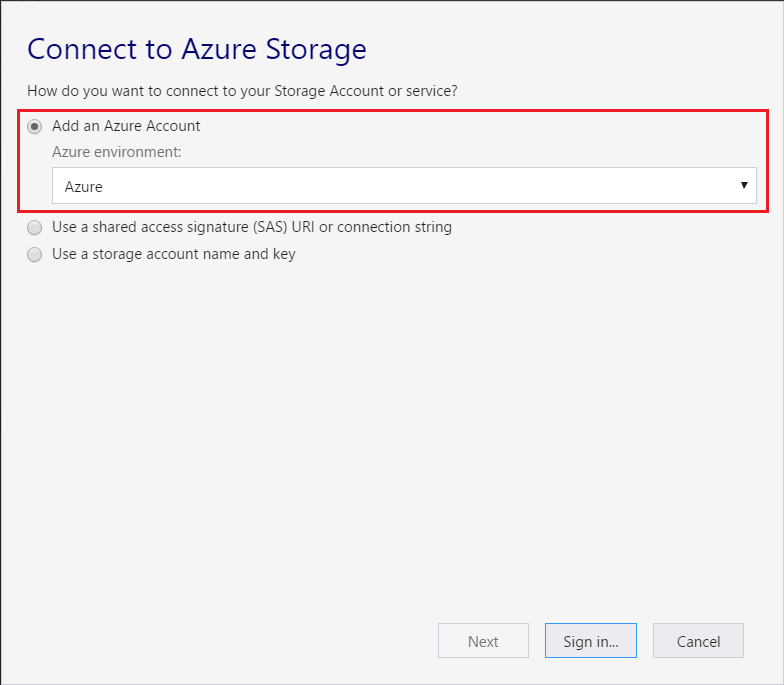

2. In the **Azure Sign in** dialog box, select **Sign in**, and then enter your Azure credentials.

    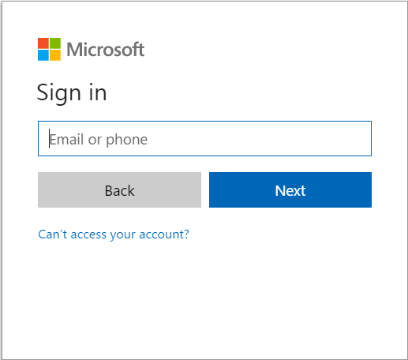

3. Select your subscription from the list and then click **Apply**.

    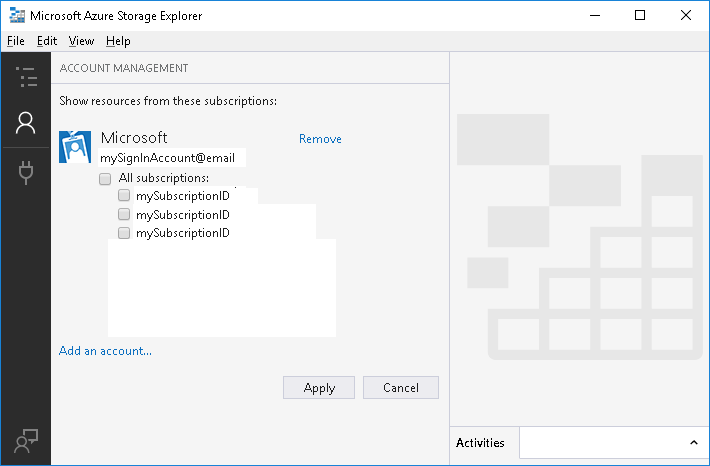

    The Explorer pane updates and displays the accounts in the selected subscription.

    

    You have successfully connected to your **Cosmos DB account** to your Azure subscription.

## Connect to Azure Cosmos DB by using a connection string

An alternative way of connecting to an Azure Cosmos DB is to use a connection string. Use the following steps to connect using a connection string.

1. Find **Local and Attached** in the left tree, right-click **Cosmos DB Accounts**, choose **Connect to Cosmos DB...**

    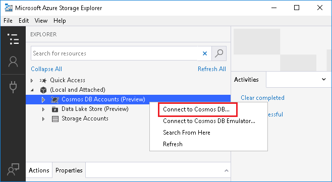

2. Only support SQL and Table API currently. Choose API, paste **Connection String**, input **Account label**, click **Next** to check the summary, and then click **Connect** to connect Azure Cosmos DB account. For information on retrieving the primary connection string, see [Get the connection string](manage-with-powershell.md#list-keys).

    

## Connect to Azure Cosmos DB by using local emulator

Use the following steps to connect to an Azure Cosmos DB by Emulator, only support SQL account currently.

1. Install Emulator and launch. For how to install Emulator, see
 [Cosmos DB Emulator](https://docs.microsoft.com/azure/cosmos-db/local-emulator)

2. Find **Local and Attached** in the left tree, right-click **Cosmos DB Accounts**, choose **Connect to Cosmos DB Emulator...**

    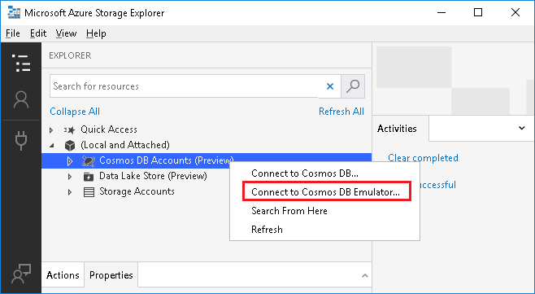

3. Only support SQL API currently. Paste **Connection String**, input **Account label**, click **Next** to check the summary, and then click **Connect** to connect Azure Cosmos DB account. For information on retrieving the primary connection string, see [Get the connection string](manage-with-powershell.md#list-keys).

    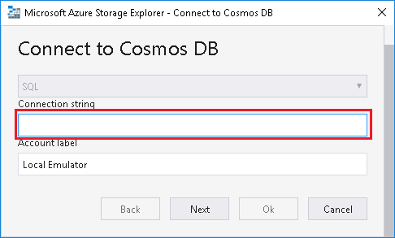

## Azure Cosmos DB resource management

You can manage an Azure Cosmos DB account by doing following operations:
* Open the account in the Azure portal
* Add the resource to the Quick Access list
* Search and refresh resources
* Create and delete databases
* Create and delete collections
* Create, edit, delete, and filter documents
* Manage stored procedures, triggers, and user-defined functions

### Quick access tasks

By right-clicking on a subscription in the Explorer pane, you can perform many quick action tasks:

* Right-click an Azure Cosmos DB account or a database, you can choose **Open in Portal** and manage the resource in the browser on the Azure portal.

     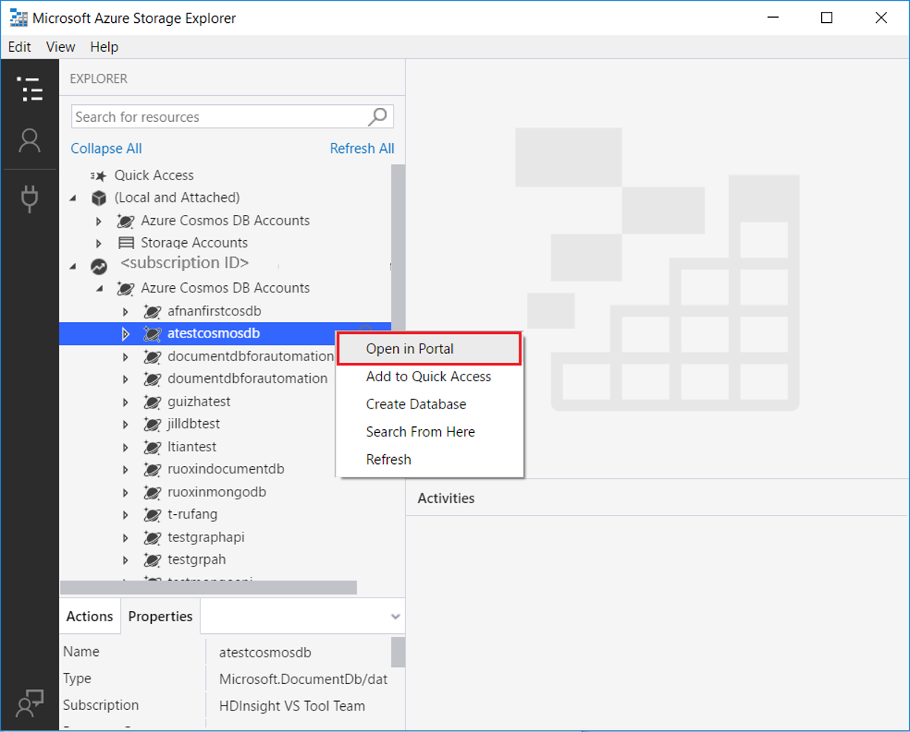

* You can also add Azure Cosmos DB account, database, collection to **Quick Access**.
* **Search from Here** enables keyword search under the selected path.

    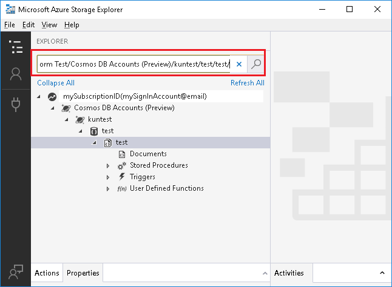

### Database and collection management
#### Create a database
-   Right-click the Azure Cosmos DB account, choose **Create Database**, input the database name, and press **Enter** to complete.

    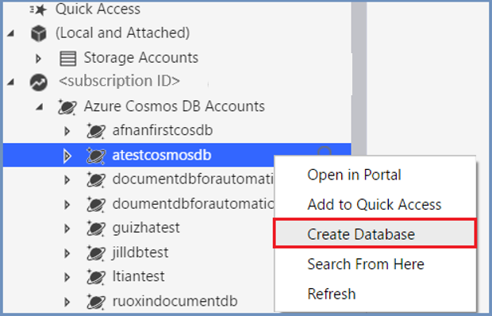

#### Delete a database
- Right-click the database, click **Delete Database**, and click **Yes** in the pop-up window. The database node is deleted, and the Azure Cosmos DB account refreshes automatically.

    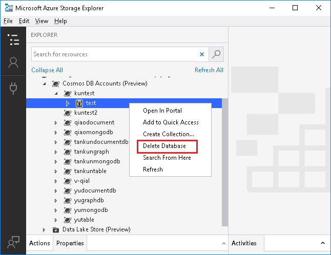

    

#### Create a collection
1. Right-click your database, choose **Create Collection**, and then provide the following information like **Collection ID**, **Storage capacity**, etc. Click **OK** to finish.

    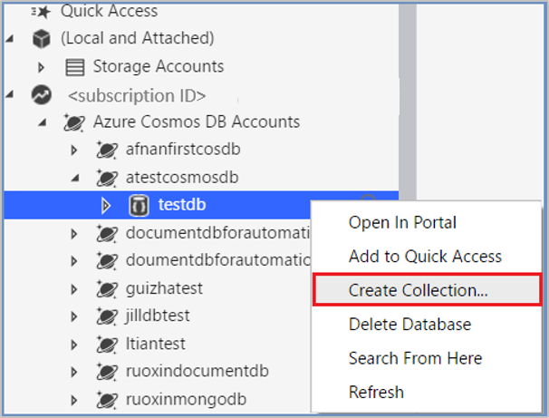

    

2. Select **Unlimited** to be able to specify partition key, then click **OK** to finish.

    If a partition key is used when creating a collection, once creation is completed, the partition key value can't be changed on the collection.

    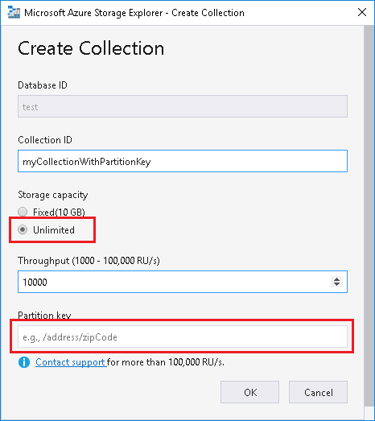

#### Delete a collection
- Right-click the collection, click **Delete Collection**, and then click **Yes** in the pop-up window.

    The collection node is deleted, and the database refreshes automatically.

    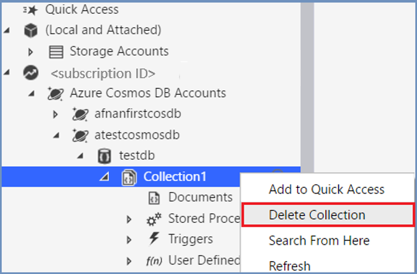

### Document management

#### Create and modify documents
- To create a new document, open **Documents** in the left window, click **New Document**, edit the contents in the right pane, then click **Save**. You can also update an existing document, and then click **Save**. Changes can be discarded by clicking **Discard**.

    

#### Delete a document
- Click the **Delete** button to delete the selected document.

#### Query for documents
- Edit the document filter by entering a [SQL query](how-to-sql-query.md) and then click **Apply**.

    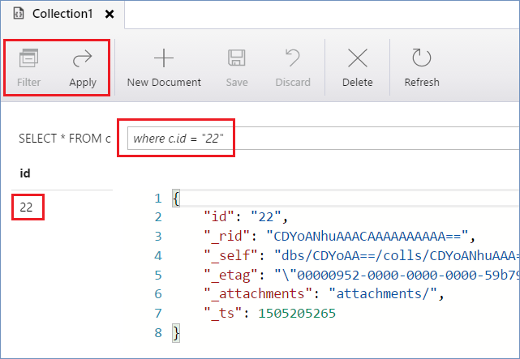

### Graph management

#### Create and modify vertex
1. To create a new vertex, open **Graph** from the left window, click **New Vertex**, edit the contents, then click **OK**.
2. To modify an existing vertex, click the pen icon in the right pane.

    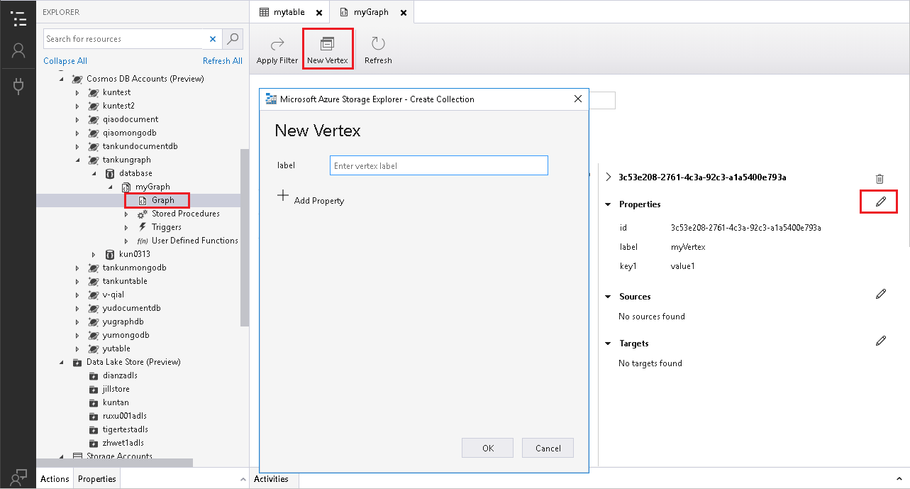

#### Delete a graph
- To delete a vertex, click the recycle bin icon beside the vertex name.

#### Filter for graph
- Edit the graph filter by entering a [gremlin query](gremlin-support.md) and then click **Apply Filter**.

    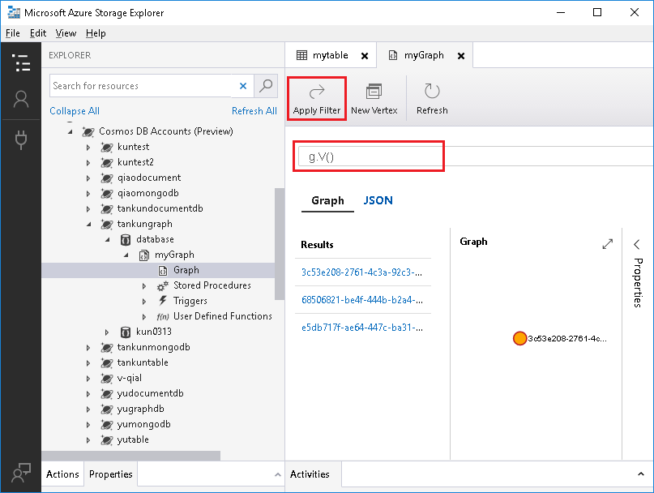

### Table management

#### Create and modify table
1. To create a new table, open **Entities** from the left window, click **Add**, edit the content in **Add Entity** dialog, add property by clicking button **Add Property**, then click **Insert**.
2. To modify a table, click **Edit**, modify the content, then click **Update**.

    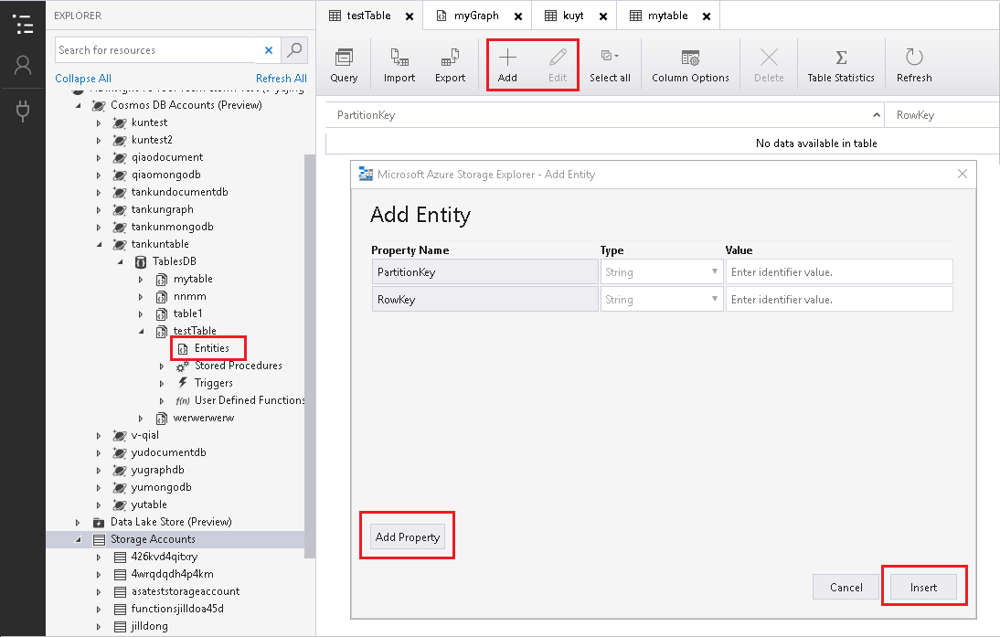

#### Import and export table
1. To import, click **Import** button and choose an existing table.
2. To export, click **Export** button and choose a destination.

    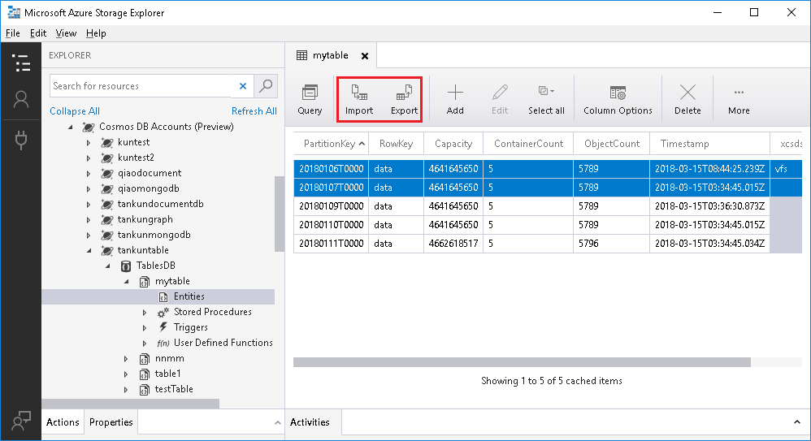

#### Delete entities
- Select the entities and click button **Delete**.

    

#### Query table
- Click **Query** button, input query condition, then click **Execute Query** button. Close Query pane by clicking **Close Query** button.

    

### Manage stored procedures, triggers, and UDFs
* To create a stored procedure, in the left tree, right-click **Stored Procedure**, choose **Create Stored Procedure**, enter a name in the left, type the stored procedure scripts in the right window, and then click **Create**.
* You can also edit existing stored procedures by double-clicking, making the update, and then clicking **Update** to save, or click **Discard** to cancel the change.

    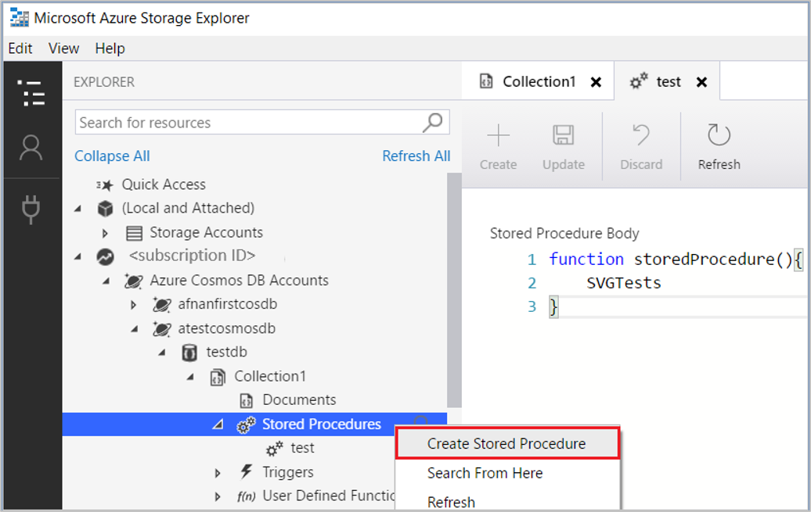
* The operations for **Triggers** and **UDF** are similar with **Stored Procedures**.

## Troubleshooting

[Azure Cosmos DB in Azure Storage Explorer](https://docs.microsoft.com/azure/cosmos-db/storage-explorer) is a standalone app that allows you to connect to Azure Cosmos DB accounts hosted on Azure and Sovereign Clouds from Windows, macOS, or Linux. It enables you to manage Azure Cosmos DB entities, manipulate data, update stored procedures and triggers along with other Azure entities like Storage blobs and queues.

These are solutions for common issues seen for Azure Cosmos DB in Storage Explorer.

### Sign in issues

Before proceeding further, try restarting your application and see if the problems can be fixed.

#### Self-signed certificate in certificate chain

There are a few reasons you may be seeing this error, the two most common ones are:

+ You're behind a *transparent proxy*, which means someone (such as your IT department) is intercepting HTTPS traffic, decrypting it, and then encrypting it using a self-signed certificate.

+ You're running software, such as anti-virus software, which is injecting a self-signed TLS/SSL certificates into the HTTPS messages you receive.

When Storage Explorer encounters one of these "self-signed certificates", it can no longer know if the HTTPS message it's receiving has been tampered with. If you have a copy of the self-signed certificate though, then you can tell Storage Explorer to trust it. If you're unsure of who is injecting the certificate, then you can try to find it yourself by doing the following steps:

1. Install OpenSSL
     - [Windows](https://slproweb.com/products/Win32OpenSSL.html) (any of the light versions is ok)
     - Mac and Linux: Should be included with your operating system
2. Run OpenSSL
    - Windows: Go to the install directory, then **/bin/**, then double-click on **openssl.exe**.
    - Mac and Linux: execute **openssl** from a terminal
3. Execute `s_client -showcerts -connect microsoft.com:443`
4. Look for self-signed certificates. If you're unsure, which are self-signed, then look for anywhere the subject ("s:") and issuer ("i:") are the same.
5.	Once you have found any self-signed certificates, copy and paste everything from and including **-----BEGIN CERTIFICATE-----** to **-----END CERTIFICATE-----** to a new .cer file for each one.
6.	Open Storage Explorer and then go to **Edit** > **SSL Certificates** > **Import Certificates**. Using the file picker, find, select, and open the .cer files you created.

If you're unable to find any self-signed certificates using the above steps, could send feedback for more help.

#### Unable to retrieve subscriptions

If you're unable to retrieve your subscriptions after you successfully signed in:

- Verify your account has access to the subscriptions by signing into the [Azure Portal](https://portal.azure.com/)
- Make sure you have signed in using the correct environment ([Azure](https://portal.azure.com/), [Azure China](https://portal.azure.cn/), [Azure Germany](https://portal.microsoftazure.de/), [Azure US Government](https://portal.azure.us/), or Custom Environment/Azure Stack)
- If you're behind a proxy, make sure that you have configured the Storage Explorer proxy properly
- Try removing and readding the account
- Try deleting the following files from your home directory (such as: C:\Users\ContosoUser), and then readding the account:
  - .adalcache
  - .devaccounts
  - .extaccounts
- Watch the developer tools console (f12) while signing in for any error messages

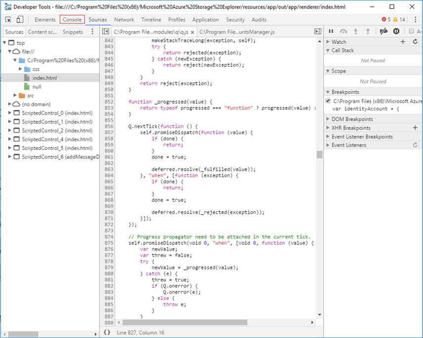

#### Unable to see the authentication page

If you're unable to see the authentication page:

- Depending on the speed of your connection, it may take a while for the sign-in page to load, wait at least one minute before closing the authentication dialog
- If you're behind a proxy, make sure that you have configured the Storage Explorer proxy properly
- Bring up the developer console by pressing F12 key. Watch the responses from developer console and see if you can find any clue for why authentication is not working

#### Cannot remove account

If you're unable to remove an account, or if the reauthenticate link does not do anything

- Try deleting the following files from your home directory, and then readding the account:
  - .adalcache
  - .devaccounts
  - .extaccounts
- If you want to remove SAS attached Storage resources, delete:
  - %AppData%/StorageExplorer folder for Windows
  - /Users/<your_name>/Library/Application SUpport/StorageExplorer for Mac
  - ~/.config/StorageExplorer for Linux
  - **You will have to reenter all your credentials** if you delete these files

### Http/Https proxy issue

You cannot list Azure Cosmos DB nodes in left tree when configuring http/https proxy in ASE. You could use Azure Cosmos DB data explorer in Azure portal as a work-around at this moment.

### "Development" node under "Local and Attached" node issue

There is no response after clicking the "Development" node under "Local and Attached" node in left tree.  The behavior is expected. Azure Cosmos DB local emulator will be supported in next release.

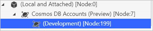

### Attaching Azure Cosmos DB account in "Local and Attached" node error

If you see below error after attaching Azure Cosmos DB account in "Local and Attached" node, then check if you're using the right connection string.

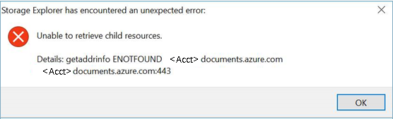

### Expand Azure Cosmos DB node error

You may see below error while trying to expand the tree nodes in left.

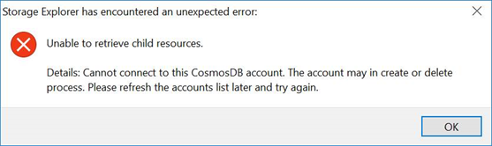

Try the following suggestions:

- Check if the Azure Cosmos DB account is in provision progress and try again when the account is being created successfully.
- If the account is under "Quick Access" node or "Local and Attached" nodes, then check if the account has been deleted. If so, you need to remove the node manually.

## Contact us

If none of the solutions work for you, send email to Azure Cosmos DB Dev Tooling Team ([cosmosdbtooling@microsoft.com](mailto:cosmosdbtooling@microsoft.com)) with details about the issue, for fixing the issues.

## Next steps

* Watch the following video to see how to use Azure Cosmos DB in Azure Storage Explorer: [Use Azure Cosmos DB in Azure Storage Explorer](https://www.youtube.com/watch?v=iNIbg1DLgWo&feature=youtu.be).
* Learn more about Storage Explorer and connect more services in [Get started with Storage Explorer](https://docs.microsoft.com/azure/vs-azure-tools-storage-manage-with-storage-explorer).
