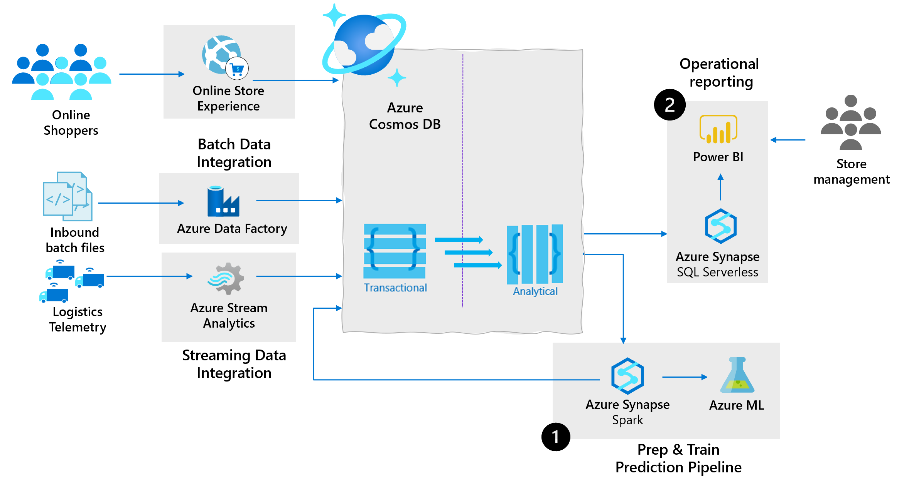
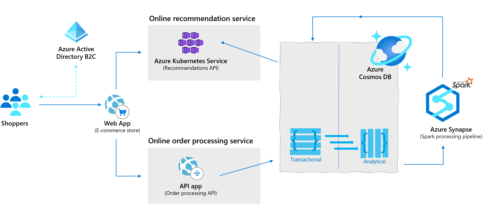
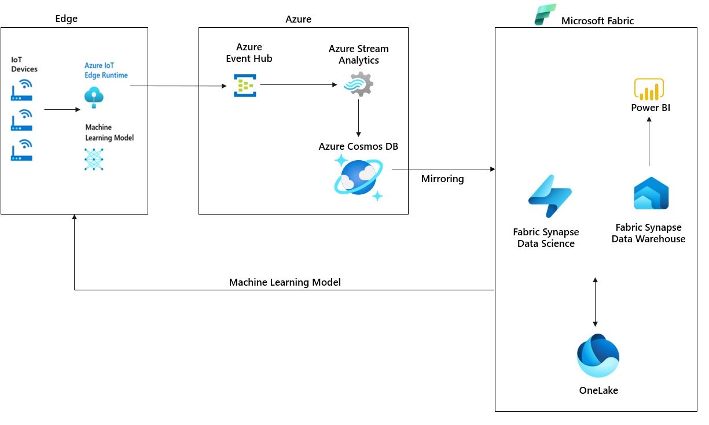
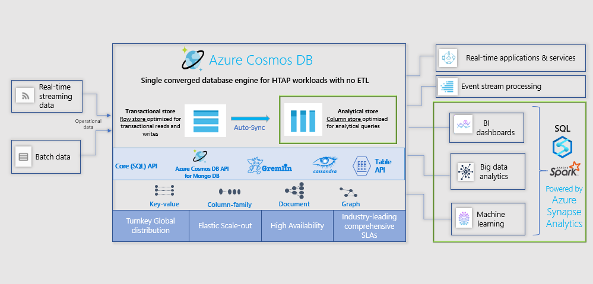

# Azure Synapse Link for Azure Cosmos DB: Near real-time analytics use cases

[Azure Synapse Link](synapse-link.md) for Azure Cosmos DB is a cloud native hybrid transactional and analytical processing (HTAP) capability that enables you to run near real-time analytics over operational data. Synapse Link creates a tight seamless integration between Azure Cosmos DB and Azure Synapse Analytics.

You might be curious to understand what industry use cases can leverage this cloud native HTAP capability for near real-time analytics over operational data. Here are three common use cases for Azure Synapse Link for Azure Cosmos DB:

* Supply chain analytics, forecasting & reporting
* Real-time personalization
* Predictive maintenance, anomaly detection in IOT scenarios

> [!NOTE]
> Azure Synapse Link for Azure Cosmos DB targets the scenario where enterprise teams are looking to run near real-time analytics. These analytics are run without ETL over operational data generated across transactional applications built on Azure Cosmos DB. This does not replace the need for a separate data warehouse when there are traditional data warehouse requirements such as workload management, high concurrency, persistence aggregates across multiple data sources.

## Supply chain analytics, forecasting & reporting

Research studies show that embedding big data analytics in supply chain operations leads to improvements in order-to-cycle delivery times and supply chain efficiency.

Manufacturers are onboarding to cloud-native  technologies to break out of constraints of legacy Enterprise Resource Planning (ERP) and Supply Chain Management (SCM) systems. With supply chains generating increasing volumes of operational data every minute (order, shipment, transaction data), manufacturers need an operational database. This operational database should scale to handle the data volumes as well as an analytical platform to get to a level of real-time contextual intelligence to stay ahead of the curve.

The following architecture shows the power of leveraging Azure Cosmos DB as the cloud-native operational database and Synapse Link in supply chain analytics:

Based on previous architecture, you can achieve the following use cases with Synapse Link for Azure Cosmos DB:

* **Prepare & train predictive pipeline:** Generate insights over the operational data across the supply chain using machine learning translates. This way you can lower inventory, operations costs, and reduce the order-to-delivery times for customers.

  Synapse Link allows you to analyze the changing operational data in Azure Cosmos DB without any manual ETL processes. It saves you from additional cost, latency, and operational complexity. Synapse Link enables data engineers and data scientists to build robust predictive pipelines:

  * Query operational data from Azure Cosmos DB analytical store by leveraging native integration with Apache Spark pools in Azure Synapse Analytics. You can query the data  in an interactive notebook or scheduled remote jobs without complex data engineering.

  * Build  Machine Learning (ML) models with Spark ML algorithms and Azure ML integration in Azure Synapse Analytics.

  * Write back the results after model inference into Azure Cosmos DB for operational near-real-time scoring.

* **Operational reporting:** Supply chain teams need flexible and custom reports over real-time, accurate operational data. These reports are required to obtain a snapshot view of supply chain effectiveness, profitability, and productivity. It allows data analysts and other key stakeholders to constantly reevaluate the business and identify areas to tweak to reduce operational costs. 

  Synapse Link for Azure Cosmos DB enables rich business intelligence (BI)/reporting scenarios:

  * Query operational data from Azure Cosmos DB analytical store by using native integration with Synapse SQL Serverless and full expressiveness of T-SQL language.

  * Model and publish auto refreshing BI dashboards over Azure Cosmos DB through Synapse SQL Serverless support for familiar BI tools. For example, Azure Analysis Services, Power BI Premium, etc.

The following is some guidance for data integration for batch & streaming data into Azure Cosmos DB:

* **Batch data integration & orchestration:** With supply chains getting more complex, supply chain data platforms need to integrate with variety of data sources and formats. Azure Synapse comes built-in with the same data integration engine and experiences as Azure Data Factory. This integration allows data engineers to create rich data pipelines without a separate orchestration engine:

  * Move data from 85+ supported data sources to [Azure Cosmos DB with Azure Data Factory](../data-factory/connector-azure-cosmos-db.md).

  * Write code-free ETL pipelines to Azure Cosmos DB including [relational-to-hierarchical and hierarchical-to-hierarchical mappings with mapping data flows](../data-factory/how-to-sqldb-to-cosmosdb.md).

* **Streaming data integration & processing:** With the growth of Industrial IoT (sensors tracking assets from 'floor-to-store', connected logistics fleets, etc.), there is an explosion of real-time data being generated in a streaming fashion that needs to be integrated with traditional slow moving data for generating insights. Azure Stream Analytics is a recommended service for streaming ETL and processing on Azure with a [wide range of scenarios](../stream-analytics/streaming-technologies.md). Azure Stream Analytics supports [Azure Cosmos DB as a native data sink](../stream-analytics/stream-analytics-documentdb-output.md).

## Real-time personalization

Retailers today must build secure and scalable e-commerce solutions that meet the demands of both customers and business. These e-commerce solutions need to engage customers through customized products and offers, process transactions quickly and securely, and focus on fulfillment and customer service. Azure Cosmos DB along with the latest Synapse Link for Azure Cosmos DB allows retailers to generate personalized recommendations for customers in real time. They use low-latency and tunable consistency settings for immediate insights as shown in the following architecture:

Synapse Link for Azure Cosmos DB use case:

* **Prepare & train predictive pipeline:** You can generate insights over the operational data across your business units or customer segments using Synapse Spark and machine learning models. This translates to personalized delivery to target customer segments, predictive end-user experiences and targeted marketing to fit your end-user requirements.

## IOT predictive maintenance

Industrial IOT innovations have drastically reduced downtimes of machinery and increased overall efficiency across all fields of industry. One of such innovations is predictive maintenance analytics for machinery at the edge of the cloud.

The following is an architecture leveraging the cloud native HTAP capabilities of Azure Synapse Link for Azure Cosmos DB in IoT predictive maintenance:

Synapse Link for Azure Cosmos DB use cases:

* **Prepare & train predictive pipeline:** The historical operational data from IoT device sensors could be used to train predictive models such as anomaly detectors. These anomaly detectors are then deployed back to the edge for real-time monitoring. Such a virtuous loop allows for continuous retraining of the predictive models.

* **Operational reporting:** With the growth of digital twin initiatives, companies are collecting vast amounts of operational data from large number of sensors to build a digital copy of each machine. This data powers BI needs to understand trends over historical data in addition to real-time applications over recent hot data.

## Sample scenario: HTAP for Azure Cosmos DB

For nearly a decade, Azure Cosmos DB has been used by thousands of customers for mission critical applications that require elastic scale, turnkey global distribution, multi-master replication for low latency and high availability of both reads & writes in their transactional workloads.
 
The following list shows an overview of the various workload patterns that are supported with operational data using Azure Cosmos DB:

* Real-time apps & services
* Event stream processing
* BI dashboards
* Big data analytics
* Machine learning

Azure Synapse Link enables Azure Cosmos DB to not just power transactional workloads but also perform near real-time analytical workloads over historical operational data. It happens with no ETL requirements and guaranteed performance isolation from the transactional workloads.

The following image shows workload patterns using Azure Cosmos DB:

Let us take the example of an e-commerce company CompanyXYZ with global operations across 20 countries/regions to illustrate the benefits of choosing Azure Cosmos DB as the single real-time database powering both transactional and analytical requirements of an inventory management platform.

* CompanyXYZ's core business depends on the inventory management system – hence availability & reliability are core pillar requirements. Benefits of using Azure Cosmos DB:

  * By virtue of deep integration with Azure infrastructure and transparent multi-master global replication, Azure Cosmos DB provides industry-leading [99.999% high availability](high-availability.md) against regional outages.

* CompanyXYZ's supply chain partners may be in separate geographic locations but they may have to see a single view of the product inventory across the globe to support their local operations. This includes the need to be able to read updates made by other supply chain partners in real time. As well as being able to make updates without worrying about conflicts with other partners at high throughput. Benefits of using Azure Cosmos DB:

  * With its unique multi-master replication protocol and latch-free, write-optimized transactional store, Azure Cosmos DB guarantees less than 10-ms latencies for both indexed reads and writes at the 99th percentile globally.

  * High throughput ingestion of both batch & streaming data feeds with [real-time indexing](index-policy.md) in transactional store.

  * Azure Cosmos DB transactional store provides three more options than the two extremes of strong and eventual consistency levels to achieve the [availability vs performance tradeoffs](consistency-levels-tradeoffs.md) closest to the business need.

* CompanyXYZ's supply chain partners have highly fluctuating traffic patterns ranging from hundreds to millions of requests/s and thus the inventory management platform needs to deal with unexpected burstiness in traffic.  Benefits of using Azure Cosmos DB:

  * Azure Cosmos DB's transactional store supports elastic scalability of storage and throughput using horizontal partitioning. Containers and databases configured in Autopilot mode can automatically and instantly scale the provisioned throughput based on the application needs without impacting the availability, latency, throughput, or performance of the workload globally.

* CompanyXYZ needs to establish a secure analytics platform to house system-wide historical inventory data to enable analytics and insights across supply chain partner, business units and functions. The analytics platform needs to enable collaboration across the system, traditional BI/reporting use cases, advanced analytics use cases and predictive intelligent solutions over the operational inventory data. Benefits of using Synapse Link for Azure Cosmos DB:

  * By using [Azure Cosmos DB analytical store](analytical-store-introduction.md), a fully isolated column store, Synapse Link enables no Extract-Transform-Load (ETL) analytics in [Azure Synapse Analytics](../synapse-analytics/overview-what-is.md) against globally distributed operational data at scale.  Business analysts, data engineers and data scientists can now use Synapse Spark or Synapse SQL in an interoperable manner to run near real-time business intelligence, analytics, and machine learning pipelines without impacting the performance of their transactional workloads on Azure Cosmos DB. See the [benefits of Synapse Link in Azure Cosmos DB](synapse-link.md) for more details.

## Next steps

To learn more, see the following docs:

* [Azure Synapse Link for Azure Cosmos DB](synapse-link.md) 

* [Azure Cosmos DB Analytical Store](analytical-store-introduction.md)

* [Working with Azure Synapse Link for Azure Cosmos DB](configure-synapse-link.md)

* [Frequently asked questions about Azure Synapse Link for Azure Cosmos DB](synapse-link-frequently-asked-questions.md)

* [Apache Spark in Azure Synapse Analytics](../synapse-analytics/spark/apache-spark-concepts.md)

* [SQL serverless/on-demand in Azure Synapse Analytics](../synapse-analytics/sql/on-demand-workspace-overview.md)
