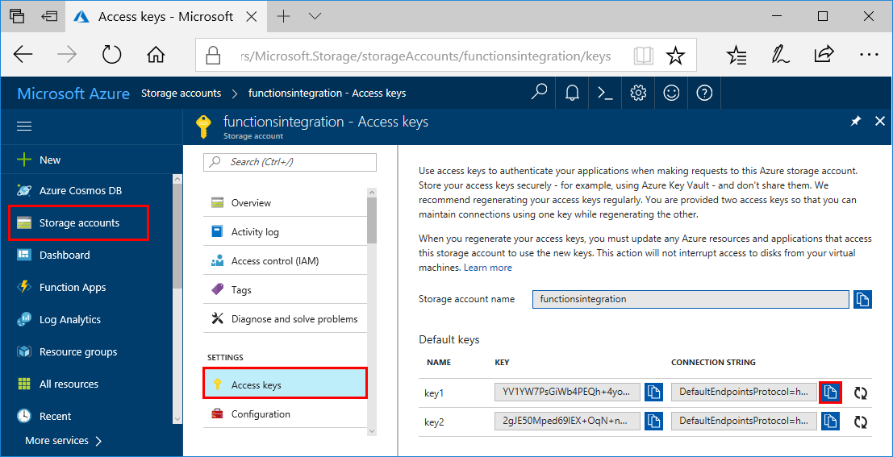

# Migrate your data to Azure Cosmos DB Table API account

This tutorial provides instructions on importing data for use with the Azure Cosmos DB [Table API](table-introduction.md). If you have data stored in Azure Table storage, you can use either the Data Migration Tool or AzCopy to import your data to Azure Cosmos DB Table API. If you have data stored in an Azure Cosmos DB Table API (preview) account, you must use the Data Migration tool to migrate your data. 

This tutorial covers the following tasks:

> [!div class="checklist"]
> * Importing data with the Data Migration tool
> * Importing data with AzCopy
> * Migrating from Table API (preview) to Table API 

## Prerequisites

* **Increase throughput:** The duration of your data migration depends on the amount of throughput you set up for an individual container or a set of containers. Be sure to increase the throughput for larger data migrations. After you've completed the migration, decrease the throughput to save costs. For more information about increasing throughput in the Azure portal, see Performance levels and pricing tiers in Azure Cosmos DB.

* **Create Azure Cosmos DB resources:** Before you start the migrating data, pre-create all your tables from the Azure portal. If you are migrating to an Azure Cosmos DB account that has database level throughput, make sure to provide a partition key when creating the Azure Cosmos DB tables.

## Data Migration tool

The command-line Azure Cosmos DB Data Migration tool (dt.exe) can be used to import your existing Azure Table storage data to a Table API GA account, or migrate data from a Table API (preview) account into a Table API GA account. Other sources are not currently supported. The UI based Data Migration tool (dtui.exe) is not currently supported for Table API accounts. 

To perform a migration of table data, complete the following tasks:

1. Download the migration tool from [GitHub](https://github.com/azure/azure-documentdb-datamigrationtool).
2. Run `dt.exe` using the command-line arguments for your scenario. `dt.exe` takes a command in the following format:

   ```bash
    dt.exe [/<option>:<value>] /s:<source-name> [/s.<source-option>:<value>] /t:<target-name> [/t.<target-option>:<value>] 
```

Options for the command are:

    /ErrorLog: Optional. Name of the CSV file to redirect data transfer failures
    /OverwriteErrorLog: Optional. Overwrite error log file
    /ProgressUpdateInterval: Optional, default is 00:00:01. Time interval to refresh on-screen data transfer progress
    /ErrorDetails: Optional, default is None. Specifies that detailed error information should be displayed for the following errors: None, Critical, All

### Command-line source settings

Use the following source options when defining Azure Table Storage or Table API preview as the source of the migration.

    /s:AzureTable: Reads data from Azure Table storage
    /s.ConnectionString: Connection string for the table endpoint. This can be retrieved from the Azure portal
    /s.LocationMode: Optional, default is PrimaryOnly. Specifies which location mode to use when connecting to Azure Table storage: PrimaryOnly, PrimaryThenSecondary, SecondaryOnly, SecondaryThenPrimary
    /s.Table: Name of the Azure Table
    /s.InternalFields: Set to All for table migration as RowKey and PartitionKey are required for import.
    /s.Filter: Optional. Filter string to apply
    /s.Projection: Optional. List of columns to select

To retrieve the source connection string when importing from Azure Table storage, open the Azure portal and click **Storage accounts** > **Account** > **Access keys**, and then use the copy button to copy the **Connection string**.



To retrieve the source connection string when importing from an Azure Cosmos DB Table API (preview) account, open the Azure portal, click **Azure Cosmos DB** > **Account** > **Connection String** and use the copy button to copy the **Connection String**.


[Sample Azure Table Storage command](#azure-table-storage)

[Sample Azure Cosmos DB Table API (preview) command](#table-api-preview)

### Command-line target settings

Use the following target options when defining Azure Cosmos DB Table API as the target of the migration.

    /t:TableAPIBulk: Uploads data into Azure CosmosDB Table in batches
    /t.ConnectionString: Connection string for the table endpoint
    /t.TableName: Specifies the name of the table to write to
    /t.Overwrite: Optional, default is false. Specifies if existing values should be overwritten
    /t.MaxInputBufferSize: Optional, default is 1GB. Approximate estimate of input bytes to buffer before flushing data to sink
    /t.Throughput: Optional, service defaults if not specified. Specifies throughput to configure for table
    /t.MaxBatchSize: Optional, default is 2MB. Specify the batch size in bytes

<a id="azure-table-storage"></a>
### Sample command: Source is Azure Table storage

Here is a command-line sample showing how to import from Azure Table storage to Table API:

```
dt /s:AzureTable /s.ConnectionString:DefaultEndpointsProtocol=https;AccountName=<Azure Table storage account name>;AccountKey=<Account Key>;EndpointSuffix=core.windows.net /s.Table:<Table name> /t:TableAPIBulk /t.ConnectionString:DefaultEndpointsProtocol=https;AccountName=<Azure Cosmos DB account name>;AccountKey=<Azure Cosmos DB account key>;TableEndpoint=https://<Account name>.table.cosmosdb.azure.com:443 /t.TableName:<Table name> /t.Overwrite
```
<a id="table-api-preview"></a>
### Sample command: Source is Azure Cosmos DB Table API (preview)

Here is a command-line sample to import from Table API preview to Table API GA:

```
dt /s:AzureTable /s.ConnectionString:DefaultEndpointsProtocol=https;AccountName=<Table API preview account name>;AccountKey=<Table API preview account key>;TableEndpoint=https://<Account Name>.documents.azure.com; /s.Table:<Table name> /t:TableAPIBulk /t.ConnectionString:DefaultEndpointsProtocol=https;AccountName=<Azure Cosmos DB account name>;AccountKey=<Azure Cosmos DB account key>;TableEndpoint=https://<Account name>.table.cosmosdb.azure.com:443 /t.TableName:<Table name> /t.Overwrite
```

## Migrate data by using AzCopy

Using the AzCopy command-line utility is the other option for migrating data from Azure Table storage to the Azure Cosmos DB Table API. To use AzCopy, you first export your data as described in [Export data from Table storage](../storage/common/storage-use-azcopy.md#export-data-from-table-storage), then import the data to Azure Cosmos DB as described in [Azure Cosmos DB Table API](../storage/common/storage-use-azcopy.md#import-data-into-table-storage).

When performing the import into Azure Cosmos DB, refer to the following sample. Note that the /Dest value uses cosmosdb, not core.

Example import command:

```
AzCopy /Source:C:\myfolder\ /Dest:https://myaccount.table.cosmosdb.windows.net/mytable1/ /DestKey:key /Manifest:"myaccount_mytable_20140103T112020.manifest" /EntityOperation:InsertOrReplace
```

## Migrate from Table API (preview) to Table API

> [!WARNING]
> If you want to immediately enjoy the benefits of the generally available tables then please migrate your existing preview tables as specified in this section, otherwise we will be performing auto-migrations for existing preview customers in the coming weeks, note however that auto-migrated preview tables will have certain restrictions to them that newly created tables will not.
> 

The Table API is now generally available (GA). There are differences between the preview and GA versions of tables both in the code that runs in the cloud as well as in code that runs at the client. Therefore it is not advised to try to mix a preview SDK client with a GA Table API account, and vice versa. Table API preview customers who want to continue to use their existing tables but in a production environment need to migrate from the preview to the GA environment, or wait for auto-migration. If you wait for auto-migration, you will be notified of the restrictions on the migrated tables. After migration, you will be able to create new tables on your existing account without restrictions (only migrated tables will have restrictions).

To migrate from Table API (preview) to the generally available Table API:

1. Create a new Azure Cosmos DB account and set its API type to Azure Table as described in [Create a database account](create-table-dotnet.md#create-a-database-account).

2. Change clients to use a GA release of the [Table API SDKs](table-sdk-dotnet.md).

3. Migrate the client data from preview tables to GA tables by using the Data Migration tool. Instructions on using the data migration tool for this purpose are described in [Data Migration tool](#data-migration-tool). 

## Next steps

In this tutorial you learned how to:

> [!div class="checklist"]
> * Import data with the Data Migration tool
> * Import data with AzCopy
> * Migrate from Table API (preview) to Table API

You can now proceed to the next tutorial and learn how to query data using the Azure Cosmos DB Table API. 

> [!div class="nextstepaction"]
>[How to query data?](../cosmos-db/tutorial-query-table.md)
