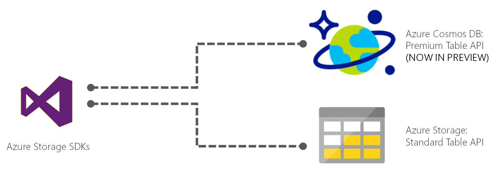

---
title: Introduction to Azure Cosmos DB's Table API | Microsoft Docs
description: Learn how you can use Azure Cosmos DB to store and query massive volumes of key-value data with low latency using the popular OSS MongoDB APIs.
services: cosmosdb
author: bhanupr
manager: jhubbard
editor: monicar
documentationcenter: ''

ms.assetid: 
ms.service: cosmosdb
ms.workload: data-services
ms.tgt_pltfrm: na
ms.devlang: na
ms.topic: get-started-article
ms.date: 05/10/2017
ms.author: arramac

---
# Introduction to Azure Cosmos DB: Table API

[Azure Cosmos DB](introduction.md) is Microsoft's globally distributed, multi-model database service for mission-critical applications. Azure Cosmos DB provides [turn-key global distribution](../documentdb/documentdb-distribute-data-globally.md), [elastic scaling of throughput and storage](partition-data.md) worldwide, single-digit millisecond latencies at the 99th percentile, [five well-defined consistency levels](../documentdb/documentdb-consistency-levels.md), and guaranteed high availability, all backed by [industry-leading SLAs](https://azure.microsoft.com/support/legal/sla/documentdb/v1_1/). Azure Cosmos DB [automatically indexes data](http://www.vldb.org/pvldb/vol8/p1668-shukla.pdf) without requiring you to deal with schema and index management. It is multi-model and supports document, key-value, graph, and columnar data models. 

 

Azure Cosmos DB provides the Table API for applications that need a key-value store with flexible schema. [Azure Table storage](../storage/storage-introduction.md) SDKs and REST APIs can be used to work with Azure Cosmos DB. You can use Azure Cosmos DB to create tables with high throughput requirements. Azure Cosmos DB supports throughput-optimized tables (informally called "premium tables"), currently in public preview. 

You can continue to use Azure Table storage for tables with high storage and lower throughput requirements. Azure Cosmos DB will introduce support for storage-optimized tables in a future update, and existing and new Azure Table storage accounts will be upgraded to Azure Cosmos DB.

## Premium and standard Table APIs
If you currently use Azure Table storage, you gain the following benefits by moving to Azure Cosmos DB's "premium table" preview:

|  | Azure Table Storage | Azure Cosmos DB: Table storage (preview) |
| --- | --- | --- |
| Latency | Fast, but no upper bounds on latency | Single-digit millisecond latency for reads and writes, backed with <10 ms latency reads and <15 ms latency writes at the 99th percentile, at any scale, anywhere in the world |
| Throughput | Highly scalable, but no dedicated throughput model. Tables have a scalability limit of 20,000 operations/s | Highly scalable with [dedicated reserved throughput per table](../documentdb/documentdb-request-units.md), that is backed by SLAs. Accounts have no upper limit on throughput, and support >10 million operations/s per table |
| Global Distribution | Single region with one optional readable secondary read region for HA. You cannot initiate failover | [Turn-key global distribution](../documentdb/documentdb-distribute-data-globally.md) from one to 30+ regions, Support for [automatic and manual failovers](../documentdb/documentdb-regional-failovers.md) at any time, anywhere in the world |
| Indexing | Only primary index on PartitionKey and RowKey. No secondary indexes | Automatic and complete indexing on all properties, no index management |
| Query | Query execution uses index for primary key, and scans otherwise. | Queries can take advantage of automatic indexing on properties for fast query times. Azure Cosmos DB's database engine is capable of supporting aggregates, geo-spatial, and sorting. |
| Consistency | Strong within primary region, Eventual with secondary region | [five well-defined consistency levels](../documentdb/documentdb-consistency-levels.md) to trade off availability, latency, throughput, and consistency based on your application needs |
| Pricing | Storage-optimized  | Throughput-optimized |
| SLAs | 99.9% availability | 99.99% availability within a single region, and ability to add more regions for higher availability. [Industry-leading comprehensive SLAs](https://azure.microsoft.com/support/legal/sla/documentdb/v1_1/) on general availability |

## How to get started

Create an Azure Cosmos DB account in the [Azure portal](https://portal.azure.com), and get started with our [Quickstart for Table API using .NET](create-table-dotnet.md). 

## Next steps

Here are a few pointers to get you started:
* Get started with [Azure Cosmos DB's Table API](create-table-dotnet.md) using existing NET Table SDK.
* Learn about [Global distribution with Azure Cosmos DB](../documentdb/documentdb-distribute-data-globally.md).
* Learn about [Provisioned throughput in Azure Cosmos DB](../documentdb/documentdb-request-units.md).