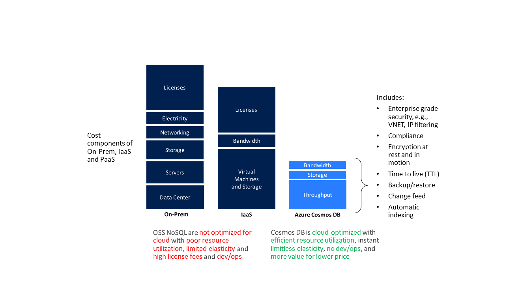

# Total Cost of Ownership with Azure Cosmos DB

Azure Cosmos DB is designed for the cloud with the [fine grained multi-tenancy and resource governance](https://azure.microsoft.com/en-us/blog/a-technical-overview-of-azure-cosmos-db/) from the ground up. This design allows the service to operate at significantly lower COGS and pass on the savings to customers. Today, Cosmos DB packs nearly 280+ customers on a single machine (with the density continuously increasing) and thousands of customers within a cluster. The service load balances replicas of customers across machines in a cluster and across clusters within a data center (read more about [Cosmos DB: Pushing the frontier of globally distributed databases](https://azure.microsoft.com/en-us/blog/azure-cosmos-db-pushing-the-frontier-of-globally-distributed-databases/)). The net result is that Cosmos DB, by virtue of resource-governance, multi-tenancy, and native integration with the rest of Azure infrastructure is on average 4-6x cheaper than MongoDB, Cassandra, or other OSS NoSQL running on IaaS and up-to 10x cheaper than those engines running on premises. See the paper on [The Total Cost of (Non) Ownership of a NoSQL Database Cloud Service](https://documentdbportalstorage.blob.core.windows.net/papers/11.15.2017/NoSQL TCO paper.pdf).

When considering any OSS NoSQL, whether it’s Apache Cassandra, MongoDB, HBase, or any other OSS NoSQL - all of these database engines were designed for on-premises. When offered as a “managed service” they are equivalent to an “Resource Manager template” with a tenant database for tracking/managing the provisioned clusters and monitoring support. OSS NoSQL architectures require significant operational overhead, and the expertise can be difficult and expensive to find. On the other hand, Cosmos DB is a fully managed cloud service, which allows developers to focus on business innovation rather than on managing and maintaining database infrastructure. Furthermore, unlike a cloud-native database service like Cosmos DB, OSS NoSQL database engines were not designed and built with the resource governance or fine-grained multi-tenancy as the fundamental architectural principles. As such, OSS NoSQL database engines like Cassandra and MongoDB make a fundamental assumption that all of the resources of the machine or VM they are running on are available for their use. Many of these database engines cannot function if the amount of resources drops below a certain threshold (for example, for small VM instances) and come with vendor-recommended configurations suggesting typically large-scale VMs with higher cost. That is why it is not possible to host an OSS NoSQL or any other on-premise database engine and expose it using an abstract charging model (requests per second or consumed storage).

## Total cost of ownership of Azure Cosmos DB 

The serverless provisioning model of Cosmos DB eliminates the need to over-provision database infrastructure and is provided without the need for specialized configurations or licensing. As a result, customers report that Cosmos DB-backed applications can run with as much as a 70 percent TCO savings when compared to OSS NoSQL databases. See [customer use-cases](https://customers.microsoft.com/en-us/search?sq=Cosmos%20DB&ff=&p=0&so=story_publish_date%20desc) for examples of what you can build on top of Cosmos DB. Other benefits of the Cosmos DB pricing model include:

* **Great value for the price.** Market analysts, customers, and partners have confirmed a greater value of all the features that Cosmos DB offers for a much lower price compared to what customers can get when implementing these solutions on their own or through other vendors. Popular database features such global distribution, multi-master, well-defined and intuitive consistency models, automatic indexing are greatly simplified with Cosmos DB, having a push-button implementation without any complexity, overhead, or downtime.

* **No NoSQL administration dev/ops required.** With Cosmos DB one does not need to employ dev/ops to manage deployments, perform maintenance, scale, patch, and execute other day-to-day tasks required with OSS NoSQL cluster hosted on-premises or on cloud infrastructure.

* **Superior elasticity.** Cosmos DB throughput can be scaled up and down on a second’s notice, allowing to reduce the cost of ownership during non-peak times. OSS NoSQL clusters deployed on cloud infrastructure offer limited elasticity, and on-premises deployments aren't elastic by definition. Only a database built by a cloud provider can elastically scale at a linear scale. In Cosmos DB, if you provision more RUs (regardless of the scale), your throughput will scale linearly guaranteed. This guarantee is backed up by financial SLAs and is guaranteed at the 99th percentile at any scale.

* **Economies of scale.** A managed service like Cosmos DB operates with a large number of nodes, integrated natively with networking, storage, and computes. Because of Cosmos DB's large scale, standardization and homogenization, Cosmos DB can pass on savings to you.

* **Optimized for the cloud.** Cloud born databases, like Cosmos DB, are designed from the ground-up with fine-grained multi-tenancy and performance isolation. This allows for optimally placing, executing, and balancing thousands of tenants and their workloads across clusters and data centers. In contrast, the current generation of OSS NoSQL databases are born to operate on-premises with an entire VM assumed to run a single tenant’s workload. These databases also not designed to leverage a cloud provider’s infrastructure and hardware to the full extent that is possible. For example, an OSS NoSQL database engine is unaware of the differences between a VM going down vs a routine image upgrade, or the fact that premium disk is already three-way replicated.  It can't take advantage of these benefits natively and pass on the benefits and savings to customers.

* **You pay by the hour.** For large-scale workloads, being able to scale at any point in time and only be charged by the hour is incredibly attractive. It’s inevitable that the price elasticity of workloads typically varies tremendously across times of the year, across workloads and tenants who bring and query their data. With Cosmos DB, you can scale up or down as you need and pay only for what you need. With on-prem or IaaS-hosted systems, you can't match this model, because you simply can't decommission hardware every hour. In such cases, you can potentially save between 10-14X, on average.

* **You get numerous features for free.** In Cosmos DB, write-style workloads are substantially cheaper compared to alternative database services. In addition, Cosmos DB gives away several popular features for free, such as [automatic indexing](indexing-policies.md), [Time to Live (TTL)](time-to-live.md), [Change Feed](change-feed.md) and others – something that other database services typically charge for, ala-carte.

* **You use ‘unified currency’ for diverse workloads.** Unlike alternative offerings, in Cosmos DB, you do not need to segment workloads (for example, into reads and writes) and provision throughput on a per workload type (read throughput vs. write throughput). In Cosmos DB, provisioned throughput is reserved using a unified and normalized currency (Request Units or RU/sec) not forcing you to segment their workloads a priori, do capacity planning separately and pay for each type of capacity separately. Such approach enables you to easily interchange the same RUs between various operations and workload types and save.

* **You are not required to provision large-scale VMs (in order to be able to scale).** Most operational databases require you to go with large VMs to avoid noisy neighbors and loose resource governance, if you want scale. This puts the burden and the upfront commitment and cost on the customers. With Cosmos DB, you can start “small” and grow into the “large scale” workload sizes seamlessly, gradually and without any downtime or impact on data availability.

* **You can saturate provisioned throughput.** By virtue of sub-core multiplexing in Cosmos DB, you can saturate the provisioned throughput much better than IaaS hosted options or third party offers, thus saving a lot more than with alternative solutions.

* **You get the benefits of deep integration of Cosmos DB with other Azure services.** Cosmos DB has a native integration with Networking, Compute, Azure Functions (serverless), Azure IoT, and others Azure services, which allows you to get the best performance, speed of data replication across the world with robust guarantees – something that third party solutions would not be able to match or would typically charge a premium.

* **You automatically get high availability, with at least 10-12 fault domains by default.** Cosmos DB supports the distribution of workloads across fault domains, a feature that is critical for high availability. With 99.999 HA for reads and writes at the 99th percentile across anywhere in the world – the cost of implementing something like this by customers on their own or through a third-party solution, would be cost-prohibitive.

* **You automatically get all enterprise capabilities, at no additional cost.** Cosmos DB offers the most comprehensive set of compliance certifications, security, and encryption at rest and in motion at no additional cost (compared to our competition). By being a Ring 0 service, you automatically get regional availability anywhere in the world. They can take their database and make it span across any number of Azure regions (already 54+ regions in Azure) and at any point add and remove any number of regions.

* **You can save up to 65% with reserved capacity** on your mission-critical workloads with even better SLAs in terms of provisioning capacity.

## Next steps

* Learn more about [Request Units](request-units.md) in Azure Cosmos DB
* Learn to [provision throughput on a database or a container](set-throughput.md)
* Learn more about [logical partitions](partition-data.md)
* Learn [how to provision throughput on a Cosmos container](how-to-provision-container-throughput.md)
* Learn [how to provision throughput on a Cosmos database](how-to-provision-database-throughput.md)
* Learn more about [How Cosmos pricing works](how-pricing-works.md)
* Learn more about [How Cosmos DB pricing model is cost-effective for customers](total-cost-of-ownership.md)
* Learn more about [Optimizing for development and testing](optimize-dev-test.md)
* Learn more about [Understanding your Cosmos DB bill](understand-your-bill.md)
* Learn more about [Optimizing throughput cost](optimize-cost-throughput.md)
* Learn more about [Optimizing storage cost](optimize-cost-storage.md)
* Learn more about [Optimizing the cost of reads and writes](optimize-cost-reads-writes.md)
* Learn more about [Optimizing the cost of queries](optimize-cost-queries)
* Learn more about [Optimizing the cost of multi-region Cosmos accounts](optimize-cost-regions.md)
* Learn more about [Cosmos DB reserved capacity](cosmos-db-reserved-capacity.md)
* Learn more about [Cosmos DB pricing page](https://azure.microsoft.com/en-us/pricing/details/cosmos-db/)
* Learn more about [Cosmos DB Emulator](local-emulator.md)
* Learn more about [Azure Free account](https://azure.microsoft.com/free/)
* Learn more about [Try Cosmos DB for free](https://azure.microsoft.com/en-us/try/cosmosdb/)
* Learn more about [Azure Cosmos DB: Pushing the frontier of globally distributed databases](https://azure.microsoft.com/en-us/blog/azure-cosmos-db-pushing-the-frontier-of-globally-distributed-databases/)
* Learn more about [The Total Cost of (Non) Ownership of a NoSQL Database Cloud Service](https://documentdbportalstorage.blob.core.windows.net/papers/11.15.2017/NoSQL%20TCO%20paper.pdf)
