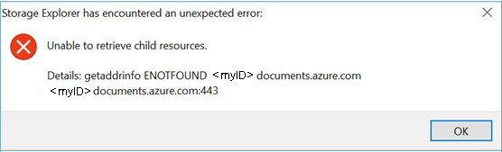

# Azure Cosmos DB in Storage Explorer troubleshooting guide overview

[Azure Cosmos DB in Azure Storage Explorer](https://docs.microsoft.com/en-us/azure/cosmos-db/storage-explorer) is a standalone app that allows you to connect to Azure Cosmos DB accounts hosted on Azure and Sovereign Clouds from Windows, macOS, or Linux. It enables you to manage Azure Cosmos DB entities, manipulate data, update stored procedures and triggers along with other Azure entities like Storage blobs and queues.

This guide summarizes solutions for common issues seen for Azure Cosmos DB in Storage Explorer.

- [Sign in issues](#Sign-in-issues)
  - [Self-signed certificate in certificate chain](#Self-signed-certificate-in-certificate-chain)
  - [Unable to retrieve subscriptions](#Unable-to-retrieve-subscriptions)
  - [Unable to see the authentication page](#Unable-to-see-the-authentication-page)
  - [Cannot remove account](#Cannot-remove-account)
- [Http/Https proxy issue](#Http/Https-proxy-issue)
- ["Development" node under "Local and Attached" node issue](#Development-node-under-Local-and-Attached-node-issue)
- [Attaching Azure Cosmos DB account in "Local and Attached" node error](#Attaching-Azure-Cosmos-DB-account-in-Local-and-Attached-node-error)
- [Expand Azure Cosmos DB node error](#Expand-Azure-Cosmos-DB-node-error)
- [Next steps](#Next-steps)

<h2 id="Sign-in-issues">Sign in issues</h2>

Before proceeding further, try restarting your application and see if the problems can be fixed.

<h2 id="Self-signed-certificate-in-certificate-chain">Self-signed certificate in certificate chain</h2>

There are a few reasons you may be seeing this error, the two most common ones are:

1. You're behind a “transparent proxy”, which means someone (such as your IT department) is intercepting HTTPS traffic, decrypting it, and then encrypting it using a self-signed certificate.

2. You're running software, such as anti-virus software, which is injecting a self-signed SSL certificates into the HTTPS messages you receive.

When Storage Explorer encounters one of these "self-signed certificates", it can no longer know if the HTTPS message it's receiving has been tampered with. If you have a copy of the self-signed certificate though, then you can tell Storage Explorer to trust it. If you're unsure of who is injecting the certificate, then you can try to find it yourself by doing the following steps:

1. Install Open SSL
     - [Windows](https://slproweb.com/products/Win32OpenSSL.html) (any of the light versions is ok)
     - Mac and Linux: Should be included with your operating system
2. Run Open SSL
    - Windows: Go to the install directory, then **/bin/**, then double-click on **openssl.exe**.
    - Mac and Linux: execute **openssl** from a terminal
3. Execute `s_client -showcerts -connect microsoft.com:443`
4. Look for self-signed certificates. If you're unsure, which are self-signed, then look for anywhere the subject ("s:") and issuer ("i:") are the same.
5.	Once you have found any self-signed certificates, copy and paste everything from and including **-----BEGIN CERTIFICATE-----** to **-----END CERTIFICATE-----** to a new .cer file for each one.
6.	Open Storage Explorer and then go to **Edit** > **SSL Certificates** > **Import Certificates**. Using the file picker, find, select, and open the .cer files you created.

If you're unable to find any self-signed certificates using the above steps, could send feedback for more help.

<h2 id="Unable-to-retrieve-subscriptions">Unable to retrieve subscriptions</h2>

If you're unable to retrieve your subscriptions after you successfully signed in:

- Verify your account has access to the subscriptions by signing into the [Azure Portal](http://portal.azure.com/)
- Make sure you have signed in using the correct environment ([Azure](http://portal.azure.com/), [Azure China](https://portal.azure.cn/), [Azure Germany](https://portal.microsoftazure.de/), [Azure US Government](http://portal.azure.us/), or Custom Environment/Azure Stack)
- If you're behind a proxy, make sure that you have configured the Storage Explorer proxy properly
- Try removing and readding the account
- Try deleting the following files from your home directory (such as: C:\Users\ContosoUser), and then readding the account:
  - .adalcache
  - .devaccounts
  - .extaccounts
- Watch the developer tools console (f12) while signing in for any error messages

<h2 id="Unable-to-see-the-authentication-page">Unable to see the authentication page</h2>  

If you're unable to see the authentication page:

- Depending on the speed of your connection, it may take a while for the sign-in page to load, wait at least one minute before closing the authentication dialog
- If you're behind a proxy, make sure that you have configured the Storage Explorer proxy properly
- Bring up the developer console by pressing F12 key. Watch the responses from developer console and see if you can find any clue for why authentication is not working

<h2 id="Cannot-remove-account">Cannot remove account</h2>

If you're unable to remove an account, or if the reauthenticate link does not do anything

- Try deleting the following files from your home directory, and then readding the account:
  - .adalcache
  - .devaccounts
  - .extaccounts
- If you want to remove SAS attached Storage resources, delete:
  - %AppData%/StorageExplorer folder for Windows
  - /Users/<your_name>/Library/Applicaiton SUpport/StorageExplorer for Mac
  - ~/.config/StorageExplorer for Linux
  - **You will have to reenter all your credentials** if you delete these files

<h2 id="Http/Https-proxy-issue">Http/Https proxy issue</h2>

You cannot list Azure Cosmos DB nodes in left tree when configuring http/https proxy in ASE. It's a known issue, and will be fixed in next release. You could use Azure Cosmos DB data explorer in Azure portal as a work-around at this moment. 

<h2 id="Development-node-under-Local-and-Attached-node-issue">"Development" node under "Local and Attached" node issue</h2>

There is no response after clicking the "Development" node under "Local and Attached" node in left tree.  The behavior is expected. Azure Cosmos DB local emulator will be supported in next release.

<h2 id="Attaching-Azure-Cosmos-DB-account-in-Local-and-Attached-node-error">Attaching Azure Cosmos DB account in "Local and Attached" node error</h2>

If you see below error after attaching Azure Cosmos DB account in "Local and Attached" node, then check if you're using the right connection string.

<h2 id="Expand-Azure-Cosmos-DB-node-error">Expand Azure Cosmos DB node error</h2>

You may see below error while trying to expand the tree nodes in left. 

Try the following suggestions:

- Check if the Azure Cosmos DB account is in provision progress and try again when the account is being created successfully.
- If the account is under "Quick Access" node or "Local and Attached" nodes, then check if the account has been deleted. If so, you need to remove the node manually.

<h2 id="Next-steps">Next steps</h2>

If none of the solutions work for you, send email to Azure Cosmos DB Dev Tooling Team ([cosmosdbtooling@microsoft.com](mailto:cosmosdbtooling@microsoft.com)) with details about the issue, for fixing the issues.

