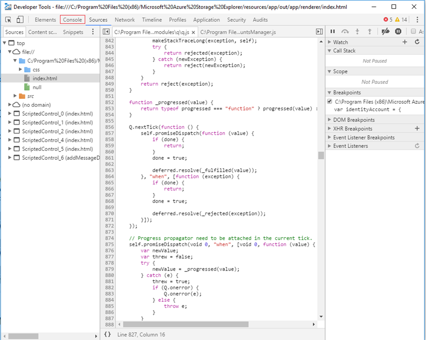
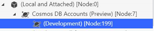
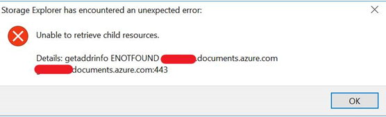

# Cosmos DB in Storage Explorer Troubleshooting Guide Overview

[Azure Cosmos DB in Azure Storage Explorer](https://docs.microsoft.com/en-us/azure/cosmos-db/storage-explorer) is a standalone app that allows you to connect to Cosmos DB accounts hosted on Azure and Sovereign Clouds from Windows, macOS or Linux. It enables you to manage Azure Cosmos DB entities, manipulate data, update stored procedures and triggers along with other Azure entities like Storage blobs and queues.

This guide summarizes solutions for common issues seen for Azure Cosmos DB in Storage Explorer.

- [Sign in Issues](https://github.com/CawaMS/StorageExplorerTroubleshootingGuide/blob/master/se-troubleshooting-guide.md#sign-in-issues)
  - [Self-Signed Certificate in Certificate Chain](https://github.com/CawaMS/StorageExplorerTroubleshootingGuide/blob/master/se-troubleshooting-guide.md#self-signed-certificate-in-certificate-chain)
  - [Unable to retrieve subscriptions](https://github.com/CawaMS/StorageExplorerTroubleshootingGuide/blob/master/se-troubleshooting-guide.md#unable-to-retrieve-subscriptions)
  - [Unable to see the authentication page](https://github.com/CawaMS/StorageExplorerTroubleshootingGuide/blob/master/se-troubleshooting-guide.md#unable-to-see-auth-page)
  - [Cannot remove account](https://github.com/CawaMS/StorageExplorerTroubleshootingGuide/blob/master/se-troubleshooting-guide.md#unable-to-remove-account)
- [Http/Https Proxy Issue](https://github.com/CawaMS/StorageExplorerTroubleshootingGuide/blob/master/se-troubleshooting-guide.md#proxy-issue)
- ['Development' node under 'Local and Attached' Issue](https://github.com/CawaMS/StorageExplorerTroubleshootingGuide/blob/master/se-troubleshooting-guide.md#development-node)
- [Attach Cosmos DB account in \`Local and Attached\` Error](https://github.com/CawaMS/StorageExplorerTroubleshootingGuide/blob/master/se-troubleshooting-guide.md#attaching)
- [Expand Cosmos DB node Error](https://github.com/CawaMS/StorageExplorerTroubleshootingGuide/blob/master/se-troubleshooting-guide.md#expand-node)
- [Submit your Issue ](https://github.com/CawaMS/StorageExplorerTroubleshootingGuide/blob/master/se-troubleshooting-guide.md#submit-issues)

## Sign in Issues

Before proceeding further, try restarting your application and see if the problems can be fixed.

## Self-Signed Certificate in Certificate Chain

There a few reasons you may be seeing this error, the two most common ones are:

1. You are behind a “transparent proxy”, which means someone (such as your IT department) is intercepting HTTPS traffic, decrypting it, and then encrypting it using a self-signed certificate.

2. You are running software, such as anti-virus software, which is injecting a self-signed SSL certificates into the HTTPS messages you receive.

When Storage Explorer encounters one of these "self-signed certificates", it can no longer know if the HTTPS message it is receiving has been tampered with. If you have a copy of the self-signed certificate though, then you can tell Storage Explorer to trust it. If you are unsure of who is injecting the certificate, then you can try to find it yourself by doing the following:

1. Install Open SSL
     - [Windows](https://slproweb.com/products/Win32OpenSSL.html) (any of the light versions should suffice)
     - Mac and Linux: Should be included with your operating system
2. Run Open SSL
    - Windows: Go to the install directory, then /bin/, then double click on openssl.exe.
    - Mac and Linux: execute "openssl" from a terminal
3. Execute `s_client -showcerts -connect microsoft.com:443`
4. Look for self-signed certificates. If you're unsure which are self-signed, then look for any where the subject ("s:") and issuer ("i:") are the same.
5.	Once you have found any self-signed certificates, then for each one, copy and paste everything from and including `-----BEGIN CERTIFICATE-----` to `-----END CERTIFICATE-----` to a new .cer file.
6.	Open Storage Explorer and then go to Edit -> SSL Certificates -> Import Certificates. Using the file picker, find, select, and open the .cer files you created.

If you are unable to find any self-signed certificates using the above steps, then reach out to us via the feedback tool for more help.

## Unable to retrieve subscriptions

If you are unable to retrieve your subscriptions after you successfully signed in:

- Verify your account has access to the subscriptions by signing into the [Azure Portal](http://portal.azure.com/)
- Make sure you have signed in using the correct environment ([Azure](http://portal.azure.com/), [Azure China](https://portal.azure.cn/), [Azure Germany](https://portal.microsoftazure.de/), [Azure US Government](http://portal.azure.us/), or Custom Environment/Azure Stack)
- If you are behind a proxy, make sure that you have configured the Storage Explorer proxy properly
- Try removing and re-adding the account
- Try deleting the following files from your home directory (i.e. C:\Users\ContosoUser), and then re-adding the account:
  - .adalcache
  - .devaccounts
  - .extaccounts
- Watch the developer tools console (f12) while signing in for any error messages

## Unable to see the authentication page

If you are unable to see the authentication page:

- Depending on the speed of your connection, it may take a while for the sign in page to load, wait at least 1 minute before closing the authentication dialog
- If you are behind a proxy, make sure that you have configured the Storage Explorer proxy properly
- Bring up the developer console by pressing F12 key. Watch the responses from developer console and see if you can find any clue for why authentication is not working

## Cannot remove account

If you are unable to remove an account, or if the re-authenticate link does not do anything

- Try deleting the following files from your home directory, and then re-adding the account:
  - .adalcache
  - .devaccounts
  - .extaccounts
- If you want to remove SAS attached Storage resources, delete:
  - %AppData%/StorageExplorer folder for Windows
  - /Users/<your_name>/Library/Applicaiton SUpport/StorageExplorer for Mac
  - ~/.config/StorageExplorer for Linux
  - **You will have to reenter all your credentials** if you delete these files

## Http/Https Proxy Issue

You cannot list Cosmos DB nodes in left tree when configuring http/https proxy in ASE. This is a known issue. We will fix this in next release. Please use Cosmos DB data explorer in Azure portal as a work around at this moment. 

## \`Development\` node under \`Local and Attached\` Issue

There is no response after clicking the \`Development\` node under \`Local and Attached\` in left tree.  The behavior is expected. We will support Cosmos DB local emulator in next release.

## Attaching Cosmos DB account in \`Local and Attached\` Error

If you see below error after attaching Cosmos DB account in \`Local and Attached\`, please check if you are using the right connection string.

## Expand Cosmos DB node Error

You may see below error while trying to expand the tree nodes in left. 

Please try the following:

- Check if the Cosmos DB account is in provision progress and try again when the account is being created successfully.
- If the account is under \`Quick Access\` or \`Local and Attached\` nodes, please check if the account has been deleted. If so, you need to remove the node manually.

## Submit Your Issue 

If none of the solutions work for you, please email us at Cosmos DB Dev Tooling Team ([cosmosdbtooling@microsoft.com](mailto:cosmosdbtooling@microsoft.com)) with details about the issue, so we can contact you for fixing the issues.
