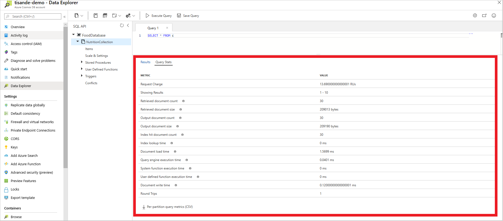

# Troubleshoot query issues when using Azure Cosmos DB

This article walks through a general recommended approach for troubleshooting queries in Azure Cosmos DB. While the steps outlined in this document should not be considered a “catch all” for potential query issues, we have included the most common performance tips here. You should use this document as a starting place for troubleshooting slow or expensive queries in Azure Cosmos DB’s core (SQL) API. You can also use [diagnostics logs](cosmosdb-monitor-resource-logs.md) to identify queries that are slow or consume significant amounts of throughput.

You can broadly categorize query optimizations in Azure Cosmos DB: Optimizations that reduce the Request Unit (RU) charge of the query and optimizations that just reduce latency. By reducing the RU charge of a query, you will almost certainly decrease latency as well.

This document will use examples that can be recreated using the [nutrition](https://github.com/CosmosDB/labs/blob/master/dotnet/setup/NutritionData.json) dataset.

### Obtaining query metrics:

When optimizing a query in Azure Cosmos DB, the first step is always to [obtain the query metrics](profile-sql-api-query.md) for your query. These are also available through the Azure portal as shown below:

[  ](./media/troubleshoot-query-performance/obtain-query-metrics.png#lightbox)

After obtaining query metrics, compare the Retrieved Document Count with the Output Document Count for your query. Use this comparison to identify the relevant sections to reference below.

The Retrieved Document Count is the number of documents that the query needed to load. The Output Document Count is the number of documents that were needed for the results of the query. If the Retrieved Document Count is significantly higher than the Output Document Count, then there was at least one part of your query that was unable to utilize the index and needed to do a scan.

You can reference the below section to understand the relevant query optimizations for your scenario:

### Query's RU charge is too high

#### Retrieved Document Count is significantly greater than Output Document Count

- [Include necessary paths in the indexing policy](#include-necessary-paths-in-the-indexing-policy)

- [Understand which system functions utilize the index](#understand-which-system-functions-utilize-the-index)

- [Queries with both a filter and an ORDER BY clause](#queries-with-both-a-filter-and-an-order-by-clause)

- [Optimize JOIN expressions by using a subquery](#optimize-join-expressions-by-using-a-subquery)

<br>

#### Retrieved Document Count is approximately equal to Output Document Count

- [Avoid cross partition queries](#avoid-cross-partition-queries)

- [Filters on multiple properties](#filters-on-multiple-properties)

- [Queries with both a filter and an ORDER BY clause](#queries-with-both-a-filter-and-an-order-by-clause)

<br>

### Query's RU charge is acceptable but latency is still too high

- [Improve proximity](#improve-proximity)

- [Increase provisioned throughput](#increase-provisioned-throughput)

- [Increase MaxConcurrency](#increase-maxconcurrency)

- [Increase MaxBufferedItemCount](#increase-maxbuffereditemcount)

## Queries where Retrieved Document Count exceeds Output Document Count

 The Retrieved Document Count is the number of documents that the query needed to load. The Output Document Count is the number of documents that were needed for the results of the query. If the Retrieved Document Count is significantly higher than the Output Document Count, then there was at least one part of your query that was unable to utilize the index and needed to do a scan.

 Below is an example of scan query that wasn't entirely served by the index.

Query:

 ```sql
SELECT VALUE c.description
FROM c
WHERE UPPER(c.description) = "BABYFOOD, DESSERT, FRUIT DESSERT, WITHOUT ASCORBIC ACID, JUNIOR"
 ```

Query Metrics:

```
Retrieved Document Count                 :          60,951
Retrieved Document Size                  :     399,998,938 bytes
Output Document Count                    :               7
Output Document Size                     :             510 bytes
Index Utilization                        :            0.00 %
Total Query Execution Time               :        4,500.34 milliseconds
  Query Preparation Times
    Query Compilation Time               :            0.09 milliseconds
    Logical Plan Build Time              :            0.05 milliseconds
    Physical Plan Build Time             :            0.04 milliseconds
    Query Optimization Time              :            0.01 milliseconds
  Index Lookup Time                      :            0.01 milliseconds
  Document Load Time                     :        4,177.66 milliseconds
  Runtime Execution Times
    Query Engine Times                   :          322.16 milliseconds
    System Function Execution Time       :           85.74 milliseconds
    User-defined Function Execution Time :            0.00 milliseconds
  Document Write Time                    :            0.01 milliseconds
Client Side Metrics
  Retry Count                            :               0
  Request Charge                         :        4,059.95 RUs
```

Retrieved Document Count (60,951) is significantly greater than Output Document Count (7) so this query needed to do a scan. In this case, the system function [UPPER()](sql-query-upper.md) does not utilize the index.

## Include necessary paths in the indexing policy

Your indexing policy should cover any properties included in `WHERE` clauses, `ORDER BY` clauses, `JOIN`, and most System Functions. The path specified in the index policy should match (case-sensitive) the property in the JSON documents.

If we run a simple query on the [nutrition](https://github.com/CosmosDB/labs/blob/master/dotnet/setup/NutritionData.json) dataset, we observe a much lower RU charge when the property in the `WHERE` clause is indexed.

### Original

Query:

```sql
SELECT * FROM c WHERE c.description = "Malabar spinach, cooked"
```

Indexing policy:

```json
{
    "indexingMode": "consistent",
    "automatic": true,
    "includedPaths": [
        {
            "path": "/*"
        }
    ],
    "excludedPaths": [
        {
            "path": "/description/*"
        }
    ]
}
```

**RU Charge:** 409.51 RU's

### Optimized

Updated indexing policy:

```json
{
    "indexingMode": "consistent",
    "automatic": true,
    "includedPaths": [
        {
            "path": "/*"
        }
    ],
    "excludedPaths": []
}
```

**RU Charge:** 2.98 RU's

You can add additional properties to the indexing policy at any time, with no impact to write availability or performance. If you add a new property to the index, queries that use this property will immediately utilize the new available index. The query will utilize the new index while it is being built. As a result, query results may be inconsistent as the index rebuild is in progress. If a new property is indexed, queries that only utilize existing indexes will not be affected during the index rebuild. You can [track index transformation progress](https://docs.microsoft.com/azure/cosmos-db/how-to-manage-indexing-policy#use-the-net-sdk-v3).

## Understand which system functions utilize the index

If the expression can be translated into a range of string values, then it can utilize the index; otherwise, it cannot.

Here is the list of string functions that can utilize the index:

- STARTSWITH(str_expr, str_expr)
- LEFT(str_expr, num_expr) = str_expr
- SUBSTRING(str_expr, num_expr, num_expr) = str_expr, but only if first num_expr is 0

Some common system functions that do not use the index and must load each document are below:

| **System Function**                     | **Ideas   for Optimization**             |
| --------------------------------------- |------------------------------------------------------------ |
| CONTAINS                                | Use Azure Search for full text search                        |
| UPPER/LOWER                             | Instead of using the system function to normalize data each time for comparisons, instead normalize the casing upon insertion. Then a query such as ```SELECT * FROM c WHERE UPPER(c.name) = 'BOB'``` simply becomes ```SELECT * FROM c WHERE c.name = 'BOB'``` |
| Mathematical functions (non-aggregates) | If you need to frequently compute a value in your query, consider storing this value as a property in your JSON document. |

------

Other parts of the query may still utilize the index despite the system functions not using the index.

## Queries with both a filter and an ORDER BY clause

While queries with a filter and an `ORDER BY` clause will normally utilize a range index, they will be more efficient if they can be served from a composite index. In addition to modifying the indexing policy, you should add all properties in the composite index to the `ORDER BY` clause. This query modification will ensure that it utilizes the composite index.  You can observe the impact by running a query on the [nutrition](https://github.com/CosmosDB/labs/blob/master/dotnet/setup/NutritionData.json) dataset.

### Original

Query:

```sql
SELECT * FROM c WHERE c.foodGroup = “Soups, Sauces, and Gravies” ORDER BY c._ts ASC
```

Indexing policy:

```json
{

        "automatic":true,
        "indexingMode":"Consistent",
        "includedPaths":[  
            {  
                "path":"/*"
            }
        ],
        "excludedPaths":[]
}
```

**RU Charge:** 44.28 RU's

### Optimized

Updated query (includes both properties in the `ORDER BY` clause):

```sql
SELECT * FROM c 
WHERE c.foodGroup = “Soups, Sauces, and Gravies” 
ORDER BY c.foodGroup, c._ts ASC
```

Updated indexing policy:

```json
{  
        "automatic":true,
        "indexingMode":"Consistent",
        "includedPaths":[  
            {  
                "path":"/*"
            }
        ],
        "excludedPaths":[],
        "compositeIndexes":[  
            [  
                {  
                    "path":"/foodGroup",
                    "order":"ascending"
        },
                {  
                    "path":"/_ts",
                    "order":"ascending"
                }
            ]
        ]
    }

```

**RU Charge:** 8.86 RU's

## Optimize JOIN expressions by using a subquery
Multi-value subqueries can optimize `JOIN` expressions by pushing predicates after each select-many expression rather than after all cross-joins in the `WHERE` clause.

Consider the following query:

```sql
SELECT Count(1) AS Count
FROM c
JOIN t IN c.tags
JOIN n IN c.nutrients
JOIN s IN c.servings
WHERE t.name = 'infant formula' AND (n.nutritionValue > 0
AND n.nutritionValue < 10) AND s.amount > 1
```

**RU Charge:** 167.62 RU's

For this query, the index will match any document that has a tag with the name "infant formula", nutritionValue greater than 0, and serving amount greater than 1. The `JOIN` expression here will perform the cross-product of all items of tags, nutrients, and servings arrays for each matching document before any filter is applied. The `WHERE` clause will then apply the filter predicate on each `<c, t, n, s>` tuple.

For instance, if a matching document had 10 items in each of the three arrays, it will expand to 1 x 10 x 10 x 10 (that is, 1,000) tuples. Using subqueries here can help in filtering out joined array items before joining with the next expression.

This query is equivalent to the preceding one but uses subqueries:

```sql
SELECT Count(1) AS Count
FROM c
JOIN (SELECT VALUE t FROM t IN c.tags WHERE t.name = 'infant formula')
JOIN (SELECT VALUE n FROM n IN c.nutrients WHERE n.nutritionValue > 0 AND n.nutritionValue < 10)
JOIN (SELECT VALUE s FROM s IN c.servings WHERE s.amount > 1)
```

**RU Charge:** 22.17 RU's

Assume that only one item in the tags array matches the filter, and there are five items for both nutrients and servings arrays. The `JOIN` expressions will then expand to 1 x 1 x 5 x 5 = 25 items, as opposed to 1,000 items in the first query.

## Queries where Retrieved Document Count is equal to Output Document Count

If the Retrieved Document Count is approximately equal to the Output Document Count, it means the query did not have to scan many unnecessary documents. For many queries, such as those that use the TOP keyword, Retrieved Document Count may exceed Output Document Count by 1. This should not be cause for concern.

## Avoid cross partition queries

Azure Cosmos DB uses [partitioning](partitioning-overview.md) to scale individual containers as Request Unit and data storage needs increase. Each physical partition has a separate and independent index. If your query has an equality filter that matches your container’s partition key, you will only need to check the relevant partition’s index. This optimization reduces the total number of RU’s that the query requires.

If you have a large number of provisioned RU’s (over 30,000) or a large amount of data stored (over ~100 GB), you likely have a large enough container to see a significant reduction in query RU charges.

For example, if we create a container with the partition key foodGroup, the following queries would only need to check a single physical partition:

```sql
SELECT * FROM c
WHERE c.foodGroup = “Soups, Sauces, and Gravies” and c.description = "Mushroom, oyster, raw"
```

These queries would also be optimized by including the partition key in the query:

```sql
SELECT * FROM c
WHERE c.foodGroup IN(“Soups, Sauces, and Gravies”, “"Vegetables and Vegetable Products”) and  c.description = "Mushroom, oyster, raw"
```

Queries that have range filters on the partition key or don’t have any filters on the partition key, will need to “fan-out” and check every physical partition’s index for results.

```sql
SELECT * FROM c
WHERE c.description = "Mushroom, oyster, raw"
```

```sql
SELECT * FROM c
WHERE c.foodGroup > “Soups, Sauces, and Gravies” and c.description = "Mushroom, oyster, raw"
```

## Filters on multiple properties

While queries with filters on multiple properties will normally utilize a range index, they will be more efficient if they can be served from a composite index. For small amounts of data, this optimization will not have a significant impact. It may prove useful, however, for large amounts of data. You can only optimize, at most, one non-equality filter per composite index. If your query has multiple non-equality filters, you should pick one of them that will utilize the composite index. The remainder will continue to utilize range indexes. The non-equality filter must be defined last in the composite index. [Learn more about composite indexes](index-policy.md#composite-indexes)

Here are some examples of queries which could be optimized with a composite index:

```sql
SELECT * FROM c
WHERE c.foodGroup = "Vegetables and Vegetable Products" AND c._ts = 1575503264
```

```sql
SELECT * FROM c
WHERE c.foodGroup = "Vegetables and Vegetable Products" AND c._ts > 1575503264
```

Here is the relevant composite index:

```json
{  
        "automatic":true,
        "indexingMode":"Consistent",
        "includedPaths":[  
            {  
                "path":"/*"
            }
        ],
        "excludedPaths":[],
        "compositeIndexes":[  
            [  
                {  
                    "path":"/foodGroup",
                    "order":"ascending"
                },
                {  
                    "path":"/_ts",
                    "order":"ascending"
                }
            ]
        ]
}
```

## Optimizations that reduce query latency:

In many cases, RU charge may be acceptable but query latency is still too high. The below sections give an overview of tips for reducing query latency. If you run the same query multiple times on the same dataset, it will have the same RU charge each time. However, query latency may vary between query executions.

## Improve proximity

Queries that are run from a different region than the Azure Cosmos DB account will have a higher latency than if they were run inside the same region. For example, if you were running code on your desktop computer, you should expect latency to be tens or hundreds (or more) milliseconds greater than if the query came from a Virtual Machine within the same Azure region as Azure Cosmos DB. It is simple to [globally distribute data in Azure Cosmos DB](distribute-data-globally.md) to ensure you can bring your data closer to your app.

## Increase provisioned throughput

In Azure Cosmos DB, your provisioned throughput is measured in Request Units (RU’s). Let’s imagine you have a query that consumes 5 RU’s of throughput. For example, if you provision 1,000 RU’s, you would be able to run that query 200 times per second. If you attempted to run the query when there was not enough throughput available, Azure Cosmos DB would return an HTTP 429 error. Any of the current Core (SQL) API sdk's will automatically retry this query after waiting a brief period. Throttled requests take a longer amount of time, so increasing provisioned throughput can improve query latency. You can observe the [total number of requests throttled requests](use-metrics.md#understand-how-many-requests-are-succeeding-or-causing-errors) in the Metrics blade of the Azure portal.

## Increase MaxConcurrency

Parallel queries work by querying multiple partitions in parallel. However, data from an individual partitioned collection is fetched serially with respect to the query. So, adjusting the MaxConcurrency to the number of partitions has the maximum chance of achieving the most performant query, provided all other system conditions remain the same. If you don't know the number of partitions, you can set the MaxConcurrency (or MaxDegreesOfParallelism in older sdk versions) to a high number, and the system chooses the minimum (number of partitions, user provided input) as the maximum degree of parallelism.

## Increase MaxBufferedItemCount

Queries are designed to pre-fetch results while the current batch of results is being processed by the client. The pre-fetching helps in overall latency improvement of a query. Setting the MaxBufferedItemCount limits the number of pre-fetched results. By setting this value to the expected number of results returned (or a higher number), the query can receive maximum benefit from pre-fetching. Setting this value to -1 allows the system to automatically decide the number of items to buffer.

## Next steps
Refer to documents below on how to measure RUs per query, get execution statistics to tune your queries, and more:

* [Get SQL query execution metrics using .NET SDK](profile-sql-api-query.md)
* [Tuning query performance with Azure Cosmos DB](sql-api-sql-query-metrics.md)
* [Performance tips for .NET SDK](performance-tips.md)
