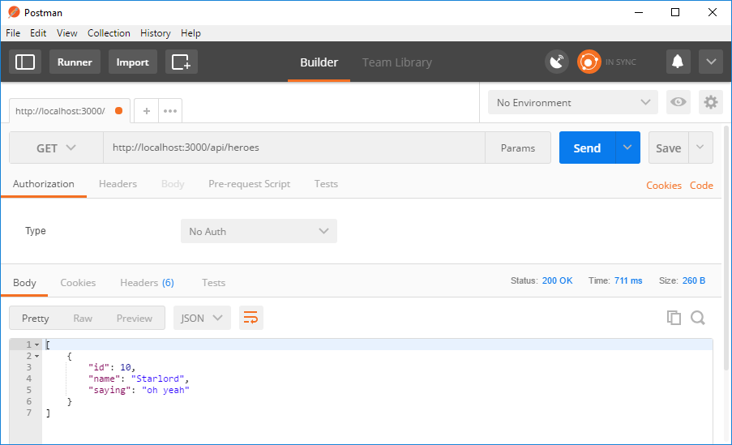

# Create a MongoDB app with Angular and Azure Cosmos DB - Part 2: Create a Node.js Express app with the Angular CLI 

This multi-part tutorial demonstrates how to create a new [MongoDB API](mongodb-introduction.md) app written in Node.js with Express, Angular, and your Azure Cosmos DB database.

Part 2 of the tutorial builds on [the introduction](tutorial-develop-mongodb-nodejs.md) and covers the following tasks:

> [!div class="checklist"]
> * Install the Angular CLI and TypeScript
> * Create a new project using Angular
> * Build out the app using the Express framework
> * Test the app in Postman

## Video walkthrough

> [!VIDEO https://www.youtube.com/embed/lIwJIYcGSUg]

## Prerequisites

Before starting this part of the tutorial, ensure you've watched the [introduction video](tutorial-develop-mongodb-nodejs.md).

This tutorial also requires: 
* [Node.js](https://nodejs.org/) version 8.4.0 or above.
* [Postman](https://www.getpostman.com/)
* [Visual Studio Code](https://code.visualstudio.com/) or your favorite code editor.

> [!TIP]
> This tutorial walks you through the steps to build the application step-by-step. If you want to download the finished project, you can get the completed application from the [angular-cosmosdb repo](https://github.com/Azure-Samples/angular-cosmosdb) on GitHub.

## Install the Angular CLI and TypeScript

1. Open a Windows Command Prompt or Mac Terminal window and install the Angular CLI.

    ```bash
    npm install -g @angular/cli
    ```

2. Install TypeScript by entering the following command in the prompt. 

    ```bash
    npm install -g typescript
    ```

## Use the Angular CLI to create a new project

1. At the command prompt, change to the folder where you want to create your new project, then run the following command. This command creates a new folder and project named angular-cosmosdb and installs the Angular components required for a new app. It uses the minimal setup (--minimal), and specifies that the project uses Sass (a CSS-like syntax with the flag --style scss).

    ```bash
    ng new angular-cosmosdb --minimal --style scss
    ```

2. Once the command completes, change directories into the src/client folder.

    ```bash
    cd angular-cosmosdb
    ```

3. Then open the folder in Visual Studio Code.

    ```bash
    code .
    ```

## Build the app using the Express framework

1. In Visual Studio Code, in the **Explorer** pane, right-click the **src** folder, click **New Folder**, and name the new folder *server*.

2. In the **Explorer** pane, right-click the **server** folder, click **New File**, and name the new file *index.js*.

3. Back at the command prompt, use the following command to install the body parser. This helps our app parse the JSON data that are passed in through the APIs.

    ```bash
    npm i express body-parser --save
    ```

4. In Visual Studio Code, copy the following code into the index.js file. This code:
    * References Express
    * Pulls in the body-parser for reading JSON data in the body of requests
    * Uses a built-in feature called path
    * Sets root variables to make it easier to find where our code is located
    * Sets up a port
    * Cranks up Express
    * Tells the app how to use the middleware that were going to be using to serve up the server
    * Serves everything that's in the dist folder, which will be the static content
    * Serves up the application, and serves index.html for any GET requests not found on the server (for deep links)
    * Starts the server with app.listen
    * Uses an arow function to log that the port is alive
    
   ```node
   const express = require('express');
   const bodyParser = require('body-parser');
   const path = require('path');
   const routes = require('./routes');

   const root = './';
   const port = process.env.PORT || '3000';
   const app = express();

   app.use(bodyParser.json());
   app.use(bodyParser.urlencoded({ extended: false }));
   app.use(express.static(path.join(root, 'dist/angular-cosmosdb')));
   app.use('/api', routes);
   app.get('*', (req, res) => {
     res.sendFile('dist/angular-cosmosdb/index.html', {root});
   });

   app.listen(port, () => console.log(`API running on localhost:${port}`));
   ```

5. In Visual Studio Code, in the **Explorer** pane, right-click the **server** folder, and then click **New file**. Name the new file *routes.js*. 

6. Copy the following code into **routes.js**. This code:
   * References the Express router
   * Gets the heroes
   * Sends back the JSON for a defined hero

   ```node
   const express = require('express');
   const router = express.Router();

   router.get('/heroes', (req, res) => {
    res.send(200, [
       {"id": 10, "name": "Starlord", "saying": "oh yeah"}
    ])
   });

   module.exports=router;
   ```

7. Save all your modified files. 

8. In Visual Studio Code, click the **Debug** button , click the Gear button . The new launch.json file opens in Visual Studio Code.

8. On line 11 of the launch.json file, change `"${workspaceFolder}\\server"` to `"program": "${workspaceRoot}/src/server/index.js"` and save the file.

9. Click the **Start Debugging** button  to run the app.

    The app should run without errors.

## Use Postman to test the app

1. Now open Postman and put `http://localhost:3000/api/heroes` in the GET box. 

2. Click the **Send** button and get the json response from the app. 

    This response shows the app is up and running locally. 

    


## Next steps

In this part of the tutorial, you've done the following:

> [!div class="checklist"]
> * Created a Node.js project using the Angular CLI
> * Tested the app using Postman

You can proceed to the next part of the tutorial to build the UI.

> [!div class="nextstepaction"]
> [Build the UI with Angular](tutorial-develop-mongodb-nodejs-part3.md)
