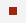
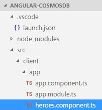
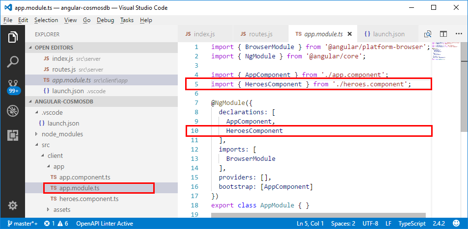
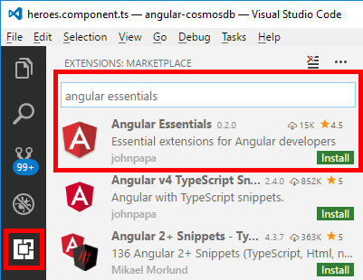
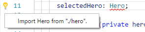

# Create a MongoDB app with Angular and Azure Cosmos DB - Part 3: Build the UI with Angular

This multi-part tutorial demonstrates how to create a new [MongoDB API](mongodb-introduction.md) app written in Node.js with Express and Angular and then connect it to your Azure Cosmos DB database.

Part 3 of the tutorial builds on [Part 2](tutorial-develop-mongodb-nodejs-part2.md) and covers the following tasks:

> [!div class="checklist"]
> * Build the Angular UI
> * Use CSS to set the look and feel
> * Test the app locally

## Video walkthrough

> [!VIDEO https://www.youtube.com/embed/MnxHuqcJVoM]

## Prerequisites

Before starting this part of the tutorial, ensure you've completed the steps in [Part 2](tutorial-develop-mongodb-nodejs-part2.md) of the tutorial.

> [!TIP]
> This tutorial walks you through the steps to build the application step-by-step. If you want to download the finished project, you can get the completed application from the [angular-cosmosdb repo](https://github.com/Azure-Samples/angular-cosmosdb) on GitHub.

## Build the UI

1. In Visual Studio Code, click the Stop button  to stop the Node app.

2. In your Windows Command Prompt or Mac Terminal window, enter the following command to generate a heroes component. In this code g=generate, c=component, heroes=name of component, and it's using a flat file structure (--flat) so that a subfolder isn't created for it.

    ```
    ng g c heroes --flat 
    ```

    The terminal window displays confirmation of the new components.

    ```bash
    installing component
      create src\client\app\heroes.component.ts
      update src\client\app\app.module.ts 
    ```

    Let's take a look at the files that were created and updated. 

3. In Visual Studio Code, in the **Explorer** pane, navigate to the new **src\client\app** folder and open the new **heroes.component.ts** file created by step 2. This TypeScript component file was created by the previous command.

    > [!TIP]
    > If the app folder doesn't display in Visual Studio Code, enter CMD + SHIFT P on a Mac or Ctrl + Shift + P on Windows to open the Command Palette, and then type *Reload Window* to pick up the system change.

    

4. In the same folder, open the **app.module.ts** file, and notice that it added the `HeroesComponent` to the declarations on line 5 and it imported it as well on line 10.

    

    Now that you have your Heroes component, create a new file for the heroes component HTML. Because we created a minimal app, the HTML was meant to go in the same file as the TypeScript file, but we want to break it out and create a separate file.

5. In the **Explorer** pane, right-click the **app** folder, click **New File**, and name the new file *heroes.component.html*.

6. In the **heroes.component.ts** file, delete lines 5 through 9 

    ```ts
    template: `
        <p>
          heroes Works!
        </p>
      `,
      ```
      and replace it with
  
    ```ts
    templateUrl: './heroes.component.html',
    ```

    to reference the new HTML file.
 
    > [!TIP]
    > You can use John Papa's Angular Essentials extentions and snippets for Visual Studio Code to speed up your development. 
    > 1. Click the **Extensions** button .
    > 2. Type *angular essentials* in the search box.
    > 3. Click **Install**. 
    > 4. Click the **Reload** button to use the new extensions.
    > or
    > Download from [http://jpapa.me/angularessentials](http://jpapa.me/angularessentials). 
    > 

7. Go back to the **heroes.component.html** file and copy in this code. The `<div>` is the container for the entire page. Inside of the container there is a list of heroes which we need to create so that when you click on one you can select it and edit it or delete it in the UI. Then in the HTML we've got some styling so you know which one has been selected. There's also an edit area so that you can add a new hero or edit an existing one. 

    ```html
    <div>
      <ul class="heroes">
        <li *ngFor="let hero of heroes" (click)="onSelect(hero)" [class.selected]="hero === selectedHero">
          <button class="delete-button" (click)="deleteHero(hero)">Delete</button>
          <div class="hero-element">
            <div class="badge">{{hero.id}}</div>
            <div class="name">{{hero.name}}</div>
            <div class="saying">{{hero.saying}}</div>
          </div>
        </li>
      </ul>
      <div class="editarea">
        <button (click)="enableAddMode()">Add New Hero</button>
        <div *ngIf="selectedHero">
          <div class="editfields">
            <div>
              <label>id: </label>
              <input [(ngModel)]="selectedHero.id" placeholder="id" *ngIf="addingHero" />
              <label *ngIf="!addingHero" class="value">{{selectedHero.id}}</label>
            </div>
            <div>
              <label>name: </label>
              <input [(ngModel)]="selectedHero.name" placeholder="name" />
            </div>
            <div>
              <label>saying: </label>
              <input [(ngModel)]="selectedHero.saying" placeholder="saying" />
            </div>
          </div>
          <button (click)="cancel()">Cancel</button>
          <button (click)="save()">Save</button>
        </div>
      </div>
    </div>
    ```

8. Now that we've got the HTML in place, we need to add it to the **heroes.component.ts** file so we can interact with the template. The new code added to **heroes.component.ts** below adds the template to our component file. A constructor has been added that gets some heroes, and initializes the hero service component to go get all the data. This code also adds all of the necessary methods for handling events in the UI. You can copy the following code over the existing code in **heroes.component.ts**. 

    ```ts
    import { Component, OnInit } from '@angular/core';

    @Component({
      selector: 'app-heroes',
      templateUrl: './heroes.component.html'
    })
    export class HeroesComponent implements OnInit {
      addingHero = false;
      heroes: any = [];
      selectedHero: Hero;
    
      constructor(private heroService: HeroService) {}
    
      ngOnInit() {
       this.getHeroes();
      }

      cancel() {
        this.addingHero = false;
        this.selectedHero = null;
      }

      deleteHero(hero: Hero) {
        this.heroService.deleteHero(hero).subscribe(res => {
          this.heroes = this.heroes.filter(h => h !== hero);
          if (this.selectedHero === hero) {
            this.selectedHero = null;
          }
        });
      }

      getHeroes() {
        return this.heroService.getHeroes().subscribe(heroes => {
          this.heroes = heroes;
        });
      }

      enableAddMode() {
        this.addingHero = true;
        this.selectedHero = new Hero();
      }

      onSelect(hero: Hero) {
        this.addingHero = false;
        this.selectedHero = hero;
      }

      save() {
        if (this.addingHero) {
          this.heroService.addHero(this.selectedHero).subscribe(hero => {
            this.addingHero = false;
            this.selectedHero = null;
            this.heroes.push(hero);
          });
        } else {
          this.heroService.updateHero(this.selectedHero).subscribe(hero => {
            this.addingHero = false;
            this.selectedHero = null;
          });
        }
      }
    }
    ```

9. In **Explorer**, open the **app/app.module.ts** file and update lines 13 (add a comma) and 14 to add an import for a `FormsModule`. The import section should now look like following:

    ```
    imports: [
      BrowserModule,
      FormsModule
    ],
    ```

10. Add an import for the new FormsModule module on line 3. 

    ```
    import { BrowserModule } from '@angular/platform-browser';
    import { NgModule } from '@angular/core';
    import { FormsModule } from '@angular/forms';
    ```

## Use CSS to set the look and feel

1. In the Explorer pane, open the **src/client/styles.scss** file.

2. Copy the following code into the **styles.scss** file, replacing the existing content of the file.

    ```css
    /* You can add global styles to this file, and also import other style files */

    * {
      font-family: Arial;
    }
    h2 {
      color: #444;
      font-weight: lighter;
    }
    body {
      margin: 2em;
    }
    
    body,
    input[text],
    button {
      color: #888;
      // font-family: Cambria, Georgia;
    }
    button {
      font-size: 14px;
      font-family: Arial;
      background-color: #eee;
      border: none;
      padding: 5px 10px;
      border-radius: 4px;
      cursor: pointer;
      cursor: hand;
      &:hover {
        background-color: #cfd8dc;
      }
      &.delete-button {
        float: right;
        background-color: gray !important;
        background-color: rgb(216, 59, 1) !important;
        color: white;
        padding: 4px;
        position: relative;
        font-size: 12px;
      }
    }
    div {
      margin: .1em;
    }

    .selected {
      background-color: #cfd8dc !important;
      background-color: rgb(0, 120, 215) !important;
      color: white;
    }

    .heroes {
      float: left;
      margin: 0 0 2em 0;
      list-style-type: none;
      padding: 0;
      li {
        cursor: pointer;
        position: relative;
        left: 0;
        background-color: #eee;
        margin: .5em;
        padding: .5em;
        height: 3.0em;
        border-radius: 4px;
        width: 17em;
        &:hover {
          color: #607d8b;
          color: rgb(0, 120, 215);
          background-color: #ddd;
          left: .1em;
        }
        &.selected:hover {
          /*background-color: #BBD8DC !important;*/
          color: white;
        }
      }
      .text {
        position: relative;
        top: -3px;
      }
      .saying {
        margin: 5px 0;
      }
      .name {
        font-weight: bold;
      }
      .badge {
        /* display: inline-block; */
        float: left;
        font-size: small;
        color: white;
        padding: 0.7em 0.7em 0 0.5em;
        background-color: #607d8b;
        background-color: rgb(0, 120, 215);
        background-color:rgb(134, 183, 221);
        line-height: 1em;
        position: relative;
        left: -1px;
        top: -4px;
        height: 3.0em;
        margin-right: .8em;
        border-radius: 4px 0 0 4px;
        width: 1.2em;
      }
    }

    .header-bar {
      background-color: rgb(0, 120, 215);
      height: 4px;
      margin-top: 10px;
      margin-bottom: 10px;
    }

    label {
      display: inline-block;
      width: 4em;
      margin: .5em 0;
      color: #888;
      &.value {
        margin-left: 10px;
        font-size: 14px;
      }
    }

    input {
      height: 2em;
      font-size: 1em;
      padding-left: .4em;
      &::placeholder {
          color: lightgray;
          font-weight: normal;
          font-size: 12px;
          letter-spacing: 3px;
      }
    }

    .editarea {
      float: left;
      input {
        margin: 4px;
        height: 20px;
        color: rgb(0, 120, 215);
      }
      button {
        margin: 8px;
      }
      .editfields {
        margin-left: 12px;
      }
    }
    ``` 
3. Save the file. 

## Display the component

Now that we have the component, how do we get it to show up on the screen? Let's modify the default components in **app.component.ts**.

1. In the Explorer pane, open **client/app/app.component.ts**.

2. In lines 6 through 8, change the title to Heroes, and then put the name of the component we created in **heroes.components.ts** (app-heroes) to refer to that new component. The template section should now look like the following: 

    ```ts
    template: `
      <h1>Heroes</h1>
      <div class="header-bar"></div>
      <app-heroes></app-heroes>
    `,
    ```

3. There are other components in **heroes.components.ts** that we're referring to, like the Hero component, so we need to go create that, too. In the Angular CLI command prompt, use the following command to create a hero model and a file named **hero.ts**, where g=generate, cl=class, and hero=name of class.

    ```bash
    ng g cl hero
    ```

    The terminal window displays confirmation of the new class.

    ```bash
    installing class
    create src\client\app\hero.ts
    ```

4. In the Explorer pane, open **src\client\app\hero.ts**.

5. In **hero.ts**, replace the content of the file with the following code, which adds a Hero class with an ID, a name, and a saying. 

    ```ts
      export class Hero {
      id: number;
      name: string;
      saying: string;
    }
    ```

6. Go back to **heroes.components.ts** and notice that on the `selectedHero: Hero;` line (line 10), `Hero` has a red line underneath. 

7. Left-click the term `Hero`, and Visual Studio displays a lightbulb icon on the left side of the code block. 

    

8. Click the lightbulb and then click **Import Hero from "client/app/hero".** or **Import Hero from "./hero".** (The message changes depending on your setup)

    A new line of code appears on line 2. If line 2 references client/app/hero, modify it so that it references the hero file from the local folder (./hero). Line 2 should look like this:

   ```
   import { Hero } from "./hero";
   ``` 

    That takes care of the model, but we still need to create the service.

## Create the Service

1. In the Angular CLI command prompt, enter the following command to create a hero service in **app.module.ts**, where g=generate, s=service, hero=name of service, -m=put in app.module.

    ```bash
    ng g s hero -m app.module
    ```

    The output states that **hero.service.ts** was created and **app.module.ts** was updated.
  
    ```bash
    installing service
      create src\client\app\hero.service.ts
      update src\client\app\app.module.ts
    ```
    
    In app.module.ts, the following lines of code were added (lines 6 and 17):
    
    ```typescript
    import { HeroService } from './hero.service';
    ...
        providers: [HeroService],
    ```

2. In Visual Studio Code, open **hero.service.ts** and copy in the following code, replacing the content of the file.

    ```ts
    import { Injectable } from '@angular/core';
    import { HttpClient } from '@angular/common/http';
    
    import { Hero } from './hero';
    
    const api = '/api';

    @Injectable()
    export class HeroService {
      constructor(private http: HttpClient) {}

      getHeroes() {
        return this.http.get<Array<Hero>>(`${api}/heroes`)
      }

      deleteHero(hero: Hero) {
        return this.http.delete(`${api}/hero/${hero.id}`);
      }

      addHero(hero: Hero) {
        return this.http.post<Hero>(`${api}/hero/`, hero);
      }

      updateHero(hero: Hero) {
        return this.http.put<Hero>(`${api}/hero/${hero.id}`, hero);
      }
    }
    ```

    This code uses the newest version of the HttpClient that Angular offers, which is a module that you need to provide, so we'll do that next.

3. In Visual Studio Code, open **app.module.ts** and import the HttpClientModule by updating the import section to include HttpClientModule.

    ```ts
    imports: [
      BrowserModule,
      FormsModule,
      HttpClientModule
    ],
    ```

4. In **app.module.ts**, add the HttpClientModule import statement the list of imports.

    ```ts
    import { HttpClientModule } from '@angular/common/http';
    ```

5. In Visual Studio Code, go back to **heroes.components.ts**. Notice that on the `constructor(private heroService: HeroService) {}` line (line 13), `HeroService` has a red line underneath. Click `HeroService`, and you'll get the lightbulb on the left side of code block. Click the light bulb and then click **Import HeroService from "./hero.service ".** or **Import HeroService from "client/app/hero.service ".**

    Clicking the light bulb inserts a new line of code on line 2. If line 2 references the client/app/hero.service folder, modify it so that it references the hero file from the local folder (./hero.serivce). Line 2 should look like this:
    
    ```javascript
    import { HeroService } from "./hero.service"
    ```

6. Save all files in Visual Studio Code.

## Build the app

1. At the command prompt, enter the following command to build the Angular application. 

    ```bash
    ng b
    ``` 

    If there are any problems, the terminal window displays information about the files to fix. When the build completes, the new files go into the **dist** folder. You can review the files new in the **dist** folder if you want.

    Now lets run the app.

2. In Visual Studio Code, click the **Debug** button  on the left side, then click the **Start Debugging** button .

3. Now open an internet browser and navigate to **localhost:3000** and see the app running locally.

     

## Next steps

In this part of the tutorial, you've done the following:

> [!div class="checklist"]
> * Built the Angular UI
> * Tested the app locally

You can proceed to the next part of the tutorial to create an Azure Cosmos DB account.

> [!div class="nextstepaction"]
> [Create an Azure Cosmos DB account using the Azure CLI](tutorial-develop-mongodb-nodejs-part4.md)
