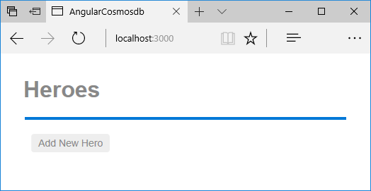

# Create a MongoDB app with Angular and Azure Cosmos DB - Part 5: Use Mongoose to connect to Azure Cosmos DB

This multi-part tutorial demonstrates how to create a new [MongoDB API](mongodb-introduction.md) app written in Node.js with Express, Angular, and your Azure Cosmos DB database.

Part 5 of the tutorial builds on [Part 4](tutorial-develop-mongodb-nodejs-part4.md) and covers the following tasks:

> [!div class="checklist"]
> * Use Mongoose to connect to Azure Cosmos DB
> * Get connection string information from Azure Cosmos DB
> * Create the hero model
> * Create the hero service to get hero data
> * Run the app locally

## Video walkthrough

> [!VIDEO https://www.youtube.com/embed/sI5hw6KPPXI]


## Prerequisites

Before starting this part of the tutorial, ensure you've completed the steps in [Part 4](tutorial-develop-mongodb-nodejs-part4.md) of the tutorial.

> [!TIP]
> This tutorial walks you through the steps to build the application step-by-step. If you want to download the finished project, you can get the completed application from the [angular-cosmosdb repo](https://github.com/Azure-Samples/angular-cosmosdb) on GitHub.

## Use Mongoose to connect to Azure Cosmos DB

1. Install the mongoose npm module, which is an API normally used to talk to MongoDB.

    ```bash
    npm i mongoose --save
    ```

2. Now create a new file in your **server** folder called **mongo.js**. In this file, you add all of your connection info for the Azure Cosmos DB database.

3. Copy the following code into **mongo.js**. This code:
    * Requires Mongoose.
    * Overrides the Mongo promise to use the basic promise that's built into ES6/ES2015 and above.
    * Calls on an env file that lets you set up certain things based on whether you're in staging, prod, or dev. We will create that file soon.
    * Includes our MongoDB connection string, which will be set in the env file.
    * Creates a connect function that calls Mongoose.

    ```javascript
    const mongoose = require('mongoose');
    /**
     * Set to Node.js native promises
     * Per http://mongoosejs.com/docs/promises.html
     */
    mongoose.Promise = global.Promise;

    const env = require('./env/environment');

    // eslint-disable-next-line max-len
    const mongoUri = `mongodb://${env.accountName}:${env.key}@${env.accountName}.documents.azure.com:${env.port}/${env.databaseName}?ssl=true`;

    function connect() {
     mongoose.set('debug', true);
     return mongoose.connect(mongoUri, { useMongoClient: true });
    }

    module.exports = {
      connect,
      mongoose
    };
    ```
    
4. In the Explorer pane, create a folder under **server** called **environment** and in the **environment** folder create a new file called **environment.js**.

5. From the mongo.js file, we know we need to include the `dbName`, the `key`, and the `cosmosPort`, so copy the following code into **environment.js**.

    ```javascript
    // TODO: replace if yours are different
    module.exports = {
      accountName: 'your-cosmosdb-account-name-goes-here',
      databaseName: 'admin', 
      key: 'your-key-goes-here',
      port: 10255
    };
    ```

## Get the connection string information

1. In **environment.js**, change the value of `port` to 10255. (You can find your Cosmos DB port the Azure Portal)

    ```javascript
    const port = 10255;
    ```

2. In **environment.js**, change the value of `accountName` to the name of the Azure Cosmos DB account you created in [Step 4](tutorial-develop-mongodb-nodejs-part4.md). 

3. Retrieve the primary key for the Azure Cosmos DB account by using the following CLI command in the terminal window: 

    ```azure-cli-interactive
    az cosmosdb list-keys --name <cosmosdb-name> -g myResourceGroup
    ```    
    
    * `<cosmosdb-name>` is the name of the Azure Cosmos DB account you created in [Step 4](tutorial-develop-mongodb-nodejs-part4.md).

4. Copy the primary key into the environment.js file as the `key` value.

    Your app now has all the information it needs to connect to Azure Cosmos DB. This information can also be retrieved in the portal. For more information, see [Get the MongoDB connection string to customize](connect-mongodb-account.md#GetCustomConnection). The Username in the portal equates to the dbName in environments.js. 

## Create a Hero model

1.  In the Explorer pane, create the file **hero.model.js** under the **server** folder.

2. Copy the following code into **hero.model.js**. This code:
   * Requires Mongoose.
   * Creates a new schema with an ID, name, and saying.
   * Creates a model using the schema.
   * Exports the model. 
   * Name the collection Heroes (instead of Heros, which would be the default name of the collection based on Mongoose plural naming rules).

   ```javascript
   const mongoose = require('mongoose');

   const Schema = mongoose.Schema;

   const heroSchema = new Schema(
     {
       id: { type: Number, required: true, unique: true },
       name: String,
       saying: String
     },
     {
       collection: 'Heroes'
     }
   );

   const Hero = mongoose.model('Hero', heroSchema);

   module.exports = Hero;
   ```

## Create a Hero service

1.  In the Explorer pane, create the file **hero.service.js** under the **server** folder.

2. Copy the following code into **hero.service.js**. This code:
   * Gets the model you just created
   * Connects to the database
   * Creates a docquery variable that uses the hero.find method to define a query that returns all heroes.
   * Runs a query with the docquery.exec with a promise to get a list of all heroes, where the response status is 200. 
   * If the status is 500, sends back the error message
   * Because we're using modules, it get the heroes. 

   ```javascript
   const Hero = require('./hero.model');

   require('./mongo').connect();

   function getHeroes() {
     const docquery = Hero.find({});
     docquery
       .exec()
       .then(heroes => {
         res.status(200).json(heroes);
       })
       .catch(error => {
         res.status(500).send(error);
         return;
       });
   }

   module.exports = {
     getHeroes
   };
   ```

## Add the hero service to routes.js

1. In Visual Studio Code, in **routes.js**, comment out the `res.send` function that sends the sample hero data and add a line to call the `heroService.getHeroes` function instead.

    ```javascript
    router.get('/heroes', (req, res) => {
      heroService.getHeroes(req, res);
    //  res.send(200, [
    //      {"id": 10, "name": "Starlord", "saying": "oh yeah"}
    //  ])
    });
    ```

2. In **routes.js** require the hero service:

    ```javascript
    const heroService = require('./hero.service'); 
    ```

3. In **hero.service.js**, update the getHeroes function to take the `req` and `res` parameters as follows:

    ```javascript
    function getHeroes(req, res) {
    ```

    Let's take a minute to review and walk through the call chain here. First we come into the `index.js`, which sets up the node server, and notice that's setting up and defining our routes. Our routes.js file then talks to the hero service and tells it to go get our functions like getHeroes and pass the request and response. Here hero.service.js is going to grab the model and connect to Mongo, and then it's going to execute getHeroes when we call it, and return back a response of 200. Then it bubbles back out through the chain. 

## Run the app

1. Now lets run the app again. In Visual Studio Code, save all your changes, click the **Debug** button  on the left side, then click the **Start Debugging** button .

3. Now lets flip over to the browser, open the Developer tools and the Network tab, then navigate to http://localhost:3000, and there's our application.

    

   There are no heroes stored in the app yet, but in the next step of the tutorial we'll add the put, push, and delete functionality so we can add, update, and delete heroes from the UI using Mongoose connections to our Azure Cosmos DB database. 

## Next steps

In this part of the tutorial, you've done the following:

> [!div class="checklist"]
> * Used Mongoose APIs to connect your heroes app to Azure Cosmos DB 
> * Added the get heroes functionality to the app

You can proceed to the next part of the tutorial to add Post, Put, and Delete functions to the app.

> [!div class="nextstepaction"]
> [Add Post, Put, and Delete functions to the app](tutorial-develop-mongodb-nodejs-part6.md)
