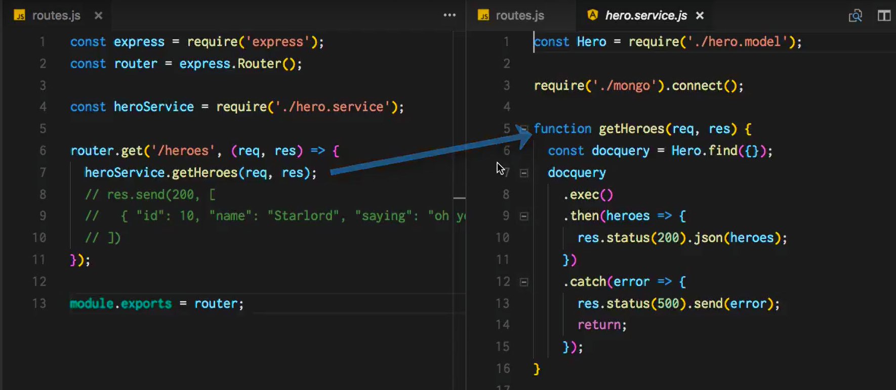
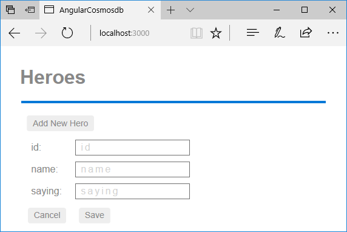
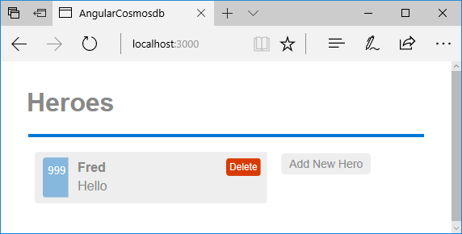
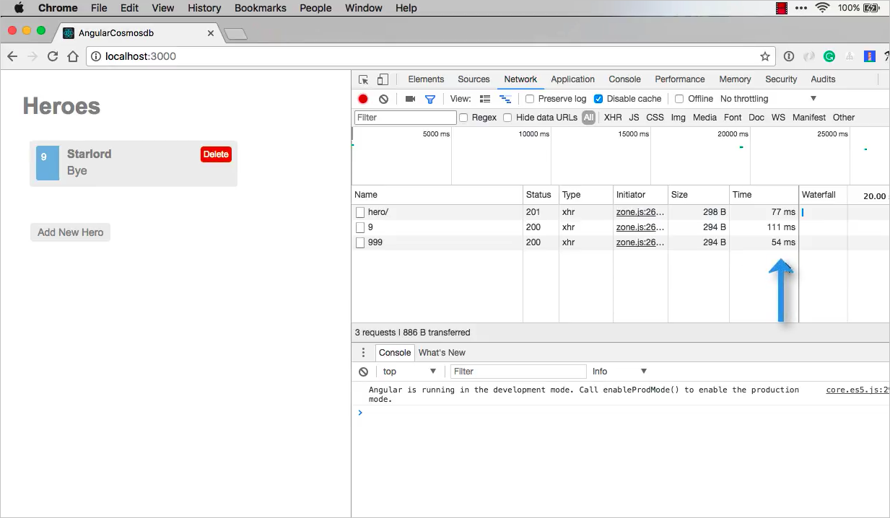

# Create an Angular app with Azure Cosmos DB's API for MongoDB - Add CRUD functions to the app

This multi-part tutorial demonstrates how to create a new app written in Node.js with Express and Angular and then connect it to your [Cosmos account configured with Cosmos DB's API for MongoDB](mongodb-introduction.md). Part 6 of the tutorial builds on [Part 5](tutorial-develop-mongodb-nodejs-part5.md) and covers the following tasks:

> [!div class="checklist"]
> * Create Post, Put, and Delete functions for the hero service
> * Run the app

> [!VIDEO https://www.youtube.com/embed/Y5mdAlFGZjc]

## Prerequisites

Before starting this part of the tutorial, ensure you've completed the steps in [Part 5](tutorial-develop-mongodb-nodejs-part5.md) of the tutorial.

> [!TIP]
> This tutorial walks you through the steps to build the application step-by-step. If you want to download the finished project, you can get the completed application from the [angular-cosmosdb repo](https://github.com/Azure-Samples/angular-cosmosdb) on GitHub.

## Add a Post function to the hero service

1. In Visual Studio Code, open **routes.js** and **hero.service.js** side by side by pressing the **Split Editor** button .

    See that routes.js line 7 is calling the `getHeroes` function on line 5 in **hero.service.js**.  We need to create this same pairing for the post, put, and delete functions. 

    
    
    Let's start by coding up the hero service. 

2. Copy the following code into **hero.service.js** after the `getHeroes` function and before `module.exports`. This code:  
   * Uses the hero model to post a new hero.
   * Checks the responses to see if there's an error and returns a status value of 500.

   ```javascript
   function postHero(req, res) {
     const originalHero = { uid: req.body.uid, name: req.body.name, saying: req.body.saying };
     const hero = new Hero(originalHero);
     hero.save(error => {
       if (checkServerError(res, error)) return;
       res.status(201).json(hero);
       console.log('Hero created successfully!');
     });
   }

   function checkServerError(res, error) {
     if (error) {
       res.status(500).send(error);
       return error;
     }
   }
   ```

3. In **hero.service.js**, update the `module.exports` to include the new `postHero` function. 

    ```javascript
    module.exports = {
      getHeroes,
      postHero
    };
    ```

4. In **routes.js**, add a router for the `post` function after the `get` router. This router posts one hero at a time. Structuring the router file this way cleanly shows you all of the available API endpoints and leaves the real work to the **hero.service.js** file.

    ```javascript
    router.post('/hero', (req, res) => {
      heroService.postHero(req, res);
    });
    ```

5. Check that everything worked by running the app. In Visual Studio Code, save all your changes, select the **Debug** button  on the left side, then select the **Start Debugging** button .

6. Now go back to your internet browser and open the Developer tools Network tab by pressing F12 on most machines. Navigate to [http://localhost:3000](http://localhost:3000) to watch the calls made over the network.

    

7. Add a new hero by selecting the **Add New Hero** button. Enter an ID of "999", name of "Fred", and saying of "Hello", then select **Save**. You should see in the Networking tab you've sent a POST request for a new hero. 

    

    Now let's go back and add the Put and Delete functions to the app.

## Add the Put and Delete functions

1. In **routes.js**, add the `put` and `delete` routers after the post router.

    ```javascript
    router.put('/hero/:uid', (req, res) => {
      heroService.putHero(req, res);
    });

    router.delete('/hero/:uid', (req, res) => {
      heroService.deleteHero(req, res);
    });
    ```

2. Copy the following code into **hero.service.js** after the `checkServerError` function. This code:
   * Creates the `put` and `delete` functions
   * Performs a check on whether the hero was found
   * Performs error handling 

   ```javascript
   function putHero(req, res) {
     const originalHero = {
       uid: parseInt(req.params.uid, 10),
       name: req.body.name,
       saying: req.body.saying
     };
     Hero.findOne({ uid: originalHero.uid }, (error, hero) => {
       if (checkServerError(res, error)) return;
       if (!checkFound(res, hero)) return;

      hero.name = originalHero.name;
       hero.saying = originalHero.saying;
       hero.save(error => {
         if (checkServerError(res, error)) return;
         res.status(200).json(hero);
         console.log('Hero updated successfully!');
       });
     });
   }

   function deleteHero(req, res) {
     const uid = parseInt(req.params.uid, 10);
     Hero.findOneAndRemove({ uid: uid })
       .then(hero => {
         if (!checkFound(res, hero)) return;
         res.status(200).json(hero);
         console.log('Hero deleted successfully!');
       })
       .catch(error => {
         if (checkServerError(res, error)) return;
       });
   }

   function checkFound(res, hero) {
     if (!hero) {
       res.status(404).send('Hero not found.');
       return;
     }
     return hero;
   }
   ```

3. In **hero.service.js**, export the new modules:

   ```javascript
    module.exports = {
      getHeroes,
      postHero,
      putHero,
      deleteHero
    };
    ```

4. Now that we've updated the code, select the **Restart** button  in Visual Studio Code.

5. Refresh the page in your internet browser and select the **Add New Hero** button. Add a new hero with an ID of "9", name of "Starlord", and saying "Hi". Select the **Save** button to save the new hero.

6. Now select the **Starlord** hero, and change the saying from "Hi" to "Bye", then select the **Save** button. 

    You can now select the ID in the Network tab to show the payload. You can see in the payload that the saying is now set to "Bye".

     

    You can also delete one of the heroes in the UI, and see the times it takes to complete the delete operation. Try this out by selecting the "Delete" button for the hero named "Fred".

     

    If you refresh the page, the Network tab shows the time it takes to get the heroes. While these times are fast, a lot depends on where your data is located in the world and your ability to geo-replicate it in an area close to your users. You can find out more about geo-replication in the next, soon to be released, tutorial.

## Next steps

In this part of the tutorial, you've done the following:

> [!div class="checklist"]
> * Added Post, Put, and Delete functions to the app 

Check back soon for additional videos in this tutorial series.

